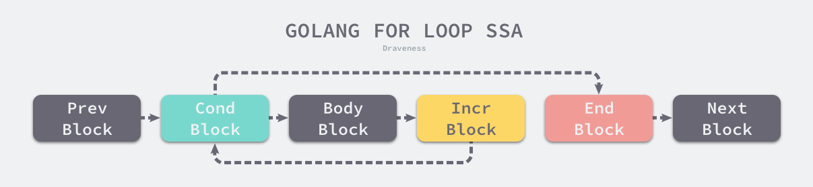

# for range详解

[参考文献:《GO语言设计与实现第五章--for和range部分》](https://draveness.me/golang/docs/part2-foundation/ch05-keyword/golang-for-range/)

## 1. for和range

下面是一段经典三段式循环代码:

```go
package main

func main() {
	for i := 0; i < 10; i++ {
		println(i)
	}
}
```

这段代码对应的完整汇编指令如下:

```
go tool compile -S demo1.go 
"".main STEXT size=88 args=0x0 locals=0x18 funcid=0x0
	0x0000 00000 (demo1.go:3)	TEXT	"".main(SB), ABIInternal, $24-0
	0x0000 00000 (demo1.go:3)	CMPQ	SP, 16(R14)
	0x0004 00004 (demo1.go:3)	PCDATA	$0, $-2
	0x0004 00004 (demo1.go:3)	JLS	81
	0x0006 00006 (demo1.go:3)	PCDATA	$0, $-1
	0x0006 00006 (demo1.go:3)	SUBQ	$24, SP
	0x000a 00010 (demo1.go:3)	MOVQ	BP, 16(SP)
	0x000f 00015 (demo1.go:3)	LEAQ	16(SP), BP
	0x0014 00020 (demo1.go:3)	FUNCDATA	$0, gclocals·33cdeccccebe80329f1fdbee7f5874cb(SB)
	0x0014 00020 (demo1.go:3)	FUNCDATA	$1, gclocals·33cdeccccebe80329f1fdbee7f5874cb(SB)
	0x0014 00020 (demo1.go:3)	XORL	AX, AX
	0x0016 00022 (demo1.go:4)	JMP	65
	0x0018 00024 (demo1.go:4)	MOVQ	AX, "".i+8(SP)
	0x001d 00029 (demo1.go:5)	PCDATA	$1, $0
	0x001d 00029 (demo1.go:5)	NOP
	0x0020 00032 (demo1.go:5)	CALL	runtime.printlock(SB)
	0x0025 00037 (demo1.go:5)	MOVQ	"".i+8(SP), AX
	0x002a 00042 (demo1.go:5)	CALL	runtime.printint(SB)
	0x002f 00047 (demo1.go:5)	CALL	runtime.printnl(SB)
	0x0034 00052 (demo1.go:5)	CALL	runtime.printunlock(SB)
	0x0039 00057 (demo1.go:4)	MOVQ	"".i+8(SP), AX
	0x003e 00062 (demo1.go:4)	INCQ	AX
	0x0041 00065 (demo1.go:4)	CMPQ	AX, $10
	0x0045 00069 (demo1.go:4)	JLT	24
	0x0047 00071 (demo1.go:7)	PCDATA	$1, $-1
	0x0047 00071 (demo1.go:7)	MOVQ	16(SP), BP
	0x004c 00076 (demo1.go:7)	ADDQ	$24, SP
	0x0050 00080 (demo1.go:7)	RET
	0x0051 00081 (demo1.go:7)	NOP
	0x0051 00081 (demo1.go:3)	PCDATA	$1, $-1
	0x0051 00081 (demo1.go:3)	PCDATA	$0, $-2
	0x0051 00081 (demo1.go:3)	CALL	runtime.morestack_noctxt(SB)
	0x0056 00086 (demo1.go:3)	PCDATA	$0, $-1
	0x0056 00086 (demo1.go:3)	JMP	0
	0x0000 49 3b 66 10 76 4b 48 83 ec 18 48 89 6c 24 10 48  I;f.vKH...H.l$.H
	0x0010 8d 6c 24 10 31 c0 eb 29 48 89 44 24 08 0f 1f 00  .l$.1..)H.D$....
	0x0020 e8 00 00 00 00 48 8b 44 24 08 e8 00 00 00 00 e8  .....H.D$.......
	0x0030 00 00 00 00 e8 00 00 00 00 48 8b 44 24 08 48 ff  .........H.D$.H.
	0x0040 c0 48 83 f8 0a 7c d1 48 8b 6c 24 10 48 83 c4 18  .H...|.H.l$.H...
	0x0050 c3 e8 00 00 00 00 eb a8                          ........
	rel 33+4 t=7 runtime.printlock+0
	rel 43+4 t=7 runtime.printint+0
	rel 48+4 t=7 runtime.printnl+0
	rel 53+4 t=7 runtime.printunlock+0
	rel 82+4 t=7 runtime.morestack_noctxt+0
go.cuinfo.packagename. SDWARFCUINFO dupok size=0
	0x0000 6d 61 69 6e                                      main
""..inittask SNOPTRDATA size=24
	0x0000 00 00 00 00 00 00 00 00 00 00 00 00 00 00 00 00  ................
	0x0010 00 00 00 00 00 00 00 00                          ........
gclocals·33cdeccccebe80329f1fdbee7f5874cb SRODATA dupok size=8
	0x0000 01 00 00 00 00 00 00 00                          ........
```

此处只看重点:

```
	0x0014 00020 (demo1.go:3)	XORL	AX, AX
	0x0016 00022 (demo1.go:4)	JMP	65
	0x0018 00024 (demo1.go:4)	MOVQ	AX, "".i+8(SP)
	0x001d 00029 (demo1.go:5)	PCDATA	$1, $0
	0x001d 00029 (demo1.go:5)	NOP
	0x0020 00032 (demo1.go:5)	CALL	runtime.printlock(SB)
	0x0025 00037 (demo1.go:5)	MOVQ	"".i+8(SP), AX
	0x002a 00042 (demo1.go:5)	CALL	runtime.printint(SB)
	0x002f 00047 (demo1.go:5)	CALL	runtime.printnl(SB)
	0x0034 00052 (demo1.go:5)	CALL	runtime.printunlock(SB)
	0x0039 00057 (demo1.go:4)	MOVQ	"".i+8(SP), AX
	0x003e 00062 (demo1.go:4)	INCQ	AX
	0x0041 00065 (demo1.go:4)	CMPQ	AX, $10
	0x0045 00069 (demo1.go:4)	JLT	24
```

- 00020 - 00022:负责循环的初始化

	对寄存器AX中的变量i进行初始化,并执行 `JMP 65`指令,跳转到00065行.

- 00065 - 00069:检查循环终止条件,将寄存器AX中存储的i与10 作比较

	- `JLT 24`指令在变量小于10时,跳转到00024行,执行循环主体;
	- `JLT 24`指令在变量大于10时,跳出循环体,执行后续代码;

- 00024 - 00062:循环内部的语句

	- 通过多个汇编指令,打印变量中的内容
	- 00062行的`INCQ AX`会将变量+1.之后是00065行的`CMPQ	AX, $10`,并回到上一步.

经过优化的`for range`循环的汇编代码结构基本相同.

`for range`循环代码:

```go
package main

func main() {
	arr := []int{1, 2, 3}
	for i, _ := range arr {
		println(i)
	}
}
```

完整汇编指令:

```
go tool compile -S demo2.go 
"".main STEXT size=88 args=0x0 locals=0x18 funcid=0x0
	0x0000 00000 (demo2.go:3)	TEXT	"".main(SB), ABIInternal, $24-0
	0x0000 00000 (demo2.go:3)	CMPQ	SP, 16(R14)
	0x0004 00004 (demo2.go:3)	PCDATA	$0, $-2
	0x0004 00004 (demo2.go:3)	JLS	81
	0x0006 00006 (demo2.go:3)	PCDATA	$0, $-1
	0x0006 00006 (demo2.go:3)	SUBQ	$24, SP
	0x000a 00010 (demo2.go:3)	MOVQ	BP, 16(SP)
	0x000f 00015 (demo2.go:3)	LEAQ	16(SP), BP
	0x0014 00020 (demo2.go:3)	FUNCDATA	$0, gclocals·33cdeccccebe80329f1fdbee7f5874cb(SB)
	0x0014 00020 (demo2.go:3)	FUNCDATA	$1, gclocals·33cdeccccebe80329f1fdbee7f5874cb(SB)
	0x0014 00020 (demo2.go:3)	XORL	AX, AX
	0x0016 00022 (demo2.go:5)	JMP	65
	0x0018 00024 (demo2.go:5)	MOVQ	AX, "".i+8(SP)
	0x001d 00029 (demo2.go:6)	PCDATA	$1, $0
	0x001d 00029 (demo2.go:6)	NOP
	0x0020 00032 (demo2.go:6)	CALL	runtime.printlock(SB)
	0x0025 00037 (demo2.go:6)	MOVQ	"".i+8(SP), AX
	0x002a 00042 (demo2.go:6)	CALL	runtime.printint(SB)
	0x002f 00047 (demo2.go:6)	CALL	runtime.printnl(SB)
	0x0034 00052 (demo2.go:6)	CALL	runtime.printunlock(SB)
	0x0039 00057 (demo2.go:5)	MOVQ	"".i+8(SP), AX
	0x003e 00062 (demo2.go:5)	INCQ	AX
	0x0041 00065 (demo2.go:5)	CMPQ	AX, $3
	0x0045 00069 (demo2.go:5)	JLT	24
	0x0047 00071 (demo2.go:8)	PCDATA	$1, $-1
	0x0047 00071 (demo2.go:8)	MOVQ	16(SP), BP
	0x004c 00076 (demo2.go:8)	ADDQ	$24, SP
	0x0050 00080 (demo2.go:8)	RET
	0x0051 00081 (demo2.go:8)	NOP
	0x0051 00081 (demo2.go:3)	PCDATA	$1, $-1
	0x0051 00081 (demo2.go:3)	PCDATA	$0, $-2
	0x0051 00081 (demo2.go:3)	CALL	runtime.morestack_noctxt(SB)
	0x0056 00086 (demo2.go:3)	PCDATA	$0, $-1
	0x0056 00086 (demo2.go:3)	JMP	0
	0x0000 49 3b 66 10 76 4b 48 83 ec 18 48 89 6c 24 10 48  I;f.vKH...H.l$.H
	0x0010 8d 6c 24 10 31 c0 eb 29 48 89 44 24 08 0f 1f 00  .l$.1..)H.D$....
	0x0020 e8 00 00 00 00 48 8b 44 24 08 e8 00 00 00 00 e8  .....H.D$.......
	0x0030 00 00 00 00 e8 00 00 00 00 48 8b 44 24 08 48 ff  .........H.D$.H.
	0x0040 c0 48 83 f8 03 7c d1 48 8b 6c 24 10 48 83 c4 18  .H...|.H.l$.H...
	0x0050 c3 e8 00 00 00 00 eb a8                          ........
	rel 33+4 t=7 runtime.printlock+0
	rel 43+4 t=7 runtime.printint+0
	rel 48+4 t=7 runtime.printnl+0
	rel 53+4 t=7 runtime.printunlock+0
	rel 82+4 t=7 runtime.morestack_noctxt+0
go.cuinfo.packagename. SDWARFCUINFO dupok size=0
	0x0000 6d 61 69 6e                                      main
""..inittask SNOPTRDATA size=24
	0x0000 00 00 00 00 00 00 00 00 00 00 00 00 00 00 00 00  ................
	0x0010 00 00 00 00 00 00 00 00                          ........
gclocals·33cdeccccebe80329f1fdbee7f5874cb SRODATA dupok size=8
	0x0000 01 00 00 00 00 00 00 00                          ........
```

重点:

```
	0x0014 00020 (demo2.go:3)	XORL	AX, AX
	0x0016 00022 (demo2.go:5)	JMP	65
	0x0018 00024 (demo2.go:5)	MOVQ	AX, "".i+8(SP)
	0x001d 00029 (demo2.go:6)	PCDATA	$1, $0
	0x001d 00029 (demo2.go:6)	NOP
	0x0020 00032 (demo2.go:6)	CALL	runtime.printlock(SB)
	0x0025 00037 (demo2.go:6)	MOVQ	"".i+8(SP), AX
	0x002a 00042 (demo2.go:6)	CALL	runtime.printint(SB)
	0x002f 00047 (demo2.go:6)	CALL	runtime.printnl(SB)
	0x0034 00052 (demo2.go:6)	CALL	runtime.printunlock(SB)
	0x0039 00057 (demo2.go:5)	MOVQ	"".i+8(SP), AX
	0x003e 00062 (demo2.go:5)	INCQ	AX
	0x0041 00065 (demo2.go:5)	CMPQ	AX, $3
	0x0045 00069 (demo2.go:5)	JLT	24
```

可以看到`for range`和`for`的汇编指令在变量初始化、循环体的执行、最后的条件判断上,都完全相同.就不再分析汇编指令了.

在汇编语言中,无论是经典`for`循环还是`for range`循环,都会使用`JMP`等命令调回循环体开始的位置复用代码.从**不同循环具有相同的汇编代码**这个现象其实可以猜到:**使用`for range`的控制结构最终也会被编译器转换成普通的`for`循环**.

## 2. 现象

### 2.1 循环永动机

如果在遍历数组的同时增加数组的元素数量,能否得到一个永远不停止的循环?

```go
package main

import "fmt"

func main() {
	arr := []int{1, 2, 3}
	for _, v := range arr {
		arr = append(arr, v)
	}

	fmt.Println(arr)
}
```

运行结果:

```
go run unstoppableRange.go 
[1 2 3 1 2 3]
```

输出结果意味着循环只遍历了原始切片中的3个元素,在遍历切片时追加的元素不会增加循环的执行次数,所以循环最终会停止.

### 2.2 神奇的指针

这个现象是触发我读这部分内容的原因.

遍历数组时,如果获取`range`返回变量的地址并保存到另一个数组或哈希时,会遇到令人困惑的现象:

```go
package main

import "fmt"

func main() {
	arr := []int{1, 2, 3}
	newArr := []*int{}
	for _, v := range arr {
		newArr = append(newArr, &v)
	}

	for _, v := range newArr {
		fmt.Println(*v)
	}
}
```

运行结果:

```
go run confusingPointer.go 
3
3
3
```

正确的做法应该是使用`&arr[i]`替代`&v`.

### 2.3 遍历清空数组

当需要清空一个切片或哈希时,通常都使用以下方法将切片中的元素置零:

```go
package main

func main() {
	arr := []int{1, 2, 3}
	for i, _ := range arr {
		arr[i] = 0
	}
}
```

依次遍历切片和哈希看起来是非常耗费性能的.因为数组、切片和哈希占用的内存空间都是连续的,所以最快的方法是直接清空这片内存中的内容,而非对每一个元素都清空一次.

编译上述代码可以得到以下汇编指令:

```
go tool compile -S rangeClearArray.go 
"".main STEXT size=98 args=0x0 locals=0x30 funcid=0x0
	0x0000 00000 (rangeClearArray.go:3)	TEXT	"".main(SB), ABIInternal, $48-0
	0x0000 00000 (rangeClearArray.go:3)	CMPQ	SP, 16(R14)
	0x0004 00004 (rangeClearArray.go:3)	PCDATA	$0, $-2
	0x0004 00004 (rangeClearArray.go:3)	JLS	90
	0x0006 00006 (rangeClearArray.go:3)	PCDATA	$0, $-1
	0x0006 00006 (rangeClearArray.go:3)	SUBQ	$48, SP
	0x000a 00010 (rangeClearArray.go:3)	MOVQ	BP, 40(SP)
	0x000f 00015 (rangeClearArray.go:3)	LEAQ	40(SP), BP
	0x0014 00020 (rangeClearArray.go:3)	FUNCDATA	$0, gclocals·33cdeccccebe80329f1fdbee7f5874cb(SB)
	0x0014 00020 (rangeClearArray.go:3)	FUNCDATA	$1, gclocals·33cdeccccebe80329f1fdbee7f5874cb(SB)
	0x0014 00020 (rangeClearArray.go:4)	MOVQ	$0, ""..autotmp_3+16(SP)
	0x001d 00029 (rangeClearArray.go:4)	LEAQ	""..autotmp_3+24(SP), CX
	0x0022 00034 (rangeClearArray.go:4)	MOVUPS	X15, (CX)
	0x0026 00038 (rangeClearArray.go:4)	MOVQ	$1, ""..autotmp_3+16(SP)
	0x002f 00047 (rangeClearArray.go:4)	MOVQ	$2, ""..autotmp_3+24(SP)
	0x0038 00056 (rangeClearArray.go:4)	MOVQ	$3, ""..autotmp_3+32(SP)
	0x0041 00065 (rangeClearArray.go:5)	LEAQ	""..autotmp_3+16(SP), AX
	0x0046 00070 (rangeClearArray.go:5)	MOVL	$24, BX
	0x004b 00075 (rangeClearArray.go:5)	PCDATA	$1, $0
	0x004b 00075 (rangeClearArray.go:5)	CALL	runtime.memclrNoHeapPointers(SB)
	0x0050 00080 (rangeClearArray.go:8)	MOVQ	40(SP), BP
	0x0055 00085 (rangeClearArray.go:8)	ADDQ	$48, SP
	0x0059 00089 (rangeClearArray.go:8)	RET
	0x005a 00090 (rangeClearArray.go:8)	NOP
	0x005a 00090 (rangeClearArray.go:3)	PCDATA	$1, $-1
	0x005a 00090 (rangeClearArray.go:3)	PCDATA	$0, $-2
	0x005a 00090 (rangeClearArray.go:3)	CALL	runtime.morestack_noctxt(SB)
	0x005f 00095 (rangeClearArray.go:3)	PCDATA	$0, $-1
	0x005f 00095 (rangeClearArray.go:3)	NOP
	0x0060 00096 (rangeClearArray.go:3)	JMP	0
	0x0000 49 3b 66 10 76 54 48 83 ec 30 48 89 6c 24 28 48  I;f.vTH..0H.l$(H
	0x0010 8d 6c 24 28 48 c7 44 24 10 00 00 00 00 48 8d 4c  .l$(H.D$.....H.L
	0x0020 24 18 44 0f 11 39 48 c7 44 24 10 01 00 00 00 48  $.D..9H.D$.....H
	0x0030 c7 44 24 18 02 00 00 00 48 c7 44 24 20 03 00 00  .D$.....H.D$ ...
	0x0040 00 48 8d 44 24 10 bb 18 00 00 00 e8 00 00 00 00  .H.D$...........
	0x0050 48 8b 6c 24 28 48 83 c4 30 c3 e8 00 00 00 00 90  H.l$(H..0.......
	0x0060 eb 9e                                            ..
	rel 76+4 t=7 runtime.memclrNoHeapPointers+0
	rel 91+4 t=7 runtime.morestack_noctxt+0
go.cuinfo.packagename. SDWARFCUINFO dupok size=0
	0x0000 6d 61 69 6e                                      main
""..inittask SNOPTRDATA size=24
	0x0000 00 00 00 00 00 00 00 00 00 00 00 00 00 00 00 00  ................
	0x0010 00 00 00 00 00 00 00 00                          ........
gclocals·33cdeccccebe80329f1fdbee7f5874cb SRODATA dupok size=8
	0x0000 01 00 00 00 00 00 00 00                          ........
```

重点:

```
	0x0014 00020 (rangeClearArray.go:4)	MOVQ	$0, ""..autotmp_3+16(SP)
	0x001d 00029 (rangeClearArray.go:4)	LEAQ	""..autotmp_3+24(SP), CX
	0x0022 00034 (rangeClearArray.go:4)	MOVUPS	X15, (CX)
	0x0026 00038 (rangeClearArray.go:4)	MOVQ	$1, ""..autotmp_3+16(SP)
	0x002f 00047 (rangeClearArray.go:4)	MOVQ	$2, ""..autotmp_3+24(SP)
	0x0038 00056 (rangeClearArray.go:4)	MOVQ	$3, ""..autotmp_3+32(SP)
	0x0041 00065 (rangeClearArray.go:5)	LEAQ	""..autotmp_3+16(SP), AX
	0x0046 00070 (rangeClearArray.go:5)	MOVL	$24, BX
	0x004b 00075 (rangeClearArray.go:5)	PCDATA	$1, $0
	0x004b 00075 (rangeClearArray.go:5)	CALL	runtime.memclrNoHeapPointers(SB)
```

可以看到,编译器会直接使用[runtime.memclrNoHeapPointers](https://github.com/golang/go/blob/41d8e61a6b9d8f9db912626eb2bbc535e929fefc/src/runtime/memclr_386.s#L13)清空切片中的数据.而非依次清除切片中的数据.

## 3. 经典循环

GO语言中的经典循环在编译器看来,是一个[OFOR](https://github.com/golang/go/blob/41d8e61a6b9d8f9db912626eb2bbc535e929fefc/src/cmd/compile/internal/gc/syntax.go#L900:2)类型的节点,这个节点由以下4部分构成:

1. 初始化循环的`Ninit`
2. 循环的继续条件`Left`
3. 循环体结束时执行的`Right`
4. 循环体`NBody`

在生成SSA中间代码的阶段,[cmd/compile/internal/gc.state.stmt](https://github.com/golang/go/blob/41d8e61a6b9d8f9db912626eb2bbc535e929fefc/src/cmd/compile/internal/gc/ssa.go#L1114)方法在发现传入的节点类型是`OFOR`时会执行以下的代码块.这段代码会将循环中的代码分成不同的块:

此处仅摘抄核心代码:

```go
case OFOR, OFORUNTIL:
		// condBlock
		b := s.endBlock()	// 1464
		if n.Op == OFOR {
			b.AddEdgeTo(bCond)	// 1466
			s.startBlock(bCond)	// 1468
			// 经典三段式的for循环,一定是有继续条件的
			if n.Left != nil {
				s.condBranch(n.Left, bBody, bEnd, 1)	// 1470
			}
		}

		// bodyBlock
		s.startBlock(bBody)		// 1494
		s.stmtList(n.Nbody)		// 1495

		// incrBlock
		b.AddEdgeTo(bIncr)		// 1507
		s.startBlock(bIncr)		// 1511
		s.stmt(n.Right)			// 1513
		b.AddEdgeTo(bCond)		// 1517
		
		// endBlock
		s.startBlock(bEnd)		// 1535
```

这个结构中包含了4个不同的块,这些代码块之间的连接表示汇编语言中的跳转关系,与我们理解的`for`循环控制结构没有太多的差别.



## 4. 范围循环

与简单的经典循环相比,范围循环在Go语言中更常见、实现也更复杂.这种循环同时使用`for`和`range`两个关键字,编译器会在编译期间将所有`for range`循环变成经典循环.从编译器的视角来看,就是将 `ORANGE`类型的节点转换成`OFOR`节点.


节点类型的转换过程都发生在中间代码生成阶段,所有的`for range`循环都会被[cmd/compile/internal/gc.walkrange](https://github.com/golang/go/blob/41d8e61a6b9d8f9db912626eb2bbc535e929fefc/src/cmd/compile/internal/gc/range.go#L158)转换成不包含复杂结构、只包含基本表达式的语句.此处只介绍循环遍历数组和切片时的过程.

对于数组和切片来说,GO语言有3种不同的遍历方式,这3种不同的遍历方式分别对应着代码中的不同条件,它们会在[cmd/compile/internal/gc.walkrange](https://github.com/golang/go/blob/41d8e61a6b9d8f9db912626eb2bbc535e929fefc/src/cmd/compile/internal/gc/range.go#L158)函数中转换成不同的控制逻辑,我们分成几种情况分析该函数的逻辑:

1. 分析遍历数组和切片清空元素的情况;
2. 分析使用`for range a{}`遍历数组和切片,不关心索引和数据的情况;
3. 分析使用`for i := range a{}`遍历数组和切片,只关心索引的情况;
4. 分析使用`for i, elem := range a{}`遍历数组和切片,关心索引和数据的情况;

### 4.1 清空元素

```go
func walkrange(n *Node) *Node {
	switch t.Etype {			// 212
	case TARRAY, TSLICE:	// 216
		if arrayClear(n, v1, v2, a) {
			return n
		}
```

[cmd/compile/internal/gc.arrayClear](https://github.com/golang/go/blob/41d8e61a6b9d8f9db912626eb2bbc535e929fefc/src/cmd/compile/internal/gc/range.go#L535)会优化GO语言遍历数组或切片并删除全部元素的逻辑:

源代码:

```go
for i := range a {
	a[i] = zero
}
```

优化后:

```go
// Convert to
if len(a) != 0 {		// 562
	hp = &a[0]
	hn = len(a)*sizeof(elem(a))
	memclr{NoHeap,Has}Pointers(hp, hn)
	i = len(a) - 1
}
```

Tips:此处只是源代码中的注释部分,这部分注释表达了后续代码所要做的操作.实现在这个注释的后边.569行-612行部分是这个注释所表达的实现.

[对变量名的解释](https://github.com/golang/go/blob/41d8e61a6b9d8f9db912626eb2bbc535e929fefc/src/cmd/compile/internal/gc/range.go#L167)

```go
// 原文:
// variable name conventions:
//	ohv1, hv1, hv2: hidden (old) val 1, 2
//	ha, hit: hidden aggregate, iterator
//	hn, hp: hidden len, pointer
//	hb: hidden bool
//	a, v1, v2: not hidden aggregate, val 1, 2

// 翻译:(这段是我自己翻译的 有可能不准 读者酌情参考)
// ohv1, hv1, hv2: 隐藏值(旧的隐藏值)1, 隐藏值(旧的隐藏值)2
// ha, hit: 隐藏总量, 隐藏迭代器
// hn, hp: 隐藏长度, 隐藏指针
// hb: 隐藏布尔值
// a, v1, v2:非隐藏总量, val1, val2
```

注释结合变量名的解释来看,遍历数组(切片)并清空的操作被优化为了以下几步:

- step1. 取数组(切片)的起始地址
- step2. 根据数组(切片)的类型和长度,计算数组(切片)的结束地址
- step3. 从起始地址到结束地址这部分内存全部清空,置为零值
- step4. 更新遍历数组的索引

相比于依次清除数组或切片中的数据,GO语言会直接使用[runtime.memclrNoHeapPointers](https://github.com/golang/go/blob/41d8e61a6b9d8f9db912626eb2bbc535e929fefc/src/runtime/memclr_386.s#L13)或[runtime.memclrHasPointers](https://github.com/golang/go/blob/41d8e61a6b9d8f9db912626eb2bbc535e929fefc/src/runtime/mbarrier.go#L324)清除目标数组内存空间中的全部数据,这也印证了我们在遍历清空数组时观察到的现象.

### 4.2 范围循环时不关心索引与数据

处理了清空元素这一特殊情况后,就可以回到`ORANGE`节点的处理过程了.此处会设置`for`循环的`Left`和`Right`字段,即终止条件和循环体执行结束后运行的代码:

```go
	// order.stmt arranged for a copy of the array/slice variable if needed.
	ha := a		// 223

	hv1 := temp(types.Types[TINT])
	hn := temp(types.Types[TINT])

	init = append(init, nod(OAS, hv1, nil))
	init = append(init, nod(OAS, hn, nod(OLEN, ha, nil)))

	// 设置终止条件
	n.Left = nod(OLT, hv1, hn)
	
	// 设置循环体执行结束后运行的代码
	n.Right = nod(OAS, hv1, nod(OADD, hv1, nodintconst(1)))

	// for range ha { body }
	if v1 == nil {
		break
	}		// 237
```

如果循环是`for range a {}`,那么就满足了上述代码中的条件`v1 == nil`,即**不关心数组的索引和数据**,这种循环会被编译器转换成如下形式:

```go
// ha: hidden aggregate 隐藏总量
ha := a
// hv1: hidden val1 隐藏变量1 推测表示遍历时元素的下标
hv1 := 0
// hn: hidden len 隐藏长度 推测想表示的是数组长度
hn := len(ha)
v1 := hv1
for ; hv1 < hn; hv1++ {
	...
}
```

这是`ORANGE`结构在编译期间被转换的最简单形式,由于原代码不需要获取数组的索引和元素,只需使用数组或切片的长度,执行对应次数的循环,所以会生成一个最简单的`for`循环.

### 4.3 范围循环时只关心索引不关心数据

如果在遍历数组时,需要使用索引`for i := range a{}`,那么编译器会继续执行以下代码:

```go
// for v1 := range ha { body }
if v2 == nil {		// 240
	body = []*Node{nod(OAS, v1, hv1)}
	break
}						// 243
```

`v2 == nil`表示**调用方不关心数组的元素,只关心遍历数组时使用的索引**.它会将`for i := range a{}`转换成下面的逻辑,与第1种循环相比,这种循环在循环体中添加了`v1 := hv1`语句,传递遍历数组时的索引:

```go
ha := a
hv1 := 0
hn := len(ha)
v1 := hv1
for ; hv1 < hn; hv1++ {
	// 传递遍历数组时的索引
	v1 := hv1
	...
}
```

### 4.4 范围循环时同时关心索引和数据

上面两种情况虽然也是使用`range`会经常遇到的情况,但是**同时遍历索引和元素**也很常见.处理这种情会使用下面这段代码:

```go
// v1, v2 = hv1, ha[hv1]
tmp := nod(OINDEX, ha, hv1)	// 248
tmp.SetBounded(true)
// Use OAS2 to correctly handle assignments
// of the form "v1, a[v1] := range".
a := nod(OAS2, nil, nil)
a.List.Set2(v1, v2)
a.Rlist.Set2(hv1, tmp)
body = []*Node{a}				// 255

n.Ninit.Append(init...)			// 439
n.Nbody.Prepend(body...)		// 448
return n							// 548
```

这段代码处理了使用者同时关心索引和切片的情况.它不仅会在循环体中插入更新索引的语句,还会插入赋值操作让循环体内部的代码能够访问到数组中的元素:

```go
// ha: 要遍历的数组
ha := a
// hv1: 迭代器的索引
hv1 := 0
// hn:数组的长度
hn := len(ha)
// v1: 迭代器的索引
v1 := hv1
// v2: 索引对应的元素
v2 := nil
for ; hv1 < hn; hv1++ {
    tmp := ha[hv1]
    v1, v2 = hv1, tmp
    ...
}
```

对于所有`range`循环,GO语言都会在编译期将原切片或数组赋值给一个新变量`ha`,在赋值过程中就发生了拷贝,而我们又通过关键字`len`预先获取了切片的长度,所以在循环追加新元素时,也不会改变循环执行的次数,这也就解释了循环永动机一节提到的现象.

而遇到下面这种同时遍历索引和元素的`range`循环时,GO语言会额外创建一个新的变量`v2`来存储切片中的元素,**循环中使用的这个变量v2会在每一次迭代被重新赋值而导致覆盖,而赋值时也会发生拷贝**.

```go
func main() {
	arr := []int{1, 2, 3}
	newArr := []*int{}
	for i, _ := range arr {
		newArr = append(newArr, &arr[i])
	}
	for _, v := range newArr {
		fmt.Println(*v)
	}
}
```

因为在循环中获取返回变量的地址都完全相同(都是变量`v2`的地址,只是这个地址里存储的值每次迭代都不同了),所以会发生神奇的指针一节的现象.因此当我们想要访问数组中元素所在的地址时,不应该直接获取`range`返回的变量地址`&v2`,而应该使用`&a[index]`的这种形式.