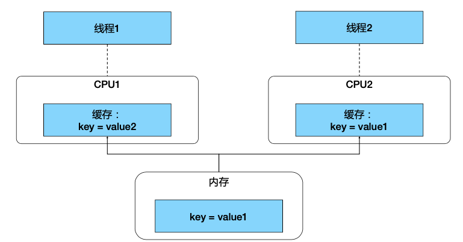

# class1:线程加锁

## PART1. 理解线程安全



线程安全:

线程安全和CPU多核架构相关.假定你有一进程,该进程中有很多线程(为方便说明,假定有2个线程,ThreadA和ThreadB).ThreadA和ThreadB现在需要同时去访问一块在进程空间内被共享的内存(为方便说明,假定这块内存的地址为0x123).我们再假定ThreadA和ThreadB分别被调度到了不同的CPU上(ThreadA被调度到了CPU1上,ThreadB被调度到了CPU2上).对于CPU而言,如果每一次计算都需要从物理内存中读取数据,那很明显过于低效.所以CPU会有自己的cache(TODO:是寄存器吗?).

对于CPU1和CPU2而言,如果都是第1次读取变量`key`,则必然会从物理内存中读取,读取完成后在本地cache.

此时问题来了:假设ThreadA修改了变量`key`的值,那么这个修改会先被保存到CPU1的cache中,并不会立刻写回内存(立刻写回内存就又会出现过于低效的情况).但运行在CPU2上的ThreaeB,此时看到的变量`key`的值依然是原值.

How to fix it?

Mutex.

[内存访问同步](https://github.com/rayallen20/ConcurrencyInGo/blob/master/note/%E7%AC%AC1%E7%AB%A0%20%E5%B9%B6%E5%8F%91%E6%A6%82%E8%BF%B0/%E7%AC%AC1%E7%AB%A0%20%E5%B9%B6%E5%8F%91%E6%A6%82%E8%BF%B0.md#%E5%86%85%E5%AD%98%E8%AE%BF%E9%97%AE%E5%90%8C%E6%AD%A5)

## PART2. 锁

### 2.1 锁的定义

锁:是一种内存访问同步机制.该机制确保goroutine独占某段内存的访问权.

GO语言不仅提供基于CSP的通讯模型,也支持基于共享内存的多线程数据访问.

### 2.2 锁的类型和作用

Sync包提供了锁的基本原语

- `sync.Mutex`:互斥锁
	- `Lock()`方法加锁;`Unlock()`方法解锁
- `sync.RWMutex`:读写锁
	- 不限制并发读,只限制并发写和并发读写
- `sync.WaitGroup`:等待一组goroutine返回
- `sync.Once`:保证某段代码只执行1次
- `sync.Cond`:让一组(或一个)goroutine在满足特定条件时被唤醒

[sync包初步](https://github.com/rayallen20/ConcurrencyInGo/blob/master/note/%E7%AC%AC3%E7%AB%A0%20GO%E8%AF%AD%E8%A8%80%E5%B9%B6%E5%8F%91%E7%BB%84%E4%BB%B6/2.%20sync%E5%8C%85.md)

TODO:sync包初步这一章的笔记尚未全部完成,但上述的这几个结构体的介绍和基本使用都有.1月5日前补齐.

### 2.3 示例

#### 2.3.1 Mutex

##### a. Mutex在Kubernetes中的应用

Kubernetes中的informer factory.

informer的作用:监听Kubernetes的对象

```go
// Start initializes all requested informers.
func (f *sharedInformerFactory) Start(stopCh <- struct{}) {
	// 加锁是为了后续遍历map map不是线程安全的 所以要加锁
	f.lock.Lock()
	defer f.lock.Unlock()
	for informerType, informer := range f.informers {
		if !f.startedInformers[informerType] {
			go informer.Run(stopCh)
			f.startedInformers[informerType] = true
		}
	}
}
```

##### b. demo

```go
package main

import (
	"fmt"
	"sync"
	"time"
)

func main() {
	// Tip:死锁定义
	// 死锁:所有并发进程彼此等待的程序.在这种情况下,如果没有外界的干预,这个程序将永远无法恢复

	go rLock()
	// Tip:直接调用wLock()会死锁
	go wLock()
	// Tip:直接调用lock()会死锁
	go lock()
	time.Sleep(5 * time.Second)
}

func lock() {
	lock := sync.Mutex{}
	for i := 0; i < 3; i++ {
		// Tip: 第2次循环就会阻塞 因为程序要等待lock解锁才能加锁
		// 但是给lock解锁的代码在循环期间又不会被执行 所以会阻塞
		lock.Lock()
		defer lock.Unlock()
		fmt.Println("lock:", i)
	}
}

func rLock() {
	lock := sync.RWMutex{}
	for i := 0; i < 3; i++ {
		// Tip:不会阻塞 因为RWMutex允许并发读
		lock.RLock()
		defer lock.RUnlock()
		fmt.Println("rLock:", i)
	}
}

func wLock() {
	lock := sync.RWMutex{}
	for i := 0; i < 3; i++ {
		// Tip:会阻塞 因为RWMutex不允许并发写
		lock.Lock()
		defer lock.Unlock()
		fmt.Println("wLock:", i)
	}
}
```

运行结果:

```
go run mutexDemo.go
lock: 0
rLock: 0
rLock: 1
rLock: 2
wLock: 0
```

#### 2.3.2 WaitGroup

##### a. WaitGroup在Kubernetes中的应用

以下代码取自Kubernetes端到端测试案例

```go
// CreateBatch create a batch of pods. All pods are created before
waiting.
func (c *PodClient) CreateBatch(pods []*v1.Pod) []*v1.Pod {
   ps := make([]*v1.Pod, len(pods))
   var wg sync.WaitGroup
   for i, pod := range pods {
       wg.Add(1)
       // 为每一个Pod起一个goroutine 执行逻辑
       go func(i int, pod *v1.Pod) {
          defer wg.Done()
          defer GinkgoRecover()
          ps[i] = c.CreateSync(pod)
		}(i, pod)
	}
	wg.Wait()
	return ps 
}
```

##### b. 案例

```go
package main

import (
	"fmt"
	"sync"
	"time"
)

func main() {
	waitByWG()
}

func waitBySleep() {
	for i := 0; i < 100; i++ {
		go fmt.Println(i)
	}
	time.Sleep(time.Second)
}

func waitByChannel() {
	// Tip:如果通过管道传递的数据仅做标识作用 通常使用空结构体
	c := make(chan struct{}, 100)
	for i := 0; i < 100; i++ {
		go func(i int) {
			fmt.Println(i)
			c <- struct{}{}
		}(i)
	}

	for i := 0; i < 100; i++ {
		// 从c中读不出100个元素 就阻塞
		<-c
	}
}

func waitByWG() {
	wg := sync.WaitGroup{}
	wg.Add(100)
	for i := 0; i < 100; i++ {
		go func(i int) {
			defer wg.Done()
			fmt.Println(i)
		}(i)
	}

	wg.Wait()
}
```

#### 2.3.3 Cond

##### a. Cond在Kubernetes中的应用

Kubernetes中的控制器都是生产者消费者模型

生产者(发送信号方):

```go
// Add marks item as needing processing.
func (q *Type) Add(item interface{}) { 
	q.cond.L.Lock()
	defer q.cond.L.Unlock() 
	if q.shuttingDown {
		return
	}
	if q.dirty.has(item) {
		return
	}
	q.metrics.add(item) q.dirty.insert(item)
	if q.processing.has(item) {
		return
	}
	q.queue = append(q.queue, item)
	// 发送信号 告知消费者队列新增元素
	q.cond.Signal()
}
```

消费者(等待信号方):

```go
// Get blocks until it can return an item to be processed. If shutdown = true,
// the caller should end their goroutine. You must call Done with item when you 
// have finished processing it.
func (q *Type) Get() (item interface{}, shutdown bool) { 
	q.cond.L.Lock()
	defer q.cond.L.Unlock()
	for len(q.queue) == 0 && !q.shuttingDown { 
		// 没有元素则等待
		q.cond.Wait()
	}
	if len(q.queue) == 0 {
		// We must be shutting down. 
		return nil, true
	}
	item, q.queue = q.queue[0], q.queue[1:] 	q.metrics.get(item) 
	q.processing.insert(item) q.dirty.delete(item)
	return item, false
}
```

##### b. 示例

```go
package main

import (
	"fmt"
	"sync"
	"time"
)

type Queue struct {
	queue []string
	cond  *sync.Cond
}

func main() {
	q := Queue{
		queue: []string{},
		cond:  sync.NewCond(&sync.Mutex{}),
	}

	go func() {
		for {
			q.Enqueue("a")
			time.Sleep(2 * time.Second)
		}
	}()

	for {
		q.Dequeue()
		time.Sleep(time.Second)
	}
}

func (q *Queue) Enqueue(item string) {
	q.cond.L.Lock()
	defer q.cond.L.Unlock()
	q.queue = append(q.queue, item)
	fmt.Printf("putting %s to queue, notify all\n", item)
	q.cond.Broadcast()
}

func (q *Queue) Dequeue() string {
	q.cond.L.Lock()
	defer q.cond.L.Unlock()
	for len(q.queue) == 0 {
		fmt.Println("no data available, wait")
		q.cond.Wait()
	}
	result := q.queue[0]
	q.queue = q.queue[1:]
	return result
}
```

[Demo详解](https://github.com/rayallen20/ConcurrencyInGo/blob/master/note/%E7%AC%AC3%E7%AB%A0%20GO%E8%AF%AD%E8%A8%80%E5%B9%B6%E5%8F%91%E7%BB%84%E4%BB%B6/2.%20sync%E5%8C%85.md#cond)