# class2:线程调度

## PART1. 进程与线程的创建

### 1.1 进程的创建

进程:资源分配基本单位

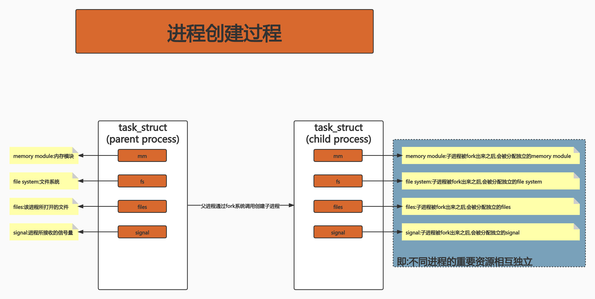

### 1.2 线程的创建

线程:调度的基本单位

无论是线程还是进程,在linux中都以`task_struct`描述.从内核角度来看,和进程没有本质区别.

Glibc中的pthread库提供NPTL(Native POSIX Threading Library)支持

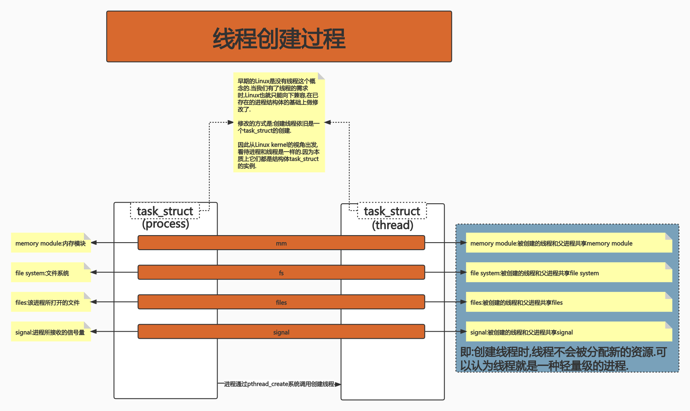

### 1.3 Linux进程的内存使用

内存页:Linux管理内存的基本单元.

```
getconf PAGE_SIZE
4096
```

说明Linux以4KB为1个基本单位,来管理内存.可以认为OS把物理内存抽象为多个页面(Page),每个页面大小为4KB.而Linux的内存管理,其实就是对这些内存页的管理.

虚拟地址:为了解决多个进程运行在同一台机器上,每个进程具体应该使用哪段内存的问题而被创建的概念.

每个进程看到的地址,其实都是虚拟地址.那么虚拟地址到物理地址,就需要一个映射关系.


以我们刚刚编写的`waitGroup.go`为例,编译后查看它的虚拟地址使用情况(环境:Centos 7.4):

```
 go build
[root@wdm waitGroup]# ls
waitGroup  waitGroup.go
[root@wdm waitGroup]# size waitGroup
   text	   data	    bss	    dec	    hex	filename
1112609	  97808	 213608	1424025	 15ba99	waitGroup
```

可以看到我们仅仅写了几十行代码,但Text段的大小已经有1MB多了(也就是指令有1M多了).

查看二进制文件的具体内容:

```
objdump -x waitGroup
```

具体内容见`./objdump-waitGroup.txt`,看了也没啥卵用,基本看不懂.

可以看到很多`runtime`的sample(TODO:sample是啥?).这说明GO在编译期间,编译器会向程序中放入很多初始化变量和未初始化变量,还会写入很多runtime的代码,所以使得程序的Text段会稍微大一些.**这就是用空间换时间的一种思路.**

### 1.4 CPU对内存的访问

CPU访问一个真实的物理地址,其实开销还是比较大的.要先查页表,然后找到物理地址,最后再去访问物理地址.这样的话整个进程效率一定不高.how to fix it? -- Buffer.

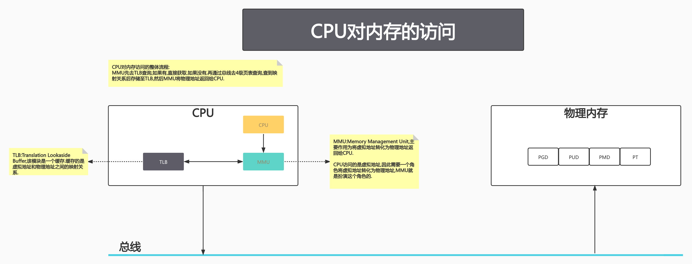

### 1.5 进程切换开销

- 直接开销
	- 切换PGD(原因:不同进程的页表项不同)
	- 切换内核态堆栈
	- 切换硬件上下文(进程恢复前,必须装入寄存器的数据统称为硬件上下文)
	- 刷新TLB(进程切换导致TLB失效,因此整个TLB全都要刷新)
	- 系统调度器的代码执行

- 间接开销
	- CPU缓存失效导致的进程需要到内存直接访问的IO操作变多

### 1.6 线程切换开销

- 从kernel的视角上看,线程本质上只是一批共享资源的进程,所以线程切换的本质依旧需要内核进行进程切换.内核进行进程切换,意味着需要走系统调用,而系统调用本身是需要开销的.
- 由于一组线程共享内存资源,因此一个进程的所有线程共享虚拟地址空间,**线程切换相比于进程切换,节省了虚拟地址空间的切换(PGD切换/TLB刷新/CPU缓存失效等情况都不会出现).**

有没有更轻量级的方法?比如可以绕过系统调用且能够完成线程切换的方式?--用户线程.

[用户线程](https://github.com/rayallen20/ConcurrencyInGo/blob/master/extend/%E8%BF%9B%E7%A8%8B%E3%80%81%E7%BA%BF%E7%A8%8B%E3%80%81%E5%8D%8F%E7%A8%8B.md#%E5%A4%9A%E7%BA%BF%E7%A8%8B%E4%B8%8E%E5%A4%9A%E6%A0%B8)

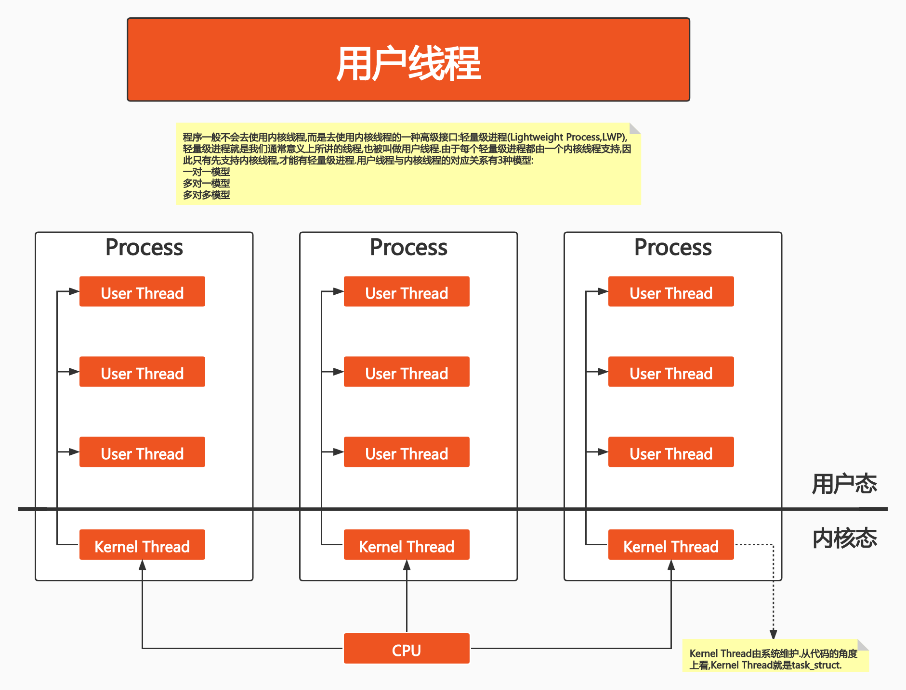

## PART2. goroutine

### 2.1 模型概要

GO语言基于GMP模型实现用户态线程.

- G:goroutine.每个goroutine有自己的栈空间,定时器.初始化的栈空间在2KB左右,空间会随需求增长.
- M:machine.抽象化表示内核线程(Kernel Thread),记录内核线程栈信息,当goroutine调度到线程时,使用该goroutine自己的栈信息.
- P:Process.表示调度器.负责调度goroutine,维护一个本地的goroutine队列,M从P上获得goroutine并执行,同时P还负责部分内存的管理.

G、M、P在GO语言中分别是一个struct.

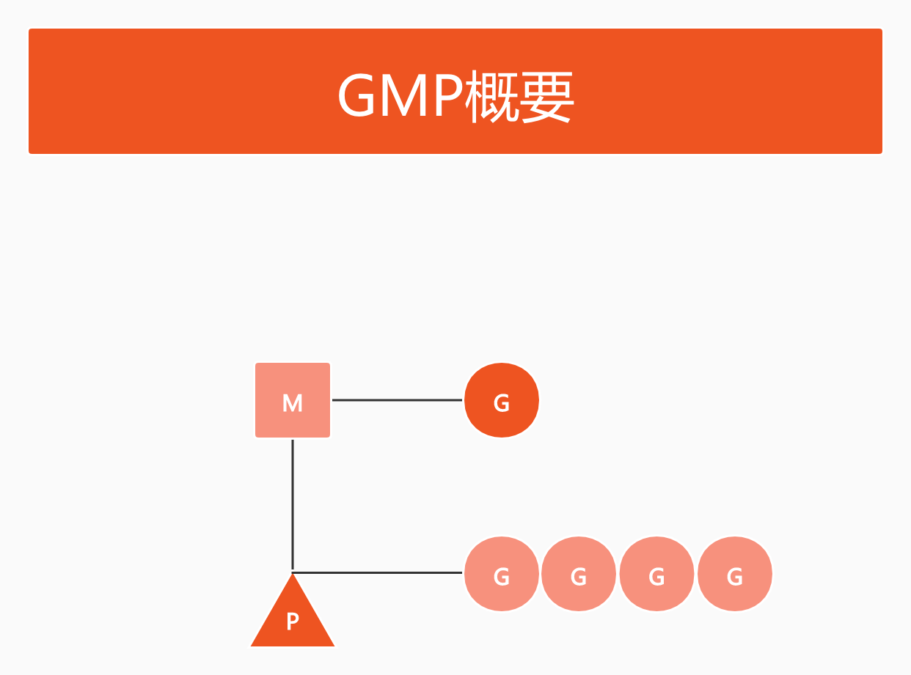

### 2.2 GMP的对应关系

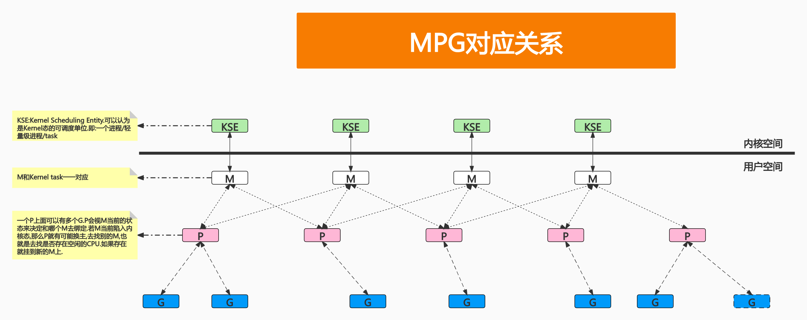

### 2.3 GMP模型细节

场景:假设此时有一段GO代码,这段代码在`main()`函数中启了很多个goroutine.那么GMP模型会按照下图示的方式运行:

Tip:`runtime.GOMAXPROCS()`可以设定GO语言程序最多支持并发线程的数量(当然,这个数字超过逻辑CPU的值也并没有什么卵用).高版本GO语言中,默认值就是当前机器的CPU数量(低版本(貌似是GO1.6之前? 忘了)缺省设置这个值是1,也就是不支持并发,需要研发人员调用`runtime.GOMAXPROCS()`手动设置).

- 初始化调度

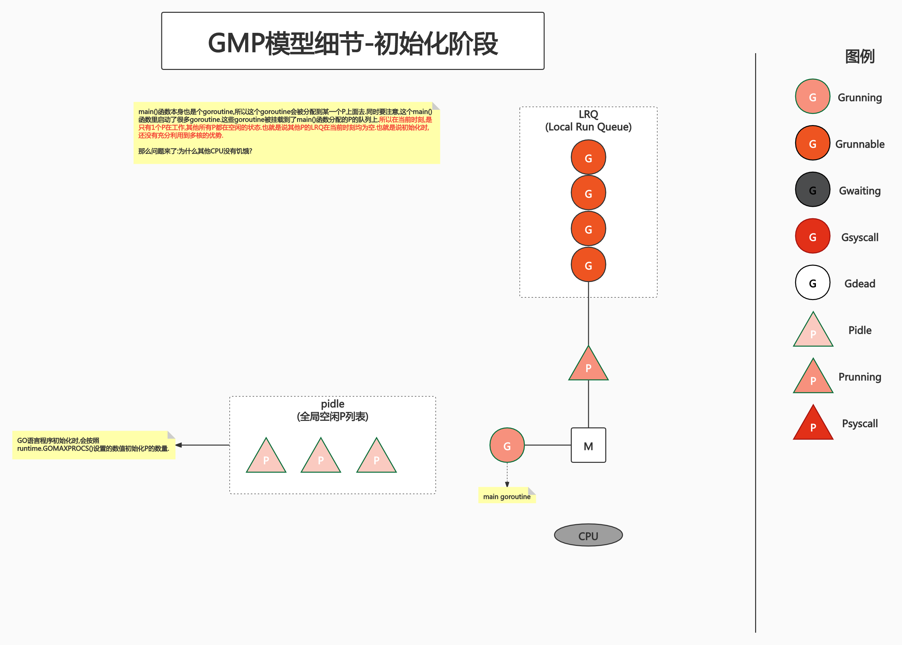

- 第1次抢占调度

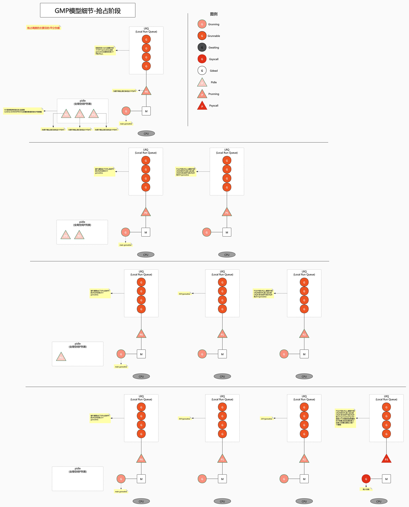

**调度是一个时刻发生的时间,它不需要每次(每个场景,每个case)都保证绝对的平均和最优.**

- P耗尽时的调度

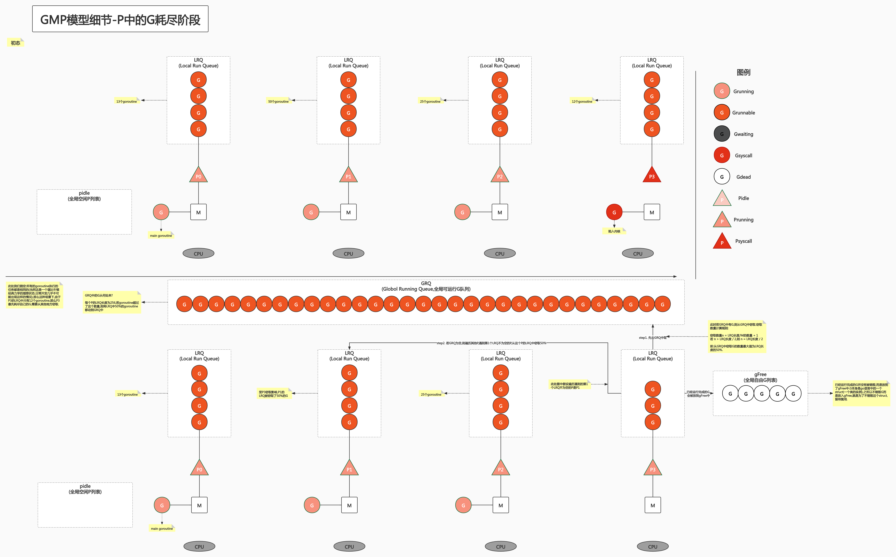

- LRQ中的G陷入内核的情况

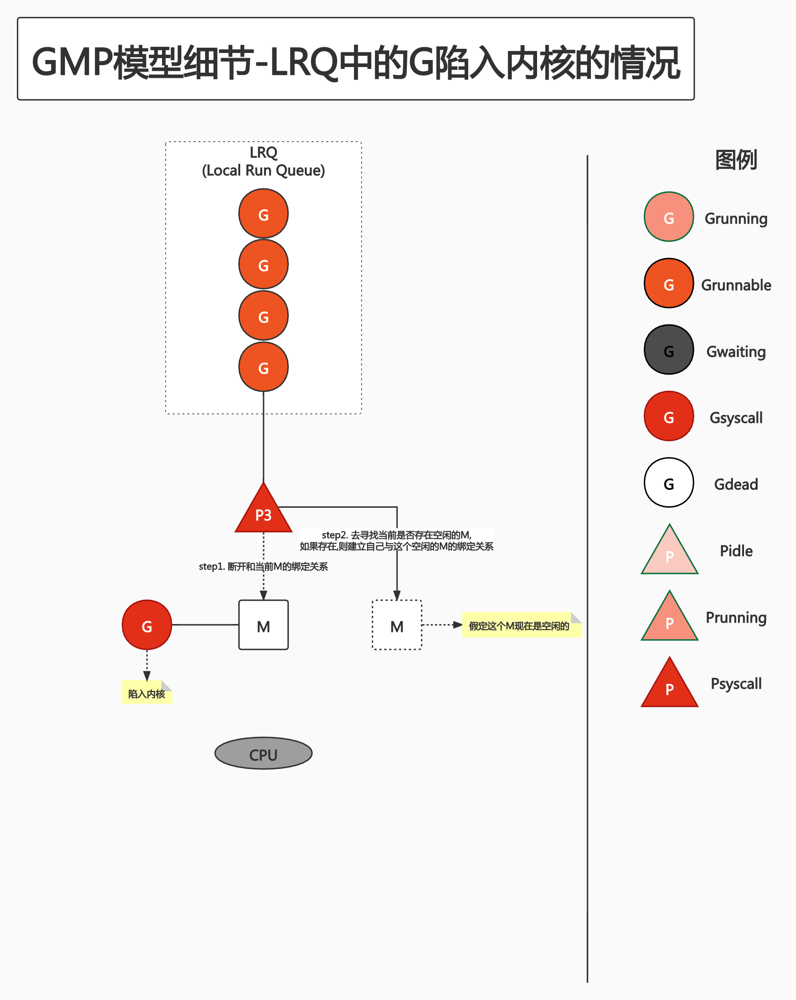

- G阻塞的情况

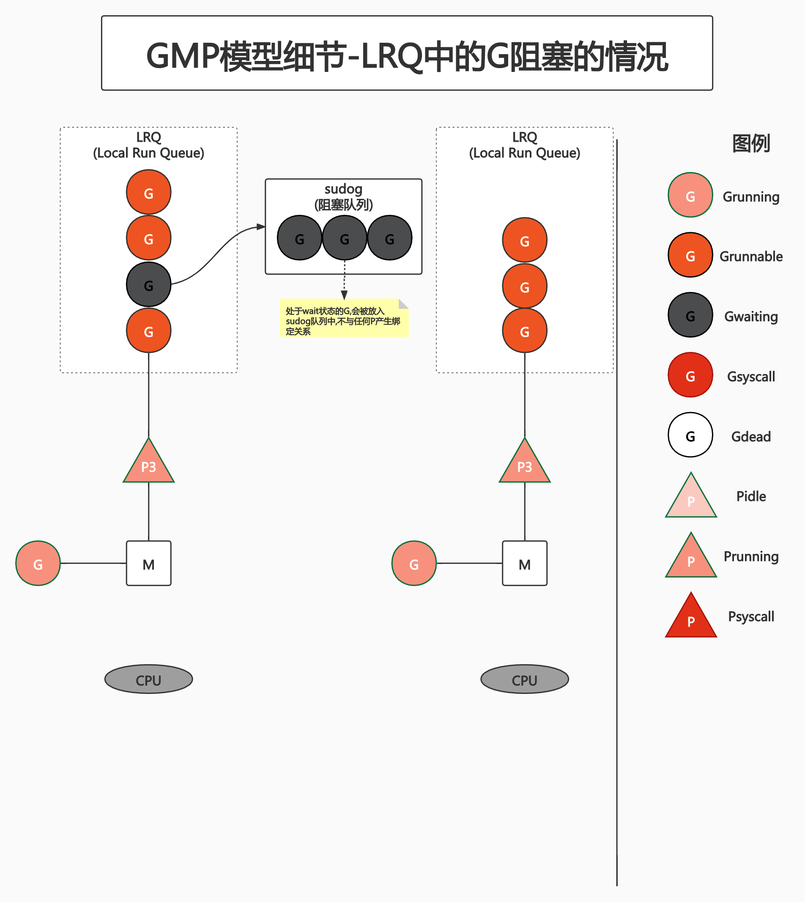

### 2.4 P的状态变化

P是有自己的状态机的.

- _Pidle:CPU没有运行用户代码或者调度器,被空闲队列或改变其状态的结构持有,运行队列为空
- _Prunning:被线程M持有,并且正在执行用户代码或调度器
- _Psyscall:没有执行用户代码,当前线程陷入系统调用
- _Pgcstop:被线程M持有,当前处理器由于GC被停止
- _Pdead:当前处理器已经不被使用

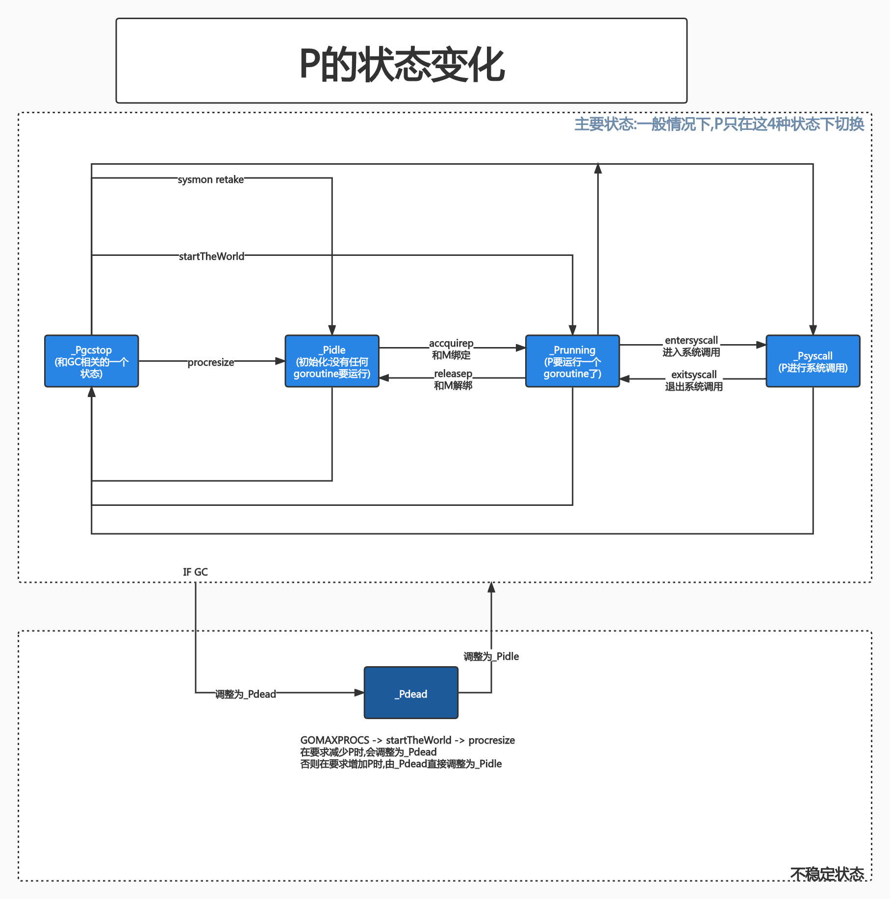

### 2.5 G的状态变化

G也有自己的状态机.

- _Gidle:刚刚被分配并且还没有被初始化,值为0,为创建goroutine后的默认值(TODO:这个值是啥值? 表示goroutine的ID么?)
- _Grunnable:存储在运行队列中(这个队列可能是某个P的LRQ,也可能是进程的GRQ),此时没有执行代码,没有栈的所有权,因为还没有被调度到
- _Grunning:正在执行代码的goroutine,拥有栈的所有权.此时已经和M产生了绑定关系
- _Gsyscall:正在执行系统调用,拥有栈的所有权,与P脱离,但与某个M绑定,在调用结束后会被分配到运行队列中
- _Gwaiting:被阻塞的goroutine,阻塞在某个channel的发送或者接收队列(在sudug)里了
- _Gdead:当前goroutine未被使用,没有执行代码,可能有分配的栈,分布在空闲列表gFree中,可能是一个刚刚初始化的goroutine,也可能时执行了goexit退出的goroutine
- _Gcopystack:栈正在被拷贝,没有执行代码,不在运行队列上,但执行权在
- _Gscan:GC正在扫描空间,没有执行代码,可以与其他状态同时存在

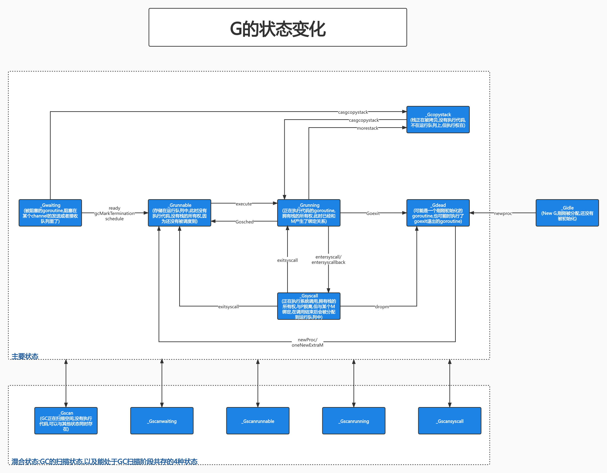

### 2.6 G所处的位置

- 每个进程都有一个全局的G队列(GRQ)
- 每个P有自己的本地执行队列(LRQ)
- 不在运行队列中的G:
	- 处于channel阻塞状态的G被放在sudog
	- 陷入系统调用的G脱离P,绑定在M上
	- 为了复用(减少后续创建G的开销),执行结束的G进入P的gFree列表

### 2.7 goroutine的创建过程

- 获取或创建新的goroutine结构体
	- 从处理器的gFree列表中查找空闲的goroutine
	- 如果没有空闲的goroutine,会通过`runtime.malg`创建一个栈大小足够的新结构体
- 将函数传入的参数移到goroutine的栈上
- 更新goroutine调度相关的属性,更新状态为_Grunnable
- 返回的goroutine会存储到全局变量allgs中

### 2.8 将goroutine放到运行队列上

- 如果goroutine处于P的LRQ中,则设置CPU的runnext作为下一个CPU执行的任务
- 当P的LRQ满了(大小为256)时,就会把LRQ中的一部分goroutine(50%)和待加入的goroutine通过`runtime.runqputslow`添加到GRQ上

### 2.9 调度器行为

调度时是如何寻找一个runnable的goroutine的?

- step1. 为保证公平,当GRQ中有runnable的goroutine时,通过schedtick保证有一定概率(1/61)从GRQ中查找对应的goroutine(1/61就是个经验数字.这样做的目的在于:如果P的LRQ一直有runnable的goroutine,那么总会有一些goroutine会被积压下沉到GRQ中.如果一直在P的LRQ中寻找runnable的goroutine,那么GRQ中的goroutine就会饥饿.为了防止这种情况的出现,所以保证一定概率从GRQ中查找)
- step2. 如果1/61的概率没有hit,就会去P的LRQ中查找runnable的goroutine
- step3. 如果前两步都没有找到runnable的goroutine,就会通过`runtime.findrunnable`进行阻塞地查找(说白了就是轮询)runnable的goroutine
- step4. 如果轮询也没找到,就会通过`runtime.runqsteal`,尝试去其他兄弟P(这个P是随机找的)中窃取,如果找到有runnable的goroutine的P(可以理解为找到了一个LRQ里有runnable的goroutine的P),则窃取这个P的50%的runnable的goroutine.