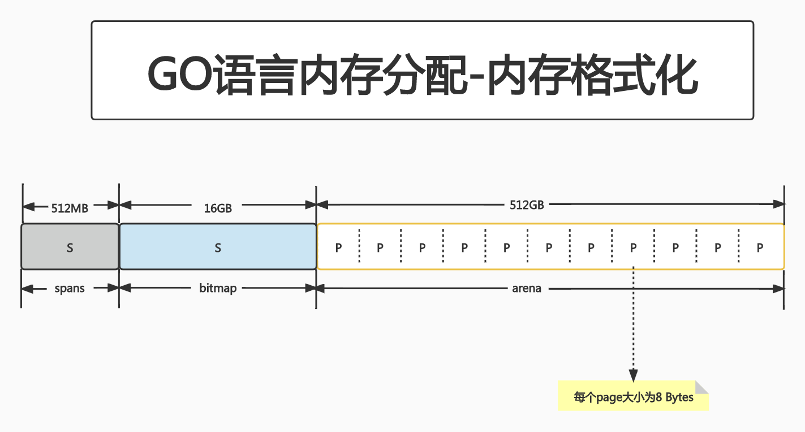
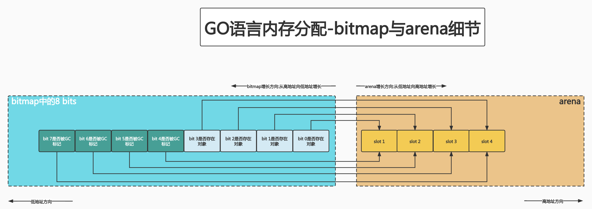
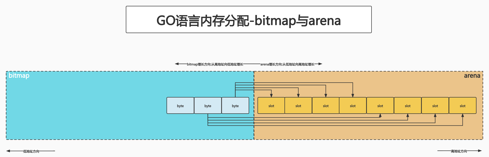
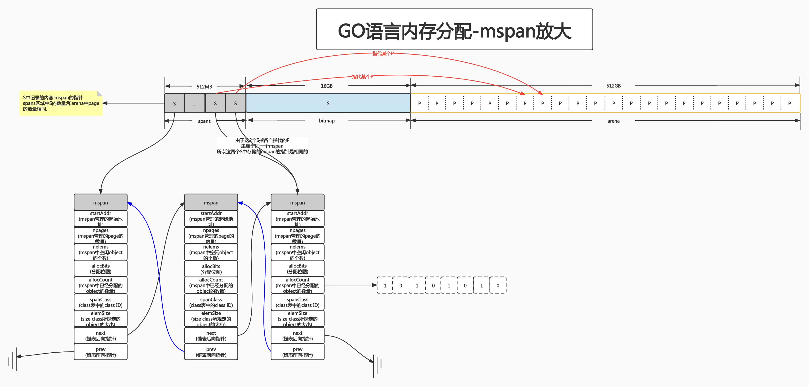
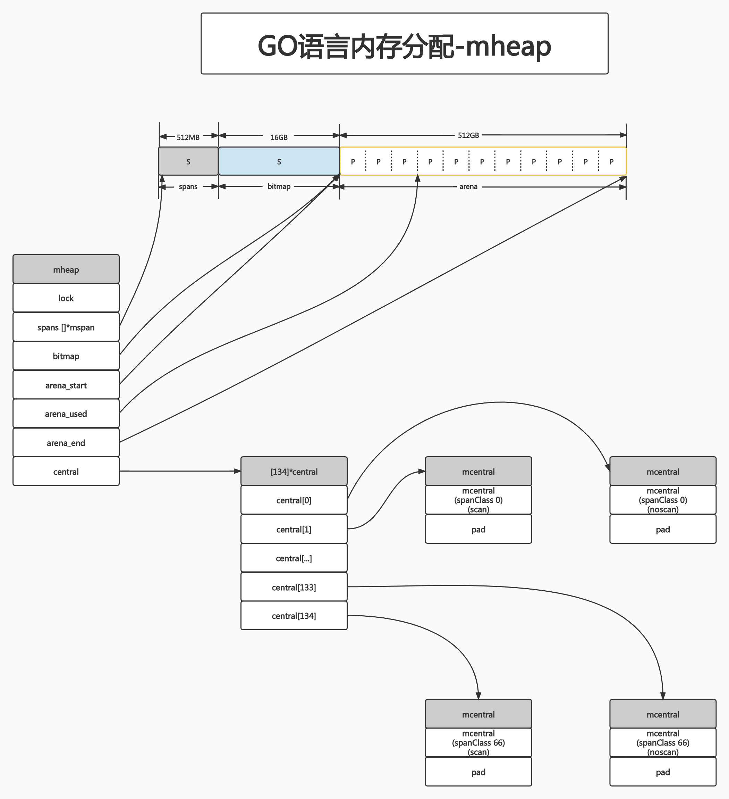
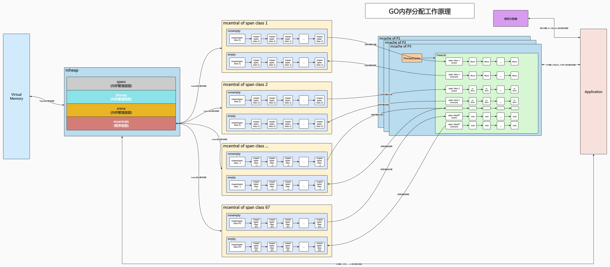

# GO语言内存分配算法

GO语言内置运行时(即runtime),抛弃了传统的内存分配方式,改为自主管理.这样可以自主地实现更好的内存使用模式,如内存池、预分配等.这样,不会每次内存分配都需要进行syscall.

GO的运行时内存分配算法主要源自Google为C语言开发的TCMalloc算法,全称Thread-Caching Malloc.**其核心思想就是把内存分为多级管理,从而降低锁的粒度.**它将可用的堆内存采用二级分配的方式进行管理:每个Thread都会自行维护一个独立的Memory Pool,进行内存分配时,优先从该Memory Pool中分配,当Memory Pool不足时,才会像Global Memory Pool申请,以避免不同Thread对Global Memory Pool的频繁竞争.

## PART1. 基础概念

GO在程序启动时,会先向OS申请一块内存(注意:此时这块内存只是一段虚拟的地址空间,并不会真正地进行分配),把这块内存切成小块后,自行管理.

申请到的内存块,被格式化为3个区域,在X86-64架构下,分别为512MB,16GB,512GB大小.



arena区域:就是堆区,GO动态分配的内存都在这个区域,它把内存分割成8K大小的page,一些page组合起来称为mspan

bitmap区域:表示arena区域哪些地址保存了对象,并用1 bit标记arena区域中的1个page是否存在对象;用1 bit标记该page是否被gc标记过.因此,bitmap中1 byte(8 bits)大小的内存对应arena区域4个指针(1个指针大小为8 Bytes)大小的内存,因此bitmap区域的大小为: 512GB / (8Bytes * 4) = 16GB





TODO:此图的slot是否就是上图中的page?

从上图其实还可以看到,bitmap的高地址部分指向arena区域的低地址部分,也就是说bitmap的地址是从高地址向低地址增长的.

spans区域:存放mspan(即:一些arena分割的page组合起来的内存管理基本单元,后文详述)的指针,每个指针对应1个page,因此spans区域的大小为:512GB / 8KB * 8B = 512MB.此处的8KB是arena区域中每个page的大小;8 Bytes是指针的大小.可以这么理解:spans区域的大小为arena区域中每个page的指针大小之和.这么设计的目的在于:创建mspan时,按page填充对应的spans区域,在回收object时,根据地址很容易就能找到该object所属的mspan.

## PART2. 内存管理单元

mspan:GO中内存管理的基本单元,是由一片连续的8KB的page组成的大块内存.注意此处说的page不是OS的page,此处说的page通常比OS的page大几倍.简单理解:mspan是一个包含page起始地址、mspan规格、page的数量等内容的双端链表.

每个mspan按照其自身的属性size class的大小分割成诺干个object,每个object可存储1个对象(个人理解:object相当于mspan中用于存储的单位,对象是实际存储的内容).并且会使用1个位图来标记其尚未使用的object.属性size class决定了object的大小.而mspan只会分配给object与object尺寸大小接近的对象.当然,对象的大小要小于object的大小.

span class:和size class的含义差不多.span class = size class * 2.这是因为每个size class有2个对应的mspan,也就是有2个span class.其中一个分配给有指针的对象,另一个分配给没有指针的对象.这样设计的目的在于:便于GC.后文详述.

mspan由一组连续的页组成,按照一定大小划分成object.


[GO语言定义size class的数量](https://github.com/golang/go/blob/master/src/runtime/sizeclasses.go#L89)

[每个size class所划分的object的大小(单位:Byte)](https://github.com/golang/go/blob/master/src/runtime/sizeclasses.go#L93)

根据mspan的size class可以得到它划分的object的大小.例如:

`size class = 3`,则有`class_to_size[3] = 32`,因此该size class决定了mspan适合存储17~32Bytes大小的object.而对于小于16Bytes的object,我们称之为微小对象(tiny object),分配器会将其合并,将几个对象分配到同一个object中.

对于mspan,它的size class决定了它所能分配到的page的数量,这也是写死在代码里的:

[不同size class决定了mspan分配到的页数](https://github.com/golang/go/blob/master/src/runtime/sizeclasses.go#L94)

例如此时要申请一个object大小为32Bytes的mspan,则有:32在数组`class_to_size`中的索引为3,`class_to_allocnpages[3] = 1`,因此该mspan能够申请到1个page,即:该mspan大小为8KB.

[GO语言中mspan的结构体定义](https://github.com/golang/go/blob/master/src/runtime/mheap.go#L381)

```go
type mspan struct {
	// next span in list, or nil if none
	// 链表后向指针,用于将span链接起来
	next *mspan
	
	// previous span in list, or nil if none
	// 链表前向指针,用于将span链接起来
	prev *mspan
	
	// address of first byte of span aka s.base()
	// 起始地址 即该mspan所管理的page的地址
	startAddr uintptr
	
	// number of pages in span
	// 该mspan管理的page的数量
	npages    uintptr 
	
	// number of object in the span.
	// mspan中空闲object的个数 表示有多少个object可供分配
	nelems uintptr 	
	
	// 分配位图 每1位表示一个object是否已经被分配
	allocBits  *gcBits
	
	// number of allocated objects
	// 已经分配的object的数量
	allocCount  uint16
	
	// size class and noscan (uint8)
	// class表中的class ID,和size class有关
	spanclass   spanClass
	
	// computed from sizeclass or from npages
	// size class所规定的object的大小
	elemsize    uintptr       
}
```



可以看到有2个S指向了同一个mspan,因为这两个S指代的P是同属1个mspan的.所以通过arena上的P可以快速找到指代它的S,通过S中保存的指针,就能找到mspan.

假设图中最左边第1个mspan的`size class = 10`,则有:

1. `class_to_size[10] = 144`,该mspan中被size class规定了保存的object大小为144 Bytes(129~144 Bytes);
2. `class_to_allocnpages[10] = 1`,故该mspan有1个page.
3. 该mspan可分配对象的个数为: 8KB / 144B = 56.89,向下取整:56个.也就是说有一些内存会被浪费掉.假设这个mspan是分配个无指针对象的,那么spanClass等于20(TODO:为啥分配给无指针对象,在这些条件限定下能够得出size class = 20?)


## PART3. 内存管理组件

内存分配由内存分配器完成.分配器由3种组件构成:mcache,mcentral,mheap(建议这部分配合TCMalloc那部分一起读)

### 3.1 mcache

mcache:每个工作线程都会绑定一个mcache,把可用的mspan作为一种资源,做一个local cache.这样就可以直接给goroutine分配.因为不存在多个goroutine竞争的情况,所以不会消耗mutex资源.

[mcache的结构体定义](https://github.com/golang/go/blob/master/src/runtime/mcache.go#L20)

[numSpanClasses的定义](https://github.com/golang/go/blob/master/src/runtime/mheap.go#L531)

其中比较重要的字段是:

```go
type mcache struct {
	alloc [numSpanClasses]*mspan
}
```

对numSpanClasses的定义:

```go
const (
	numSpanClasses = _NumSizeClasses << 1
)
```

`mcache`用`SpanClasses`作为索引,管理多个用于分配的mspan,它包含所有规格的mspan.它是`_NumSizeClasses`的2倍,即67 * 2 = 134个mspan.之所以有一个2倍的关系,是因为1个size class对应2个span class:其中一个mspan分配的对象不包含指针;另一个mspan对象则包含指针.

对于无指针对象的`mspan`在进行GC时,无需进一步扫描它是否引用了其他活跃的对象.


`mcache`在初始化时无任何`mspan`资源,在使用过程中会动态从`mcentral`申请,申请后会cache住.当object大小小于32KB时,使用`mcache`中相对应规格的`mspan`进行分配即可.

### 3.2 mcentral

`mcentral`:为所有`mcache`提供切分好的`mspan`资源.每个`mcentral`保存1种特定大小的全局`mspan`列表,包括已分配出去的和未分配出去的.每个`mcentral`对应`1种`mspan`.

而`mspan`的种类(或者说规格,即spanclass的大小)决定了不同的`mspan`适配的`object`大小不同.当工作线程的`mcache`中没有合适(也就是适配`object`的`mspan`)时,会从`mcentral`中获取.

[GO1.9版本中对mcentral的定义](https://github.com/golang/go/blob/dev.boringcrypto.go1.9/src/runtime/mcentral.go#L20)

```go
type mcentral struct {
	// 互斥锁
	lock      mutex
	
	// spanClass 即mspan的规格
	spanclass spanClass
	
	// list of spans with a free object, ie a nonempty free list
	// 有空闲object的mspan链表
	nonempty  mSpanList
	
	// list of spans with no free objects (or cached in an mcache)
	// 没有空闲object的mspan链表,或者是已被mcache取走的mspan链表
	empty     mSpanList

	// nmalloc is the cumulative count of objects allocated from
	// this mcentral, assuming all spans in mcaches are
	// fully-allocated. Written atomically, read under STW.
	// 累计已分配对象的个数
	nmalloc uint64
}
```


`empty`字段表示指向的那条链表中,所有的`mspan`都被分配了`object`或已经被`mcache`取走了.那么这个链表中的每个`mspan`就已经被工作线程独占了.反之,`nonempty`指向了一个有空闲对象的`mspan`链表.每个`mcentral`结构体都在`mheap`中维护.

简单理解`mcache`从`mcentral`获取和归还`mspan`的流程:

- 获取`mspan`:
	- 加锁
	- 从`nonempty`链表找到一个可用的`mspan`
	- 并将其从`nonempty`链表删除
	- 将取出的`mspan`加入到`empty`链表
	- 将mspan返回给工作线程
	- 解锁
- 归还`mspan`:
	- 加锁
	- 将`mspan`从`empty`链表删除
	- 将`mspan`加入到`nonempty`链表
	- 解锁
	
### 3.3 mheap

`mheap`:代表GO程序持有的所有堆空间,GO程序使用1个`mheap`的全局对象`_mheap`来管理堆内存.

当`mcentral`没有空闲的`mspan`时,会向mheap申请.而`mheap`没有资源时,会向操作系统申请新内存.mheap主要用于大对象的内存分配,以及管理未切割的`mspan`,用于给`mcentral`切割成小对象.

[go1.9对mheap的定义](https://github.com/golang/go/blob/dev.boringcrypto.go1.9/src/runtime/mheap.go#L30)

```go
type mheap struct {
	lock      mutex
	
	// spans is a lookup table to map virtual address page IDs to *mspan.
	// For allocated spans, their pages map to the span itself.
	// For free spans, only the lowest and highest pages map to the span itself.
	// Internal pages map to an arbitrary span.
	// For pages that have never been allocated, spans entries are nil.
	//
	// This is backed by a reserved region of the address space so
	// it can grow without moving. The memory up to len(spans) is
	// mapped. cap(spans) indicates the total reserved memory.
	// 指向mspans区域,用于映射mspan和page的关系
	spans []*mspan
	
	// Points to one byte past the end of the bitmap
	// 指向bitmap首地址 注意bitmap是从高地址向低地址方向增长的
	bitmap        uintptr
	
	// The arena_* fields indicate the addresses of the Go heap.
	//
	// The maximum range of the Go heap is
	// [arena_start, arena_start+_MaxMem+1).
	//
	// The range of the current Go heap is
	// [arena_start, arena_used). Parts of this range may not be
	// mapped, but the metadata structures are always mapped for
	// the full range.
	// 指向arena区首地址
	arena_start uintptr
	// 指向arena区已使用地址位置
	arena_used  uintptr // Set with setArenaUsed.
	
	// The heap is grown using a linear allocator that allocates
	// from the block [arena_alloc, arena_end). arena_alloc is
	// often, but *not always* equal to arena_used.
	// 指向arena区末地址
	arena_end   uintptr
	
	// central free lists for small size classes.
	// the padding makes sure that the MCentrals are
	// spaced CacheLineSize bytes apart, so that each MCentral.lock
	// gets its own cache line.
	// central is indexed by spanClass.
	central [67*2]struct {
		mcentral mcentral
		pad [sys.CacheLineSize - unsafe.Sizeof(mcentral{})%sys.CacheLineSize]byte
	}
}
```



上图我们看到,`bitmap`和`arena_start`指向了同一个地址,这是因为`bitmap`的地址是从高到低增长的,所以他们指向的内存位置相同.

## PART4. 总结

- Go在程序启动时,会向操作系统申请一大块内存,之后自行管理.
- Go内存管理的基本单元是`mspan`,它由若干个`Page`组成,每种`mspan`可以分配特定大小的`object`.
- `mcache`,`mcentral`,`mheap`是Go内存管理的三大组件,层层递进.`mcache`管理线程在本地缓存的`mspan`;`mcentral`管理全局的`mspan`供所有线程使用;`mheap`管理Go的所有动态分配内存.
- 极小对象会分配在一个`object`中,以节省资源.使用tiny分配器分配内存;一般小对象通过mspan分配内存;大对象则直接由mheap分配内存.

