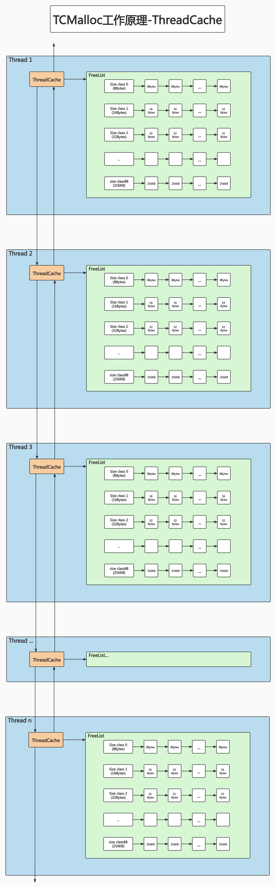
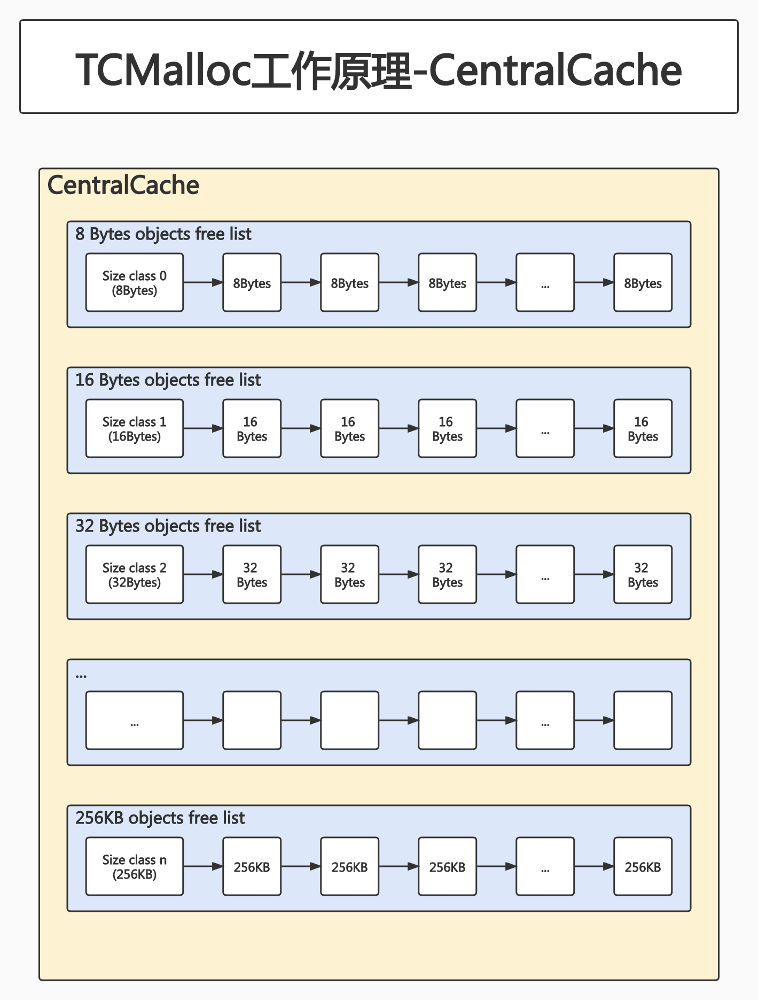
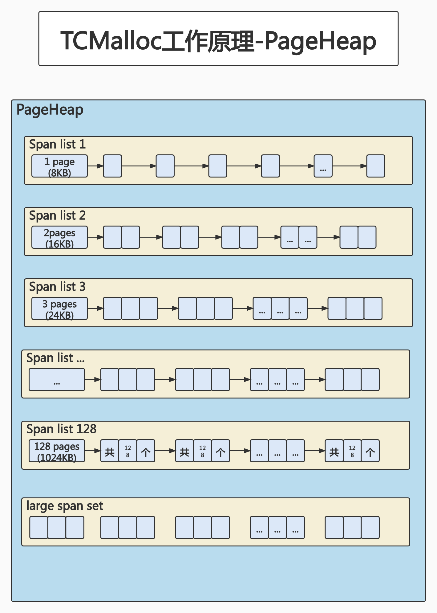
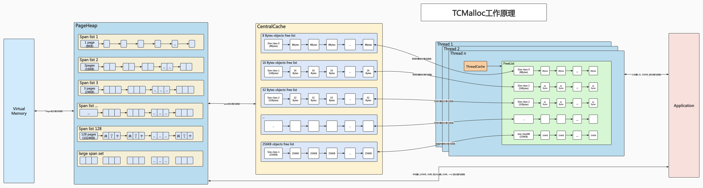

# TCMalloc内存分配算法

[参考文章(照抄的这篇文章)](https://zhuanlan.zhihu.com/p/51432385)

## 1. 概览

TCMalloc的官方介绍中将内存分配称为Object Allocation,此处沿用这个叫法,将object翻译为对象,可以把它理解为具有一定大小的内存.

按照所分配内存的大小,TCMalloc将内存分配为3类:

- 小对象分配 (0, 256KB]
- 中对象分配 (256KB, 1MB]
- 大对象分配 (1MB, +∞)

概念介绍:

page:和OS管理内存的方式类似,TCMalloc将整个虚拟空间划分为n个同等大小的page,每个page默认8KB.

span:连续的1-n个page称为1个span

PageHeap:TCMalloc是用C语言实现的一个内存分配算法.PageHeap是其中的一个类,这个类用于处理向OS申请内存相关的操作,并提供了一层cache.**可以认为,PageHeap就是所有可供Application动态分配的内存的抽象.**

PageHeap以span为单位,向OS申请内存.申请到的span可能只有1个page,也可能有n个page.span可能会被划分为一系列的小对象,共小对象分配使用,也可能当做一整块用于中对象或大对象分配.

## 2. 小对象分配

### 2.1 Size Class

对于256KB以内的小对象分配,TCMalloc按大小划分了85个类别(官网上的原文是近似88个,老师上课说128个,此处待考证),这些类别称为Size Class.每个Size Class都对应一个大小,比如8Bytes,16Bytes,32Bytes.Application申请内存时,TCMalloc会首先将所申请的内存大小向上取整到size class的大小(比如1-8Bytes的申请,会分配到8Bytes;9-16Bytes的申请,会分配到16Bytes,以此类推).因此这里会产生内部碎片.TCMalloc将这里的内部碎片控制在12.5%以内,具体实现此处不多展开了.

### 2.2 ThreadCache

对于每个线程,TCMalloc都为其保存了一份单独的cache,称为ThreadCache,这也是TCMalloc名字的由来(Thread-Caching Malloc).每个ThreadCache中对于每个size class都有一个单独的FreeList,FreeList中cache了n个还未被Application使用的空闲对象.

小对象的分配直接从ThreadCache的FreeList中返回一个空闲对象,相应的,小对象的回收也是将其重新放回ThreadCache对应的FreeList中.

由于每个Thread都有自己的ThreadCache,因此从ThreadCache中取用或回收内存是不需要加锁的,速度很快.

为了方便统计数据,每个线程的ThreadCache连接成一个双向链表,其结构如下图示:

### 2.3 CentralCache

ThreadCache中的空闲对象从何而来?--CentralCache.CentralCache是一个所有线程公用的cache.

和ThreadCache类似,CentralCache中对于每个size class也有一个单独的链表来cache空闲对象,这个链表称为CentralFreeList,供各个Thread的ThreadCache从中取用空闲对象.

由于是所有Thread共用的,因此从CentralCache中取用或回收对象,是需要加锁的.为了平摊锁操作的开销,ThreadCache一般从CentralCache中一次性取用或回收多个空闲对象.

### 2.4 PageHeap

CentralCache中的空闲对象又是从何而来?--PageHeap.PageHeap是TCMalloc对可动态分配的内存的抽象.

当CentralCache中的空闲对象不够用时,CentralCache会向PageHeap申请一块内存(这块内存可能来自PageHeap的cache,也可能是从OS申请的新的内存),并将其拆分为一系列空闲对象,添加到对应的size class的CentralFreeList中.

PageHeap内部根据内存块(span)的大小,采取2种不同的cache策略:128个page以内的span,每个span都用一个链表来cache;超过128个page的span,存储于一个有序的set中.

### 2.5 内存回收

以上说的都是内存分配,那么小对象的内存回收是如何做的?

Application调用`free()`或delete一个小对象时,仅仅是将其插入到ThreadCache中和size class对应的FreeList中,不需加锁,速度很快.

只有当满足一定的条件时,ThreadCache中的空闲对象才会重新放回CentralCache中,以供其他线程取用.同样的,当满足一定条件时,CentralCache中的空闲对象也会还给PageHeap,PageHeap再还给系统.

关于内存在这些组件之间的移动问题,现在先忽略这些细节.

### 2.6 小结

小对象分配流程:

- step1. 将要分配的内存大小映射到对应的size class
- step2. 查看ThreadCache中,该size class对应的FreeList
	- 若FreeList非空,则移除FreeList的第一个空闲对象并将其返回,分配结束
	- 若FreeList是空的:
		- 从CentralCache中size class对应的CentralFreeList获取一堆空闲对象
			- 若CentralFreeList也是空的:
				- 向PageHeap申请一个span
				- 将这个span分成size class对应大小的空闲对象,放入CentralFreeList中
- step3. 将这些对象放置到ThreadCache中的size class对应的FreeList中(第1个对象不放)
- 返回从CentralCache中获取的第1个对象给Application

## 3. 中对象分配

256KB ≤ 要申请的内存大小 ＜ 1MB(128 pages)的内存分配被认为是中对象分配,采取了与小对象不同的分配策略.

首先,TCMalloc会将Application所要申请的内存大小向上取整到整数个page(所以此处会产生1Byte~8KB的内部碎片).之后的操作很简单:向PageHeap申请一个指定page数量的span,并向Application返回其起始地址即可.

问题是,PageHeap是如何管理这些span的?

之前说过,PageHeap提供了一层缓存,因此PageHeap并非每次都是向OS申请内存,也有可能从PageHeap的cache中分配.

对 1 page < span大小 ≤ 128 pages 和 128 pages < span大小这两种不同的span,PageHeap采取的cache策略是不同的.

以下为了叙述方便,我们把1 page < span大小 ≤ 128 pages的span称为small span;把128 pages < span的span称为large span(此处只是为了方便描述,并没有哪本教材是这么命名的).

PageHeap中有128个小span的链表,分别对应1~128个page的span.

假设此时要分配一块内存,它的大小经过向上取整之后,对应k个page,因此需要从PageHeap中取一个大小为k个page的span,其过程如下:

- 从k个page的span链表开始,到128个page的span链表,按顺序找到第一个非空链表
- 取出这个非空链表中的1个span,假设该span有n个page,将这个span拆分成两个span
	- 一个大小为k个page的span,作为分配结果返回给Application
	- 另一个大小为n - k个page的span,重新插入到n - k个page的span链表中
- 如果找不到非空链表,则将这次分配看做是大对象分配,分配过程详见下文

## 4. 大对象分配

超过1MB(128 pages)的内存分配被认为是大对象分配,与中对象分配类似,也是先将所要分配的内存大小向上取整到整数个page,假设是k个page,然后向PageHeap申请一个k个page大小的span.

对于中对象的分配,如果上述的span链表无法满足,也会被当做是大对象来处理.也就是说,**TCMalloc在源码层面其实并没有区分中对象和大对象**,只是对于不同大小的span的缓存方式不一样.

大对象分配用到的span都是超过128个page的span,其缓存方式不是链表,而是一个按span大小排序的有序set,以便按大小进行查找.

假设此时要分配一块超过1MB的内存,其大小经过向上取整之后对应k个page(此时k > 128);或要分配一块1MB以内的内存,但无法由中对象分配逻辑来满足,此时k <= 128.

不管哪种情况,都是要从PageHeap的large span set中取一个大小为k个page的span,其过程如下:

- 搜索set,找到不小于k个page的最小的span(best-fit),假设该span有n(n ≥ k)个page
- 将这个span拆分为两个span:
	- 一个大小为k个page的,作为分配结果返回给Application
	- 另一个span大小为n - k个page:
		- 若n - k > 128,则将该span插入到large span set中
		- 若n - k ≤ 128,将其插入到对应的小span链表中
- 如果找不到合适的span,则使用sbrk(这是啥?)或mmap(这又是啥?)向系统申请新的内存以生成新的span,并重新执行中对象或大对象的分配算法

## 5. 小结

可以看到,不超过256KB的小对象分配,在Application和Virtual Memory之间其实有三层缓存:PageHeap、CentralCache、ThreadCache.而中对象和大对象分配,则只有PageHeap一层缓存.

