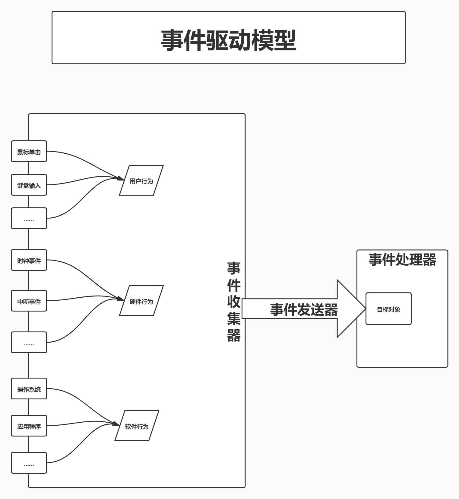
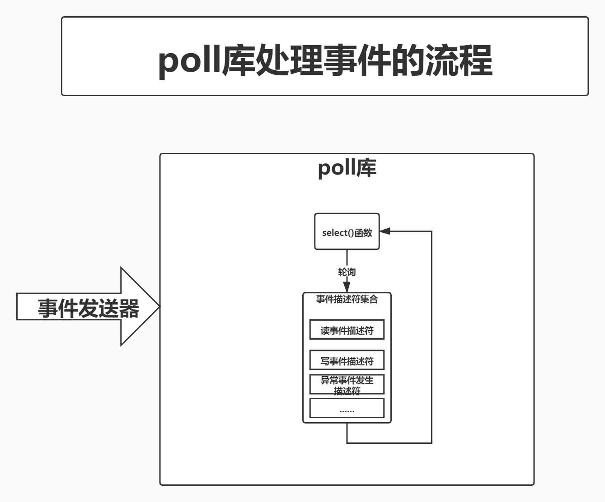
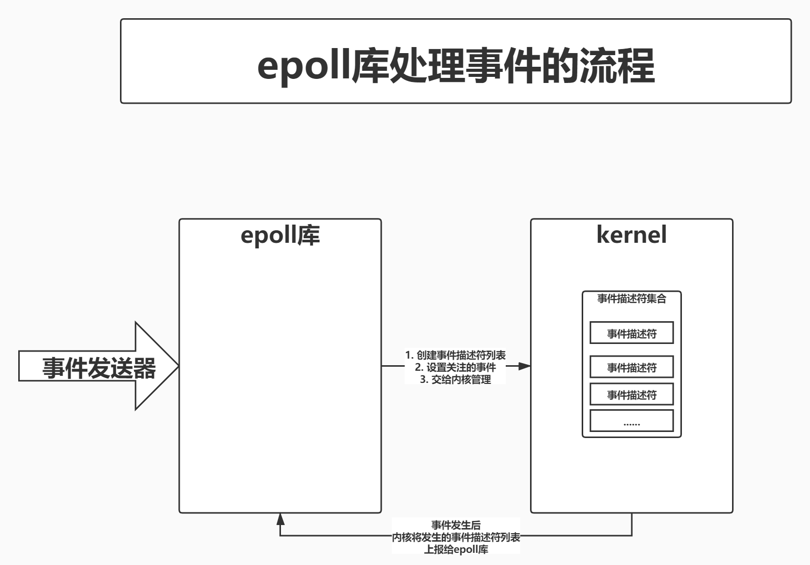

# 请求处理方式与事件驱动模型

## PART1. 服务器端请求的处理方式

### 1.1 多进程方式

多进程方式:服务器每当接收到一个客户端时,就由服务器主进程生成一个子进程出来,和该客户端建立连接并进行交互,直到连接断开,该子进程的生命周期结束.

多进程方式的优点:设计和实现相对简单,各个子进程之间相互独立,处理客户端请求的过程彼此不受干扰,并且当一个子进程出现问题时,不容易将影响漫延到其他进程中,导致惊群效应.这些优点保证了提供服务的稳定性.当子进程退出时,其占用资源会被操作系统回收,也不会留下任何垃圾.

多进程方式的缺点:该方式缺点也很明显.OS中生成一个子进程需要进行内存复制等操作,在资源和时间上会产生一定的额外开销.因此,如果Web服务器接收大量并发请求,就会对系统资源造成压力,导致系统性能下降.

初期的Apache服务器就是采用这种方式对外提供服务的.为了应对大量并发请求,Apache服务器采用"预生成进程"的机制对多进程方式进行了改进."预生成进程"的工作方式很好理解.它将生成子进程的时间提前,在客户端请求还没有到来之前,预先生成好子进程.当请求到来时,主进程分配一个子进程和该客户端进行交互,交互完成之后,该子进程并不结束生命周期,而是被主进程管理起来,等待下一个客户端请求的到来.改进的多进程方式在一定程度上缓解了大量并发请求场景下Web服务器对系统资源造成的压力.但由于Apache服务器在最初的架构设计上采用了多进程方式,因此这并不能从根本上解决问题.

### 1.2 多线程方式

多线程方式和多进程方式类似,它是指服务器每当接收到一个客户端时,会由主进程派生出来一个线程来和该客户端进行交互.

由于OS创建一个线程的开销远远低于创建一个进程的开销,所以多线程方式在很大程度上减轻了Web服务器对系统资源的要求.该方式使用线程进行任务调度,开发方面可以遵循一定的标准,这相对来讲比较规范和有利于协作.但在线程管理方面,该方式有一定的不足.多个线程位于同一个进程内,可以访问同样的内存空间,彼此之间相互影响;同时,在开发过程中不可避免地要由开发者自己对内存进行管理,增加了出错的风险,服务器系统需要长时间连续不停地运转,错误的逐渐积累,可能最终对整个服务器产生巨大影响.

IIS服务器使用多线程方式对外提供服务,它的稳定性整体来讲还算不错,但对于经验丰富的Web服务器管理人员来讲,他们通常还是会定期检查和重启服务器,以预防不可预料的故障发生

### 1.3 异步方式

异步方式和多进程方式以及多线程方式是完全不同的一种处理客户端请求的方式.在介绍该方式之前,先提及4个概念:同步、异步以及阻塞、非阻塞.

网络通信中的同步机制和异步机制是**描述通信模式的概念**.

同步机制:是指发送方发送请求后,需要等待接收到接收方发回的响应后,才接着发送下一个请求

异步机制:和同步机制相反,在异步机制中,发送方发出一个请求后,不等待接收方响应这个请求,就继续发送下一个请求.

在同步机制中,所有的请求在服务端得到同步,发送方和接收方对请求的处理步调是一致的;在异步机制中,所有来自发送方的请求形成一个队列,接收方处理完成后通知发送方.

阻塞和非阻塞用来描述**进程处理调用的方式**.在网络通信中,主要指网络套接字Socket的阻塞和非阻塞方式,而Socket实质也就是IO操作.

Socket的阻塞调用方式为:调用结果返回之前,当前线程从运行状态被挂起,一直等到调用结果返回之后,才进入就绪状态.

在网络通信中,经常可以看到有人将同步和阻塞等同、异步和非阻塞等同.事实上,这两对概念有一定的区别,不能混淆.这两对概念的组合,产生了4个新的概念:同步阻塞、异步阻塞、同步非阻塞、异步非阻塞

****
个人理解:同步/异步描述的是通信模式;阻塞/非阻塞描述的是进程处理调用.一个描述通信,描述对象是2台机器;一个描述本地,描述对象是进程.
****

同步阻塞:发送方向接收方发送请求后,一直等待响应;接收方处理请求时进行的IO操作若不能立刻得到结果,则需要一直等到IO操作返回结果后,再响应发送方,期间不能进行其他工作.这种方式实现简单但效率不高.

同步非阻塞:发送方向接收方发送请求后,一直等待响应;接收方处理请求时进行的IO操作若不能立刻得到结果,就立即返回,做其他操作.但由于没有得到IO处理的结果,所以先不响应发送方,此时发送方一直在等待.直到接收方IO操作完成,获得IO结果并响应发送方后,接收方才进入下一次请求过程.在实际中不使用这种方式.

异步阻塞:发送方向接收方发送请求后,不用等待响应,可以继续进行其他工作;接收方处理请求时进行的IO操作若不能立刻得到结果,则一直等到IO操作返回结果后,才响应发送方,期间不能进行其他工作.这种方式在实际中也不使用.

异步非阻塞:发送方向接收方发送请求后,不用等待响应,可以继续进行其他工作;接收方处理请求时进行的IO操作若不能立刻得到结果,也不等待,而是马上返回去做其他事情.**当IO操作完成后,将完成状态和结果通知接收方**,接收方再响应发送方.在这4种方式中,这种方式是发送方和接收方通信效率最高的一种.

## PART2. 事件驱动模型

### 2.1 事件驱动模型的定义

实际上,事件驱动并不是计算机编程领域的专业词汇,它是一种比较古老的响应事件的模型,在计算机编程、公共关系、经济活动等领域均有很广泛的应用.顾名思义,事件驱动就是在持续事务管理过程中,由当前时间点上出现的事件引发的调用可用资源执行相关任务,解决不断出现的问题,防止事务堆积的一种策略.在计算机编程领域,事件驱动模型对应一种程序设计方式:Event-driven programming.即事件驱动程序设计.

如下图示,事件驱动模型一般是由事件收集器、事件发送器和事件处理器这3部分基本单元组成.

其中,事件收集器专门负责收集所有的事件,包括来自用户的(比如鼠标单击事件、键盘输入事件等)、来自硬件的(比如时钟事件等)和来自软件的(如操作系统、应用程序本身等).事件发送器负责将收集到的事件分发到目标对象中.目标对象就是事件处理器所处的位置.事件处理器主要负责具体事件的相应工作	,它往往要到实现阶段才完全确定.

在程序设计过程中,对事件驱动机制的实现方式有多种,这里介绍batch programming,即批次程序设计.批次的程序设计是一种比较初级的程序设计方式.使用批次程序设计的软件,其流程是由程序设计师在设计编码过程中决定的.也就是说,在程序运行的过程中,事件的发生、事件的发送和事件的处理都是预先设计好的.由此可见,事件驱动程序设计更多的关注了事件产生的随机性,使得应用程序具备相当的柔性,可以应付种种来自用户、硬件和系统的离散随机事件,这在很大程度上增强了用户和软件的交互性和用户操作的灵活性.

事件驱动程序可以由任何编程语言来实现,只是难易度有别.如果一个系统是以事件驱动程序模型作为编程基础的,那么,它的架构基本上是这样的:预先设计一个事件循环所形成的程序,这个时间循环程序构成了图中的"事件收集器",它不断地检查目前要处理的事件信息,然后使用"事件发送器"传递给"事件处理器"."事件处理器"一般运用虚函数机制来实现.

我们日常使用的Windows操作系统,就是基于事件驱动程序设计的典型实例.Windows操作系统中的视图(通常叫"窗口"),就是我们所说的事件发送器的目标对象.视图接收事件并能够对事件进行响应的处理.当我们将事件发送到具体某一个视图的时候,实际上我们完成了从传统的流线型程序结构到事件触发方式的改变.

在事件驱动程序的基本单元中,事件收集器已经由Windows操作系统完成;因为Windows操作系统是用C写的,而不是用C++写的,所以没有对象的概念,这导致了Windows系统只能将发生的事件发送到所谓的"窗口函数"中.事实上,事件尽管不是被发送到具体的对象,但应该说,这是C语言对OOP实现的一种变体.在这里我们可以看到,事件发送器也已经由Windows完成了部分内容,其中,确定事件的目标所要做的工作的复杂程度可能要超出我们的想象.

### 2.2 常用的事件驱动模型

以Nginx服务器响应和处理Web请求的过程为例,这个过程就是基于事件驱动模型的,它也包含事件收集器、事件发送器和事件处理器等三部分基本单元.此处重点介绍Nginx的"事件处理器".

通常,我们在编写服务器处理模型的程序时,基于事件驱动模型,"目标对象"中的"事件处理器"可以有以下几种实现办法:

- "事件发送器"每传递过来一个请求,"目标对象"就创建一个新的进程,调用"事件处理器"来处理该请求
- "事件发送器"每传递过来一个请求,"目标对象"就创建一个新的线程,调用"事件处理器"来处理该请求
- "事件发送器"每传递过来一个请求,"目标对象"就将其放入一个待处理事件的列表,使用非阻塞I/O方式调用"事件处理器"来处理该请求

这三种处理方式,各有特点,第1种方式,由于创建新的进程开销较大,会导致服务器性能较差,但实现简单;第2种方式,由于要涉及线程的同步,故可能会面临死锁,同步等一系列的问题,编码比较复杂;第3种方式,在编写程序代码时,逻辑比前两种都复杂.大多网络服务器都采用了第3种方式,逐渐形成了所谓的"事件驱动处理库".

事件驱动处理库又称为多路IO复用方法,最常见的包括以下3种:select模型、poll模型和epoll模型.Nginx服务器还支持rtsig模型、kqueue模型、dev/poll模型和eventport模型等.

#### 2.2.1 select库

select库是各个版本的Linux和Windows平台都支持的基本事件驱动模型库,并且在接口的定义上也基本相同,只是部分参数的含义略有差异.使用select库的步骤为:

- step1. 创建所关注事件的描述符集合.对于一个描述符,可以关注其上面的读(Read)事件、写(Write)事件以及异常发生(Exception)事件.所以要创建3类事件描述符集合,分别用来收集读事件描述符、写事件描述符和异常事件的描述符.

- step2. 调用底层提供的select()函数,等待事件发生.**注意,select的阻塞与是否设置非阻塞I/O无关.**

- step3. 轮询所有事件描述符中的每一个事件描述符,检查是否有相应事件的发生,如果有,则进行处理.

Nginx服务器在编译过程中如果没有为其指定其他高性能事件驱动模型库,将自动编译该库.可以使用`--with-select_module`和`--without-select_module`两个参数强制Nginx是否编译该库.

#### 2.2.2 poll库

poll库,作为Linux平台上的基本事件驱动模型,是在Linux2.1.23中引入的.Windows平台不支持poll库.

poll库与select库的基本工作方式是相同的,都是先创建一个关注事件的描述符集合,再去等待这些事件发生,然后再轮询描述符集合,检查有没有事件发生,如果有,就进行处理.

poll库与select库的主要区别在于:select库需要为读事件、写事件和异常处理事件分别创建一个描述符集合,因此在最后轮询的时候,需要分别轮询这3个集合.而poll库只需要创建1个集合,在每个描述符对应的结构上分别设置读事件、写事件或者异常事件,最后轮询的时候,可以同时检查这3种事件是否发生.可以说,poll库是select库的优化实现.

Nginx服务器在编译过程中如果没有为其指定其他高性能事件驱动模型库,它将自动编译该库.可以使用`--with-poll_module`和`--without-poll-module`两个参数强制Nginx是否编译该库.

#### 2.2.3 epoll库

epoll库是Nginx支持的高性能事件驱动库之一.它是公认的非常优秀的事件驱动模型,和poll库以及select库有很大的不同.epoll属于poll库的一个变种,在Linux2.5.44中引入,在Linux2.6及以上的版本都可以使用它.poll库和epoll库在实际工作中,最大的区别在于效率.

从前面的介绍得知,它们的处理方式都是创建一个待处理事件列表,然后把这个列表发给内核,返回的时候再去轮询检查这个列表,以判断事件是否发生.这样在描述符比较多的应用中,效率低下.一种比较好的做法是,把描述符列表的管理交由内核负责,一旦有某种事件发生,内核把发生事件的描述符列表通知给进程,这样就避免了轮询整个描述符列表.epoll库就是这样一种模型.

首先,epoll库通过相关调用,通知内核创建一个有N个描述符的事件列表;然后,给这些描述符设置所关注的事件,并把它添加到内核的事件列表中去,在具体的编码过程中也可以通过相关调用对事件列表中的描述符进行修改和删除.

完成设置后,epoll库就开始等待内核通知事件发生了.某一事件发生后,内核将发生的事件描述符列表上报给epoll库.得到事件列表的epoll库,就可以进行事件处理了.

epoll库在Linux平台上是高效的.它支持一个进程打开大数目的事件描述符,上限是系统可以打开文件的最大数目;同时,epoll库的IO效率不随描述符数据增加而线性下降,因为它只会对内核上报的"活跃"的描述符进行操作.

