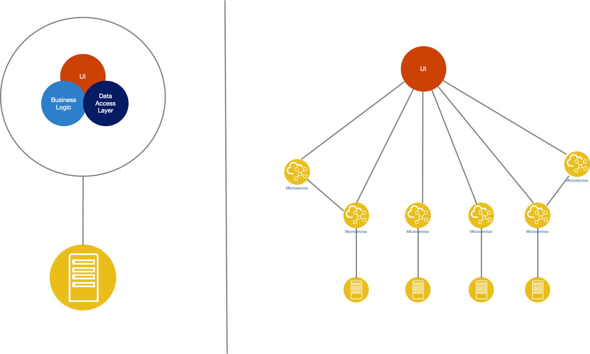
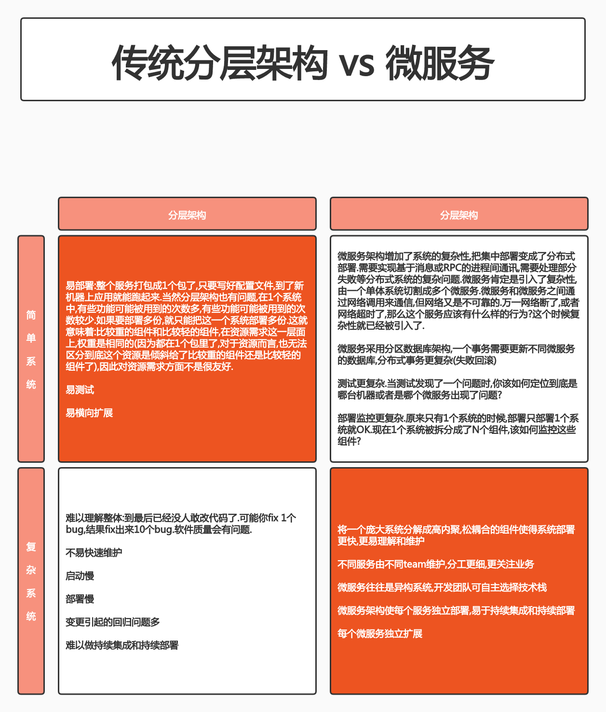
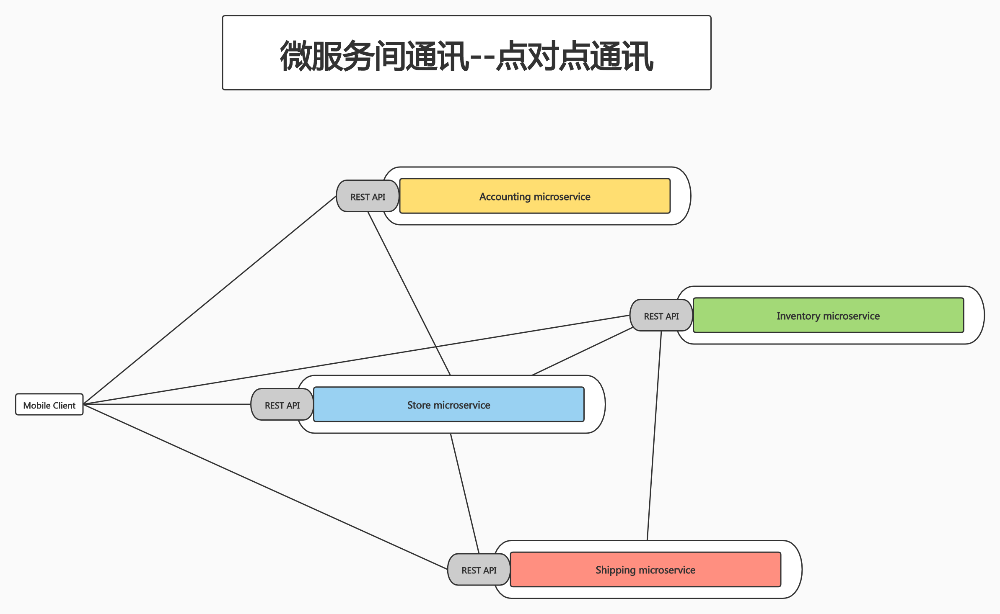
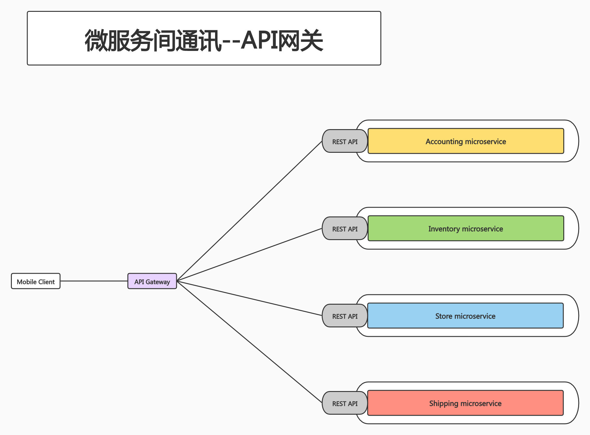

# class1:从系统架构谈起

## PART1. 传统分层架构 vs 微服务

应用的架构都是在不断演进的.

将近20年前,大多数架构都是单体架构.也就是整个系统由1个代码仓库,构建出的1个应用包.

这样的架构也有其优点:部署简单.只需要将这个应用包复制到另一个地方,配置一下就可以运行使用了.

但这样的架构存在的问题更多:

1. 随着业务越来越复杂,这种架构就会陷入绝境.很有可能这个应用的代码量会变得巨大.
	
	例:IBM曾经有过一个系统,这个系统被定为当时BU(怀疑是Business Unit,可以认为是整个大组织)的战略性产品.高峰期有800多人共同维护这套系统.
	
	这个项目的后期,无论是谁,即使是这个系统的首席架构,也无法感知这个系统的全局.没有人能说清楚每一个组件的行为细节.
	
	最终的结果就是:想要推进任何的新功能,都变的不太可能.因为1个功能要推进,需要依靠几个功能模块的修改.这几个功能模块如何联动,对这几个模块的改动会带来多少影响,引发哪些问题,都是无法评估的.
	
2. 整个构建速度非常慢

	例:还是刚才那个项目.当这个系统部署到用户的机器上时,由于系统过于庞大,瞬间产生了大量(几个G)的日志.此时需要调整日志的level.实际上只是修改了几行代码,但重新构建需要花费2天的时间.

3. 安装花费时间较长

	例:还是这个项目.研发人员和客户预约了1天的时间用于对这个项目POC(Proof Of Concept,概念验证).但安装这个系统就花费了1天的时间.后边就没有时间演示了.

理所当然的,这个产品必然成为一个失败的产品.

随着这些问题的出现,人们也已经意识到,架构体系是需要变化的.当时就提出了单体应用到SOA架构的转变.

但SOA架构也有自己的问题.SOA架构中一个核心的组件是ESB(Enterprise Service Bus).ESB是一个集中的企业服务总线.SOA架构是基于面向服务的架构模式,把单体架构拆分成不同的子系统.但子系统与子系统之间,是需要调用的.所有子系统间的通信,走ESB完成.

显而易见,ESB又成为了企业的瓶颈,难以维护.因此SOA架构也不成功.

再后来就演进成为了Microservice架构.Microservice和Microservice之间,既能够直接通信,也能够走API Gateway通信.

Microservice架构和SOA相比,通过轻量级的协议(例如REST的HTTP协议)取代了厚重的ESB.因此整个体系架构变的轻量,可维护性较强.

对于Microservice而言,有一些Microservice可能没有本地数据,那么这种数据就可以独立部署了;有一些Microservice需要依赖数据(比如依赖MySQL),那么每个Microservice维护自己的Database.Microservice和Microservice之间,通过网络调用完成通信.这也是现在最流行和最成功的一种架构模式.

## PART2. 传统分层架构与微服务的优劣势对比

## PART3. 微服务改造

通常在项目刚启动的阶段都是单体架构的,当到了需要拆分成Microservice时,很多人都会有这样一个问题:我现在已经是单体架构了,是不是不适合上Kubernetes?如果我要调整系统架构,应该往哪个方向调整?

所以实际上这是2个问题:

1. 单体架构能不能升Kubernetes?

	也可以.只是不那么友好.因为Kubernetes希望你的整个环境是动态的.比如某个节点失效,比如这个节点网络断掉,或者这个节点不响应了.那么此时我们需要这个系统的行为是:把这个节点上的业务快速在其他节点上启动起来并替换掉这个出问题的节点.
	
	那如果你是一个单体架构,可能启动你的应用就需要花费1个小时.那么在这个期间你的服务是处于不可用状态的.
	
	所以结论是:如果你想强上,也可以上.只是上了可能效果不那么明显.
	
2. 如果要去改造单体架构,有哪些原则可以遵循?

分离微服务的方法建议:

- 审视并发现可以分离的业务逻辑
	- 高内聚,松耦合
- 寻找天生隔离的代码模块,可以借助于静态代码分析工具
	- 通过代码扫描工具,可以找到那些包与包之间调用较少的关系(这里我没找到合适的词),甚至有可能找到完全没有互相调用的2个包.那么这就意味着这2个包的逻辑是独立的.那么就可以把这两个包切分成不同的业务
- 不同并发规模,不同内存需求的模块都可以分理出不同的微服务,此方法可提高资源利用率,节省成本

一些常用的课微服务化的组件:

- 用户和账户管理
- 授权和会话管理
- 系统配置
- 通知和通讯服务
- 照片,多媒体,元数据等

**分解原则:基于size, scope and capabilities.**

- size:我的Microservice,切分到什么粒度才算Microservice?
- scope:我的Microservice,它的范围(我理解此处的范围指功能点的多少)是多大?
- capabilities:我的Microservice需要提供什么样的能力?(我理解此处的能力与功能无关,它是指运维方面的能力.比如当一个节点挂掉,整个系统的行为是如何的?这个挂掉的节点是否有自愈的机制?)

以Istio为例.Istio是基于Kubernetes的一个服务网格治理平台.在早期它追求架构的纯粹性,1个控制平面有很多组件.这些组件从架构层面来讲非常清晰.但是后边就陷入了困境:由于1个控制平面中有很多组件,当需要做系统升级时,这些组件的升级是否有顺序?在升级的过程中是否会有业务中断?

这个时候就需要系统重构了.因为如果你每次升级都很痛苦,那说明你原来的微服务划分界限是不正确的.

接下来就是去审视:这些控制平面的组件,分别是被哪些人关注的?是被同一波人所关注,还是被不同的2波人所关注?最终发现:所有组件都是被这个网格的管理人员所关注的,换言之,只有1个团队为这些组件负责.

虽然这些组件的职责各不相同,但是否有必要把粒度划分的这么细?为此花费这么大的运维成本是否值得?最终又把这些组件合并为了1个组件.

以此为例,切分微服务时,除了功能范围外,还要考虑多种因素.例如:团队的职责范围,这个微服务将来升级时的可维护性等.**兵无常势,水无常形.需根据业务场景决定.以上列出的,也只是一些指导原则.**

## PART4. 微服务间通讯

SOA架构中,子系统和子系统之间都是通过ESB通信的.每个厂商为了推销自家的产品,都在鼓吹所有通信必须走ESB.再加上ESB的协议(比如SOP协议或通过Web Service调用)本身非常复杂厚重,不像REST协议这种轻量级协议.自然灾害加人祸,很自然的ESB成为了企业的瓶颈.

在微服务的领域,它的架构原则就相对宽松一些.也没有那么多的约定.微服务架构只是希望:每一个大的平台,都按照功能模块,按照资源需求,按照人员组织的责任,将一个大的系统划分成不同的子系统.每个子系统的职责应该尽量精简,易于维护.剩下的问题就是企业自己决策了.微服务架构提供最佳实践,但不是强制性原则.因此微服务架构下的通信就可以更为灵活.

微服务架构下,服务间通讯提供了2种方式:

1. 点对点通讯
2. API网关

### 点对点通讯

点对点:1个系统中有很多微服务.这些微服务之间都可以彼此通信,且这些微服务可以都对外暴露接口.作为客户端可以直接访问任何一个微服务.

这种设计的好处在于:自治性强,对其他组件的依赖减少了.

这种设计通常是用于系统内部的,集群内部通过点对点的方式通讯是一个最佳实践.

对于集群外部的用户,还是要通过其他方式来进到集群里面.

- 多用于系统内部多组件之间的通讯(应用场景)
- 有大量的重复模块,例如认证授权
- 缺少统一规范,如监控,审计等功能(缺点)
- 后期维护成本较高,服务和服务的依赖关系错综复杂难以管理(缺点)

### API网关

这种设计主要用于集群外的用户要访问集群内的服务时使用.通常来讲微服务的最佳实践就是这两者的结合.

外边的客户端要访问内部服务时,所有的请求不会直接发到这些服务上,而是发到一个集中的API网关上.这个API网关是一个集中的入口.请求无论是通过URL还是Request Header,都有一种方式告知API网关,自己要访问哪一个后端服务.这样API网关就可以把这个请求转到对应的服务上.

有了这种模式,就可以通过API网关,做很多统一的事情:如鉴权、认证、审计等.

这个请求到了后端的微服务,微服务之间就可以通过点对点的方式通讯了.

- 基于一个轻量级的message gateway
- 新API通过注册Gateway实现
- 整合实现Common function