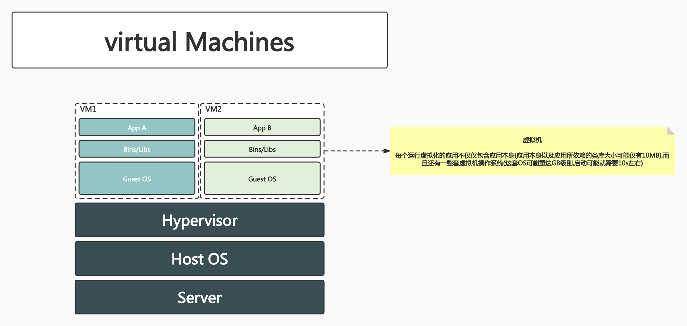
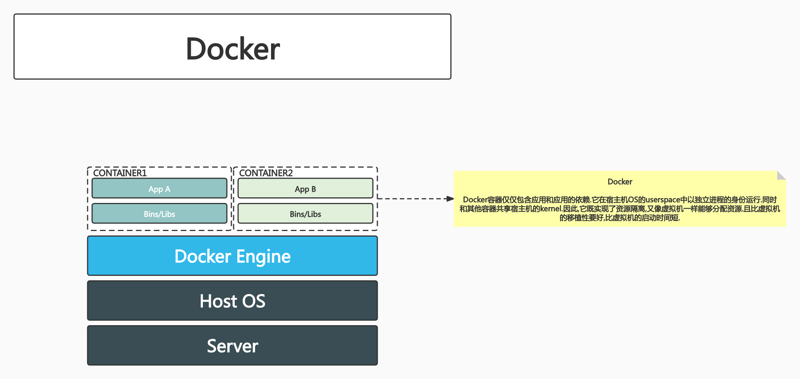

# class2:理解Docker

## PART1. Docker的概念

- 基于Linux内核的Cgroup,Namespace,以及Union FS等技术,对进程进行封装隔离,属于OS层面的虚拟化技术,由于隔离的进程独立于宿主和其他的隔离的进程,因此也称其为容器
- 最初实现是基于LXC(Linux Containers),从0.7以后开始去除LXC,转而使用自行开发的`LibContainer`,从1.11开始,则进一步演进为使用`runC`和`Containerd`
- Docker在容器的基础上,进行了进一步的封装,从文件系统、网络互联到进程隔离等,极大的简化了容器的创建和维护,使得Docker技术比虚拟机技术更为轻便、快捷

在Docker被研发出来之前,Cgroup,Namespace,Union FS都是Linux中已经存在且成熟的技术.Docker把这些技术组合了起来,做了一些创新.改变了运维和分发、部署业务的场景.

Docker如何改变的这些场景?还是回到微服务架构上.微服务间通过网络调用完成通信.假设微服务A调用微服务B,那么A服务是需要知道B服务的IP和端口号,A才能访问B.也就是说每一个微服务都需要一个独立的网络身份.

在容器出现之前,通过虚拟化来实现这种模式.把1台物理机切分成多个虚拟机,每个虚拟机有自己的IP地址和端口.这样微服务架构就可以部署在这种虚拟化的技术栈上了.

容器其实也是要解决这个问题.如果有一种方式,能够把一个独立进程模拟成类似于虚拟机提供的实体,那么这种方式是否可以取代虚拟机?

Docker就是通过Cgroup,Namespace,Union FS来解决这个问题的.

## PART2. 为什么要用Docker

- 更高效地利用系统资源
	虚拟机技术需要虚拟一套操作系统.那么就会有一套完整的OS的加载过程,这个过程要占用内存;要维护一套OS,那就得有自己的Kernel,Kernel的运行要占用CPU.因此会有一部分资源专门用来支撑这个OS的.这些资源无法被业务利用.因此整体上资源利用率一定比较低.
- 更快速的启动时间
	相比于启动一个虚拟机,一定是启动一个进程更快.
- 一致的运行环境
	基于Union FS的容器镜像技术为此提供了支持.
- 持续交付和部署
- 更轻松地迁移
- 更轻松地维护和扩展

刚才所说的Cgroup,Namespace,Union FS这3个技术,都是Linux中的技术,它们并不是虚拟化.

- Namespace

	Linux中运行的进程,可以指定运行在哪一个Namespace下.Namespace又分为很多个子系统:网络Namespace、PID Namespace、UTS Namespace、MNT Namespace等很多个Namespace.
	
	假设此时启动了一个进程,并为该进程分配了一个新的网络Namespace,那就意味着这个进程运行在这个新的网络Namespace中,该进程可以有自己独立的网络设备,有独立的IP地址,独立的访问规则,独立的路由表.这个Namespace和主机的Namespace是独立的,隔离的.
	
	这样就可以给一个进程赋予一个独立的网络标识了.

- Cgroup

	创建虚拟机时,需要指定这个虚拟机占用多少CPU、多少Memory、多少Disk.Namespace只是把主机上的一个进程放到一个隔离环境,这中间不涉及虚拟机,这个进程仍旧是跑在主机上的.
	
	如果主机上跑了很多进程,这些进程之间可能会出现资源竞争的场景.如何管控这些进程的资源分配呢?Cgroup解决了这个问题.Cgroup是Linux中的Control Group,用于控制主机的资源.
	
- Union FS

	Docker中支持容器镜像的概念.容器镜像在一个环境下编译好之后,可以在任何环境下replay.实际上是把编译这个过程的每一个动作都replay了.这样一来就保证了应用无论到了哪种环境下,这个应用的所有依赖都在容器镜像中已经打包好了.因此可以在任何环境下快速启动

Namespace使得Linux上运行的进程可以有其独立的运行空间和独立的身份.Cgroup用于控制该进程的资源.其实就已经模拟了一个操作系统.但是本质上这又不是一个操作系统,它还是主机上的一个进程.

主机上的一个进程启动的时间,相比于创建一个虚拟机再在这个虚拟机上启动进程的时间,一定是在主机上启动一个进程的时间较短的.

## PART3. 虚拟机和容器运行态的对比



宿主机本身有一个Host OS.还需要Hypervisor用于启动虚拟机.Hypervisor之上才是各个VM.Guest OS中也是一个完整的OS.

从资源开销上来看,这种设计一定更耗费资源.因为Guest OS和Hypervisor都是多余的.

从问题排查的角度来看,也更为难以排查.可能同一个问题,要在Guest OS和Host OS各自排查一遍.



Docker的启动,则是在主机上启动一个进程的过程.就是fork一个进程的过程,这样排查问题也相对容易.因为这种设计整个技术栈很短.

## PART4. 虚拟机和容器性能对比


- 启动

	容器的启动实际上就是一个fork操作.因此启动速度较快.

- 硬盘使用

	容器在硬盘使用方面,是共享基础镜像的.因此节约硬盘空间.甚至你的应用有可能都不需要基础镜像,仅有你的应用即可,这种情况下几KB就够了.
	
- 性能

	也有容器进程运行起来性能较低的情况发生.但从原理上来看,容器自身就是跑在主机上的进程.如果慢了,那可能是你需要去排查问题或调优了.

- 系统支持量

	虚拟机一台宿主机可能同时只能支持几十个.一般来讲创建虚拟机时要指定资源.1个虚拟机至少要1个CPU的.
	
	容器对资源的管控粒度更细.

## 5. 安装Docker

[Ubuntu下安装Docker](https://github.com/rayallen20/DockerPrimer/blob/main/%E7%AC%AC2%E7%AB%A0%20%E6%A0%B8%E5%BF%83%E6%A6%82%E5%BF%B5%E4%B8%8E%E5%AE%89%E8%A3%85%E9%85%8D%E7%BD%AE/%E7%AC%AC2%E7%AB%A0%20%E6%A0%B8%E5%BF%83%E6%A6%82%E5%BF%B5%E4%B8%8E%E5%AE%89%E8%A3%85%E9%85%8D%E7%BD%AE.md#221-ubuntu%E7%8E%AF%E5%A2%83%E4%B8%8B%E5%AE%89%E8%A3%85docker)

## 6. 容器操作

docker安装好后,它自身会有一个后台的进程daemon,前台就是docker的命令行.

在运行时,默认会读取配置文件`/root/.docker/config.json`,根据这个配置文件连接后台进程docker daemon.

```
root@docker-test:/home/roach# ps -ef|grep docker
root         752       1  0 Jan15 ?        00:01:27 /usr/bin/dockerd -H fd:// --containerd=/run/containerd/containerd.sock
```

`/usr/bin/dockerd`就是docker daemon.`dockerd`中的最后一个字母`d`,其实就是daemon的意思.

连接上docker daemon后,在命令行中的操作就发送到docker daemon了.

```
root@docker-test:/home/roach# cat /root/.docker/config.json 
{
	"auths": {
		"https://index.docker.io/v1/": {
			"auth": "NDA0ODY0NTM6MjM0MTQ1Mjlh"
		}
	}
}
```

[镜像操作](https://github.com/rayallen20/DockerPrimer/blob/main/%E7%AC%AC3%E7%AB%A0%20%E4%BD%BF%E7%94%A8Docker%E9%95%9C%E5%83%8F/%E7%AC%AC3%E7%AB%A0%20%E4%BD%BF%E7%94%A8Docker%E9%95%9C%E5%83%8F.md)

[容器操作](https://github.com/rayallen20/DockerPrimer/blob/main/%E7%AC%AC4%E7%AB%A0%20%E6%93%8D%E4%BD%9CDocker%E5%AE%B9%E5%99%A8/%E7%AC%AC4%E7%AB%A0%20%E6%93%8D%E4%BD%9CDocker%E5%AE%B9%E5%99%A8.md)

[Dockerfile的编写](https://github.com/rayallen20/DockerPrimer/blob/main/%E7%AC%AC8%E7%AB%A0%20%E4%BD%BF%E7%94%A8Dockerfile%E5%88%9B%E5%BB%BA%E9%95%9C%E5%83%8F/%E7%AC%AC8%E7%AB%A0%20%E4%BD%BF%E7%94%A8Dockerfile%E5%88%9B%E5%BB%BA%E9%95%9C%E5%83%8F.md)