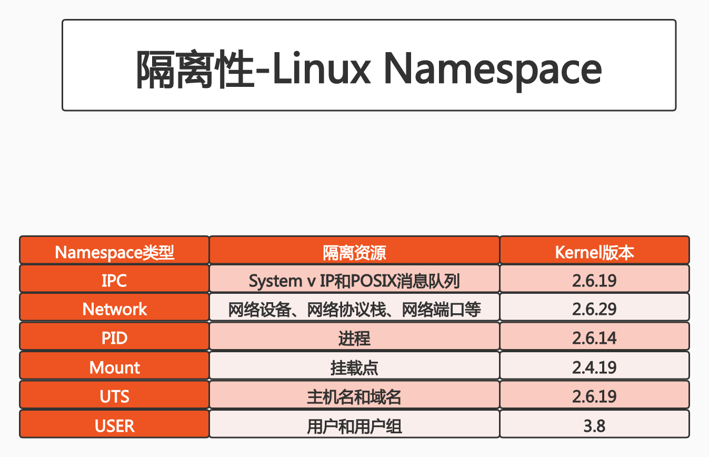
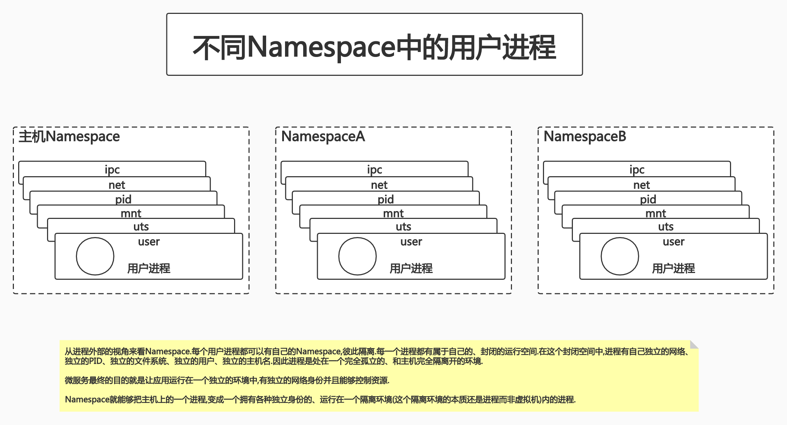
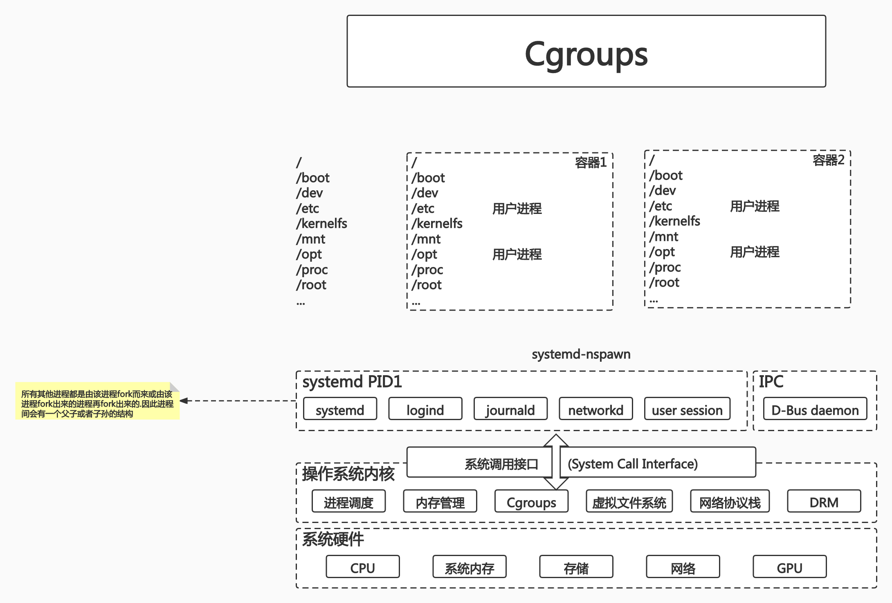
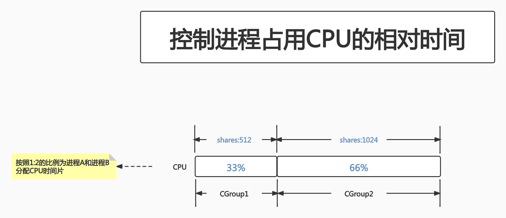
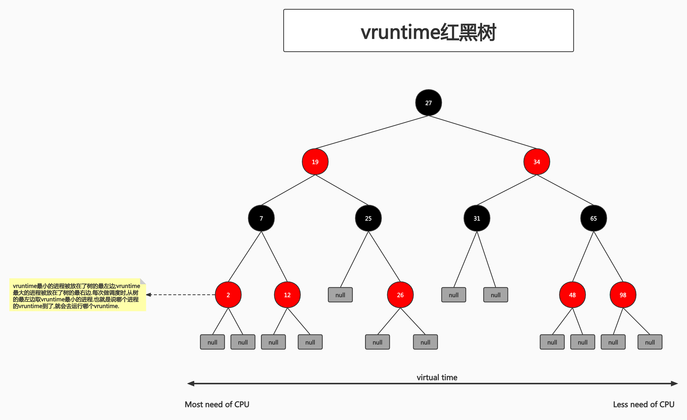
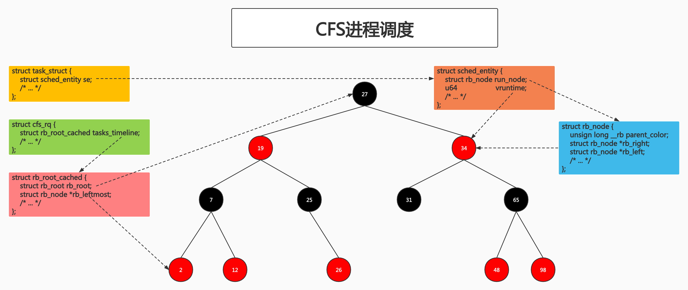

# class3:Docker的核心技术(一)

## PART1. 容器主要特性


- 隔离性

	应用可以在一个隔离环境中运行,因此应用所有的依赖都需要在这个隔离环境中存在.这就要求在生产环境中构建容器镜像时需要做依赖检查.有了依赖检查这一步,才能保证这个容器在其他环境下的replay是有效的.

- 可配额

	依赖于Cgroups来控制每个容器所能占用的最大资源.这样可以有效调节同一个OS中多个进程对资源的抢占情况.
	
- 便携性

	由于容器有了隔离性,所以容器镜像可以在任何环境下replay.

- 安全性
	
	安全性也是依赖于容器较好的隔离性,因此容器镜像天然安全.除此之外,Linux自身也有一些安全保障的技术,来确保运行在Linux上的线程(也就是容器镜像)的安全.

## PART2. Namespace

Namespace:Linux Namespace是一种Linux Kernel提供的资源隔离方案.

- 系统可以为进程分配不同的Namespace
- 系统可以保证不同的Namespace资源独立分配、进程彼此隔离,即:不同的Namespace下的进程互不干扰

### 2.1 Linux内核代码中Namespace的实现

[进程数据结构](https://github.com/torvalds/linux/blob/master/include/linux/sched.h#L727):

```c
struct task_struct {
	...
	/*namespaces*/
	struct nsproxy *nsproxy;
}
```

在`task_struct`中,有一个属性(字段,英文翻译的话应该是property或field)叫做`nsproxy`.该属性就是用于定义该进程所在的Namespace的.

[Namespace数据结构](https://github.com/torvalds/linux/blob/master/include/linux/nsproxy.h#L31):

```c
struct nsproxy {
	atomic_t count;
	struct uts_namespace *uts_ns;
	struct ipc_namespace *ipc_ns;
	struct mnt_namespace *mnt_ns;
	struct pid_namespace *pid_ns_for_children;
	struct net *net_ns;
}
```

可以看到,1个Namespace由多个不同的子Namespace构成.至于进程具体应该运行在哪些子Namespace中,就要看业务需要了.

### 2.2 Linux对Namespace的操作方法

- [clone](https://man7.org/linux/man-pages/man2/clone.2.html)

	TODO:此处的`clone`方法的源码我没找到,但是在手册上找到了
	
	在创建新进程的系统调用时,可以通过`flags`参数指定需要新建的Namespace类型:
	
	`CLONE_NEWCGROUP/CLONE_NEWIPC/CLONE_NEWNET/CLONE_NEWNS/CLONE_NEWPID/CLONE_NEWUSER/CLONE_NEWUTS`
	
	```c
	int clone(int (*fn)(void *), void *child_stack, int flags, void *arg)
	```

	一个进程在初创的时候,它是有Namespace的.例如OS中的第1个进程`init`(也就是PID为1的进程),这个进程本身有其自己的Namespace(从代码的角度上来讲,1个进程就是1个`task_struct`结构体的实例,`init`进程自然也是`task_struct`的实例,那么它自然也会有`nsproxy`这个字段),即默认的Namespace,也就是主机Namespace.
	
	```
	root@docker-test:/home/roach# ps -ef
	UID          PID    PPID  C STIME TTY          TIME CMD
	root           1       0  0 Jan17 ?        00:00:07 /sbin/init maybe-ubiquity
	```
	
	Linux中的进程都是树状的.所有的进程都是通过其他进程`fork`出来的.
	
	```
	root@docker-test:/home/roach# pstree
	systemd─┬─accounts-daemon───2*[{accounts-daemon}]
	        ├─agetty
	        ├─atd
	        ├─containerd───8*[{containerd}]
	        ├─containerd-shim─┬─mysqld───36*[{mysqld}]
	        │                 └─10*[{containerd-shim}]
	        ├─containerd-shim─┬─python
	        │                 └─10*[{containerd-shim}]
	        ├─cron
	        ├─dbus-daemon
	        ├─dockerd─┬─docker-proxy───4*[{docker-proxy}]
	        │         ├─docker-proxy───6*[{docker-proxy}]
	        │         └─10*[{dockerd}]
	        ├─multipathd───6*[{multipathd}]
	        ├─networkd-dispat
	        ├─polkitd───2*[{polkitd}]
	        ├─rsyslogd───3*[{rsyslogd}]
	        ├─snapd───9*[{snapd}]
	        ├─sshd───sshd───sshd───bash───sudo───bash───pstree
	        ├─systemd───(sd-pam)
	        ├─systemd-journal
	        ├─systemd-logind
	        ├─systemd-network
	        ├─systemd-resolve
	        ├─systemd-timesyn───{systemd-timesyn}
	        ├─systemd-udevd
	        ├─udisksd───4*[{udisksd}]
	        ├─unattended-upgr───{unattended-upgr}
	        ├─upowerd───2*[{upowerd}]
	        └─vsftpd
	```
	
	当某个进程被`systemd`进程`fork`出来时(此处只是以`systemd`创建其他进程为例),`fork()`函数会自动将`systemd`进程的Namespace复制到新的进程上.
	
	那么`init`进程是Linux中的第1个进程,其他进程必然从这个进程`fork`而来.而`fork()`函数会默认复制`init`进程的Namespace,因此新创建的进程会和主机共用1个Namespace.所以默认情况下我们感受不到Namespace,因为这些进程共用同一个PID的Namespace.
	
	但是在`fork()`或者`clone()`时,可以传递一些参数(例如`flag`),用于指定新创建进程的Namespace.

- [setns](https://github.com/torvalds/linux/blob/master/tools/perf/util/setns.c#L7:5)

	```c
	int setns(int fd, int nstype)
	```

	该系统调用可以让调用进程加入某个已经存在的Namespace中.
	
	`setns`可以调整一个已经存在的进程,将该进程切换到另一个Namespace中.

- unshare

	该系统调用可以将调用进程移动到新的Namespace下:
	
	```c
	int unshare(int flags)
	```
### 2.3 隔离性-Linux Namespace
	


不同Namespace隔离的资源是不同的.



- Pid Namespace

	- 不同用户的进程就是通过Pid Namespace隔离开的.且不同namespace中可以有相同Pid
	- 有了Pid namespace,每个namespace中的Pid能够相互隔离

	每个进程的PID不同就是通过给每个进程设置了不同的Pid Namespace实现的.

	但这里有一个映射关系.容器内的进程在主机上通过ps命令都可以看到.
	
	```
	root@docker-test:/home/roach# docker ps
	CONTAINER ID   IMAGE             COMMAND                  CREATED      STATUS      PORTS                                         NAMES
	4c12178318ca   training/webapp   "python app.py"          3 days ago   Up 3 days   0.0.0.0:49172->5000/tcp, :::49172->5000/tcp   web
	a4bdee731c62   mysql             "docker-entrypoint.s…"   3 days ago   Up 3 days   3306/tcp, 33060/tcp                           db
	```

	可以看到现在有2个容器处于运行状态.我们在主机上查看这2个进程的PID:

	```
	root@docker-test:/home/roach# ps -efa|grep docker
	...
	root       17197     752  0 Jan19 ?        00:00:00 /usr/bin/docker-proxy -proto tcp -host-ip 0.0.0.0 -host-port 49172 -container-ip 172.17.0.3 -container-port 5000
	root       17201     752  0 Jan19 ?        00:00:00 /usr/bin/docker-proxy -proto tcp -host-ip :: -host-port 49172 -container-ip 172.17.0.3 -container-port 5000
	...
	```
	
	从主机上看这2个容器的PID分别为17197和17201.
	
	再分别进入容器查看每个进程在容器中的PID:

	- 容器webapp内查看进程:
	
	```
	root@4c12178318ca:/opt/webapp# ps -ef|grep python
	root           1       0  0 Jan19 ?        00:00:24 python app.py
	root          57      41  0 06:39 pts/0    00:00:00 grep --color=auto python
	```
	
	可以看到该进程在容器内PID为1.

	- 容器db内查看进程:
	
	```
	root@a4bdee731c62:/# ps -ef|grep mysql
	mysql          1       0  0 Jan19 ?        00:04:05 mysqld
	root         613     187  0 06:47 pts/0    00:00:00 grep mysql
	```
	
	可以看到,进程在容器内的PID都是1.这就说明容器的Pid Namespace和主机的Pid Namespace是需要一个映射关系的.

	在这个例子中,就是容器`webapp`的PID为1的Pid Namespace,需要映射到主机上PID为17197的Pid Namespace;容器`db`的PID为1的Namespace,需要映射到主机上PID为17201的Namespace.
	
	Dockerfile中的`ENTRYPOINT`指令中执行的命令,就是容器中PID为1的进程.容器中的其他进程,都是该进程fork出来的.

- net Namespace

	- 网络隔离是通过net Namespace实现的.每个net 	Namespace有独立的network devices, IP addresses, IP routing tables, /proc/net目录
	- Docker默认采用veth的方式将容器中的虚拟网卡和宿主机上的一个docker bridge:docker0连接在一起

	```
	root@docker-test:/home/roach/dockerGoImg# tree /proc/net/dev_snmp6/
	/proc/net/dev_snmp6/
	├── docker0
	├── enp0s3
	├── lo
	├── veth96ff43d
	└── vethb0e43f5
	
	0 directories, 5 files
	```

	进程如果拥有独立的net Namespace,那么该进程的网络身份就和主机不同了,而且和主机是彼此隔离的.

- ipc Namespace

	- 容器中进程交互还是采用Linux常见的进程间交互(interprocess communication - IPC)方法,包括常见的信号量、消息队列和共享内存
	- 容器的进程间交互,实际上还是宿主机上在同一个Pid namespace中的进程间交互,因此需要在IPC资源申请时加入namespace信息.每个IPC资源有一个唯一的32位ID

	如果需要进程间通信(比如要发送信号量、要共享内存),这种场景就需要通过IPC通信来完成.2个进程想要进行IPC通信,必须处于同一个ipc namespace中.

- mnt Namespace

	- mnt Namespace允许不同namespace的进程看到不同的文件结构,这样每个namespace中的进程所看到的文件目录就被隔离开了

	每个进程都有自己的文件系统.从代码的角度来看,结构体`task_struct`中有如下几个字段:
	
	- `struct mm_struct *mm, *active_mm;`
	- `struct fs_struct *fs;`(文件系统信息)
	- `struct files_struct *files;`(打开文件信息)
	- `struct signal_struct *signal`(信号量信息)
	- `struct sighand_struct *sighand;`(信号处理对象)

	mnt Namespace决定了`task_struct`的实例(也就是1个进程)能够看到的文件系统.因此每个进程能够看到的文件系统也是不同的.
	
- UTS Namespace

	- UTS(UNIX Time-sharing System) Namespace允许每个容器拥有独立的hostname和domain name,使其在网络上可以被视作一个独立的节点,而非宿主机上的一个进程.

	UTS Namespace决定了每个进程可以有其专属的主机域名.配合net Namespace,每个进程就拥有了自己独立的主机域名和IP地址

- user Namespace

	- 每个容器可以有不同的user和group id,也就是说可以在容器内部,以容器内部用户的角色执行程序.而非以宿主机上的用户角色来执行容器内的程序.

	user Namespace用于让每个进程可以有自己的用户管理系统.

### 2.4 关于Namespace的操作

##### 1. 查看OS中所有Namespace

`lsns`:列出有关所有当前可访问的Namespace或给定Namespace的信息

```
root@docker-test:/home/roach/dockerGoImg# lsns
        NS TYPE   NPROCS   PID USER             COMMAND
4026531835 cgroup    114     1 root             /sbin/init maybe-ubiquity
4026531836 pid       112     1 root             /sbin/init maybe-ubiquity
4026531837 user      113     1 root             /sbin/init maybe-ubiquity
4026531838 uts       109     1 root             /sbin/init maybe-ubiquity
4026531839 ipc       112     1 root             /sbin/init maybe-ubiquity
4026531840 mnt       105     1 root             /sbin/init maybe-ubiquity
4026531860 mnt         1    15 root             kdevtmpfs
4026531992 net       112     1 root             /sbin/init maybe-ubiquity
4026532172 mnt         1   386 root             /lib/systemd/systemd-udevd
4026532173 uts         1   386 root             /lib/systemd/systemd-udevd
4026532235 mnt         1   588 systemd-timesync /lib/systemd/systemd-timesyncd
4026532236 uts         1   588 systemd-timesync /lib/systemd/systemd-timesyncd
4026532237 mnt         1   634 systemd-network  /lib/systemd/systemd-networkd
4026532238 mnt         1   636 systemd-resolve  /lib/systemd/systemd-resolved
4026532250 mnt         1 17010 systemd-coredump mysqld
4026532251 uts         1 17010 systemd-coredump mysqld
4026532252 ipc         1 17010 systemd-coredump mysqld
4026532253 pid         1 17010 systemd-coredump mysqld
4026532255 net         1 17010 systemd-coredump mysqld
4026532303 uts         1   664 root             /lib/systemd/systemd-logind
4026532305 mnt         1   664 root             /lib/systemd/systemd-logind
4026532317 mnt         1  2248 root             /usr/lib/upower/upowerd
4026532318 user        1  2248 root             /usr/lib/upower/upowerd
4026532319 mnt         1 17241 root             python app.py
4026532320 uts         1 17241 root             python app.py
4026532321 ipc         1 17241 root             python app.py
4026532322 pid         1 17241 root             python app.py
4026532324 net         1 17241 root             python app.py
```

`-t`选项:只查看给定类型的Namespace

```
root@docker-test:/home/roach/dockerGoImg# lsns -t uts
        NS TYPE NPROCS   PID USER             COMMAND
4026531838 uts     109     1 root             /sbin/init maybe-ubiquity
4026532173 uts       1   386 root             /lib/systemd/systemd-udevd
4026532236 uts       1   588 systemd-timesync /lib/systemd/systemd-timesyncd
4026532251 uts       1 17010 systemd-coredump mysqld
4026532303 uts       1   664 root             /lib/systemd/systemd-logind
4026532320 uts       1 17241 root             python app.py
```

##### 2. 查看指定进程的Namespace信息

`ls -la /proc/<pid>/ns/`

- step1. 查找当前处于运行状态的容器的PID信息

```
root@docker-test:/home/roach/dockerGoImg# lsns -t net
        NS TYPE NPROCS   PID USER                NETNSID NSFS                           COMMAND
4026531992 net     112     1 root             unassigned                                /sbin/init maybe-ubiquity
4026532255 net       1 17010 systemd-coredump          0 /run/docker/netns/86de23b9ffbb mysqld
4026532324 net       1 17241 root                      1 /run/docker/netns/2b9b7d0ad9a4 python app.py
```

注:此处只要能找到PID就行,我示例中的只是多种方法之一

- step2. 查看该进程的Namespace信息

```
root@docker-test:/home/roach/dockerGoImg# ls -la /proc/17010/ns/
total 0
dr-x--x--x 2 systemd-coredump systemd-coredump 0 Jan 16 16:29 .
dr-xr-xr-x 9 systemd-coredump systemd-coredump 0 Jan 16 16:29 ..
lrwxrwxrwx 1 systemd-coredump systemd-coredump 0 Jan 19 18:13 cgroup -> 'cgroup:[4026531835]'
lrwxrwxrwx 1 systemd-coredump systemd-coredump 0 Jan 19 18:13 ipc -> 'ipc:[4026532252]'
lrwxrwxrwx 1 systemd-coredump systemd-coredump 0 Jan 19 18:13 mnt -> 'mnt:[4026532250]'
lrwxrwxrwx 1 systemd-coredump systemd-coredump 0 Jan 16 16:29 net -> 'net:[4026532255]'
lrwxrwxrwx 1 systemd-coredump systemd-coredump 0 Jan 19 18:13 pid -> 'pid:[4026532253]'
lrwxrwxrwx 1 systemd-coredump systemd-coredump 0 Jan 20 10:18 pid_for_children -> 'pid:[4026532253]'
lrwxrwxrwx 1 systemd-coredump systemd-coredump 0 Jan 19 18:13 user -> 'user:[4026531837]'
lrwxrwxrwx 1 systemd-coredump systemd-coredump 0 Jan 19 18:13 uts -> 'uts:[4026532251]'
```

##### 3. 进入指定进程的Namespace并运行命令

`nsenter`:可以在指定进程的Namespace下运行指定程序的命令

`nsenter -t <pid> -n ip addr`

例:查看容器的网络配置

```
root@docker-test:/home/roach/dockerGoImg# nsenter -t 17241 -n ip a
1: lo: <LOOPBACK,UP,LOWER_UP> mtu 65536 qdisc noqueue state UNKNOWN group default qlen 1000
    link/loopback 00:00:00:00:00:00 brd 00:00:00:00:00:00
    inet 127.0.0.1/8 scope host lo
       valid_lft forever preferred_lft forever
150: eth0@if151: <BROADCAST,MULTICAST,UP,LOWER_UP> mtu 1500 qdisc noqueue state UP group default 
    link/ether 02:42:ac:11:00:03 brd ff:ff:ff:ff:ff:ff link-netnsid 0
    inet 172.17.0.3/16 brd 172.17.255.255 scope global eth0
       valid_lft forever preferred_lft forever
```

`-t`选项:指定被进入命名空间的目标进程的pid

`-m`选项:进入mnt Namespace

`-u`选项:进入uts Namespace

`-i`选项:进入ipc Namespace

`-n`选项:进入net Namespace

`-p`选项:进入pid Namespace

`-U`选项:进入user Namespace

`-G`选项:设置运行程序的gid

`-S`选项:设置运行程序的uid

`-r`选项:设置根目录

`-w`选项:设置工作目录

```
root@docker-test:/home/roach/dockerGoImg# nsenter -t 17241 -i echo fuck
fuck
```

### 2.5 Namespace练习

开启2个ssh,这2个ssh要连接到同一台主机上.且有着相同的用户身份.

- step1. 在窗口A中执行`unshare -fn sleep 60`
	
	`-f`:切换Namespace
	
	`-n`:指定切换net Namespace
	
	也就是说这条命令的含义是:启动一个进程`sleep`,并切换该进程的net Namespace
	
	```
	root@docker-test:/home/roach/dockerGoImg# unshare -fn sleep 60

	
	```

	此时窗口A就hang在这里了.

- step2. 在窗口B中执行`lsns -t net`,找到在窗口A中启动的PID

	```
	root@docker-test:/home/roach# lsns -t net
        	NS TYPE NPROCS   PID USER                NETNSID NSFS                           COMMAND
	4026531992 net     117     1 root             unassigned                                /sbin/i
	4026532255 net       1 17010 systemd-coredump          0 /run/docker/netns/86de23b9ffbb mysqld
	4026532324 net       1 17241 root                      1 /run/docker/netns/2b9b7d0ad9a4 python 
	4026532388 net       2 37163 root             unassigned                                unshare
	```

	确认该进程的PID为37163.

- step3. 在窗口B中执行`nsenter -t 37163 -n ip a`.查看该进程的网卡信息

	
	```
	root@docker-test:/home/roach# nsenter -t 37163 -n ip a
	1: lo: <LOOPBACK> mtu 65536 qdisc noop state DOWN group default qlen 1000
	    link/loopback 00:00:00:00:00:00 brd 00:00:00:00:00:00
	```

## PART3. Cgroups

- Cgroups(Control Groups)是Linux下用于对一个或一组进程进行资源控制和监控的机制
- 可以对诸如CPU使用时间、内存、磁盘I/O等进程所需资源进行限制
- 不同资源的具体管理工作由相应的Cgroup子系统(Subsystem)来实现
- 针对不同类型的资源限制,只要将限制策略在不同的子系统上进行关联即可
- Cgroups在不同的系统资源管理子系统中,以层级树(Hierarchy)的方式来组织管理:每个Cgroup都可以包含其他的子Cgroup,因此子Cgroup能使用的资源除了受本Cgroup配置的资源参数限制外,还受到父Cgroup设置的资源限制

Cgroups用于对Linux中的进程做统一的监控和资源管理.

Cgroups也分为不同的子系统,不同的子系统会控制不同的资源.一个进程所需的资源大约可以分为:CPU、内存、Disk I/O.这些资源都可以被Cgroups管理起来.这些资源在Cgroups中被称为Subsystem.

进程是一个树状结构.Cgroups也采用了类似的结构,叫做Hierarchy.

### 3.1 Linux内核代码中Cgroup的实现

[进程数据结构](https://github.com/torvalds/linux/blob/master/include/linux/sched.h#L1208):

```c
struct task_struct {
	...
#ifdef CONFIG_CGROUPS
	/* Control Group info protected by css_set_lock: */
	struct css_set __rcu		*cgroups;
	/* cg_list protected by css_set_lock and tsk->alloc_lock: */
	struct list_head		cg_list;
#endif
	...
}
```

`task_struct`表示1个进程.其中有一个属性叫做`css_set`.该属性是`cgroups_subsys_state`对象集合的数据类型.

[Cgroup的数据结构](https://github.com/torvalds/linux/blob/fa2e1ba3e9e39072fa7a6a9d11ac432c505b4ac7/include/linux/cgroup-defs.h#L199:8)

```c
struct css_set {
	/*
	 * Set of subsystem states, one for each subsystem. This array is
	 * immutable after creation apart from the init_css_set during
	 * subsystem registration (at boot time).
	 */
	struct cgroup_subsys_state *subsys[CGROUP_SUBSYS_COUNT];
	...
}
```

### 3.2 可配额/可度量-Control Groups



cgroups实现了对资源的配额和度量.

- blkio:该子系统用于限制每个块设备的输入输出控制.如:磁盘、光盘以及USB等
- cpu:该子系统通过调度程序为cgroup任务提供CPU访问
- cpuacct:产生cgroup任务的CPU资源报告
- cpuset:如果是多核心的CPU,该子系统为cgroup任务分配单独的CPU和内存
- divices:允许或拒绝cgroup任务对设备的访问
- freezer:暂停和恢复cgroup任务
- memory:设置每个cgroup的内存限制以及产生内存资源报告
- net_cls:标记每个网络包以供cgroup方便使用
- ns:命名空间子系统
- pid:进程标识子系统

blkio:即block IO.该子系统用于控制读写磁盘的速度

cpu:设置为该进程分配多少CPU的时间片

cpuacct:用于汇报CPU的状态

cpuset:用于在多CPU场景下,将某个进程绑定在某个CPU核心上.其目的是为了高效.1个进程的生命周期就和1个CPU核心绑定,对于CPU核心来讲不需要做进程切换,提高效率(比如CPU本地的cache,TLB表等都是可以复用的,减少进程切换的开销).

memory:控制一个进程可使用的内存大小

### 3.3 CPU子系统

- `cpu.shares`:可出让的能获得CPU使用时间的相对值
- `cpu.cfs_period_us`:`cfs_period_us`用于配置时间周期长度,单位为μs(微秒)
- `cpu.cfs_quota_us`:`cfs_quota_us`用于配置当前Cgroup在`cfs_period_us`时间内最多能使用的CPU时间数,单位为μs(微秒)
- `cpu.stat`:Cgroup内的进程使用的CPU时间统计
- `nr_periods`:经过`cpu.cfs_period_us`的时间周期数量
- `nr_throttled`:在经过的周期内,有多少次因为进程在指定的时间周期内用光了配额时间而受到限制
- `throttled_time`:Cgroup中的进程被限制使用CPU的总用时,单位为ns(纳秒)

CPU子系统用于控制1个进程能占用多少CPU.通过2种手段控制:

1. `cpu.shares`:相对时间
2. `cpu.cfs_period_us`:绝对时间

用于控制进程占用CPU的文件:

```
root@docker-test:/# tree -L 1 /sys/fs/cgroup/cpu
/sys/fs/cgroup/cpu
├── cgroup.clone_children
├── cgroup.procs
├── cgroup.sane_behavior
├── cpuacct.stat
├── cpuacct.usage
├── cpuacct.usage_all
├── cpuacct.usage_percpu
├── cpuacct.usage_percpu_sys
├── cpuacct.usage_percpu_user
├── cpuacct.usage_sys
├── cpuacct.usage_user
├── cpu.cfs_period_us
├── cpu.cfs_quota_us
├── cpu.shares
├── cpu.stat
├── docker
├── notify_on_release
├── release_agent
├── system.slice
├── tasks
└── user.slice

3 directories, 18 files
```

#### 3.3.1 `cpu.shares`

shares顾名思义就是占比,是一个相对值.设现有3个CPU,2个CGroup(我们将它命名为Cgroup1和Cgroup2),2个进程(我们将它命名为进程A和进程B).

将进程A放在CGroup1中,将进程B放在CGroup2中.此时进程和CGroup就产生关联关系了.

将CGroup1的cpu.shares设置为512,将CGroup2的cpu.shares设置为1024.512:1024=1:2.这表示OS在调用这2个进程时,会按照1:2的比例分配CPU时间片.因此说shares是一个相对值.



#### 3.3.2 `cpu.cfs_periods_us`

这种方式是控制进程对CPU占用的绝对时间.需要2个文件来控制.

1. `cpu.cfs_periods_us`:配置时间周期的长度.
2. `cpu.cfs_quota_us`:配置在`cpu.cfs_periods_us`所定义的时间长度内,进程最多可以占用CPU的时长.


可以认为控制的是:每100000μs中,该进程可占用CPU时长为40000μs

#### 3.3.3 二者区别

`cpu.shares`定义的是一个相对值.如果在多个进程竞争CPU资源的场景下,按照其定义的百分比划分CPU占用时长.如果没有竞争,则该进程可以一直占用CPU.

按照上图所示,进程B分到了2/3的时间片,但如果进程B里边没有任何对CPU的占用,那么进程A就可以吃掉所有的CPU资源.

`cpu.cfs_periods_us`是绝对时间.无论是否存在其他进程与该进程竞争CPU资源,按照上文举的例子来讲,每100000μs中,该进程都只能占用40000μs的CPU.

#### 3.3.4 Linux调度器

内核默认提供了5个调度器,Linux内核使用`struct sched_class`来对调度器进行抽象:

- Stop调度器,`stop_sched_class`:优先级最高的调度类,可以抢占其他所有进程,不能被其他进程抢占
- Deadline调度器,`dl_sched_class`:使用红黑树,把进程按照绝对截止期限进行排序,选择最小进程进行调度运行
- RT调度器,`rt_sched_class`:实时调度器,为每个优先级维护一个队列
- CFS调度器,`cfs_sched_class`:完全公平调度器,采用完全公平调度算法,引入虚拟运行时间的概念
- IDLE-Task调度器,`idle_sched_class`:空闲调度器,每个CPU都会有1个idle线程,当没有其他进程可以调度时,调度运行idle线程

Linux中提供多个调度器.最高优先级的是RT(Real Time)调度器.这个调度器是轮询的.假设有多个进程使用RT调度器来调度,那么RT调度器将使用轮询的策略来调度这些进程.这样是为了保证时效性.

优先级上其次是CFS(Completely Fair Scheduler,完全公平调度器)调度器.通常普通用户进程都是使用CFS调度器来调度的.CFS引入了一个vruntime(虚拟运行时间)的概念,是平时遇到的最多的调度器.

#### 3.3.5 CFS调度器原理

- CFS是Completely Fair Scheduler的简写,即完全公平调度器
- CFS实现的主要思想是维护为任务提供处理器时间方面的平衡,这意味着应该给进程分配相当数量的处理器
- 分给某个任务的时间失去平衡时,应该给失去平衡的任务分配时间,以便让该任务执行
- CFS通过vruntime(虚拟运行时间)来实现平衡,维护提供给某个任务的时间量
	- vruntime = 实际运行时间 * 1024 / 进程权重
- 进程按照各自不同的速率在物理时钟节拍内前进,优先级高则权重大,其虚拟时钟比真实时钟跑得慢,但获得比较多的运行时间

也就是说,一个进程的权重越大,那么该进程的虚拟时钟(vruntime)跑的越慢,就能够获得越长的运行时间.

#### 3.3.6 vruntime红黑树

CFS调度器并没有将进程维护在运行队列中,而是维护了一个以虚拟运行时间为顺序的红黑树.红黑树的主要持有点有:

1. 自平衡,树上没有任何一条路径,会比其他路径长出2倍
2. O(log n)时间复杂度,能够在树上进行快读高效地插入或删除操作



#### 3.3.7 CFS进程调度

- 在时钟周期开始时,调度器用`__schedule()`函数来开始调度的运行
- `__schedule()`函数调用`pick_next_task()`让进程调度器从就绪队列中选择一个最合适的进程`next`,即红黑树最左边的节点(也就是vruntime最小的进程)
- 通过`context_switch()`切换到新的地址空间,从而保证让`next`进程运行
- 在时钟周期结束时,调度器调用`entity_tick()`函数来更新进程负载、进程状态以及vruntime(当前vruntime + 该时钟周期内运行的时间)
	- 在这个时钟周期内,有的进程运行了,而有的进程没有运行.那此时需要更新vruntime,然后根据更新后的vruntime做一个顺序上的调整(也就是红黑树通过插入和反转等操作进行重新排序),调整后会把一个更紧迫的进程放在红黑树的最左侧.
	- 进程优先级越高的进程,按照公式`vruntime = 实际运行时间 * 1024 / 进程权重`,其vruntime值越小.vruntime值越小说明该进程越紧迫,即该进程可以占用更多的时间.这样vruntime和`cpu.shares`就产生了一个关联关系:`cpu.shares`占比越大的进程,能占有CPU的时间就越长
- 最后将该进程的虚拟时间与就绪队列红黑树最左边的调度实体的虚拟时间作比较,如果小于最左边的时间,则不用触发调度,继续调度当前调度实体



#### 3.3.9 CPU子系统练习

- step1. 在`/sys/fs/cgroup/cpu`下,创建目录`cpudemo`并进入

```
root@docker-test:/# cd /sys/fs/cgroup/cpu
root@docker-test:/sys/fs/cgroup/cpu# mkdir cpudemo
root@docker-test:/sys/fs/cgroup/cpu# cd cpudemo/
```

- step2. 查看当前目录下文件

```
root@docker-test:/sys/fs/cgroup/cpu/cpudemo# ls
cgroup.clone_children  cpuacct.stat   cpuacct.usage_all     cpuacct.usage_percpu_sys   cpuacct.usage_sys   cpu.cfs_period_us  cpu.shares  cpu.uclamp.max  notify_on_release
cgroup.procs           cpuacct.usage  cpuacct.usage_percpu  cpuacct.usage_percpu_user  cpuacct.usage_user  cpu.cfs_quota_us   cpu.stat    cpu.uclamp.min  tasks
```

可以看到控制文件被自动创建出来了

- step3. 创建一个`go`文件,在该`go`文件中,启动2个死循环,1个死循环跑在主线程上,另一个跑在子线程上

```
root@docker-test:/home/roach/myGoPath/src/busyloop# cat busyloop.go 
package main

func main() {
	// 子线程消耗1个CPU
	go func() {
		for {
		}
	}()
	// 主线程消耗1个CPU
	for {
	}
}
```

- step4. 编译并运行该程序.运行的同时再起一个连接执行`top`命令

窗口1:编译并执行`busyloop`

```
root@docker-test:/home/roach/myGoPath/src/busyloop# go build
root@docker-test:/home/roach/myGoPath/src/busyloop# ./busyloop
```

窗口B:执行`top`

```
top - 17:26:23 up 7 min,  2 users,  load average: 0.32, 0.14, 0.06
Tasks: 122 total,   2 running, 120 sleeping,   0 stopped,   0 zombie
%Cpu(s):100.0 us,  0.0 sy,  0.0 ni,  0.0 id,  0.0 wa,  0.0 hi,  0.0 si,  0.0 st
MiB Mem :  11977.8 total,  11253.7 free,    218.9 used,    505.2 buff/cache
MiB Swap:   4096.0 total,   4096.0 free,      0.0 used.  11506.3 avail Mem 

    PID USER      PR  NI    VIRT    RES    SHR S  %CPU  %MEM     TIME+ COMMAND 
   1472 root      20   0  702104    960    676 R 200.0   0.0   0:12.05 busyloop
```

可以看到`busyloop`进程吃满了2个CPU.记住PID为1472

- step5. 将该进程加入到CGroups的管理中

```
root@docker-test:/sys/fs/cgroup/cpu/cpudemo# echo 1472 > cgroup.procs
root@docker-test:/sys/fs/cgroup/cpu/cpudemo# cat cgroup.procs
1472
```

此时还没改,只是纳入管理.所以`top`查看还是200%

- step6. 查看`cpu.shares`和`cpu.cfs_period_us` `cpu.cfs_quota_us`

```
root@docker-test:/sys/fs/cgroup/cpu/cpudemo# cat cpu.shares
1024
root@docker-test:/sys/fs/cgroup/cpu/cpudemo# cat cpu.cfs_period_us 
100000
root@docker-test:/sys/fs/cgroup/cpu/cpudemo# cat cpu.cfs_quota_us 
-1
```

此处`-1`表示不限制

- step7. 通过修改绝对时间,控制该进程对CPU的占用时长

```
root@docker-test:/sys/fs/cgroup/cpu/cpudemo# echo 100000 > cpu.cfs_quota_us 
root@docker-test:/sys/fs/cgroup/cpu/cpudemo# cat cpu.cfs_quota_us
100000
```

此时`quota`值和`period`值是相同的.说明只能给该进程1个CPU.

- step8. 执行`top`命令查看

```
top - 17:31:17 up 12 min,  2 users,  load average: 1.15, 1.10, 0.53
Tasks: 117 total,   2 running, 115 sleeping,   0 stopped,   0 zombie
%Cpu(s): 50.2 us,  0.0 sy,  0.0 ni, 49.8 id,  0.0 wa,  0.0 hi,  0.0 si,  0.0 st
MiB Mem :  11977.8 total,  11253.9 free,    218.7 used,    505.2 buff/cache
MiB Swap:   4096.0 total,   4096.0 free,      0.0 used.  11506.5 avail Mem 

    PID USER      PR  NI    VIRT    RES    SHR S  %CPU  %MEM     TIME+ COMMAND 
   1472 root      20   0  702104    960    676 R  99.7   0.0   8:08.74 busyloop
```

可以看到该进程现在只能占用1个CPU了.

- step9. 将`quota`限制为50000,再`top`查看

```
root@docker-test:/sys/fs/cgroup/cpu/cpudemo# echo 50000 > cpu.cfs_quota_us 
root@docker-test:/sys/fs/cgroup/cpu/cpudemo# cat cpu.cfs_quota_us
50000
```

```
top - 17:32:41 up 13 min,  2 users,  load average: 1.04, 1.07, 0.56
Tasks: 118 total,   2 running, 116 sleeping,   0 stopped,   0 zombie
%Cpu(s): 25.9 us,  0.0 sy,  0.0 ni, 74.1 id,  0.0 wa,  0.0 hi,  0.0 si,  0.0 st
MiB Mem :  11977.8 total,  11253.9 free,    218.7 used,    505.2 buff/cache
MiB Swap:   4096.0 total,   4096.0 free,      0.0 used.  11506.5 avail Mem 

    PID USER      PR  NI    VIRT    RES    SHR S  %CPU  %MEM     TIME+ COMMAND 
   1472 root      20   0  702104    960    676 R  49.8   0.0   9:25.92 busyloop
```

则此时只能占用1个CPU的50%了.

本练习演示了如何压制一个进程对CPU的占用.

### 3.4 cpuacct子系统

用于统计Cgroup及其子Cgroup下进程的CPU使用情况

- cpuacct.usage

	- 包含该Cgroup及其子Cgroup下进程使用CPU时间,单位是ns(纳秒)
	
- cpuacct.stat
	
	- 包含该Cgroup及其子Cgroup下进程使用CPU时间,以及用户态和内核态的时间

### 3.5 Memory子系统

- `memory.usage_in_bytes`

	- cgoup下进程使用的内存,包含cgroup及其子cgroup下的进程使用的内存

- `memory.max_usage_in_bytes`

	- cgroup下进程使用内存的最大值,包含子cgroup的内存使用量

- `memory.limit_in_bytes`

	- 设置cgroup下进程最多能使用的内存.如果设置为-1,表示对该cgroup的内存使用不做限制

- `memory.oom_control`

	- 设置是否在cgroup中使用OOM(Out of Memory) Killer,默认为使用.当属于该cgroup的进程使用的内存超过最大限定值(`memory.max_usage_in_bytes`)时,会立刻被OOM Killer处理

`memory.limit_in_bytes`:相当于控制进程可以用多少内存开销的限制.`-1`表示不限制

可压缩资源:比如CPU.压制一个进程可使用的CPU资源,不会导致该进程的死亡,只是会让这个进程运行速度变慢.

但内存不属于可压缩资源.因为内存一旦被限制,就不能再申请新的内存了.此时OS就会kill掉这个进程.

### 3.6 Cgroup dirver

- 当OS使用systemd作为init system时,初始化进程生成一个根cgroup目录结构并作为cgroup管理器
- systemd与cgroup紧密结合,并且为每个systemd unit分配cgroup
- cgroupfs
	- docker默认用cgroupfs作为cgroup驱动

存在问题:

- 因此,在systemd作为init system的系统中,默认并存着2套groupdriver
- 这会使得系统中docker和kubelet管理的进程被cgroupfs管理;而systemd拉起的服务由systemd驱动管理.让cgroup管理混乱且容易在资源紧张时引发问题
- **因此kubelet会默认`--cgroup-dirver=systemd`,若运行时cgroup不一致,kubelet会报错**

### 3.7 Memory子系统的练习

- step1. 现有一个GO程序如下:

```
root@docker-test:/home/roach/myGoPath/src/malloc# tree ./
./
├── go.mod
├── Makefile
├── malloc.c
└── malloc.go

0 directories, 4 files
```

`malloc.go`文件内容如下:

```
root@docker-test:/home/roach/myGoPath/src/malloc# cat malloc.go
package main

//#cgo LDFLAGS:
//char* allocMemory();
import "C"
import (
	"fmt"
	"time"
)

func main() {
	// only loop 10 times to avoid exhausting the host memory
	holder := []*C.char{}
	for i := 1; i <= 10; i++ {
		fmt.Printf("Allocating %dMb memory, raw memory is %d\n", i*100, i*100*1024*1025)
		// hold the memory, otherwise it will be freed by GC
		holder = append(holder, (*C.char)(C.allocMemory()))
		time.Sleep(time.Minute)
	}
}
```

`malloc.c`文件内容如下:

```
root@docker-test:/home/roach/myGoPath/src/malloc# cat malloc.c
#include <stdlib.h>
#include <stdio.h>
#include <string.h>

#define BLOCK_SIZE (100*1024*1024)
char* allocMemory() {
    char* out = (char*)malloc(BLOCK_SIZE);
    memset(out, 'A', BLOCK_SIZE);
    return out;
}
```

`Makefile`文件内容如下:

```
root@docker-test:/home/roach/myGoPath/src/malloc# cat Makefile 
build:
	CGO_ENABLED=1 GOOS=linux CGO_LDFLAGS="-static" go build
```

- step2. 编译(没装gcc的记得先装gcc,ubuntu下`apt install gcc`即可)

```
root@docker-test:/home/roach/myGoPath/src/malloc# make build
CGO_ENABLED=1 GOOS=linux CGO_LDFLAGS="-static" go build
root@docker-test:/home/roach/myGoPath/src/malloc# tree ./
./
├── go.mod
├── Makefile
├── malloc
├── malloc.c
└── malloc.go

0 directories, 5 files
```

- step3. 运行

```
root@docker-test:/home/roach/myGoPath/src/malloc# ./malloc 
Allocating 100Mb memory, raw memory is 104960000
```

注意:此时时hang在这的

- step4. 再起一个窗口,查看该进程的内存占用情况

```
root@docker-test:/sys/fs/cgroup/memory/memorydemo1# watch 'ps -aux|grep malloc|grep -v grep'

Every 2.0s: ps -aux|grep malloc|grep -v grep                                                                                                                                                                                               docker-test: Thu Jan 20 18:12:22 2022

root        6349  0.0  0.8 1101188 104564 pts/1  Sl+  18:11   0:00 ./malloc
```

- step5. 在`/sys/fs/cgroup/memory/`下创建目录`memorydemo1`

```
root@docker-test:/# cd /sys/fs/cgroup/memory
root@docker-test:/sys/fs/cgroup/memory# mkdir memorydemo1
root@docker-test:/sys/fs/cgroup/memory# cd memorydemo1
root@docker-test:/sys/fs/cgroup/memory/memorydemo1# ls
cgroup.clone_children  memory.failcnt       memory.kmem.limit_in_bytes      memory.kmem.tcp.failcnt             memory.kmem.tcp.usage_in_bytes  memory.max_usage_in_bytes        memory.oom_control          memory.stat            memory.use_hierarchy
cgroup.event_control   memory.force_empty   memory.kmem.max_usage_in_bytes  memory.kmem.tcp.limit_in_bytes      memory.kmem.usage_in_bytes      memory.move_charge_at_immigrate  memory.pressure_level       memory.swappiness      notify_on_release
cgroup.procs           memory.kmem.failcnt  memory.kmem.slabinfo            memory.kmem.tcp.max_usage_in_bytes  memory.limit_in_bytes           memory.numa_stat                 memory.soft_limit_in_bytes  memory.usage_in_bytes  tasks
```

- step6. 查看`malloc`进程的PID

```
root@docker-test:/sys/fs/cgroup/memory/memorydemo1# ps -ef|grep malloc|grep -v grep|awk '{print $2}'
6349
```

- step7. 将进程添加到cgroup配置组

```
root@docker-test:/sys/fs/cgroup/memory/memorydemo1# echo 6349 > cgroup.procs 
root@docker-test:/sys/fs/cgroup/memory/memorydemo1# cat cgroup.procs
6349
```

- step8. 设置`memory.limit_in_bytes`

```
root@docker-test:/sys/fs/cgroup/memory/memorydemo1# echo 104960000 > memory.limit_in_bytes
root@docker-test:/sys/fs/cgroup/memory/memorydemo1# cat memory.limit_in_bytes
104960000
```

此时运行`malloc`程序的窗口中,该进程已经被kill了.