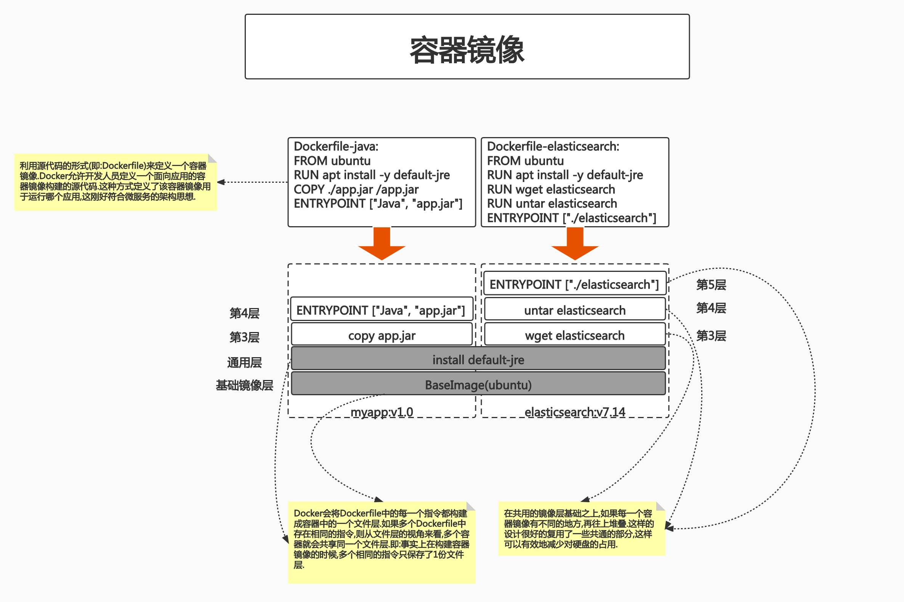
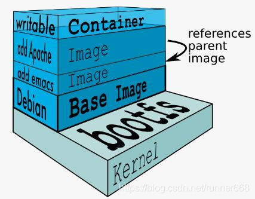
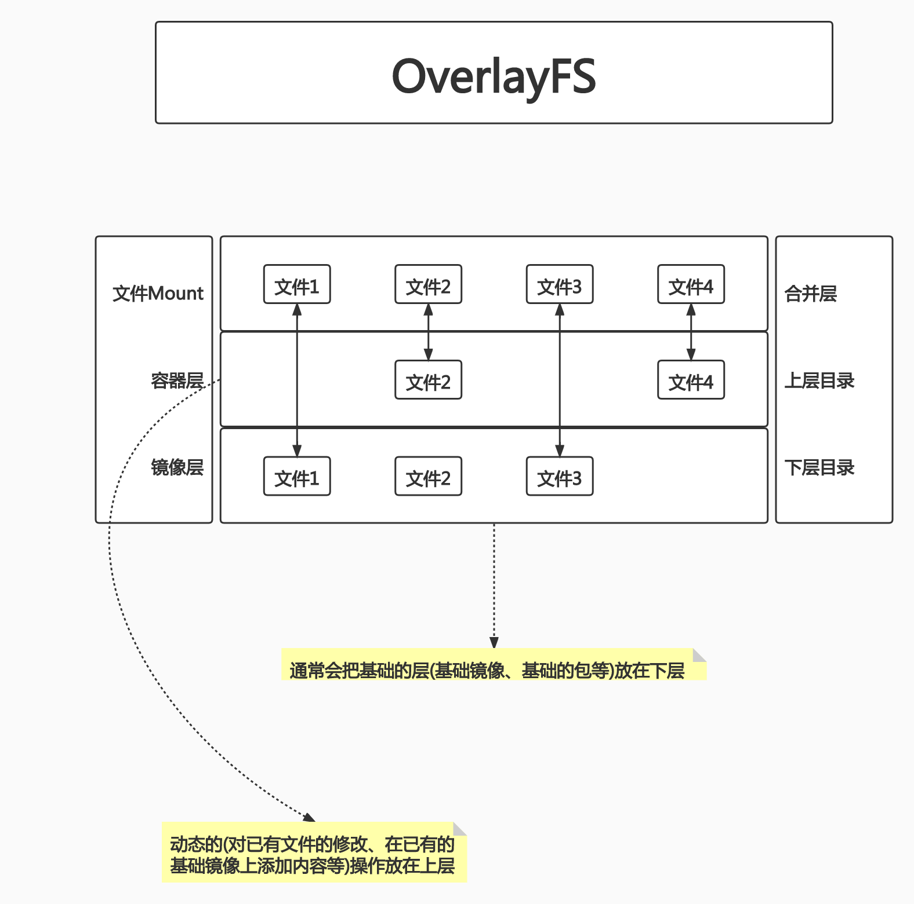
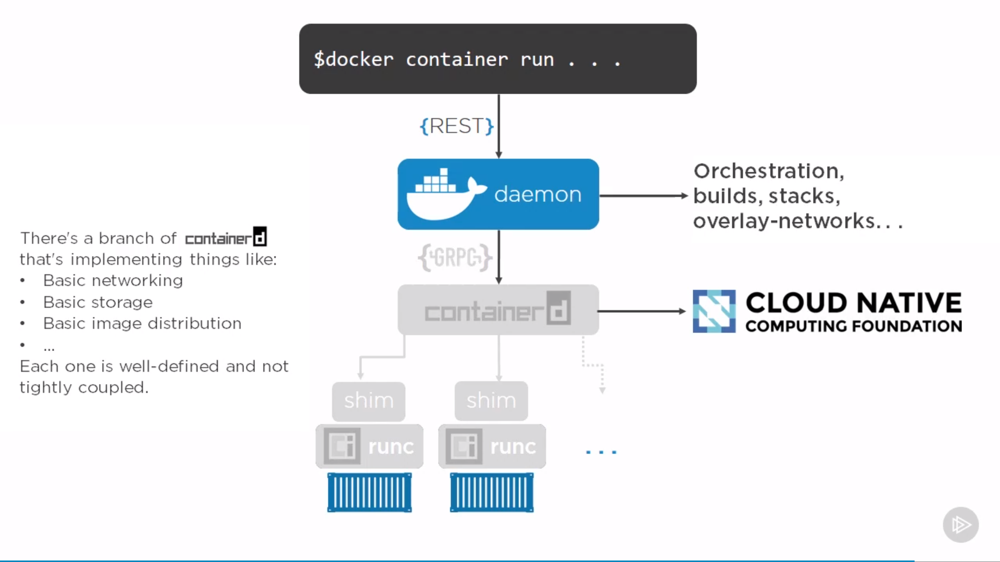

# class4:Docker核心技术(二)

## PART1. 文件系统

### 1.1 概述

- 将不同目录挂载到同一个虚拟文件系统下的文件系统(unite several directories into a single virtual filesystem)
- 支持为每一个成员目录(类似Git Branch)设定readonly、readwirte和write-able权限
- 文件系统分层,对readonly权限的branch可以逻辑上进行修改(增量地,不影响readonly部分的)
- 通常Union FS有2个用途:
	- 可以将多个disk挂到同一个目录下
	- 将一个readonly的branch和一个writeable的branch联合在一起

Union FS:通过一些技术手段,将不同的目录mount到同一个虚拟目录中.每个目录在虚拟目录中可以有独立的权限(readonly、readwirte、write-able).

通过这种方式,可以将多个不同来源的子目录模拟成一个完整的OS.

### 1.2 容器镜像

Docker的容器镜像就是利用了Union FS的技术.Docker提出了容器镜像的概念.



### 1.3 Docker的文件系统

Linux的文件系统与启动:

一般1个Linux会分为2个主要组成部分:

1. Bootfs(boot file system)

	- Bootloader:引导加载kernel
	- Kernel:当kernel被加载到内存中后,umount bootfs

2. rootfs(root file system)
 	
 	- /dev,/proc,/bin,/etc等标准目录和文件
 	- 对于不同的Linux发行版,bootfs基本是一致的,但rootfs会有差别


### 1.4 Docker的启动

Linux的启动:

- 在启动后,首先将rootfs设置为readonly,进行一系列检查,然后将其切换为"readwrite"供用户使用

Docker的启动:

- 初始化时也是将rootfs以readonly方式加载并检查,但接下来使用union mount的方式将一个readwrite的文件系统挂载在readonly的rootfs之上
- 允许再次将下层的FS(file system)设定为readonly并且向上叠加
- 这样一组readonly和一个writeable的结构,构成了一个container的运行时态,每一个FS被称为一个FS层



最上方的一层为readwrite,在它之下的层都是readonly.所有用户的修改都被记录在了顶层(即:readwrite的层)中,不会涉及到下方的层.

### 1.5 写操作

由于镜像具有共享特性,所以对容器的可写层的操作需要依赖存储驱动提供的写时复制和用时分配机制,以此来支持对容器可写层的修改,进而提高对存储和内存资源的利用率.

- 写时复制

写时复制,即Copy-on-Write.1个镜像可以被多个容器使用,但是不需要在内存和磁盘上做多拷贝.在需要对镜像提供的文件进行修改时,该文件才会从镜像的文件系统被复制到容器的可写层文件系统,然后进行修改.而镜像中的文件不会改变.不同容器对文件的修改都相互独立、互不影响.

1个镜像是可以被不同的容器使用的.1个镜像中的不同层也是被多个镜像共享的.因此有了写时复制技术,就可以确保下方的基础镜像层不会被修改.无论通过该基础镜像启动了多少个容器,这些容器的底层基础镜像都是一致的.换言之,N个使用了同一个基础镜像的容器,是共享了1个基础镜像层的文件,而非每个容器各持有一份基础镜像层文件的拷贝.

当需要修改基础镜像层时,是在位于该层上方的可写层中对基础层的文件做修改,最终结果相当于在上方的文件层中对下方的基础层做覆盖的操作.

- 用时分配

按需分配空间,而非提前分配,即当一个文件被创建出来后,才会分配空间

### 1.6 容器存储驱动优缺点比较以及应用

写时复制的行为需要容器的存储驱动来支持.

|存储驱动|Docker|Containerd|
|:-:|:-:|:-:|
|AUFS|在Ubuntu或Debian上支持|不支持|
|OverlayFS|支持|支持|
|Device Mapper|支持|支持|
|BtrFS|社区版本在Ubuntu或Debian上支持,企业版本在SLES上支持|支持|
|ZFS|支持|不支持|

|存储驱动|优点|缺点|应用场景|
|:-:|:-:|:-:|:-:|
|AUFS|Docker最早支持的驱动类型,稳定性高|并未进入主线的内核,因此只能在有限的场合下使用.另外在实现上具有多层结构,在层比较多的场景下,做写时复制有时会需要比较长的时间|少I/O的场景|
|OverlayFS|并入主线内核,可以在目前几乎所有发行版本上使用.实现只有2层,因此性能比AUFS高|写时复制机制需要复制整个文件,而不能只针对修改的部分进行复制,因此大文件操作会需要比较长的时间.其中Overlay在Docker的后续版本中被移除|少I/O的场景|
|Device Mapper|并入主线内核,针对块操作,性能比较高.修改文件时只需复制需要修改的块,效率高|不同容器之间不能共享缓存.在Dokcer的后续版本中会被移除|I/O密集场景|
|BtrFS|并入主线内核,虽然是文件级操作系统,但是可以对块进行操作|需要消耗比较多的内存,稳定性相对比较差|需要支持Snapshot等比较特殊的场景|
|ZFS|不同的容器之间可以共享缓存,多个容器访问相同的文件能够共享一个单一的Page Cache|在频繁写操作的场景下,会产生比较严重的磁盘碎片.需要消耗比较多的内存,另外稳定性相对比较差|容器高密度部署的场景|

### 1.7 OverlayFS

OverlayFS也是一种与AUFS类似的联合文件系统,同样属于文件级的存储驱动,包含了最初的Overlay和更新更稳定的OverlayFS2.

**Overlay只有2层:upper层和lower层,lower层代表镜像层,upper层代表容器可写层.**




### 1.8 OverlayFS文件系统演示

- step1. 创建目录`overlayfs`

```
root@docker-test:/home/roach# pwd
/home/roach
root@docker-test:/home/roach# mkdir overlayfs
root@docker-test:/home/roach# ls
backup.tar  crazy_chaplygin_echo_fuck.tar  Dockerfile  dockerGoImg  go1.17.6.linux-amd64.tar.gz  myGoPath  overlayfs  testDockerfile  test_for_bash.tar  ubuntu-16.04-x86_64.tar.gz
```

- step2. 创建4个子目录:`upper` `lower` ` merged` `work`

```
root@docker-test:/home/roach# cd overlayfs/
root@docker-test:/home/roach/overlayfs# mkdir upper lower merged work
root@docker-test:/home/roach/overlayfs# tree ./
./
├── lower
├── merged
├── upper
└── work

4 directories, 0 files
```

- step3. 在不同目录下创建不同文件

```
root@docker-test:/home/roach/overlayfs# echo "from lower" > lower/in_lower.txt
root@docker-test:/home/roach/overlayfs# echo "from upper" > upper/in_upper.txt
root@docker-test:/home/roach/overlayfs# echo "from lower" > lower/in_both.txt
root@docker-test:/home/roach/overlayfs# echo "from upper" > upper/in_both.txt
root@docker-test:/home/roach/overlayfs# tree ./
./
├── lower
│   ├── in_both.txt
│   └── in_lower.txt
├── merged
├── upper
│   ├── in_both.txt
│   └── in_upper.txt
└── work

4 directories, 4 files
```

接下来要演示的是:将`upper`目录和`lower`目录整合到一起后,文件的内容会有什么样的变化.

- step4. 挂载一个OverlayFS文件系统

```
root@docker-test:/home/roach/overlayfs# sudo mount -t overlay overlay -o lowerdir=`pwd`/lower,upperdir=`pwd`/upper,workdir=`pwd`/work `pwd`/merged
root@docker-test:/home/roach/overlayfs# tree ./
./
├── lower
│   ├── in_both.txt
│   └── in_lower.txt
├── merged
│   ├── in_both.txt
│   ├── in_lower.txt
│   └── in_upper.txt
├── upper
│   ├── in_both.txt
│   └── in_upper.txt
└── work
    └── work

5 directories, 7 files
```

- `-t`:指定文件系统类型
- `lowerdir`:指定用户要挂载的lower层目录
- `upperdir`:指定用户要挂载的upper层目录
- `workdir`:指定文件系统的工作基础目录.挂载后该目录会被清空,且在使用过程中其内容对用户不可见
- `pwd/merged`:这并不是参数,而是指定最终挂载的目录

- step5. 查看`./merged`目录中的内容

```
root@docker-test:/home/roach/overlayfs# cd merged/
root@docker-test:/home/roach/overlayfs/merged# tree ./
./
├── in_both.txt
├── in_lower.txt
└── in_upper.txt

0 directories, 3 files
root@docker-test:/home/roach/overlayfs/merged# cat in_lower.txt 
from lower
root@docker-test:/home/roach/overlayfs/merged# cat in_upper.txt 
from upper
root@docker-test:/home/roach/overlayfs/merged# cat in_both.txt 
from upper
```

可以看到,当把2(多)个目录通过overlay的形式mount到一个虚拟目录时,在这个新的虚拟目录中,会整合来自上层和下层的文件.最终这个虚拟目录中会整合多个目录中的文件,如果遇到同名文件,则上层的文件会覆盖下层的文件.

回到容器镜像上,基础镜像层就相当于演示中的lower层.

若需要在这个基础镜像层中添加一些内容,则在这个基础镜像层上再加一个新的容器层,然后通过overlayFS的形式将这个新的容器层mount进去即可.

若需要在这个基础镜像层中做一些修改,也不需要去修改lower层,只需在上方堆叠一个同名文件即可.新的文件会覆盖掉下层中已存在的文件.

- step6. 在`./merged`中删除文件

1. 删除`in_both.txt`

```
root@docker-test:/home/roach/overlayfs/merged# rm ./in_both.txt
root@docker-test:/home/roach/overlayfs/merged# cd ..
root@docker-test:/home/roach/overlayfs# tree ./
./
├── lower
│   ├── in_both.txt
│   └── in_lower.txt
├── merged
│   ├── in_lower.txt
│   └── in_upper.txt
├── upper
│   ├── in_both.txt
│   └── in_upper.txt
└── work
    └── work

5 directories, 6 files
root@docker-test:/home/roach/overlayfs# cat ./upper/in_both.txt
cat: ./upper/in_both.txt: No such device or address
root@docker-test:/home/roach/overlayfs# cat ./lower/in_both.txt 
from lower
```

可以看到,`upper/in_both.txt`被删除了.但`lower/in_both.txt`没有受到删除操作的影响

2. 删除`in_lower.txt`

```
root@docker-test:/home/roach/overlayfs# rm ./merged/in_lower.txt 
root@docker-test:/home/roach/overlayfs# tree ./
./
├── lower
│   ├── in_both.txt
│   └── in_lower.txt
├── merged
│   └── in_upper.txt
├── upper
│   ├── in_both.txt
│   ├── in_lower.txt
│   └── in_upper.txt
└── work
    └── work

5 directories, 6 files
root@docker-test:/home/roach/overlayfs# cat ./upper/in_lower.txt 
cat: ./upper/in_lower.txt: No such device or address
root@docker-test:/home/roach/overlayfs# cat ./lower/in_lower.txt 
from lower
root@docker-test:/home/roach/overlayfs# ll ./upper/
total 12
drwxr-xr-x 2 root root 4096 Jan 28 17:23 ./
drwxr-xr-x 6 root root 4096 Jan 28 09:22 ../
c--------- 1 root root 0, 0 Jan 28 17:21 in_both.txt
c--------- 1 root root 0, 0 Jan 28 17:23 in_lower.txt
-rw-r--r-- 1 root root   11 Jan 28 16:37 in_upper.txt
```

可以看到,`upper/`目录中多了一个文件`in_lower.txt`.但这个文件是不存在的.但`lower/in_lower.txt`没有受到删除操作的影响.

注:`c---------`中的`c`表示字符设备文件

3. 删除`in_upper.txt`

```
root@docker-test:/home/roach/overlayfs# rm ./merged/in_upper.txt 
root@docker-test:/home/roach/overlayfs# tree ./
./
├── lower
│   ├── in_both.txt
│   └── in_lower.txt
├── merged
├── upper
│   ├── in_both.txt
│   └── in_lower.txt
└── work
    └── work

5 directories, 4 files
```

可以看到,`upper/in_upper.txt`确实被删除了.

## PART2. OCI容器标准

OCI:Open Container Initiative

- OCI组织于2015年创建,是一个致力于定义容器镜像标准和运行时的开放式组织
- OCI定义了镜像标准(Image Specification)、运行时标准(Runtime Specification)和分发标准(Distribution Specification)

	- 镜像标准定义应用如何打包
	- 运行时标准定义如何解压应用包并运行
	- 分发标准定义如何分发容器镜像

## PART3. Docker引擎架构



- Docker daemon:Docker后台的服务端.事实上是一套REST API.
- Docker command:命令行.可以把docker的命令作为一个请求发送给Docker daemon
- containerd:用于控制运行时进程的组件.Docker daemon接收到该请求后,通过GRPC的调用,把请求转发到containerd上
- shim进程:containerd收到请求后,启动一个shim进程.shim进程通过runc(底层运行时的一个接口)启动容器进程

shim的作用:在早期,containerd和shim是不存在的.那个时代,当你通过docker命令去运行一个容器进程时,这个容器进程是由docker daemon直接拉起的.

这样设计的问题:docker daemon成为了所有容器进程的父进程.当你升级或重启docker时,父进程就不存在了,子进程也会被重启.这导致的问题是:你无法轻易升级docker.对于早期的docker来讲,这是一个致命问题.

containerd启动了一个shim进程后,会将该shim交给OS的init system(比如systemd).这样containerd下面是不挂任何进程的,可以随意升级或重启.即:**把控制组件和数据面组件分离**.