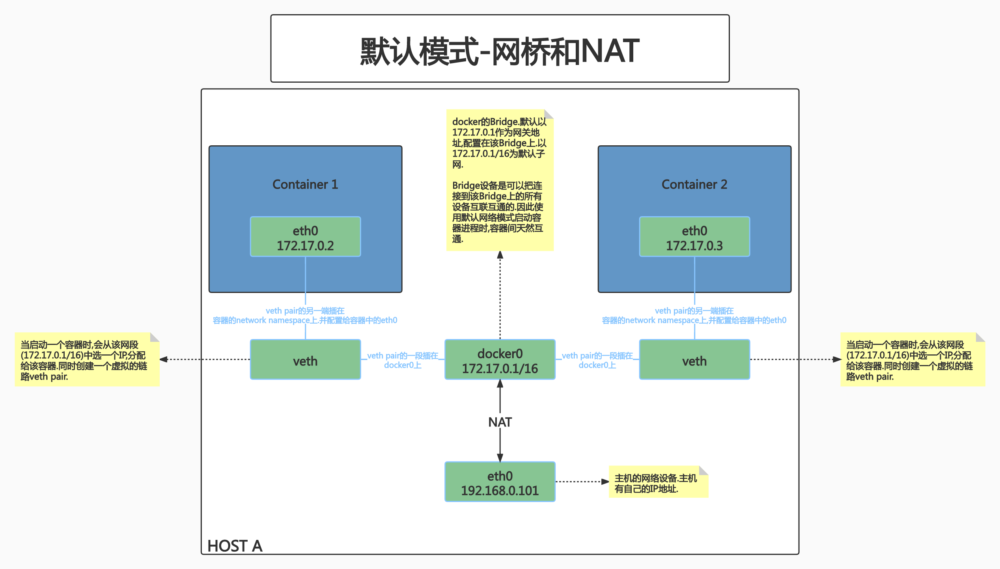
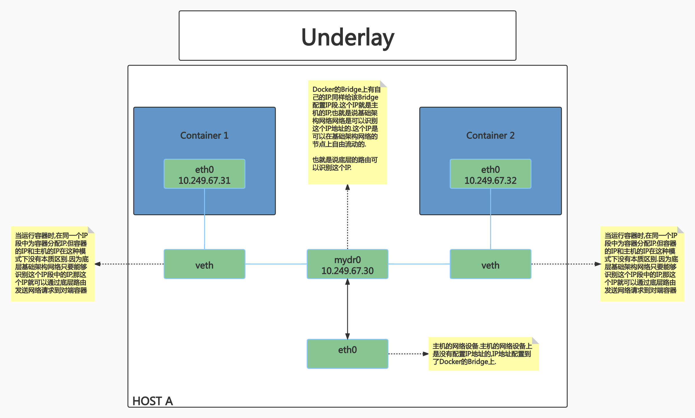
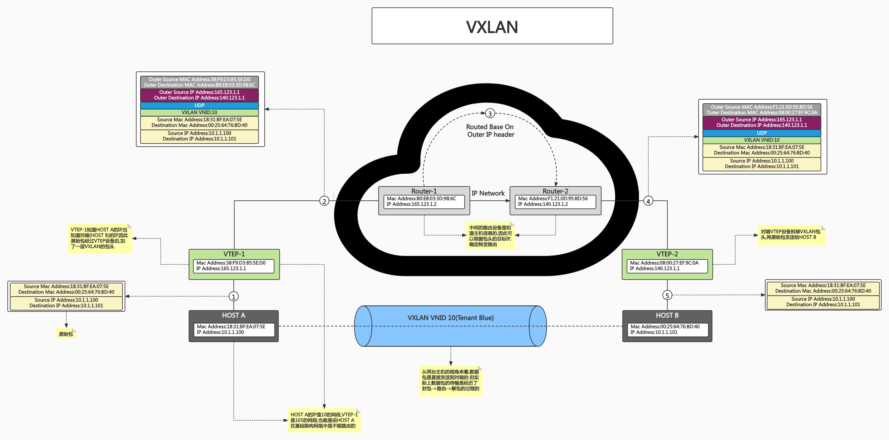

# class5:容器网络

## PART1. Docker的网络模式

### 1.1 单节点的网络模式

Docker本身在它创建之初,就有自己的网络驱动器:CNM(Container Network Manager).CNM支持多种模式.

- Null(`--net=None`)
	
	- 把容器放入独立的网络空间但不做任何配置
	- 用户需要通过运行`docker network`命令来完成网络配置
	- 主要作用:当用户希望全权处理容器的网络配置时使用.Docker不为用户做任何配置,但是会为用户把网络的namespace创建出来.
	- 如果上层有Kubernetes这种编排系统,Kubernetes希望通过自己的网络插件来配置网络,此时就应该使用Null模式来创建一个镜像

- Host
	
	- 使用主机网络名空间,复用主机网络
	- 使用Host模式启动的容器进程,没有自己独立的网络配置,容器进程复用主机网络.在Kubernetes中有很多场景下会使用到.
	- 例:你作为管理员,希望配置主机的网络.就可以用Host模式启动一个容器,以这个容器为入口,配置主机网络

- Container

	- 复用其他容器的网络
	- 和Host模式类似.主要作用:创建多个容器进程(假设N个),这N个容器进程会复用同一个网络
	- 使用场景:以微服务为例.一个微服务本身可能是一个进程,还可能有一些其他进程为该进程做辅助工作.这些辅助进程是通过网络和微服务进程交互的.此时就有多种组织这些进程的方式了:
		- 一种方式是将这些进程都放在1个容器镜像内,让这些进程一起发布.
		- 另一种方式就是为每一个进程构建一个独立的容器镜像.但是在启动这些容器时,让这些容器共享同一个网络namespace.从网络层面看,这种方式和前一种没有任何区别.容器和容器之间可以通过localhost来通信.彼此网络上可见

- Bridge(`--net=bridge`)

	- 使用Linux网桥和iptables提供容器互连,Docker在每台主机上创建一个名叫docker0的网桥,通过veth pair来连接该主机的每一个EndPoint.
	- 这种网络模式是Docker默认模式.

### 1.2 跨主机的网络模式

- Remote(work with remote dirvers)

	- Underlay:
	
		- 使用现有底层网络,为每一个容器配置可路由的网络IP
		- 这种模式容器网络和主机网络是一样的.容器的IP段在主机层面知道如何路由.这样一来容器的数据包就可以自由传输.
		- 这种模式的局限性:容器网络和主机网络共用,但容器网络对IP的消耗是巨大的.所以如果采用这种模式实现跨主机的容器间通信,需要提前规划好网段(比如有多大的网段分给容器,有多大的网段分给基础架构)
	
	- Overlay:

		- 通过网络封包实现
		- 通常容器网络和底层基础架构网络是两套网络.容器有自己的子网,这个子网在底层网络中是不能路由的.也就是说,容器网络中的网络请求是不能在基础网络中传输的,数据包是传不过去的.
		- 想要实现跨主机的容器间互联互通,就需要基于Overlay技术.当容器发出的数据包要通过主机向外传输时,在主机层面再封装一层.在原始数据包的基础上通过各种协议再加一层包头,这个包头会把当前主机地址作为原地址,把对端主机地址作为目标地址.封装好的数据包就可以在基础架构网络中传输了
		- 数据包到达对端主机后,对端主机解包.解开主机一层包头后,剩下的就是容器的数据包头.这样一来数据包就可以到达对端主机上的容器了

## PART2. 单节点的容器网络模式

### 2.1 Null模式启动容器

- Null模式是一个空实现
- 可以通过Null模式启动容器并在宿主机上通过命令为容器配置网络

演示:创建一个网络模式为Null的容器,并为该容器配置网络

- step1. 运行一个nginx的容器,并且将网络模式设置成Null

```
root@docker-test:/home/roach# docker run --network=none -d nginx
ec119c5d66daba51016345e9468ba1db5fec37bdcbed2eb767fc45d82f4e3612
root@docker-test:/home/roach# docker ps
CONTAINER ID   IMAGE     COMMAND                  CREATED         STATUS         PORTS     NAMES
ec119c5d66da   nginx     "/docker-entrypoint.…"   9 seconds ago   Up 8 seconds             sweet_nobel
```

- step2. 检查该容器进程的pid

```
root@docker-test:/home/roach# docker inspect ec119c5d66da|grep -i pid
            "Pid": 1310,
            "PidMode": "",
            "PidsLimit": null,
```

- step3. 在宿主机上查看容器进程的网络情况

```
root@docker-test:/home/roach# nsenter -t 1310 -n ip a
1: lo: <LOOPBACK,UP,LOWER_UP> mtu 65536 qdisc noqueue state UNKNOWN group default qlen 1000
    link/loopback 00:00:00:00:00:00 brd 00:00:00:00:00:00
    inet 127.0.0.1/8 scope host lo
       valid_lft forever preferred_lft forever
```

可以看到只有loopback地址,没有其他网络配置.也就是说现在是无法通过外部的网络调用来访问这个服务的,但是该进程的network namespace是已经被建立了.

- step4. 创建容器进程的network namespace

```
root@docker-test:/home/roach# mkdir -p /var/run/netns
root@docker-test:/home/roach# export pid=1310
root@docker-test:/home/roach# ln -s /proc/$pid/ns/net /var/run/netns/$pid
```

此处创建目录的目的:当我们希望把一个进程关联到一个network namespace上时,就需要有一个地方来保存network namespace的相关信息(如:有哪些network namespace、这些network namespace关联了哪些进程等信息).这个地方就是`/var/run/netns/`.

此处创建软连接的目的:`/proc/$pid/ns/net`是容器进程的network namespace信息;`/var/run/netns/$pid`是我们自己创建的,用于保存容器进程的network namespace的目录.此处建立软连接是为了后续操作,在创建了链路之后,连接容器进程的network namespace和主机的network namespace用.

注:某些程序启动服务后,会将它们PID放置在`/var/run/`目录下

- step5. 检查容器进程的network namespace是否能在主机上被查看到

```
root@docker-test:/home/roach# ip netns list
1310
```

`ip netns`:用于管理network namespace.它可以创建命名的 network namespace,然后通过名字来引用network namespace

`ip netns list`:显示所有命名的network namesapce,其实就是显示`/var/run/netns`目录下的所有network namespace对象

- step6. 查看Docker的网桥设备

```
root@docker-test:/home/roach# brctl show
bridge name	bridge id		STP enabled	interfaces
docker0		8000.02420bb43568	no
```

注:`brctl`命令需安装(`root@docker-test:/home/roach# apt install bridge-utils`)

当安装完Docker后,Docker默认在主机上会安装一个Bridge(桥接设备,可以理解为是一个集线器,该集线器上有很多网口.当多台主机的网线都连接到该Bridge设备后,这些主机之间就可以互通了),该设备用于连接当前主机上的所有容器.

有了网桥设备,想要让容器内的网络和主机互通,就比较容易了.其实只需要做2件事:

1. 为容器进程配置网络
2. 从容器的网络中牵一根网线到主机的namespace,并且插在docker0的Bridge上

这样主机网络和容器网络就可以互通了

- step7. 创建链路

```
root@docker-test:/home/roach# ip link add A type veth peer name B
```

这条命令相当于创建了一条链路.链路的类型为`veth`(virtual ethernet,虚拟以太网).可以认为这就是一条网线.网线有两端,一端叫A,另一端叫B.

- step8. 将链路的A口连接到主机的network namespace上,并让链路的A口启动生效

	- step8.1 将链路的A口连接到主机的network namespace上

	```
	root@docker-test:/home/roach# brctl addif docker0 A
	```
	
	即:将链路的A端连接到桥接设备docker0上
	
	- step8.2 让链路的A口启动生效

	```
	root@docker-test:/home/roach# ip link set A up
	```
	
	即:启动链路的A端,使其生效

- step9. 将链路的B口连接到容器的network namespace上

	- step9.1 设置容器进程的IP

	```
	root@docker-test:/home/roach# SETIP=172.17.0.10
	root@docker-test:/home/roach# SETMASK=16
	root@docker-test:/home/roach# GATEWAY=172.17.0.1
	```

	注:Docker安装后,默认docker0 Bridge的网关地址就是`172.17.0.1`,子网掩码长度默认为16.所以此处的`SETMASK`和`GATEWAY`都是按照Docker的默认配置来配置的.
	
	- step9.2 将链路的B口连接到容器的network namespace上

	```
	root@docker-test:/home/roach# ip link set B netns $pid
	```

	- step9.3 设置容器network namespace的网络设备名称

	```
	root@docker-test:/home/roach# ip netns exec $pid ip link set dev B name eth0
	```

	注意:此处是进到容器的network namespace中,去设置容器的网络设备名称的.可以看到命令先是`ip netns exec $pid`,再是`ip link set dev B name eth0`
	
	- step 9.4 启动容器的网卡,并为容器内部的网卡配置IP地址、子网掩码、默认路由的网关地址

	```
	root@docker-test:/home/roach# ip netns exec $pid ip link set eth0 up
	root@docker-test:/home/roach# ip netns exec $pid ip addr add $SETIP/$SETMASK dev eth0
	root@docker-test:/home/roach# ip netns exec $pid ip route add default via $GATEWAY
	```

- step10. 在主机上访问容器的IP地址

```
root@docker-test:/home/roach# curl 172.17.0.10
<!DOCTYPE html>
<html>
<head>
<title>Welcome to nginx!</title>
<style>
html { color-scheme: light dark; }
body { width: 35em; margin: 0 auto;
font-family: Tahoma, Verdana, Arial, sans-serif; }
</style>
</head>
<body>
<h1>Welcome to nginx!</h1>
<p>If you see this page, the nginx web server is successfully installed and
working. Further configuration is required.</p>

<p>For online documentation and support please refer to
<a href="http://nginx.org/">nginx.org</a>.<br/>
Commercial support is available at
<a href="http://nginx.com/">nginx.com</a>.</p>

<p><em>Thank you for using nginx.</em></p>
</body>
</html>
```

- step11. 在主机上查看容器的网络配置

```
root@docker-test:/home/roach# nsenter -t $pid -n ip a
1: lo: <LOOPBACK,UP,LOWER_UP> mtu 65536 qdisc noqueue state UNKNOWN group default qlen 1000
    link/loopback 00:00:00:00:00:00 brd 00:00:00:00:00:00
    inet 127.0.0.1/8 scope host lo
       valid_lft forever preferred_lft forever
4: eth0@if5: <BROADCAST,MULTICAST,UP,LOWER_UP> mtu 1500 qdisc noqueue state UP group default qlen 1000
    link/ether 6e:3f:1b:00:cf:fc brd ff:ff:ff:ff:ff:ff link-netnsid 0
    inet 172.17.0.10/16 scope global eth0
       valid_lft forever preferred_lft forever
```

也就是说刚才的一套操作,就相当于给容器又配了一块可以和主机互通的网卡了

### 2.2 默认模式:网桥和NAT

Docker网络的默认模式就是桥接.桥接其实就是刚才演示中的那些步骤.

不指定网络模式时,docker在网络连接方面做的工作,和我们刚才演示的是一样的.

- step1. 不指定网络模式,启动一个nginx容器

```
root@docker-test:/home/roach# docker run -d nginx
b0756c9f3865f02fdbe73ddc45571800d6cad656233e474127f4f5ced808109b
root@docker-test:/home/roach# docker ps
CONTAINER ID   IMAGE     COMMAND                  CREATED          STATUS          PORTS     NAMES
b0756c9f3865   nginx     "/docker-entrypoint.…"   13 seconds ago   Up 13 seconds   80/tcp    jolly_aryabhata
ec119c5d66da   nginx     "/docker-entrypoint.…"   2 days ago       Up 2 days                 sweet_nobel
```

- step2. 查看该容器的网络设备情况

```
root@docker-test:/home/roach# docker inspect b0756c9f3865|grep -i pid
            "Pid": 14332,
            "PidMode": "",
            "PidsLimit": null,
root@docker-test:/home/roach# nsenter -t 14332 -n ip a
1: lo: <LOOPBACK,UP,LOWER_UP> mtu 65536 qdisc noqueue state UNKNOWN group default qlen 1000
    link/loopback 00:00:00:00:00:00 brd 00:00:00:00:00:00
    inet 127.0.0.1/8 scope host lo
       valid_lft forever preferred_lft forever
6: eth0@if7: <BROADCAST,MULTICAST,UP,LOWER_UP> mtu 1500 qdisc noqueue state UP group default 
    link/ether 02:42:ac:11:00:02 brd ff:ff:ff:ff:ff:ff link-netnsid 0
    inet 172.17.0.2/16 brd 172.17.255.255 scope global eth0
       valid_lft forever preferred_lft forever
```

可以看到,该容器的IP地址为:172.17.0.2



若想要把容器内部的服务发布到主机上,该怎么做?

[映射端口地址](https://github.com/rayallen20/DockerPrimer/blob/main/%E7%AC%AC7%E7%AB%A0%20%E7%AB%AF%E5%8F%A3%E6%98%A0%E5%B0%84%E4%B8%8E%E5%AE%B9%E5%99%A8%E4%BA%92%E8%BF%9E/%E7%AC%AC7%E7%AB%A0%20%E7%AB%AF%E5%8F%A3%E6%98%A0%E5%B0%84%E4%B8%8E%E5%AE%B9%E5%99%A8%E4%BA%92%E8%BF%9E.md#2-%E6%98%A0%E5%B0%84%E6%89%80%E6%9C%89%E6%8E%A5%E5%8F%A3%E5%9C%B0%E5%9D%80)

例:

`docker run -d --name nginx -p 8080:80 nginx`

其底层逻辑为:

- Docker以标准模式配置网络

	- 创建veth pair
	- 将veth pair的一端连接到docker0网桥
	- veth pair的另一端设置为容器network namespace的eth0
	- 为容器network namespace的eth0分配ip
	- 主机上的iptables规则:`PREROUTING -A DOCKER ! -i docker0 -p tcp -m tcp -dport 2333 -j DNAT --to-destination 172.17.0.2:22`

		- 实际上就是通过主机的iptable做了一个端口转发.

## PART3. 多节点的容器网络模式

### 3.1 Underlay

从实现上最容易的就是Underlay模式.

- 采用Linux网桥设备(sbrctl),通过物理网络连通容器
- 创建新的网桥设备mydr0
- 将主机网卡加入网桥
- 把主机网卡的地址配置到网桥,并把默认路由规则转移到网桥mydr0
- 启动容器
- 创建veth pair,把一个peer添加到网桥mydr0
- 配置容器把veth的另一个peer分配给容器网卡



也就是说,Underlay模式是不划分独立的容器网络,而是容器网络融入到基础架构网络中.

- 优点:方案简单
- 缺点:需要较强的网段规划能力.因为容器对IP的需求很大,所以要事先规划好所有IP的分配,避免造成IP的浪费.

### 3.2 Docker Libnetwork Overlay

- Docker overlay网络驱动原生支持多主机网络
- Libnetwork是一个内置的基于VXLAN的网络驱动

VXLAN是Overlay网络中最常用的一种模式.



### 3.3 网络插件-以Flannel为例

Kubernetes中的网络插件Flannel支持Overlay模式

- 同一主机内的Pod可以使用网桥进行通信
- 不同主机上的Pod将通过flanneld将其流量封装在UDP数据包中

