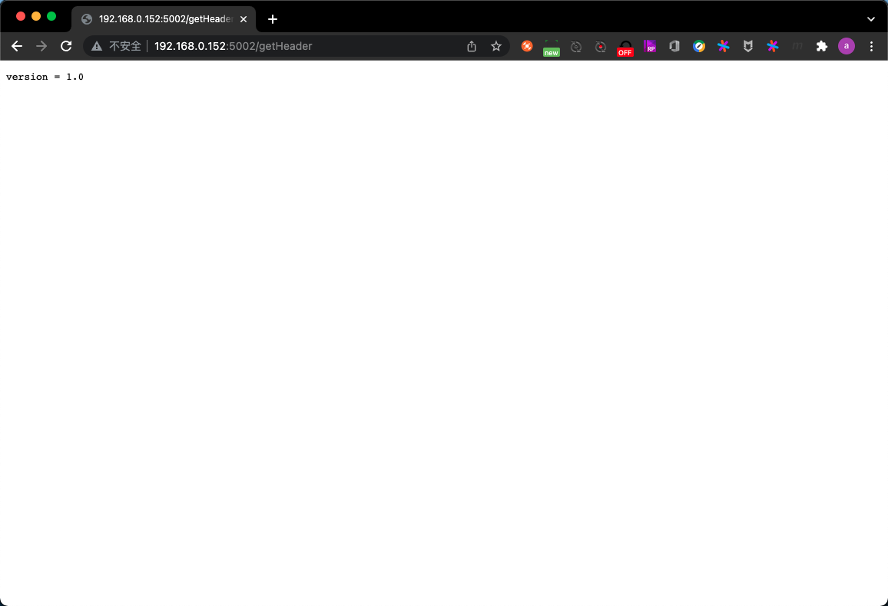

# class6:Dockerfile最佳实践

## PART1. 创建docker镜像

Dockerfile:用来构建镜像的文本文件,文本内容包含了一条条构建镜像所需的指令和说明.可以认为是创建一个虚拟机时,对操作的一个扩展.

可以基于Dockerfile来定义整个容器镜像.包括容器的基础镜像、中间件、可运行的文件等.可以把任何初始化一个进程所需的依赖在Dockerfile中定义好.

`docker build`命令会依次读取并运行Dockerfile中的指令,把这些指令转换成一个真正的容器镜像.

通常一个容器镜像分为2部分:

1. 描述文件(Meta Data)
2. 二进制文件

示例:

```
# 指定基础镜像
FROM ubuntu

# 设置环境变量
ENV DEBIAN_FRONTEND=noninteractive
# 执行一些命令
RUN sed -i 's/^exit 101/exit 0' /usr/sbin/policy-rc.d

# 运行指令
RUN \
    apt-get update && \
    apt-get install -y ca-certificates && \
    apt-get install -y curl && \
    rm -rf /var/lib/apt/lists/*

# 把本地文件复制到容器镜像中
ADD ./bin/myapp myapp
# 指定容器镜像运行的进程
ENTRYPOINT ["/myapp"]
```

以这个Dockerfile为例:

- 拉取下来的基础镜像作为一个tar包存储在本机了
- `ENV DEBIAN_FRONTEND=noninteractive`:在基础镜像上又加了设置环境变量的一层
- `RUN sed -i 's/^exit 101/exit 0' /usr/sbin/policy-rc.d`:又加了文件替换的一层
- `RUN \ ...`:安装的软件包以二进制文件的形式存在于镜像中,但从主机的视角来看,只是在之前的基础上又加了一层
- `ADD ./bin/myapp myapp`:又加了复制文件的一层
- `ENTRYPOINT ["/myapp"]`:又加了启动进程的一层

其中每一层都是以tar包的形式存储在主机上.这些tar包就是容器镜像中的二进制文件部分.

另外还有一个描述文件用来把这些二进制文件组织起来,形成一个镜像.

所以当我们说打包容器镜像的时候,实际上就是打包了多个二进制文件和一个描述文件.

当我们要传输这个容器镜像时,实际上就是把这些二进制文件和对应的描述文件传输出去.

当基于这个镜像运行容器时,实际上做的就是解压和运行程序的操作.

## PART2. 回顾12 Factor之进程

- 运行环境中,应用程序通常以一个和多个进程运行

	- 应用的进程必须无状态(Stateless)且无共享(Share nothing)
	- 优点:利于横向扩展.使得人可以用很低的成本管理大量的进程

- 任何需要持久化的数据都要存储在后端服务内,比如数据库

	- 应在构建阶段将源代码编译成待执行应用
	- 即:数据库容器化.如果是起步阶段,应该选择一个最安全的,最简单的场景来使用新的技术.
	- 先把计算容器化也是可以的.像数据库这种有状态的应用,到了Kuberbnetes中再讨论

- Session Sticky是12-Factor极力反对的

	- Session中的数据应该保存在如Memcached或Redis这样的带有过期时间的缓存中
	- Session Sticky:很多应用是希望面向会话的.即:对于同一个客户端而言,服务端希望该客户端永远连接到一个指定的节点上.这样可以保持会话,可以复用session信息
	- 但这是不符合12-Factor原则的.12-Factor鼓励所有的用户信息、会话信息放在一个公共缓存中.真正后端的服务是不应该处理这些用户信息、会话信息的

Docker遵循以上原则管理和构建应用.所有这些原则的目的都是为了让提供服务(计算)的应用进程成为一个无状态的、可随意切换的进程.这也是容器的一个优势.

## PART3. 理解构建上下文(Build Context)

- 当运行`docker build`命令时,当前工作目录被称为构建上下文
- `docker build`默认查找当前目录的`Dockerfile`作为构建输入,也可以通过`-f`参数指定`Dockerfile`
	
	- 例:`docker build -f ./Dockerfile`

- 当`docker build`运行时,首先会把构建上下文传输给docker daemon,把没用的文件包含在构建上下文中,会导致传输时间长,构建需要的资源多,构建出的镜像大等问题

	- 可以通过`.dockerignore`文件从构建上下文中排除某些文件

- 因此需要确保构建上下文清晰,比如创建一个专门的目录放置Dockerfile,并在目录中运行`docker build`

实验:以用户家目录(家目录中还有其他与构建无关的文件)为构建上下文与以工程目录(工程目录中无与构建无关的文件)为构建上下文的比对

现有一项目(模块2的httpserver),其代码和Dockerfile内容如下:

代码:

```go
package main

import (
	"flag"
	"fmt"
	"io"
	"log"
	"net/http"

	_ "net/http/pprof"

	"github.com/golang/glog"
)

func main() {
	flag.Set("v", "4")
	glog.V(2).Info("Starting http server...")
	http.HandleFunc("/", rootHandler)
	c, python, java := true, false, "no!"
	fmt.Println(c, python, java)
	err := http.ListenAndServe(":80", nil)
	// mux := http.NewServeMux()
	// mux.HandleFunc("/", rootHandler)
	// mux.HandleFunc("/healthz", healthz)
	// mux.HandleFunc("/debug/pprof/", pprof.Index)
	// mux.HandleFunc("/debug/pprof/profile", pprof.Profile)
	// mux.HandleFunc("/debug/pprof/symbol", pprof.Symbol)
	// mux.HandleFunc("/debug/pprof/trace", pprof.Trace)
	// err := http.ListenAndServe(":80", mux)
	if err != nil {
		log.Fatal(err)
	}

}

func healthz(w http.ResponseWriter, r *http.Request) {
	io.WriteString(w, "ok\n")
}

func rootHandler(w http.ResponseWriter, r *http.Request) {
	fmt.Println("entering root handler")
	user := r.URL.Query().Get("user")
	if user != "" {
		io.WriteString(w, fmt.Sprintf("hello [%s]\n", user))
	} else {
		io.WriteString(w, "hello [stranger]\n")
	}
	io.WriteString(w, "===================Details of the http request header:============\n")
	for k, v := range r.Header {
		io.WriteString(w, fmt.Sprintf("%s=%s\n", k, v))
	}
}
```

Dockerfile

```
FROM ubuntu
ENV MY_SERVICE_PORT=80
ENV MY_SERVICE_PORT1=80
ENV MY_SERVICE_PORT2=80
ENV MY_SERVICE_PORT3=80
LABEL multi.label1="value1" multi.label2="value2" other="value3"
ADD httpserver /httpserver
EXPOSE 80
ENTRYPOINT /httpserver
```

- 以用户家目录为构建上下文,构建镜像(需要将编译好的二进制文件复制到家目录)

	- 查看目录内容
	
	```
	root@docker-test:/home/roach/myGoPath/src/httpServer# ls
	Dockerfile  go.mod  go.sum  httpserver  main.go
	```
	
	- 构建镜像
	
	```
	root@docker-test:~# docker build -f $GOPATH/src/httpServer/Dockerfile .
	Sending build context to Docker daemon  96.57MB
	Step 1/9 : FROM ubuntu
	 ---> ba6acccedd29
	Step 2/9 : ENV MY_SERVICE_PORT=80
	 ---> Using cache
	 ---> 08b186233bb0
	Step 3/9 : ENV MY_SERVICE_PORT1=80
	 ---> Using cache
	 ---> d66f93b11a6e
	Step 4/9 : ENV MY_SERVICE_PORT2=80
	 ---> Using cache
	 ---> e8835285a31d
	Step 5/9 : ENV MY_SERVICE_PORT3=80
	 ---> Using cache
	 ---> 846a418fadcd
	Step 6/9 : LABEL multi.label1="value1" multi.label2="value2" other="value3"
	 ---> Using cache
	 ---> 392581b916d0
	Step 7/9 : ADD httpserver /httpserver
	 ---> Using cache
	 ---> e264d879f1c2
	Step 8/9 : EXPOSE 80
	 ---> Using cache
	 ---> 460edeb69a55
	Step 9/9 : ENTRYPOINT /httpserver
	 ---> Using cache
	 ---> 131929bfed59
	Successfully built 131929bfed59
	```
	
	可以看到,镜像大小为96.57MB

	- 以工程目录为构建上下文,构建镜像
	
	- 查看目录内容
	
	```
	root@docker-test:~# ls
	Dockerfile  httpserver  snap  testAdd  ubuntu_18.04.tar
	```
	
	- 构建镜像
	
	```
	root@docker-test:/home/roach/myGoPath/src/httpServer# docker build -f ./Dockerfile .
	Sending build context to Docker daemon  7.228MB
	Step 1/9 : FROM ubuntu
	 ---> ba6acccedd29
	Step 2/9 : ENV MY_SERVICE_PORT=80
	 ---> Using cache
	 ---> 08b186233bb0
	Step 3/9 : ENV MY_SERVICE_PORT1=80
	 ---> Using cache
	 ---> d66f93b11a6e
	Step 4/9 : ENV MY_SERVICE_PORT2=80
	 ---> Using cache
	 ---> e8835285a31d
	Step 5/9 : ENV MY_SERVICE_PORT3=80
	 ---> Using cache
	 ---> 846a418fadcd
	Step 6/9 : LABEL multi.label1="value1" multi.label2="value2" other="value3"
	 ---> Using cache
	 ---> 392581b916d0
	Step 7/9 : ADD httpserver /httpserver
	 ---> Using cache
	 ---> e264d879f1c2
	Step 8/9 : EXPOSE 80
	 ---> Using cache
	 ---> 460edeb69a55
	Step 9/9 : ENTRYPOINT /httpserver
	 ---> Using cache
	 ---> 131929bfed59
	Successfully built 131929bfed59
	```
	
	可以看到,镜像大小为7.228MB

那么是不是在构建时只能切换到工程目录中执行`docker build`指令呢?

并不是.可以通过指定构建上下文目录的方式,在非工程目录位置处,以工程目录为构建上下文,构建镜像.

```
root@docker-test:~# pwd
/root
root@docker-test:~# docker build $GOPATH/src/httpServer
Sending build context to Docker daemon  7.228MB
Step 1/9 : FROM ubuntu
 ---> ba6acccedd29
Step 2/9 : ENV MY_SERVICE_PORT=80
 ---> Using cache
 ---> 08b186233bb0
Step 3/9 : ENV MY_SERVICE_PORT1=80
 ---> Using cache
 ---> d66f93b11a6e
Step 4/9 : ENV MY_SERVICE_PORT2=80
 ---> Using cache
 ---> e8835285a31d
Step 5/9 : ENV MY_SERVICE_PORT3=80
 ---> Using cache
 ---> 846a418fadcd
Step 6/9 : LABEL multi.label1="value1" multi.label2="value2" other="value3"
 ---> Using cache
 ---> 392581b916d0
Step 7/9 : ADD httpserver /httpserver
 ---> Using cache
 ---> e264d879f1c2
Step 8/9 : EXPOSE 80
 ---> Using cache
 ---> 460edeb69a55
Step 9/9 : ENTRYPOINT /httpserver
 ---> Using cache
 ---> 131929bfed59
Successfully built 131929bfed59
```

可以看到,构建出来的镜像大小为7.228MB,和上文试验中切换到工程目录并构建的结果是一样的.

## PART4. 构建缓存(Build Cache)

镜像构建日志:使用`docker build`命令构建镜像时,打印每一步(每一层或Dockerfile中的每一条指令)执行过程的输出内容.通过日志可以知道构建的每一个步骤.

```
root@docker-test:~# pwd
/root
root@docker-test:~# docker build $GOPATH/src/httpServer
Sending build context to Docker daemon  7.228MB
Step 1/9 : FROM ubuntu
 ---> ba6acccedd29
Step 2/9 : ENV MY_SERVICE_PORT=80
 ---> Using cache
 ---> 08b186233bb0
Step 3/9 : ENV MY_SERVICE_PORT1=80
 ---> Using cache
 ---> d66f93b11a6e
Step 4/9 : ENV MY_SERVICE_PORT2=80
 ---> Using cache
 ---> e8835285a31d
Step 5/9 : ENV MY_SERVICE_PORT3=80
 ---> Using cache
 ---> 846a418fadcd
Step 6/9 : LABEL multi.label1="value1" multi.label2="value2" other="value3"
 ---> Using cache
 ---> 392581b916d0
Step 7/9 : ADD httpserver /httpserver
 ---> Using cache
 ---> e264d879f1c2
Step 8/9 : EXPOSE 80
 ---> Using cache
 ---> 460edeb69a55
Step 9/9 : ENTRYPOINT /httpserver
 ---> Using cache
 ---> 131929bfed59
Successfully built 131929bfed59
```

注意日志中的`Using cache`的部分,即构建缓存.

构建容器镜像时,Docker依次读取Dockerfile中的指令,并按顺序依次执行构建指令.

Docker读取指令后,会先判断缓存中是否有可用的已存镜像,只有已存镜像不存在时,才会重新构建.否则复用(reuse)已存镜像.

- 通常Docker简单判断Dockerfile中的指令与镜像
- 针对`ADD`和`COPY`指令,Docker判断该镜像层每一个被复制的文件的内容并生成一个checksum,与现存镜像比对时,比对的是二者的checksum
- 其他指令,比如`RUN apt-get -y update`,Docker简单比较与现存镜像中的指令字串是否一致
- 当某一层cache失效后,所有层级的cache均一并失效,后续指令都重新构建镜像
	
	- 因此,在构建镜像时,应该尽量把很久才更新一次的(或者可以说不动的)层放在下面,把频繁更新的层放在上面.用于防止一个层缓存失效后,该层之上所有的层都缓存失效的问题.

这样的做法可以有效提升构建效率.

## PART5. 多段构建(Multi-stage build)

```
root@docker-test:/home/roach/dockerGoImg# cat Dockerfile 
# 编译用镜像
ARG GO_VERSION=1.17.6
# 命名编译用镜像为builder
FROM golang:${GO_VERSION} as builder
RUN mkdir -p /go/src/test
WORKDIR /go/src/test
COPY main.go .
RUN go mod init testGoProject
RUN CGO_ENABLED=0 GOOS=linux go build -o app .

# 运行用镜像
FROM alpine:latest
RUN apk --no-cache add ca-certificates
WORKDIR /root/
# 从镜像builder处复制文件
COPY --from=builder /go/src/test/app .
CMD ["./app"]
```

场景:此时需编译一个容器镜像,该容器镜像中运行一个GO语言编写的进程.请以最终运行该进程的镜像体积尽可能小为目标,编译容器镜像.

GO语言的项目通常有`vendor/`目录,因此编译时需要拉取第三方依赖包.需要注意的是,此时拉取的是第三方包的源代码.拉取之后才能完成项目的编译工作.但最终容器镜像需要的并不是这些源码,仅仅是编译之后的二进制文件.可是编译的过程又会把源代码拉取到本地,这些源代码会影响最终编译出来的镜像的体积.因此需要多段构建.

多段构建:在1个Dockerfile中,指定多个要构建的镜像.其中一个镜像(为方便描述称该镜像为镜像A)用于编译项目,将编译好的二进制文件放到指定的目录;另一个镜像用于运行该二进制文件(为方便描述称该镜像为镜像B),镜像B从镜像A指定的目录中将二进制文件复制到镜像B中,并运行该二进制文件.

## PART6. Dockerfile常用指令

### 6.1 FROM

用途:选择基础镜像,推荐`alpine`

选择完备的操作系统(例:`FROM Ubuntu`)作为基础镜像,优点显而易见:完备.各种命令都有.但同时缺点也很明显:镜像体积过大,传输时间长,磁盘占用大.更严重的问题在于:完备的OS需要很多中间件,一旦某一个中间件出现安全漏洞,那么修复的成本非常的高.

还有一种方式是使用空的容器(例:`FROM scratch`)作为基础镜像.像GO语言的项目就可以使用这种基础镜像,因为GO编译后的二进制文件直接就可以执行了,不需要其他组件.用这种镜像作为基础镜像,其优点在于镜像体积较小,没有任何多余文件.但是缺点在于:有时候在限网的情况下,需要进入到容器中做一些调试(比如查看IP、进程、端口等),但空的容器是没有这种能力的.

所以通常Docker推荐用一些小的基础镜像(例:`FROM alpine`),可以认为这种基础镜像是一个小型的Linux,在这个基础镜像上,添加你需要的工具.在这个基础镜像上运行你的应用即可.

示例:`FROM [--platform=<platfrom>]<image>[@<digest>][AS<name>]`

[FROM指令介绍](https://github.com/rayallen20/DockerPrimer/blob/main/%E7%AC%AC8%E7%AB%A0%20%E4%BD%BF%E7%94%A8Dockerfile%E5%88%9B%E5%BB%BA%E9%95%9C%E5%83%8F/%E7%AC%AC8%E7%AB%A0%20%E4%BD%BF%E7%94%A8Dockerfile%E5%88%9B%E5%BB%BA%E9%95%9C%E5%83%8F.md#2-from)

### 6.2 LABELS

用途:按标签组织项目

比如写入一些author信息、镜像的用途信息等.

示例:`LABEL multi.label1="value1" multi.label2="value2" other="value3"`

配合`docker images -f`参数可以用于查询镜像

`docker images -f label=multi.label1="value1"`

[LABEL指令介绍](https://github.com/rayallen20/DockerPrimer/blob/main/%E7%AC%AC8%E7%AB%A0%20%E4%BD%BF%E7%94%A8Dockerfile%E5%88%9B%E5%BB%BA%E9%95%9C%E5%83%8F/%E7%AC%AC8%E7%AB%A0%20%E4%BD%BF%E7%94%A8Dockerfile%E5%88%9B%E5%BB%BA%E9%95%9C%E5%83%8F.md#3-label)

### 6.3 RUN

用途:执行命令

示例:

```
RUN apt-get update \
	&& apt-get install -y libsnappy-dev zliblg-dev libbz2-dev \
	&& rm -rf /var/cache/apt \
	&& rm -rf /var/lib/apt/lists/*
```

最常见的用法是`RUN apt-get update && apt-get install`.这两条命令应该永远用`&&`连接.如果分开执行,`RUN apt-get update`构建层被缓存,可能会导致新的package无法安装(安装的是被缓存的构建层中的package)

[RUN指令介绍](https://github.com/rayallen20/DockerPrimer/blob/main/%E7%AC%AC8%E7%AB%A0%20%E4%BD%BF%E7%94%A8Dockerfile%E5%88%9B%E5%BB%BA%E9%95%9C%E5%83%8F/%E7%AC%AC8%E7%AB%A0%20%E4%BD%BF%E7%94%A8Dockerfile%E5%88%9B%E5%BB%BA%E9%95%9C%E5%83%8F.md#1-run)

### 6.4 CMD

用途:该指令用于运行容器镜像中包含的应用,需要带参数

示例:`CMD ["executable", "param1", "param2"]`

[CMD指令介绍](https://github.com/rayallen20/DockerPrimer/blob/main/%E7%AC%AC8%E7%AB%A0%20%E4%BD%BF%E7%94%A8Dockerfile%E5%88%9B%E5%BB%BA%E9%95%9C%E5%83%8F/%E7%AC%AC8%E7%AB%A0%20%E4%BD%BF%E7%94%A8Dockerfile%E5%88%9B%E5%BB%BA%E9%95%9C%E5%83%8F.md#2-cmd)

### 6.5 EXPOSE

用途:发布端口.**注意:该指令只是起到声明作用,并不会自动完成端口映射.**

事实上来讲,就算不使用`EXPOSE`指令,如果应用监听的是80端口,那么它跑在容器内,监听的也是容器的80端口.所以实际上来讲`EXPOSE`指令的用处并不是很大,更多的是作为一种约定或声明来使用.

示例:`EXPOSE <port> [<port>/<protocol> ...]`

- EXPOSE指令是镜像创建者和使用者的约定
- 使用`docker run`命令的`-P`选项时,docker会自动随机映射宿主机的端口到`EXPOSE`指令的端口.

[EXPOSE指令介绍](https://github.com/rayallen20/DockerPrimer/blob/main/%E7%AC%AC8%E7%AB%A0%20%E4%BD%BF%E7%94%A8Dockerfile%E5%88%9B%E5%BB%BA%E9%95%9C%E5%83%8F/%E7%AC%AC8%E7%AB%A0%20%E4%BD%BF%E7%94%A8Dockerfile%E5%88%9B%E5%BB%BA%E9%95%9C%E5%83%8F.md#4-expose)

### 6.6 ENV

用途:设置环境变量

示例:`ENV <key>=<value>`

也可以使用`docker run`命令的`-e`选项,在启动容器时设置容器的环境变量.

[ENV指令介绍](https://github.com/rayallen20/DockerPrimer/blob/main/%E7%AC%AC8%E7%AB%A0%20%E4%BD%BF%E7%94%A8Dockerfile%E5%88%9B%E5%BB%BA%E9%95%9C%E5%83%8F/%E7%AC%AC8%E7%AB%A0%20%E4%BD%BF%E7%94%A8Dockerfile%E5%88%9B%E5%BB%BA%E9%95%9C%E5%83%8F.md#5-env)

### 6.7 ADD

用途:从源地址(文件、目录或URL)复制文件到目标路径

示例:

- `ADD [--chown=<user>:<group>] <src> ... <dest>`
- `ADD [--chown=<user>:<group>] ["<src>" ... "<dest>"]` (路径中有空格时使用)

注意事项:

- `ADD`支持GO风格的通配符,如`ADD check* /testdir/`
- `src`部分若为文件,则必须包含在编译上下文中,`ADD`指令无法添加编译上下文之外的文件
- `src`部分若为URL:

	- 若`dest`部分结尾没有`/`,则`dest`为目标文件名
	- 若`dest`部分结尾有`/`,则`dest`为目标目录名
- `src`部分若为目录,则所有文件都会被复制到`dest`
- `src`部分若为本地压缩文件,则在`ADD`的同时完成解压操作
- 如果`dest`不存在,则`ADD`指令会创建目标目录
- 应尽量减少通过`ADD URL`的方式添加远端文件,建议使用`curl`或`wget && untar`

`ADD`指令的语义不是那么明确,所以尽可能少用该指令.除非你很明确的知道你在做什么.

[ADD指令介绍](https://github.com/rayallen20/DockerPrimer/blob/main/%E7%AC%AC8%E7%AB%A0%20%E4%BD%BF%E7%94%A8Dockerfile%E5%88%9B%E5%BB%BA%E9%95%9C%E5%83%8F/%E7%AC%AC8%E7%AB%A0%20%E4%BD%BF%E7%94%A8Dockerfile%E5%88%9B%E5%BB%BA%E9%95%9C%E5%83%8F.md#3-add)

### 6.8 COPY

用途:从源地址(文件、目录)复制文件到目标路径

示例:

- `COPY [--chown=<user>:<group>] <src> ... <dest>`
- `COPY [--chown=<user>:<group>] ["<src>" ... "<dest>"]` (路径中有空格时使用)

`COPY`的使用和`ADD`类似,但有如下区别:

- `COPY`只支持本地文件的复制,不支持URL
- `COPY`不解压文件
- 多段构建场景下经常用到`COPY`指令,通常用于从前一个临时镜像中拷贝文件
	- `COPY -from=build /bin/project /bin/project`

`COPY`语义上更直白,复制本地文件时,优先使用`COPY`

[COPY指令介绍](https://github.com/rayallen20/DockerPrimer/blob/main/%E7%AC%AC8%E7%AB%A0%20%E4%BD%BF%E7%94%A8Dockerfile%E5%88%9B%E5%BB%BA%E9%95%9C%E5%83%8F/%E7%AC%AC8%E7%AB%A0%20%E4%BD%BF%E7%94%A8Dockerfile%E5%88%9B%E5%BB%BA%E9%95%9C%E5%83%8F.md#4-copy)

### 6.9 ENTRYPOINT

用途:定义可执行的容器镜像入口命令

`ENTRYPOINT`指令是使得容器镜像是面向应用的主因.虚拟化的场景中,虽然可以通过脚本来实现启动时加载某些中间件、启动某些进程的方式来实现开启虚拟机时启动进程,但最终的产物是一个OS(比如一个CentOS的虚拟机上跑了N个应用进程),并非是一个应用.所以虚拟化是面向OS的,而非面向应用的.

但镜像不同.通常在生产环境中是不太可能直接启动一个CentOS的镜像的.更多的情况是每个容器镜像都是运行某个应用的(如Http Server、Nginx等).

最核心的就是`ENTRYPOINT`指令.即在容器启动时指定容器要启动的服务.这使得容器镜像加载以后不仅仅是一个OS,可以是一个OS加上Application;也可以没有OS只有Application.因此我们说容器镜像是面向应用的.

示例:

- `ENTRYPOINT ["executable", "param1", "param2"]` (这种方式在使用`docker run`命令运行容器镜像时,可以对`executable`追加参数)
- `ENTRYPOINT command param1 param2` (这种方式在使用`docker run`命令运行容器镜像时,可以使用该命令中的参数替换掉`param1 param2`的部分)

注意事项:

- `docker run -entrypoint="command"`可以覆盖Dockerfile中定义的`ENTRYPOINT`
- `ENTRYPOINT`的最佳实践:使用`ENTRYPOINT`定义镜像主命令,并通过`CMD`定义主要参数.如下所示:

	- `ENTRYPOINT ["s3cmd"]`
	- `CMD ["--help"]`

通常`ENTRYPOINT`会是Dockerfile中的最后一条指令.

[ENTRYPOINT指令介绍](https://github.com/rayallen20/DockerPrimer/blob/main/%E7%AC%AC8%E7%AB%A0%20%E4%BD%BF%E7%94%A8Dockerfile%E5%88%9B%E5%BB%BA%E9%95%9C%E5%83%8F/%E7%AC%AC8%E7%AB%A0%20%E4%BD%BF%E7%94%A8Dockerfile%E5%88%9B%E5%BB%BA%E9%95%9C%E5%83%8F.md#6-entrypoint)

[ENTRYPOINT指令和CMD指令的区别](https://github.com/rayallen20/DockerPrimer/blob/main/%E7%AC%AC8%E7%AB%A0%20%E4%BD%BF%E7%94%A8Dockerfile%E5%88%9B%E5%BB%BA%E9%95%9C%E5%83%8F/%E7%AC%AC8%E7%AB%A0%20%E4%BD%BF%E7%94%A8Dockerfile%E5%88%9B%E5%BB%BA%E9%95%9C%E5%83%8F.md#%E9%99%84entrypoint%E5%92%8Ccmd%E6%8C%87%E4%BB%A4%E7%9A%84%E5%8C%BA%E5%88%AB)

### 6.10 VOLUME

用途:将指定目录定义为容器的外挂存储卷.Dockerfile一旦定义了某个`VOLUME`,则在该指令之后的,所有针对`VOLUME`指令中的目录的操作,都是无效的.相当于从该指令之后,该目录就成为了外挂存储目录了.但是Kubernetes是缺少对Docker内部的VOLUME的管理的,因此不建议使用该指令.

示例:`VOLUME ["/data"]`

等价于`docker run -v /data`,可通过`docker inspect`命令查看容器的挂载点.

`/var/lib/docker/volumes/<containerid>/_data`

[VOLUME指令介绍](https://github.com/rayallen20/DockerPrimer/blob/main/%E7%AC%AC8%E7%AB%A0%20%E4%BD%BF%E7%94%A8Dockerfile%E5%88%9B%E5%BB%BA%E9%95%9C%E5%83%8F/%E7%AC%AC8%E7%AB%A0%20%E4%BD%BF%E7%94%A8Dockerfile%E5%88%9B%E5%BB%BA%E9%95%9C%E5%83%8F.md#7-volume)

[Docker数据管理](https://github.com/rayallen20/DockerPrimer/blob/main/%E7%AC%AC6%E7%AB%A0%20Docker%E6%95%B0%E6%8D%AE%E7%AE%A1%E7%90%86/%E7%AC%AC6%E7%AB%A0%20Docker%E6%95%B0%E6%8D%AE%E7%AE%A1%E7%90%86.md)

### 6.11 USER

用途:切换运行镜像的用户和用户组,因安全性要求,越来越多的场景要求容器应用要以non-root身份运行

示例:`USER <user>[:<group>]`

[USER指令介绍](https://github.com/rayallen20/DockerPrimer/blob/main/%E7%AC%AC8%E7%AB%A0%20%E4%BD%BF%E7%94%A8Dockerfile%E5%88%9B%E5%BB%BA%E9%95%9C%E5%83%8F/%E7%AC%AC8%E7%AB%A0%20%E4%BD%BF%E7%94%A8Dockerfile%E5%88%9B%E5%BB%BA%E9%95%9C%E5%83%8F.md#8-user)

### 6.12 WORKDIR

用途:等价于`cd`命令,用于切换工作目录

示例:`WORKDIR /path/to/workdir`

[WORKDIR指令介绍](https://github.com/rayallen20/DockerPrimer/blob/main/%E7%AC%AC8%E7%AB%A0%20%E4%BD%BF%E7%94%A8Dockerfile%E5%88%9B%E5%BB%BA%E9%95%9C%E5%83%8F/%E7%AC%AC8%E7%AB%A0%20%E4%BD%BF%E7%94%A8Dockerfile%E5%88%9B%E5%BB%BA%E9%95%9C%E5%83%8F.md#9-workdir)

### 6.13 其他非常用指令

- `ARG`
- `ONBUILD`
- `STOPSIGNAL`
- `HEALTHCHECK`
- `SHELL`

## PART7. Dockerfile最佳实践

- 不要安装无效软件包
- 应简化镜像中同时运行的进程数,理想状况下,每个镜像应该只有1个
进程

	- 这样利于管理容器.当把一个传统巨石架构的应用移植到容器平台时,想要一下就成为这种1个容器运行1个进程的架构是比较困难的.经常会有一些伴生的进程.所以这只是指导原则,当做不到的时候,也会把多个进程放在同一个容器中.这时就要选择合理的初始化进程.

- 当无法避免同一镜像运行多进程时,应选择合理的初始化进程(init process)
- 最小化层级数

	- 最新的docker只有`RUN`、`COPY`、`ADD`指令会创建新的层,其他指令创建的是临时层,不会影响最终镜像的大小
		
		- 比如`EXPOSE`指令就不会生成新的层
	
	- 通过多段构建减少镜像层数
	- 将命令用`&&`连接起来,仅执行1条`RUN`指令,可以减少层数

- 把多行参数按字母排序,可以减少可能出现的重复参数,并且提高可读性
- 编写Dockerfile时,应该把变更频率低的编译指令优先构建,以便放在镜像底层,这样能够有效利用构建缓存(build cache)
- 复制文件时,每个文件应独立复制,这确保某个文件变更时,只影响文件对应的缓存

**目标:易管理、少漏洞、镜像小、层级少、利用缓存**

## PART8. 多进程的容器镜像

- 选择适当的init进程

	- 需要捕获SIGTERM信号并完成子进程的优雅终止
	- 负责清理退出的子进程以避免僵尸进程

这方面上如果做的不好,就会出现很大问题:

当Kubernetes要去终止一个进程时,会发送一个SIGTERM终止信号给容器,以便容器能够优雅退出.但如果容器这一侧做的不够好,就会出现问题.

比如容器中有一个初始化进程,用于拉起主进程.则来自Kubernetes的SIGTERM信号发送到初始化进程时,初始化进程并没有把信号传递给主进程,而是直接把这个信号给无视了.这样应用就失去了优雅终止的可能性,最终应用只能被`kill -9`,有可能导致业务故障.

[推荐开源项目](https://github.com/krallin/tini)

## PART9. Docker镜像管理

[`docker save`](https://github.com/rayallen20/DockerPrimer/blob/main/%E7%AC%AC3%E7%AB%A0%20%E4%BD%BF%E7%94%A8Docker%E9%95%9C%E5%83%8F/%E7%AC%AC3%E7%AB%A0%20%E4%BD%BF%E7%94%A8Docker%E9%95%9C%E5%83%8F.md#1-%E5%AD%98%E5%87%BA%E9%95%9C%E5%83%8F)

[`docker load`](https://github.com/rayallen20/DockerPrimer/blob/main/%E7%AC%AC3%E7%AB%A0%20%E4%BD%BF%E7%94%A8Docker%E9%95%9C%E5%83%8F/%E7%AC%AC3%E7%AB%A0%20%E4%BD%BF%E7%94%A8Docker%E9%95%9C%E5%83%8F.md#2-%E8%BD%BD%E5%85%A5%E9%95%9C%E5%83%8F)

[`docker tag`](https://github.com/rayallen20/DockerPrimer/blob/main/%E7%AC%AC3%E7%AB%A0%20%E4%BD%BF%E7%94%A8Docker%E9%95%9C%E5%83%8F/%E7%AC%AC3%E7%AB%A0%20%E4%BD%BF%E7%94%A8Docker%E9%95%9C%E5%83%8F.md#2-%E4%BD%BF%E7%94%A8tag%E5%91%BD%E4%BB%A4%E6%B7%BB%E5%8A%A0%E9%95%9C%E5%83%8F%E6%A0%87%E7%AD%BE)

[`docker push`](https://github.com/rayallen20/DockerPrimer/blob/main/%E7%AC%AC3%E7%AB%A0%20%E4%BD%BF%E7%94%A8Docker%E9%95%9C%E5%83%8F/%E7%AC%AC3%E7%AB%A0%20%E4%BD%BF%E7%94%A8Docker%E9%95%9C%E5%83%8F.md#37-%E4%B8%8A%E4%BC%A0%E9%95%9C%E5%83%8F)

[`docker pull`](https://github.com/rayallen20/DockerPrimer/blob/main/%E7%AC%AC3%E7%AB%A0%20%E4%BD%BF%E7%94%A8Docker%E9%95%9C%E5%83%8F/%E7%AC%AC3%E7%AB%A0%20%E4%BD%BF%E7%94%A8Docker%E9%95%9C%E5%83%8F.md#31-%E8%8E%B7%E5%8F%96%E9%95%9C%E5%83%8F)

[使用Docker镜像](https://github.com/rayallen20/DockerPrimer/blob/main/%E7%AC%AC3%E7%AB%A0%20%E4%BD%BF%E7%94%A8Docker%E9%95%9C%E5%83%8F/%E7%AC%AC3%E7%AB%A0%20%E4%BD%BF%E7%94%A8Docker%E9%95%9C%E5%83%8F.md)

## PART10. 基于Docker镜像的版本管理

`docker tag`命令可以为容器镜像添加标签.标签就可以用于管理镜像的版本.

`docker tag 373a1594b92e hub.docker.com/cncamp/httpserver:v1.0`

其中:

- `hub.docker.com`:镜像仓库地址,缺省设置为`hub.docker.com`
- `cncamp`:仓库名.若后续要推送该镜像至仓库,则此处需要些对应仓库管理平台的用户名(比如要推送该镜像至`hub.docker.com`,则此处就要写docker hub的用户名)
- `httpserver`:镜像名
- `v1.0`:tag信息,通常用于记录版本

## PART11. Docker tag与Github的版本管理

有了镜像的tag信息,就很容易对镜像做版本管理了.

- 以Kuberbetes为例

	- 开发分支

		- `git checkout master`
	
	- Release分支

		- `git checkout -b release-1.21`
	
	- 在并行期,所有变更同时进master和release branch
	
	- 版本发布

		- 以release branch为基础构建镜像,并为镜像标记版本信息
		- `docker tag 93b6fb6b8635 k8s.io/kubernetes.apiserver:v1.21`
	
	- 在github中保存release代码快照
	
		- `git tag v1.21`

镜像的版本管理和代码的版本管理是一致的.

## PART12. 镜像仓库

[创建私有镜像仓库](https://github.com/rayallen20/DockerPrimer/blob/main/%E7%AC%AC5%E7%AB%A0%20%E8%AE%BF%E9%97%AEDocker%E4%BB%93%E5%BA%93/%E7%AC%AC5%E7%AB%A0%20%E8%AE%BF%E9%97%AEDocker%E4%BB%93%E5%BA%93.md#53-%E6%90%AD%E5%BB%BA%E6%9C%AC%E5%9C%B0%E7%A7%81%E6%9C%89%E4%BB%93%E5%BA%93)

容器镜像是多个二进制文件和1个manifest文件构成的一个tar包.镜像仓库就是用来存储这个tar包的.

`sudo docker run -d -p 5000:5000 registry`

## PART13. Docker优势

- 封装性

	- 不需要再启动内核,所以应用扩缩容时可以秒速启动
	- 资源利用率高,直接使用宿主机内核调度资源,性能损失小
	- 方便的CPU、内存资源调整
	- 能实现秒级快速回滚
	- 一键启动所有依赖服务,测试不用为搭建环境发愁,PE也不用为建站复杂担心
	- 镜像一次编译,随处使用
	- 测试、生产环境高度一致(数据除外)

- 隔离性

	- 应用的运行环境和宿主机环境无关,完全由镜像控制,1台物理机上部署多种环境的镜像测试
	- 多个应用版本可以并存在机器上

- 镜像增量分发

	- 由于采用了Union FS,简单来说就是支持将不同的目录挂载到同一个虚拟文件系统下,并实现了一种layer的概念,每次发布只传输变化的部分,节约带宽

- 社区活跃

	- Docker命令简单、易用,社区十分活跃,且周边组件丰富

## PART14. 作业

### 14.1 作业要求

- 构建本地镜像
- 编写Dockerfile,将练习2.2编写的httpserver容器化
- 将镜像推送至docker官方镜像仓库
- 通过docker命令本地启动httpserver
- 通过`nsenter`进入容器查看IP配置

### 14.2 实现

#### 14.2.1 构建本地镜像并将httpserver容器化

[源代码地址](https://github.com/rayallen20/httpserver)

Dockerfile编写如下:

```
# 编译用镜像
# 指定GO编译器版本
ARG GO_VERSION=1.17.6
FROM golang:${GO_VERSION} as builder
# 安装git
RUN apt-get update && apt-get install -y git
WORKDIR /root/
# 拉取代码 此处直接clone也是不正规的 应该用pull
RUN git clone https://github.com/rayallen20/httpserver.git
WORKDIR /root/httpserver/
# 拉取依赖
RUN go mod vendor
# 编译
RUN CGO_ENABLED=0 GOOS=linux go build -o httpserver

# 运行用镜像
FROM alpine:latest
RUN apk --no-cache add ca-certificates
# 指定环境变量version
ENV VERSION=1.0
WORKDIR /root/
# 从编译用镜像处复制二进制文件
COPY --from=builder /root/httpserver/httpserver .
CMD ["./httpserver"]
```

#### 14.2.2 通过docker命令本地启动httpserver

运行容器并指定端口:

```
root@docker-test:/home/roach/httpserverDocker# docker run -d -p 5002:5000 40486453/httpserver:v1.0
20cbbe85523d4a24de6f3c0fb293170d945e653e3aa20450260650e9c651b717
```

运行结果:



#### 14.2.3 将镜像推送至docker官方镜像仓库

推送镜像至docker hub:

```
root@docker-test:/home/roach/httpserverDocker# docker push 40486453/httpserver:v1.0
The push refers to repository [docker.io/40486453/httpserver]
e242a4a79185: Pushed 
7ef4e98d2c88: Mounted from 40486453/test-multistage 
8d3ac3489996: Mounted from 40486453/test-multistage 
v1.0: digest: sha256:ffb4ef11b048f455ab48c9e2aa01ffbf1de7486614f1922bcc57bf9c0da3a587 size: 949
```

[镜像地址](https://hub.docker.com/repository/docker/40486453/httpserver)

#### 14.2.4 通过`nsenter`进入容器查看IP配置

- 查看容器IP配置:

```
root@docker-test:/home/roach/httpserverDocker# docker inspect 20cbbe85523d|grep -i pid
            "Pid": 17737,
            "PidMode": "",
            "PidsLimit": null,
root@docker-test:/home/roach/httpserverDocker# nsenter -t 17737 -n ip a
1: lo: <LOOPBACK,UP,LOWER_UP> mtu 65536 qdisc noqueue state UNKNOWN group default qlen 1000
    link/loopback 00:00:00:00:00:00 brd 00:00:00:00:00:00
    inet 127.0.0.1/8 scope host lo
       valid_lft forever preferred_lft forever
160: eth0@if161: <BROADCAST,MULTICAST,UP,LOWER_UP> mtu 1500 qdisc noqueue state UP group default 
    link/ether 02:42:ac:11:00:02 brd ff:ff:ff:ff:ff:ff link-netnsid 0
    inet 172.17.0.2/16 brd 172.17.255.255 scope global eth0
       valid_lft forever preferred_lft forever
```