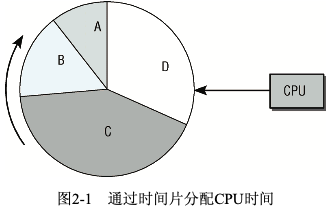

# Manage And Schedule Task

所有现代OS都能够同时运行若干进程,至少用户错觉上是这样.如果系统只有1个CPU,那么在给定时刻,只有1个程序可以运行.在多处理器系统中,可以真正并行运行的进程数目,取决于物理CPU的数目.

内核和处理器建立了多任务的错觉,即:可以并行做集中操作,这是通过以很短的时间间隔在系统运行的应用程序之间不停切换而做到的.由于切换间隔很短,使得用户感知不到短时间内的停滞,从而在感觉上认为计算机能够同时做几件事情.

这种系统管理方式引起了几个问题:

- 除非明确要求,否则应用程序不能彼此干扰.

	- 例:应用程序A的错误不能传播到应用程序B.由于Linux是一个多用户系统,它也必须确保程序不能读取或修改其他程序的内存,否则就很容易访问到其他用户的私有数据

- CPU时间必须在各种应用程序之间尽可能公平地共享,其中一些程序可能比其他程序更重要.

	- 这里我们抛开存储保护的问题不谈.但我们需要理解内核共享CPU时间的方法,以及如何在进程间切换.

想要解决内核共享CPU时间这个问题,需要2个任务:

1. 内核必须决定为各个进程分配多长时间,何时切换到下一个进程.

	- 那这里就有一个问题:哪个进程是下一个进程?这个决策和平台无关

2. 在内核从进程A切换到进程B时,必须确保进程B的执行环境与上一次撤销其处理器资源时完全相同

	- 例:处理器寄存器的内容和虚拟地址空间的结构必须和撤销前一致

这两个任务的执行是相对独立的.且第2项工作与处理器极度相关.不能只用C语言实现,还需汇编代码的帮助.

这两项任务时内核子系统的调度器部分负责.CPU时间如何分配取决于调度器策略,这与任务切换(在各个进程之间切换任务)机制完全无关.

## PART1. Process Priority

并非所有进程都具有相同的重要性.除进程优先级外,进程还有不同的关键度类别,以满足不同的需求.此处进行一个比较粗糙的划分,进程可以分为实时进程和非实时进程

- 硬实时进程

	- 硬实时进程有严格的时间限制,某些任务必须在指定的时限内完成
	- 硬实时进程的关键特征:必须在可保证的时间范围内得到处理
	- 但这并不表示它所要求的时间范围会比较短.而是系统必须保证绝不会超过某个时间范围,即使在不大可能或条件不利的情况下也是如此.
	- 主流的Linux内核不支持硬实时处理.一些修改版本(如RTLinux、Xenomai、RATI)为此提供了方案:Linux内核作为独立的"进程"运行,用以处理次重要的软件;实时工作在内核外部完成.只有当没有实时的关键操作执行时,内核才会运行.
	- 由于Linux是针对吞吐量优化,试图尽快处理常见情形,所以很难实现可保证的响应时间.2007年在降低内核整体延迟(指向内核发出请求到完成之间的时间间隔)方面取得了相当多的进展.相关工作包括:可抢占的内核机制、实时互斥量、完全公平调度器

- 软实时进程

	- 软实时进程是硬实时进程的一种弱化形式.尽管仍然需要快速得到结果,但可以接收稍微晚一点.
	- 例:对CD的写入就是一个软实时进程.CD写入进程接收的数据需要保持某一速率,因为数据是以连续流的形式写入介质的.若系统负载过高,数据流可能会暂时中断,这可能会导致CD不可用.(相比于硬实时进程失败的结果而言,CD不可用这一失败并不致命).但是CD写入进程在需要CPU时间时,应该能够得到保证,至少它的优先级是高于所有其他普通进程的

- 普通进程

	- 大多数进程是没有特定时间约束的普通进程,但仍然可以根据重要性来分配优先级
	- 例:冗长的编译或计算只需要极低的优先级,因为计算偶尔中断一两秒对计算或编译的结果不会造成任何的影响

用户不太可能注意到:交互式应用会尽快响应用户命令,因为用户很容易不耐烦.

下图是一个CPU时间分配的简图.进程的运行按时间片调度,分配给进程的时间片份额和进程的相对重要性有关.系统中时间的流动对应于圆盘的转动,而CPU则由圆周旁的"扫描器"表示.其最终结果是:尽管所有的进程都有机会运行,但重要的进程会比次要的进程得到更多的CPU时间.

这种方案称之为抢占式多任务处理(preemptive multitasking),各个进程都分配到一定的时间段可以执行.时间段到期后,内核会从进程收回控制权,让下一个进程运行,而不考虑上一个进程所执行的任务.被抢占进程的运行时环境(即所有CPU寄存器的内容和页表)都会保存起来,因此其执行结果不会丢失.在该进程恢复执行时,其进程环境可以完全恢复.时间片的长度会根据进程重要性(以及因此而分配的优先级)的不同而变化.图中分配给各个进程的时间片长度各有不同即说明了这一点.

注意,进程调度在内核开发者之间引起了非常热烈的讨论,尤其是提到挑选最合适的算法时.为调度器的质量确立一种定量标准这件事,可以讲即使可能也非常困难.另外调度器要满足Linux系统上许多不同工作负荷所提出的需求,这是非常具有挑战性的.自动化控制所需的小型嵌入式系统和大型计算机的需求非常不同,而多媒体系统的需求与前两者也颇为不同.实际上调度器的代码近年来已经重写了两次.

1. 在2.5系列内核开发期间,所谓的O(1)调度器代替了前一个调度器.该调度器一个特别的性质是:它可以在常数时间内完成其工作,且不依赖于系统上运行的进程数目.该设计从根本上打破了先前使用的调度体系结构.
2. 完全公平调度器(completely fair scheduler)在内核版本2.6.23开发期间合并进来.新的代码再一次完全放弃了原有的设计原则.
	
	- 例:前一个调度器中为确保用户交互任务响应快速,需要许多启 发式原则.而CFS的关键特性是:试图尽可能地模仿理想情况下的公平调度.
	- CFS不仅可以调度单个进程,还能够处理更一般性的调度实体(scheduling entity).
	- 例:CFS分配可用时间时,可以首先在不同用户之间分配,接下来在各个用户的进程之间分配

在关注内核如何实现调度之前,我们首先来讨论进程可能拥有的状态