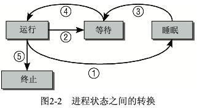

# PART2. Process Lifecycle

进程并不总是可以立即运行.有时候它必须等待来自外部信号源、不受其控制的事件(例:在文本编辑器中等待键盘输入).在事件发生之前进程无法运行.

当调度器在进程之间切换时,必须知道系统中每个进程的状态.将CPU时间分配到无事可做的进程显然是没有意义的.

进程在各个状态之间的转换也同样重要.例如,如果一个进程在等待来自外设的数据,那么调度器的职责是:一旦数据到达,则需要将进程的状态由等待改为可运行.

进程可能有以下几种状态:

- 运行:该进程此刻正在执行
- 等待:进程能够运行,但没有得到许可,因为CPU分配给了另一个进程.调度器可以在下一次任务切换时选择该进程
- 睡眠:进程正在睡眠无法运行,因为它在等待一个外部事件.调度器无法在下一次任务切换时选择该进程

系统将所有进程保存在一个进程表中,无论其状态是运行、睡眠或等待.但睡眠进程会特别标记出来,调度器会知道它们无法立即运行.睡眠进程会分类到若干队列中,因此它们可在适当的时间唤醒.例如在进程等待的外部事件已经发生时即可被唤醒

对于一个排队中的可运行进程,我们来考察其各种可能的状态转换.该进程已经就绪,但没有运行,因为CPU分配给了其他进程(因此该进程的状态是"等待").在调度器授予CPU时间之前.进程会一直保持该状态.在分配CPU时间之后,其状态改变为"运行"(路径④).

在调度器决定从该进程收回CPU资源时(可能的原因此处先不谈),过程状态从"运行"改变为"等待"(路径②),循环重新开始.实际上根据是否可以被信号中断,有两种"睡眠"状态.现在这种差别还不重要,但在更仔细地考察具体实现时其差别就相对重要了.

如果进程必须等待事件,则其状态从"运行"改变为"睡眠"(路径①).

但进程状态无法从"睡眠"直接改变为"运行".在所等待的事件发生后,进程先变回到"等待"状态(路径③),然后重新回到正常循环

在程序执行终止(例如用户关闭应用程序)后,过程状态由"运行"变为"终止"(路径⑤)

此处没有列出的一个特殊的进程状态是所谓的"僵尸"状态.顾名思义,这样的进程已经死亡,但仍然以某种方式活着.实际上,说这些进程死了,是因为其资源(内存、与外设的连接等等)已经释放,因此它们既没有能力也绝不可能再次运行.说它们仍然活着,是因为进程表中仍然有对应的表项.

僵尸是如何产生的?其原因在于UNIX操作系统下进程创建和销毁的方式.在两种事件发生时,程序将终止运行.

1. 程序必须由另一个进程或一个用户杀死
	- 通常是通过发送`SIGTERM`(`kill -15`)或`SIGKILL`(`kill -9`)信号来完成,这等价于正常地终止进程
2. 进程的父进程在子进程终止时必须调用或已经调用`wait4`
(这个命名就和`convertA2B`一样,4表示for)系统调用
	- 这相当于向内核证实:父进程已确认子进程的终结.该系统调用使得内核可以释放为子进程保留的资源

只有在第1个条件发生(程序终止)而第2个条件不成立的情况下(`wait4`)时,才会出现僵尸状态.在进程终止之后,其数据尚未从进程表删除之前,进程总是暂时处于"僵尸"状态.有时候(例:父进程编程极其糟糕,没有发出`wait`调用),僵尸进程可能稳定地寄身于进程表中,直至下一次系统重启.从进程工具(如`ps`或`top`)的输出中可以看到僵尸进程.因为残余的数据在内核中占据的空间极少,所以这几乎不是问题.

### 抢占式多任务处理

Linux进程管理的结构中还需要另外2种进程状态选项:用户态和内核态.这反映了所有现代CPU都有两种(至少2种)不同执行状态的事实,其中一种具有无限的权利,而另一种则受到各种限制.

例如,可能禁止访问某些内存区域.这种区别是建立封闭"隔离罩"的一个重要前提,它维持着系统中现存的各个进程,防止它们与系统其他部分相互干扰.

进程通常都处于用户态,只能访问自身的数据,无法干扰系统中的其他应用程序,甚至也不会感知到自身之外其他程序的存在.

如果进程想要访问系统数据或系统功能(系统功能管理着所有进程之间共享的资源,例如文件系统空间),则必须切换到内核态.显然这只能在受控情况下完成,否则所有建立的保护机制都是多余的,而且这种访问必须经由明确定义的路径.比如通过系统调用来实现用户态到内核态的切换.

从用户状态切换到核心态的第二种方法是通过中断,此时切换是自动触发的.系统调用是由用户应用程序有意调用的,而中断则不同,其发生或多或少是不可预测的.处理中断的操作,通常与中断发生时执行的进程无关.

例如,外部块设备向内存传输数据完毕会引发一个中断,但相关数据用于系统中运行的任何进程都是可能的.类似地,进入系统的网络数据包也是通过中断通知的.显然,该数据包也未必是用于当前运行的进程.因此,在Linux执行中断操作时,当前运行的进程不会察觉.

内核的抢占调度模型建立了一个层次结构,用于判断哪些进程状态可以被其他状态抢占.

- 普通进程总是可能被抢占,甚至是被其他进程抢占

	- 在一个重要进程变为可运行时(例如编辑器接收到了键盘输入),调度器可以决定是否立即执行编辑器进程,即使当前进程仍然处于正常运行状态.对于实现良好的交互行为和低系统延迟,这种抢占起到了重要作用.

- 如果进程处于内核态并正在处理系统调用,则系统中的其他进程无法夺取该进程的CPU时间.调度器必须等到系统调用执行结束,才能选择另一个进程执行,但中断可以中止系统调用(但实际上在进行重要的内核操作时,可以停用几乎所有的中断).
- 中断可以暂停处于用户状态和核心态的进程.中断具有最高优先级,因为在中断触发后需要尽快处理

在内核2.5开发期间,一个称之为**内核抢占(kernel preemption)**的选项添加到内核.该选项支持在紧急情况下切换到另一个进程,即使当前进程是处于内核态正在执行系统调用(中断处理期间不行).尽管内核会试图尽快执行系统调用,但对于依赖恒定数据流的应用程序来说,系统调用所需的时间仍然太长.内核抢占可以减少这样的等待时间,因而保证"更平滑的"程序执行.但该特性的代价是增加内核的复杂度,因为接下来有许多数据结构需要针对并发访问进行保护,即使在单处理器系统上也是如此.