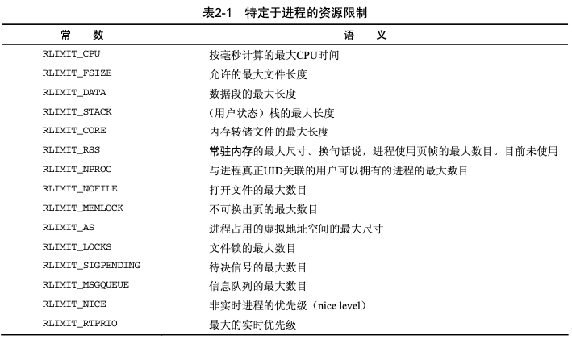
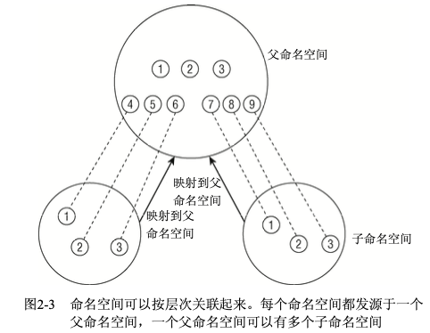
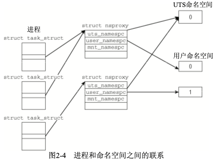

# PART3. Task Expression

Linux内核设计进程和程序的所有算法都围绕着一个名为[task_struct](https://github.com/torvalds/linux/blob/v2.6.24/include/linux/sched.h#L917)的数据结构建立,该结构定义在`include/sched.h`中.

以下是`task_struct`简化版本的代码:

```c
struct task_struct {
	/* -1:不可运行; 0:可运行 > 0:停止*/
	volatile long state;
	void *stack;
	atomic_t usage;
	/*每进程标志,下文定义*/
	unsigned long flags;
	unsigned long ptrace;
	/*大内核锁深度*/
	int lock_depth;
	
	int prio, static_prio, normal_prio;
	struct list_head run_list;
	const struct sched_class *sched_class;
	struct sched_entity se;
	
	unsigned short ioprio;
	
	unsigned int policy;
	cpumask_t cpus_allowed;
	unsigned int time_slice;
	
#if defined(CONFIG_SCHEDSTATS) || defined(CONFIG_TASK_DELAY_ACCT)
	struct sched_info sched_info;
#endif

	struct list_head tasks;
	
	/* ptrace_list/ptrace_children链表是ptrace能够看到当前进程的子进程列表 */
	struct list_head ptrace_children;
	
	struct list_head ptrace_list;
	
	struct mm_struct *mm, *active_mm;
	
/*进程状态*/
	struct linux_binfmt *binfmt;
	int exit_state;
	int exit_code, exit_signal;
	/*在父进程终止时发送的信号*/
	int pdeath_signal;
	
	unsigned int personality;
	unsigned did_exec:1;
	pid_t pid;
	pid_t tgid;
	
	/*
	* 分别是指向(原)父进程、最年轻的子进程、年幼的兄弟进程、年长的兄弟进程的指针
	* (p->father可以替换为p->parent->pid)
	*/
	struct task_struct *real_parent;	/* 真正的父进程(在被调试的情况下) */
	struct task_struct *parent; /* 父进程 */
	
	/*
	 * children/sibling链表外加当前调试的进程,构成了当前进程的所有子进程
	 */
	struct list_head children;	/* 子进程链表 */
	struct list_head sibling;	/* 连接到父进程的子进程链表 */
	struct task_struct *group_leader;	/* 线程组组长 */
	
	/* PID与PID散列表的联系 */
	struct pid_link pids[PIDTYPE_MAX];
	struct list_head thread_group;
	
	struct completion *vfork_done;	/* 用于vfork() */
	int __user *set_child_tid;		/* CLONE_CHILD_SETTID */
	int __user *clear_child_tid;	/* CLONE_CHILD_CLEARTID */
	
	unsigned int rt_priority;
	cputime_t utime, stime, utimescaled, stimescaled;
	unsigned long nvcsw, nivcsw; /* 上下文切换计数 */
	struct timespec start_time; 		/* 单调时间 */
	struct timespec real_start_time;	/* 自启动以来的时间 */
	
/* 内存管理器失效和页交换信息,这个有一点争论.它既可以看做是特定于内存管理器的,也可以看做是特定于线程的 */
	unsigned long min_flt, maj_flt;
	
	cputime_t it_prof_expires, it_virt_expires;
	unsigned long long it_sched_expires;
	struct list_head cpu_timers[3];
	
/* 进程身份凭据 */
	uid_t uid,euid,suid,fsuid;
	gid_t gid,egid,sgid,fsgid;
	struct group_info *group_info;
	kernel_cap_t   cap_effective, cap_inheritable, cap_permitted;
	
	unsigned keep_capabilities:1;
	struct user_struct *user;
	
	char comm[TASK_COMM_LEN]; /* 除去路径后的可执行文件名称
								-用[gs]et_task_comm访问(其中用task_lock()锁定它
								-通常由flush_old_exec初始化 */

/* 文件系统信息 */
	int link_count, total_link_count;
	
#ifdef CONFIG_SYSVIPC
/* ipc相关 */
	struct sysv_sem sysvsem;
#endif

/* 当前进程特定于CPU的状态信息 */
	struct thread_struct thread;
/* 文件系统信息 */
	struct fs_struct *fs;
/* 打开文件信息 */
	struct files_struct *files;
/* 命名空间 */
	struct nsproxy *nsproxy;
/* 信号处理程序 */
	struct signal_struct *signal;
	struct sighand_struct *sighand;
	
	sigset_t blocked, real_blocked;
	sigset_t saved_sigmask;		/* 用TIF_RESTORE_SIGMASK恢复 */
	struct sigpending pending;
	
	unsigned long sas_ss_sp;
	size_t sas_ss_size;
	int (*notifier)(void *priv);
	void *notifier_data;
	sigset_t *notifier_mask;
	
#ifdef CONFIG_SECURITY
	void *security;
#endif

/* 线程组跟踪 */
	u32 parent_exec_id;
   	u32 self_exec_id;
   	
/* 日志文件系统信息 */
	void *journal_info;
	
/* 虚拟内存状态 */
	struct reclaim_state *reclaim_state;

	struct backing_dev_info *backing_dev_info;

	struct io_context *io_context;

	unsigned long ptrace_message;
	siginfo_t *last_siginfo; /* 由ptrace使用 */
...
}
```

把它分解成各个部分,每个部分表示进程的一个特定方面:

- 状态和执行信息,如待决信号、使用的二进制格式(和其他系统二进制格式的任何仿真信息)、进程ID号(PID)、到父进程及其他有关进程的指针、优先级和程序执行有关的时间信息(如CPU时间)
- 有关已经分配的虚拟内存的信息
- 进程身份凭据,如用户ID、组ID以及权限(权限是授予进程的特定许可.权限使得进程可以执行某些本来只能由root进程执行的操作)等.可使用系统调用查询(或修改)这些数据
- 使用的文件(包括程序代码的二进制文件)以及进程所处理的所有文件的文件系统信息,这些也必须保存下来
- 线程信息用于记录该进程特定于CPU的运行时间数据(该结构的其余字段与所使用的硬件无关)
- 在与其他应用程序协作时所需的进程间通信有关的信息
- 在该进程所用的信号处理程序,用于响应到来的信号

此处讨论`task_struct`中比较重要的字段

`state`字段(`volatile long state`)指定了进程的当前状态,可使用以下值(这些值都是预处理器常数,同样[定义](https://github.com/torvalds/linux/blob/v2.6.24/include/linux/sched.h#L170)在该文件中)

```
#define TASK_RUNNING		0
#define TASK_INTERRUPTIBLE	1
#define TASK_UNINTERRUPTIBLE	2
#define TASK_STOPPED		4
#define TASK_TRACED		8
/* in tsk->exit_state */
#define EXIT_ZOMBIE		16
#define EXIT_DEAD		32
/* in tsk->state again */
#define TASK_DEAD		64
```

- `TASK_RUNNING`:表示进程处于可运行状态.但这不表示已经给该进程实际分配了CPU.该状态仅确保进程可以立即运行,无需等待外部事件.进程可能会一直等到调度器选中它为止.
- `TASK_INTERRUPTIBLE`:针对等待某事件或其他资源的睡眠进程而设置.在内核发送信号给该进程表明事件已经发生时,进程状态变为`TASK_RUNNING`,此时只要调度器选中该进程即可恢复执行
- `TASK_UNINTERRUPTIBLE`:表示因内核指示而停用的睡眠进程.它们不能由外部信号唤醒,只能由内核来唤醒
- `TASK_STOPPED`:表示进程特地停止运行.例如由调试器暂停
- `TASK_TRACED`:用于从停止的进程中,将当前被调试的进程(使用ptrace机制)与常规进程区分开

以下常量既用于`struct task_struct`的`state`字段,也用于`exit_state`字段.`exit_state`字段明确用于表示退出进程

- `EXIT_ZOMBIE`:表示进程处于僵尸状态
- `EXIT_DEAD`:表示`wait`系统调用已经发出,而进程完全从系统移除之前的状态.只有多个线程对同一个进程发出`wait`调用时,该状态才有意义

Linux提供**资源限制(resource limit,rlimit)**机制,对进程使用系统资源施加某些限制.该机制利用了`task_struct`中的[`rlim`数组](https://github.com/torvalds/linux/blob/v2.6.24/include/linux/sched.h#L490),元素类型为[`struct rlimit`](https://github.com/torvalds/linux/blob/v2.6.24/include/linux/resource.h#L42:8)

```c
struct signal_struct {
	...
	struct rlimit rlim[RLIM_NLIMITS];
	...
}
```

```
struct rlimit {
	unsigned long	rlim_cur;
	unsigned long	rlim_max;
};
```

这个设计非常通用,可以用来限制很多种不同的资源类型.

- `rlim_cur`:进程当前的资源限制,又叫**软限制(soft limit)**
- `rlim_max`:是`rlim_cur`的最大容许值,又叫**硬限制(hard limit)**

系统调用`setrlimit`来增减当前限制,但不能超出rlim_max指定的值.`getrlimits`用于检查当前限制.

`rlim`数组中的位置(即`rlimit rlim[RLIM_NLIMITS]`中的`RLIM_NLIMITS`)标识了受限制资源的类型,这也是内核需要定义预处理器常数,将资源与位置关联起来的原因.



注:由于Linux试图建立与特定的本地UNIX系统之间的二进制兼容性,因此不同体系结构的数值可能不同

因为限制涉及内核的各个不同部分,所以内核必须确认子系统遵守了相应限制.

如果某一类资源没有使用限制(几乎所有资源的默认设置),则将`rlim_max`设置为`RLIM_INFINITY`.有2种资源例外:

- 打开文件的数目(`RLIMIT_NOFILE`)默认值为1024
- 每个用户的最大进程数(`RLIMIT_NPROC`),定义为`max_threads / 2`.`max_threads`是一个全局变量,指定在把1/8的可用内存用于管理线程信息的情况下,可以创建的线程数量.在计算时,提前给定了20个线程的最小可能内存用量

`init`进程的限制在系统启动时立即生效.[定义](https://github.com/torvalds/linux/blob/v2.6.24/include/asm-generic/resource.h#L72)如下

```c
/*
 * boot-time rlimit defaults for the init task:
 */
#define INIT_RLIMITS							\
{									\
	[RLIMIT_CPU]		= {  RLIM_INFINITY,  RLIM_INFINITY },	\
	[RLIMIT_FSIZE]		= {  RLIM_INFINITY,  RLIM_INFINITY },	\
	[RLIMIT_DATA]		= {  RLIM_INFINITY,  RLIM_INFINITY },	\
	[RLIMIT_STACK]		= {       _STK_LIM,   _STK_LIM_MAX },	\
	[RLIMIT_CORE]		= {              0,  RLIM_INFINITY },	\
	[RLIMIT_RSS]		= {  RLIM_INFINITY,  RLIM_INFINITY },	\
	[RLIMIT_NPROC]		= {              0,              0 },	\
	[RLIMIT_NOFILE]		= {       INR_OPEN,       INR_OPEN },	\
	[RLIMIT_MEMLOCK]	= {    MLOCK_LIMIT,    MLOCK_LIMIT },	\
	[RLIMIT_AS]		= {  RLIM_INFINITY,  RLIM_INFINITY },	\
	[RLIMIT_LOCKS]		= {  RLIM_INFINITY,  RLIM_INFINITY },	\
	[RLIMIT_SIGPENDING]	= { 		0,	       0 },	\
	[RLIMIT_MSGQUEUE]	= {   MQ_BYTES_MAX,   MQ_BYTES_MAX },	\
	[RLIMIT_NICE]		= { 0, 0 },				\
	[RLIMIT_RTPRIO]		= { 0, 0 },				\
}
```

查看当前`rlimit`值:在`/proc/$PID/limits`中记录

例:查看当前进程的`rlimit`值

```
root@docker-test:/home/roach# cat /proc/self/limits
Limit                     Soft Limit           Hard Limit           Units     
Max cpu time              unlimited            unlimited            seconds   
Max file size             unlimited            unlimited            bytes     
Max data size             unlimited            unlimited            bytes     
Max stack size            8388608              unlimited            bytes     
Max core file size        0                    unlimited            bytes     
Max resident set          unlimited            unlimited            bytes     
Max processes             47559                47559                processes 
Max open files            1024                 1048576              files     
Max locked memory         67108864             67108864             bytes     
Max address space         unlimited            unlimited            bytes     
Max file locks            unlimited            unlimited            locks     
Max pending signals       47559                47559                signals   
Max msgqueue size         819200               819200               bytes     
Max nice priority         0                    0                    
Max realtime priority     0                    0                    
Max realtime timeout      unlimited            unlimited            us  
```

例:查看`docker`进程的`rlimit`值

```
root@docker-test:/home/roach# ps -ef|grep docker
root         778       1  0 07:33 ?        00:00:04 /usr/bin/dockerd -H fd:// --containerd=/run/containerd/containerd.sock
root        9345    7152  0 15:34 pts/0    00:00:00 grep --color=auto docker
root@docker-test:/home/roach# ls /proc/778/limits 
/proc/778/limits
root@docker-test:/home/roach# cat /proc/778/limits
Limit                     Soft Limit           Hard Limit           Units     
Max cpu time              unlimited            unlimited            seconds   
Max file size             unlimited            unlimited            bytes     
Max data size             unlimited            unlimited            bytes     
Max stack size            8388608              unlimited            bytes     
Max core file size        unlimited            unlimited            bytes     
Max resident set          unlimited            unlimited            bytes     
Max processes             unlimited            unlimited            processes 
Max open files            1048576              1048576              files     
Max locked memory         65536                65536                bytes     
Max address space         unlimited            unlimited            bytes     
Max file locks            unlimited            unlimited            locks     
Max pending signals       47559                47559                signals   
Max msgqueue size         819200               819200               bytes     
Max nice priority         0                    0                    
Max realtime priority     0                    0                    
Max realtime timeout      unlimited            unlimited            us  
```

## 3.1 进程类型

典型的UNIX进程包括:由二进制代码组成的应用程序、单线程(计算机沿单一路径通过代码,不会有其他路径同时运行)、分配给应用程序的一组资源(如内存、文件等).新进程是使用`fork`和`exec`系统调用产生的.

- `fork`:生成当前进程的一个相同副本,该副本称为**子进程**.原进程的所有资源都以适当的方式复制到子进程,因此该系统调用之后,原来的进程就有了2个独立的`task_struct`实例.这2个实例的联系包括:同一组打开文件、同样的工作目录、内存中同样的数据(2个实例各持有一份副本)等.此外二者毫无关联.
- `exec`:从一个可执行的二进制文件加载另一个应用程序,来替代当前运行的进程.因为`exec`并不创建新进程,所以必须首先使用`fork`来复制一个旧的程序,然后调用`exec`在系统上创建另一个应用程序
- `clone`:上述两个调用在所有UNIX操作系统变体上都是可用的,其历史可以追溯到很久之前.除此之外Linux还提供了`clone`系统调用.`clone`的工作原理基本上与`fork`相同,但新进程不是独立于父进程的,而是可以与父进程共享某些资源.可以指定需要共享和复制的资源种类(例:父进程的内存数据、父进程的打开文件、父进程的信号处理程序).`clone`用于实现**线程**,但仅仅该系统调用不足以做到这一点,还需要用户空间库才能提供完整的实现.线程库的例子有Linuxthreads和Next Generation Posix Threads等

## 3.2 命名空间

命名空间提供了虚拟化的一种轻量级方式,使得我们可以从不同的方面来查看运行系统的全局属性.

### 3.2.1 概念

传统上,在Linux以及其他衍生的UNIX变体中,许多资源是全局管理的.例:系统中的所有进程按照惯例是通过PID标识的,这意味着内核必须管理一个全局的PID列表.而且,所有调用者通过`uname`系统调用返回的系统相关信息(包括系统名称和有关内核的一些信息)都是相同的.

```
root@docker-test:/home/roach# uname -a
Linux docker-test 5.4.0-96-generic #109-Ubuntu SMP Wed Jan 12 16:49:16 UTC 2022 x86_64 x86_64 x86_64 GNU/Linux
```

用户ID的管理方式类似,也是各个用户通过一个全局唯一的UID号标识.

全局ID使得内核可以有选择地允许或拒绝某些特权.虽然UID为0的root用户基本上允许做任何事,但其他UID的用户则会受到限制.例如UID为`n`的用户,不允许杀死属于用户`m`的进程(`m≠n`).但这不能防止用户看到彼此,即用户`n`可以看到另一个用户`m`也在计算机上活动.只要用户只能操纵他们自己的进程,就没什么问题,因为没有理由不允许用户看到其他用户的进程.

但有些情况下,这种效果可能并不是想要的.

假设提供Web主机的供应商打算向用户提供Linux计算机的全部访问权限,包括root权限在内.传统上,这需要为每个用户准备一台服务器(很简单的道理,1个Linux只能有1个root用户,如果供应商的每个用户都想要root权限,那就只能给供应商的每个用户各自准备一台服务器).这代价过于高.使用KVM或者VMWware提供虚拟化环境是一种解决问题的方法,但资源分配做的不够好.计算机的各个用户都需要一个独立的内核,以及一份完全安装好的配套的用户层应用.

命名空间提供了一种不同的解决方案,所需资源较少.在虚拟化的系统中,一台物理机可以运行多个内核,可能是并行的多个不同的操作系统.而命名空间则只使用1个内核在1台物理机上运作,前述的所有全局资源(PID、UID等)都通过**命名空间**抽象起来.这使得可以将一组进程放置到容器中,各个容器彼此隔离.隔离可以使容器的成员与其他容器毫无关系.但也可以通过允许容器进行一定的共享,来降低容器之间的分隔.例如,容器可以设置为使用自身的PID集合,但仍然与其他容器共享部分文件系统.

本质上,命名空间建立了系统的不同**视图**.此前的每一项全局资源都必须包装到容器数据结构中,只有资源和包含资源的命名空间构成的二元组仍然是全局唯一的.虽然在给定容器的内部资源是自足的,但无法提供在容器外部具有唯一性的ID.



命名空间可以按层次关联起来,每个命名空间都发源于一个父命名空间,一个父命名空间可以有多个子命名空间.

命名空间可以组织为层次.此时我们考虑系统上有3个不同命名空间的情况,1个命名空间是父命名空间,衍生了2个子命名空间.假定容器模仿虚拟主机(VPS),其中每个容器必须看起来像是一台单独的Linux计算机.因此每个命名空间中都有一个自身的`init`进程,PID为1.其他进程的PID以递增次序分配,2个子命名空间中都有PID为1的`init`进程,以及PID分别为2和3的另外两个进程.由于相同的PID在系统中出现多次,所以PID号不是全局唯一的.

虽然子容器不了解系统中的其他容器,但父容器知道子命名空间的存在,也可以看到其中执行的所有进程.图中子容器的进程映射到父容器中,PID为4到9.尽管系统上有9个进程,但却需要15个PID来表示,因为一个进程可以关联到多个PID(同一个进程在父命名空间中PID为4,但是在子命名空间中PID为1).至于哪个PID是"正确"的,则依赖于具体的上下文.

如果命名空间包含的是比较简单的量,那么命名空间之间也可以是非层次的,例如UTS命名空间.在这种情况下,父子命名空间之间没有联系.

Linux系统对简单形式的命名空间的支持已经有很长一段时间了,主要是`chroot`系统调用.该方法可以将进程限制到文件系统的某一部分,因此是一种简单的命名空间机制.但真正的命名空间所能控制的功能远超文件系统视图.

新的命名空间可以用2种方法创建:

1. 在`fork`或`clone`系统调用创建新线程时,有特定的选项用于控制新进程的命名空间:

	- 与父进程共享命名空间
	- 建立新的命名空间

2. `unshare`系统调用将进程的某些部分从父进程分离,其中也包括命名空间.

在进程已经使用上述的两种机制之一从父进程命名空间分离后,从该进程的角度来看,改变全局属性不会传播到父进程命名空间,而父进程的修改也不会传播到子进程,至少对于简单的量来讲是这样.而对于文件系统来说情况就比较复杂了,因为文件系统的共享机制非常强大,因此带来了大量的可能性,具体情况讲到文件系统再说.

### 3.2.2 实现

命名空间需要实现2个部分:

1. 命名空间的每个子系统(例如`user_namespace`、`mnt_namespace等`)要提供数据结构,用于将全局组件包装到命名空间中
2. 将给定进程关联到命名空间的机制



全局属性要封装到命名空间中,每个进程关联到一个选定的命名空间(`task_struct`中的字段`nsproxy`,该字段类型为`*nsproxy`,表示1个进程关联到的命名空间).每个命名空间的子系统都必须提供一个数据结构,将所有通过命名空间形式提供的对象集中起来.[`struct nsproxy`](https://github.com/torvalds/linux/blob/v2.6.24/include/linux/nsproxy.h#L24)用于汇集指向各个命名空间的子系统的指针:

```c
struct nsproxy {
	atomic_t count;
	struct uts_namespace *uts_ns;
	struct ipc_namespace *ipc_ns;
	struct mnt_namespace *mnt_ns;
	struct pid_namespace *pid_ns;
	struct user_namespace *user_ns;
	struct net 	     *net_ns;
};
```

当前内核的以下范围可以感知到命名空间:

- `uts_namespace`:包含了运行内核的名称、版本、底层体系结构类型等信息.UTS是UNIX Timesharing System的简称
- `ipc_namespace`:与进程间通信(IPC)有关的信息(例如在命令行中与其他进程交互)
- `mnt_namespace`:已经装载的文件系统的视图
- `user_namespace`:保存用于限制每个用户资源使用的信息
- `net_ns`:包含所有网络相关的命名空间参数

由于在创建新进程时可使用`fork`建立一个新的命名空间,因此必须提供适当的标志用于控制这个建立行为.每个命名空间都有一个[对应的标志](https://github.com/torvalds/linux/blob/v2.6.24/include/linux/sched.h#L25):

```c
#define CLONE_NEWUTS		0x04000000	/* 创建新的utsname组 */
#define CLONE_NEWIPC		0x08000000	/* 创建新的IPC命名空间 */
#define CLONE_NEWUSER		0x10000000	/* 创建新的用户命名空间 */
#define CLONE_NEWPID		0x20000000	/* 创建新的PID命名空间 */
#define CLONE_NEWNET		0x40000000	/* 创建新的网络命名空间 */
```

每个进程都[关联](https://github.com/torvalds/linux/blob/v2.6.24/include/linux/sched.h#L1056)到自身的命名空间视图:

```c
struct task_struct { 
...
/* 命名空间 */
	struct nsproxy *nsproxy;
... 
}
```

因为使用了指针,所以多个进程可以共享一组子命名空间.这样,修改给定的命名空间,对所有属于该命名空间的进程都是可见的.

注意,对命名空间的支持必须在编译时启用,而且必须逐一指定需要支持的命名空间.但对命名空间的一般性支持总是会编译到内核中.这使得内核不管有无命名空间,都不必使用不同的代码.除非指定不同的选项,否则每个进程都会关联到一个默认命名空间,这样可感知命名空间的代码总是可以使用.但如果内核编译时没有指定对具体命名空间的支持,默认命名空间的作用则类似于不启用命名空间,所有属性相当于全局的.

[`init_nsproxy`](https://github.com/torvalds/linux/blob/v2.6.24/kernel/nsproxy.c#L27)定义了初始的全局命名空间,其中维护了指向各子系统初始的命名空间对象的指针:

```c
struct nsproxy init_nsproxy = INIT_NSPROXY(init_nsproxy);
```

[`INIT_NSPROXY`](https://github.com/torvalds/linux/blob/v2.6.24/include/linux/init_task.h#L73)

```c
#define INIT_NSPROXY(nsproxy) {						\
	.pid_ns		= &init_pid_ns,					\
	.count		= ATOMIC_INIT(1),				\
	.uts_ns		= &init_uts_ns,					\
	.mnt_ns		= NULL,						\
	INIT_NET_NS(net_ns)                                             \
	INIT_IPC_NS(ipc_ns)						\
	.user_ns	= &init_user_ns,				\
}
```

##### uts_namespace

[`uts_namespace`](https://github.com/torvalds/linux/blob/v2.6.24/include/linux/utsname.h#L40)几乎不需要特别的处理,因为它只有简单量,没有层次组织.

```c
struct uts_namespace {
	struct kref kref;
	struct new_utsname name;
};
```

[`kref`](https://github.com/torvalds/linux/blob/v2.6.24/include/linux/kref.h#L23)

```c
struct kref {
	atomic_t refcount;
};
```

`kerf`是一个嵌入的引用计数器,可用于跟踪内核中共有多少地方使用了`struct uts_namespace`的实例.`uts_namespace`所提供的属性信息本身包含在[`struct new_utsname`](https://github.com/torvalds/linux/blob/v2.6.24/include/linux/utsname.h#L24)中:

```c
struct new_utsname {
	char sysname[65];
	char nodename[65];
	char release[65];
	char version[65];
	char machine[65];
	char domainname[65];
};
```

各个字符串分别存储了系统的名称、内核发布版本、机器名等等.使用`uname`工具可以取得这些属性的当前值,也可以在`/proc/sys/kernel/`中看到:

```
root@docker-test:/home/roach# uname -a
Linux docker-test 5.4.0-96-generic #109-Ubuntu SMP Wed Jan 12 16:49:16 UTC 2022 x86_64 x86_64 x86_64 GNU/Linux
root@docker-test:/home/roach# cat /proc/sys/kernel/ostype
Linux
root@docker-test:/home/roach# cat /proc/sys/kernel/osrelease 
5.4.0-96-generic
```

初始设置保存在[`init_uts_ns`](https://github.com/torvalds/linux/blob/v2.6.24/init/version.c#L21)中.

```c
struct uts_namespace init_uts_ns = {
	.kref = {
		.refcount	= ATOMIC_INIT(2),
	},
	.name = {
		.sysname	= UTS_SYSNAME,
		.nodename	= UTS_NODENAME,
		.release	= UTS_RELEASE,
		.version	= UTS_VERSION,
		.machine	= UTS_MACHINE,
		.domainname	= UTS_DOMAINNAME,
	},
};
```

这些常数在内核中各处定义.例如`UTS_RELEASE`在`utsrelase.h`中定义,而这个文件是编译时通过顶层Makefile动态生成的;[`UTS_SYSNAME`](https://github.com/torvalds/linux/blob/v2.6.24/include/linux/uts.h#L7)则在`/include/linux/uts.h`中定义.

注意,UTS结构的某些部分不能修改.例如:把`sysname`字段值换成Linux以外的其他值是没有意义的,但改变`nodename`字段值(主机名)是可以的.

内核中创建新的UTS的功能由函数[`copy_utsname`](https://github.com/torvalds/linux/blob/v2.6.24/kernel/utsname.c#L44)实现.

```c
struct uts_namespace *copy_utsname(unsigned long flags, struct uts_namespace *old_ns)
{
	struct uts_namespace *new_ns;

	BUG_ON(!old_ns);
	get_uts_ns(old_ns);

	if (!(flags & CLONE_NEWUTS))
		return old_ns;

	new_ns = clone_uts_ns(old_ns);

	put_uts_ns(old_ns);
	return new_ns;
}
```

在某个进程调用`fork`并通过`CLONE_NEWUTS`标志指定创建新的`uts_namespace`实例时会调用该函数.此时生成先前`uts_namespace`的副本,当前进程的`nsproxy`实例内部的指针会指向这个副本.由于在读取或设置UTS属性值时,内核会保证总是操作特定于当前进程的`uts_namespace`实例,在当前进程修改UTS属性不会反映到父进程,而父进程的修改也不会传播到子进程.

##### user_namespace

`user_namespace`在数据结构管理方面和`uts_namespace`类似:在要求创建新的`user_namespace`时,则生成当前`user_namespace`的一份副本,然后关联到当前进程的`nsproxy`实例.但`user_namespace`自身的表示稍微复杂一些:

[`user_namespace`](https://github.com/torvalds/linux/blob/v2.6.24/include/linux/user_namespace.h#L12)

```c
struct user_namespace {
	struct kref		kref;
	struct hlist_head	uidhash_table[UIDHASH_SZ];
	struct user_struct	*root_user;
};
```

`kref`还是那个引用计数器,用于跟踪有多少地方用到了`user_namespace`实例.对命名空间中的每个用户,都有一个[`struct user_struct`](https://github.com/torvalds/linux/blob/v2.6.24/include/linux/sched.h#L528)实例负责记录该用户的资源消耗,各个势力可以通过散列表`uidhash_table`来访问.

`user_struct`的精确定义并不重要.只需知道该结构维护了一些统计数据(比如进程和打开的文件数目)等即可.

```c
struct user_struct {
	atomic_t __count;	/* reference count */
	atomic_t processes;	/* How many processes does this user have? */
	atomic_t files;		/* How many open files does this user have? */
	atomic_t sigpending;	/* How many pending signals does this user have? */
#ifdef CONFIG_INOTIFY_USER
	atomic_t inotify_watches; /* How many inotify watches does this user have? */
	atomic_t inotify_devs;	/* How many inotify devs does this user have opened? */
#endif
#ifdef CONFIG_POSIX_MQUEUE
	/* protected by mq_lock	*/
	unsigned long mq_bytes;	/* How many bytes can be allocated to mqueue? */
#endif
	unsigned long locked_shm; /* How many pages of mlocked shm ? */

#ifdef CONFIG_KEYS
	struct key *uid_keyring;	/* UID specific keyring */
	struct key *session_keyring;	/* UID's default session keyring */
#endif

	/* Hash table maintenance information */
	struct hlist_node uidhash_node;
	uid_t uid;

#ifdef CONFIG_FAIR_USER_SCHED
	struct task_group *tg;
#ifdef CONFIG_SYSFS
	struct kset kset;
	struct subsys_attribute user_attr;
	struct work_struct work;
#endif
#endif
};
```

更需要关注的问题是:每个`user_namespace`对其用户资源使用的统计,与其他命名空间完全无关,对root用户的统计也是如此.这是因为在克隆一个`user_namespace`时,为当前用户和root都创建了新的`user_struct`实例:

[`*clone_user_ns`](https://github.com/torvalds/linux/blob/v2.6.24/kernel/user_namespace.c#L29)

```c
static struct user_namespace *clone_user_ns(struct user_namespace *old_ns)
{
	struct user_namespace *ns;
	struct user_struct *new_user;
...

	ns = kmalloc(sizeof(struct user_namespace), GFP_KERNEL);
...

	/* 插入一个新用户  */
	ns->root_user = alloc_uid(ns, 0);
...

	/* 重置current->user为新用户 */
	new_user = alloc_uid(ns, current->uid);
...

	switch_uid(new_user);
	return ns;
}
```

`alloc_uid`是一个辅助函数,对当前命名空间中给定UID的一个用户,若该用户没有对应的`user_struct`实例,则分配一个新的实例.在为root和当前用户分别设置了`user_struct`实例后, `switch_uid`确保从现在开始将新的`user_struct`实例用于资源统计.本质上就是将`struct task_struct`的`user`字段指向新的`user_struct`实例.