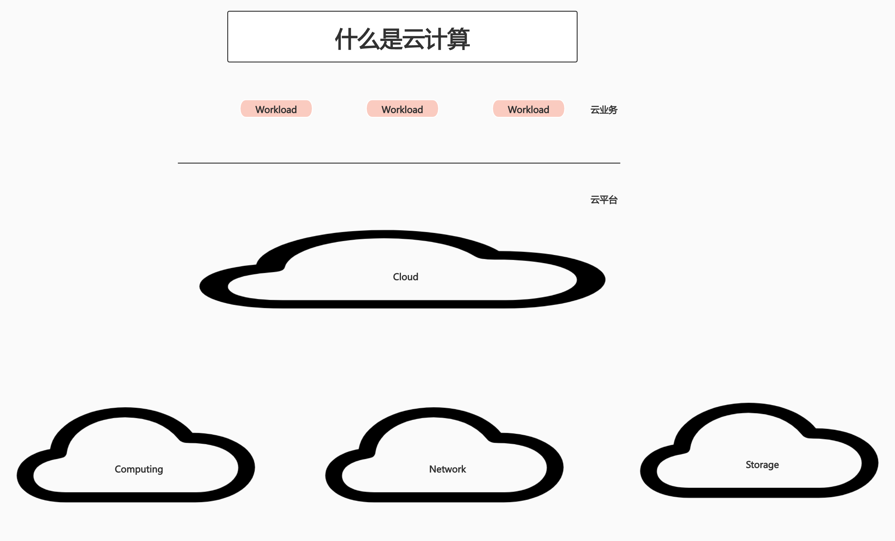
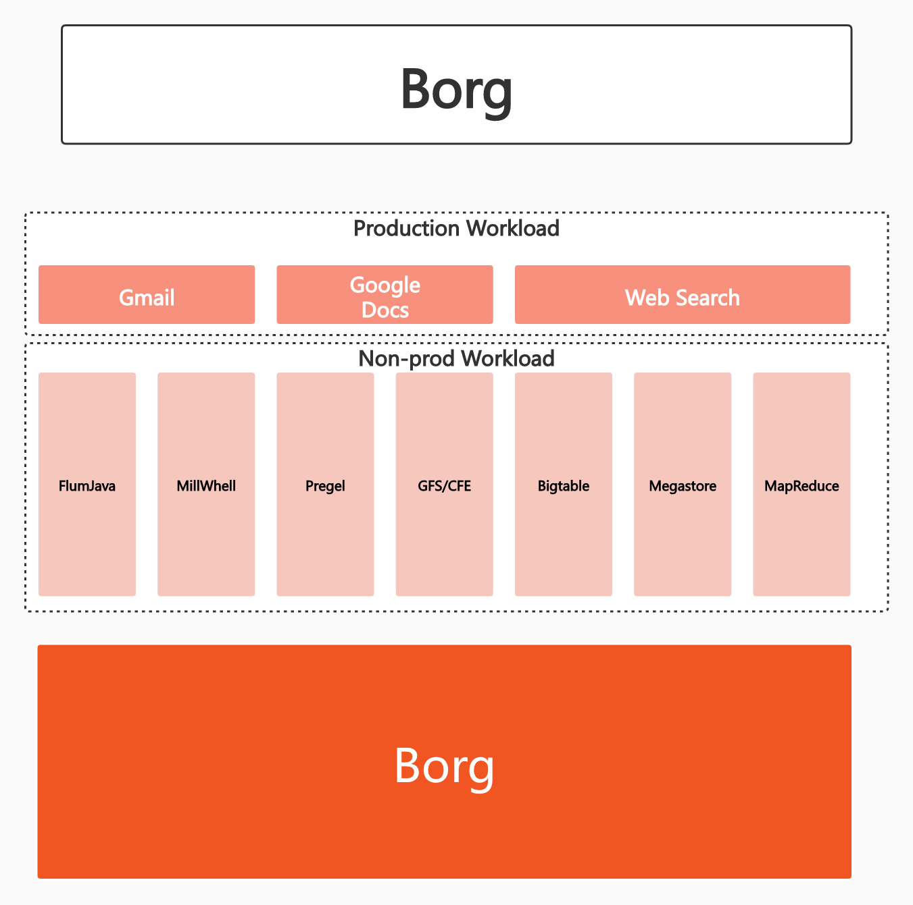
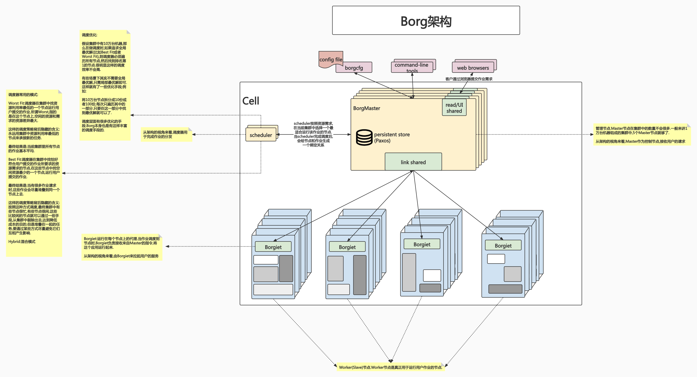
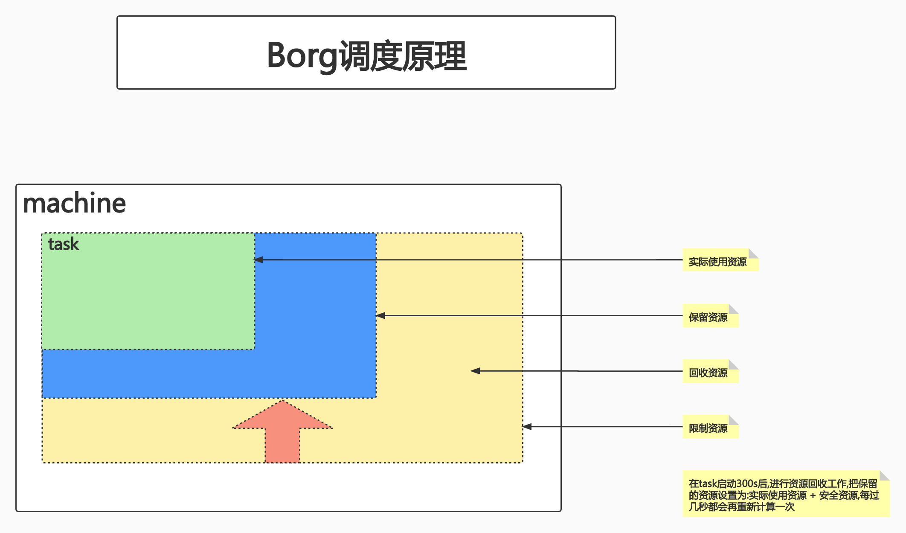
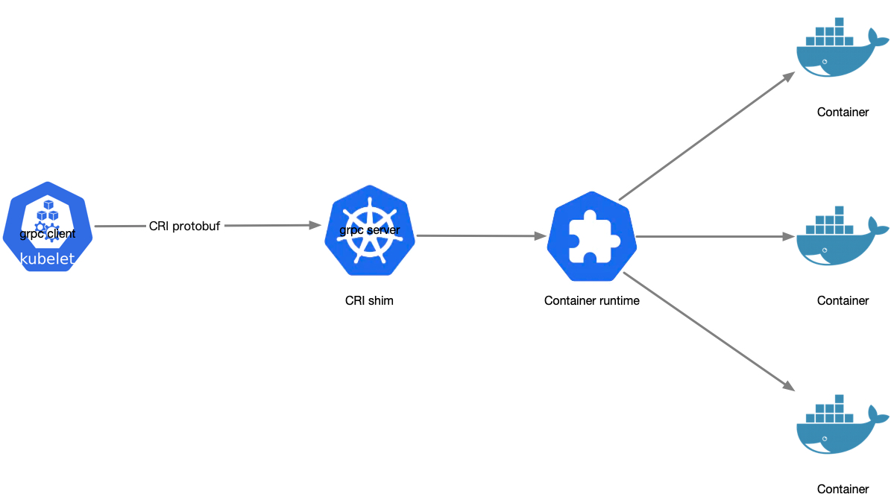

# class1:Kubernetes架构基础(一)

## PART1. 什么是云计算

### 1.1 云计算平台的分类

过去这段时间里,作业管理平台主要是2个方向:

1. 以Openstack为典型的虚拟化平台

	这种虚拟化平台可以认为是在很多台物理机上都安装Hypervisor,在Hypervisor上启动很多个虚拟机,再把这些虚拟机组成一个大的云平台.
	
	最终交付的产品形态:一个个的OS.在这个OS上去部署应用.因此后续工作(应用部署、应用升级、应用管理)与底层的基础云平台有着相对比较明显的界限.如:
	
	- IaaS:Infrastructure as a Service
	- PaaS:Platform as a Service
	- SaaS:Software as a Service

	
	虚拟机构建和业务代码部署是分离的.这种可变的基础架构使后续维护风险变大.

2. 以谷歌Borg为典型的基于进程的作业调度平台

## PART2. 谷歌Borg云计算平台

### 2.1 Google Borg简介

Borg是Google内部用于管理公司内部所有作业的一个作业管理平台.Kubernetes的前身即为Borg.

Borg并没有使用虚拟化技术.它的主要实现方式是使用轻量级的作业调度.也就是说Borg调度的是进程.

##### Borg使用到的容器技术

Borg本身利用了一些容器技术:

- Cgroup技术就是Google开源给Linux的
- Namespace的前身:`chroot`和`jail`
	但这也带来了一些缺点:
	
	- 对象之间的强依赖job和task是强包含关系,不利于重组
	- 所有容器共享IP,会导致端口冲突,隔离困难等问题
	- 为超级用户添加复杂逻辑,导致系统过于复杂

##### Borg主要支持的业务

Borg主要支持2类业务

1. Production Workload:生产业务.这类业务包括Gmail、Google Docs、Web Search等服务
2. Non-prod Workload:离线作业.比如AI方向、大数据方向的批处理作业

##### Production Workload和Non-prod Workload的区别

- Production Workload要求高可用,要求永远在线.它对资源的开销可能并不是特别大,也不是大量地消耗计算资源的服务(除非负载特别高,但负载一般也是有波峰波谷的,不是一直高负载的)
- Non-prod Workload一般用于批处理作业.对资源开销的要求会比较高(比如启动一个AI训练时,会疯狂的吃CPU/GPU).但Non-prod Workload对可用性的要求比Production Workload低.更直观的说,当你发起一个批处理作业时,你不能要求该作业马上返回结果,因为这个批处理作业本身需要时间(有可能是几分钟,几小时,几天甚至几个月).对于Non-prod Workload的时效性要求较低

Google通过把在线业务和离线业务混合部署的方式,使得整个数据中心的资源利用率有了一个本质提升.

但最终技术迭代引发了borg的换代需求.

##### Borg的特性

1. 物理资源利用率高

	通过在线业务和离线业务混部的方式,使得资源利用率有了很大的提升
	
2. 没有使用虚拟化技术,因此所有资源都可以用于计算
3. 服务器共享,在进程级别做隔离

	用轻量级的进程隔离来实现应用之间的隔离和封装

4. 应用高可用,故障恢复时间短
5. 调度策略灵活
6. 应用接入和使用方便,提供了完备的Job描述语言、服务发现、实时状态监控和诊断工具

	Borg是一个面向应用的平台,对应用接入友好.应用可以通过一些简单的配置就接入到这个平台中来

##### Borg的优势

1. 对外隐藏底层资源的管理和调度、故障处理等

	把底层的资源和调度抽象出来,对外隐藏.用户不需要管理平台的调度,只需要告知平台:我需要多少资源,跑多少个副本即可.剩下的事情交给平台做

2. 实现应用的高可靠和高可用
3. 足够弹性,支持应用跑在成千上万的机器上

### 2.2 Borg中的基本概念

##### Workload

Production Workload:在线任务,长期运行、对延时敏感、面向终端用户等.比如Gmail、Google Docs、Web Search服务等.

Non-prod Workload:离线任务,也称为批处理任务(Batch),比如一些分布式计算服务等.

这两种Workload由于业务特性不同,所以在Borg平台中,通过不同类型的Workload混播,达到资源利用率的提升.

举个例子,大家都是白天上网晚上睡觉.晚上网站的访问量小,资源就空出来了.这时就可以启动一些离线业务,做一些批处理的作业(AI训练、对账等重计算业务).这样可以把访问量波谷时的资源利用率拉起来,使得整个集群的经济性比较好.

##### Cell

1个Cell上跑1个集群管理系统Borg

通过定义Cell可以让Borg对服务器资源进行统一抽象,作为用户就无需知道自己的应用跑在哪台机器上,也不用关心资源分配、程序安装、依赖管理、健康检查及故障恢复等

我理解Cell就是Kubernetes中的Cluster.

举个例子,假设1个数据中心,现在有10万台机器.如果10万台机器被1个控制平面管理(也就是说这10万台机器组成了1个Cell),那很明显是不合理的.集群管理一定是有一些节点是管理节点,有一些节点是作业节点的.

10万台机器,如果被分成10个Cell,那就是10个集群,每个集群1万个节点.这样的话就把整个数据中心切割成了不同的故障域.假设其中1个Cell出现故障,其他Cell不受影响

##### Job和Task

用户以Job的形式提交应用部署请求.1个Job包含1个或多个相同的Task,每个Task运行相同的应用的应用程序,Task数量就是应用的副本数

每个Job可以定义属性、元信息和优先级,优先级设计到抢占式调度过程

我理解Job就是Kubernetes中的Pod;Task就是Kubernetes中的Container

Job是最终用户要在集群上运行的作业.1个Job有可能是多个Task的组合.Job除了包含Task外,还有属性、元信息和优先级信息.Job是Borg的调度单元.Job提交给Borg的调度系统,由Borg的调度器完成分配资源的工作.

Task即为进程.多个Task组成1个Job.

##### Naming

Borg的服务发现通过BNS(Borg Name Service)来实现.

例:`50.jfoo.ubar.cc.borg.google.com`

- `cc`:表示Cell名
- `ubar`:表示用户名
- `jfoo`:表示Job名
- `50`:表示当前服务是Job中的第几个Task

我理解Naming就是Kubernetes中的Service.

在Borg上运行的每一个服务,都可以通过Naming服务来暴露其域名,以便集群外部的流量来访问该服务.在微服务架构下,Micro Service A和Micro Service B之间,就可以通过这种Naming Service来完成微服务之间的调用.

综上所述,Borg其实隐含了3层含义:

1. 集群(计算资源)管理的概念.需要把多台机器组成一个集群(Cell),然后交给Borg的控制平面去管理
2. 作业的描述和调度的概念.因此Borg是一个作业调度平台
3. 服务发现的概念.Naming的存在是为了解决微服务之间的调用问题,因此Borg是一个服务发现平台

### 2.3 Borg架构

Borgmaster主进程:

- 处理客户端RPC请求,比如创建Job,查询Job等
- 维护系统组件和服务的状态,比如服务器、Task等
- 负责与Borglet通信

Scheduler进程:

- 调度策略

	- Worst Fit
	- Best Fit
	- Hybrid

- 调度优化

	- Score caching:当服务器或者任务的状态未发生变更或变更很少时,直接采用缓存数据,避免重复计算
	- Equivalence classes:调度同一Job下多个相同的Task时,只需计算1次
	- Relaxed randomization:引入一些随机性,即每次随机选择一些机器,只要符合需求的服务器数量达到一定值时,就可以停止计算,无需每次对Cell中的所有服务器feasibility(n. 可能性,可行性) checking

Borglet:

Borglet是部署在所有服务器上的Agent,负责接收Borgmaster进程的指令

### 2.4 应用高可用

高可用是在线业务的命.如果一个应用失去了高可用性,那它就完全没有办法提供稳定的在线服务,这个后果是不可承受的.现在人们之所以用Kubernetes平台,就是因为它对高可用的场景做了很丰富的支持.

- 被抢占的non-prod任务放回pending queue,等待重新调度

	在线业务应该永远保证其高可用,这是第一目标.因此当在线业务对资源有需求时,这种需求应该优先保证.所以Borg在这方面做了一些事情:当在线业务有资源需求时(例如要部署一个在线业务,或者要扩容一个在线业务),Borg就会为这个在线业务做调度.假设调度时,集群中已经没有可用资源了,Borg会去杀离线业务.也就是把离线业务的资源抢过来给在线业务,让在线业务先跑.
	
	但是离线业务也没有直接丢弃,而是把这个离线业务放回pending queue中,等到有资源时再重新跑.
	
	这样既保证了在线业务的高可用,又保证了离线业务的作业不会丢失,不会处于异常状态.

- 多副本应用跨故障域部署.所谓故障域有大有小,比如相同机器、相同机架或者相同电源插座等,一挂全挂

	Borg提供了一些能力,来支持跨地域的、跨故障域的部署.高可用往往通过冗余部署来实现.
	
	举个例子,常态下1个服务只有1个副本.当这个副本出现故障时,就意味着这个服务不可用了.想要保持这个服务高可用,多部署几份,在这几份前面配个负载均衡即可.
	
	假设所有的冗余都部署在了同一台机器上,那么当这台机器出现故障时,冗余部署就失去了意义.因此Borg提供了一个跨故障域(包括跨节点、跨机架、跨可用区、跨数据中心等)的多副本部署能力.

- 对于类似服务器或操作系统升级的维护操作,避免大量服务器同时进行
- 支持幂等性,支持客户端重复操作

	幂等:针对一个程序,给定其同样的输入,让该程序运行N次,该程序返回的N个结果是一样的,则称该程序是幂等的;若返回结果不同,则该程序就不是幂等的.
	
	那如何保证幂等?
	
	1. 要有一个用于处理输入的逻辑
	2. 输入尽可能是一个声明式的输入.所谓声明式的输入,指的是尽可能地声明它是什么,而非输入指令、动作.因为指令、动作有可能不是幂等的

	Borg支持声明式的输入.例如:声明一个作业,声明时定义好该作业需要的资源、要运行的应用等信息.那么这样的一个声明式指令无论发送多少次,其最终执行的结果都是一样的.

- 当服务器状态变为不可用时,要控制重新调度任务的速率.因为Borg无法区分是节点故障还是出现了短暂的网络分区.如果是网络分区,则等待网络恢复更利于保障服务的可用性
- 当某种"任务@服务器"的组合出现故障时,下次重新调度时,避免这种组合再次出现,因为极大可能会再次出现相同的故障
- 记录详细的内部信息,便于故障排查和分析
- 保障应用高可用的关键性设计原则:无论何种原因,即使Borgmaster或者Borglet挂掉、失联,都不能杀掉正在运行的服务(Task)

### 2.5 Borg系统自身高可用

- Borgmaster组件多副本设计

	Borgmaster组件多副本是为了保障Borg自身的高可用.无论是数据存储的高可用,还是Borgmaster这个控制平面的高可用,Borg都要保证.

- 采用一些简单和底层(low-level)的工具来部署Borg系统实例,避免引入过多的外部依赖
- 每个Cell的Borg均独立部署,避免不同Borg系统相互影响

	每个Cell独立部署,这样保证了整个数据中心的高可用.1个Cell坏了其他的Cell还活着,这样故障的Cell就成为了一个局部的故障.这个故障也只影响到了坏掉的Cell所管理的节点.换言之就是通过Cell将整个数据中心划分成了不同的故障域
	
### 2.6 资源利用率

- 通过将在线任务(prod)和离线任务(non-prod, Batch)混合部署,空闲时离线任务可以充分利用计算资源;繁忙时在线任务通过抢占的方式保证优先得到执行,合理地利用资源
- 98%的服务实现了混部

	通过混部的方式,使得资源的利用率非常的高.如果1个节点上只跑在线服务,那一定会出现的问题是:业务波谷的资源是空闲的.所以为了节省整个数据中心的成本,应该遵循这种混部的部署方式.

- 90%的服务器中报了超过25个Task和4500个线程
- 在一个中等规模的Cell中,在线任务和离线任务独立部署比混合部署所需的服务器数量多出月20%~30%.简单算一笔账,Google的服务器数量在千万级别,按20%算也是百万级别,大概能剩下的服务器采购费用就是百亿级别,这还不包括省下的机房等基础设施和电费等费用

### 2.7 Borg的调度原理

很多人用云平台,都会有一个理想化的、先入为主的需求.比如一个业务开发人员,他的主要目标除了写好业务逻辑外,根本的核心需求就是业务的高可用.

想要达到这个目标,第一:代码要足够健壮.第二,要为服务预留足够的资源.至于到底预留多少才算是预留了"足够"的资源,这就是一个可以深入讨论的点了.

一般的做法可以先做个压测.先限网,TPS(Transactions Per Second,每秒传输的事务处理个数,即服务器每秒处理的事务数)为10,压测100次,查看资源的使用情况.那么这个资源使用情况就已经是基于10倍的请求量得出的结果了.

之后在申请资源时,按照这个结果申请资源.因为业务高峰期时要保证资源是足够的,所以开发人员都会尽可能多地去申请资源.多申请资源就会多占用资源,但常态下业务又达不到很高的资源利用率,最终很有可能的结果是:90%的资源都浪费掉了.

Borg实现了一种机制:允许用户申请资源,但是在任务启动后会不停地监控作业,确认作业真正使用的资源数量.如果Borg发现作业用到的资源远远小于申请时的资源,就会进行回收.`保留的资源数量 = (1 + 阈值) * 作业真实使用的资源`.将剩余的部分(即`申请的资源数量 - 保留的资源数量`)全都回收掉.这样就有效提升了整个集群的资源利用率.

换言之,用户可以声明很多的资源,但是当用户提交的作业达不到一定的利用率时,Borg会把用户声明的资源中的一部分回收走,交给其他作业使用.这样整个集群的资源利用率就提高了.

### 2.8 隔离性

安全性隔离:

- 早期使用`chroot`、`jail`,后期版本基于Namespace

	早期的iPhone越狱,其实就是`chroot`和`jail`

性能隔离:

- 采用基于Cgroup的容器技术实现
- 在线任务(prod)是延时敏感(latency-sensitive)型的,优先级高,而离线任务(non-prod、Batch)优先级低
- Borg通过不同优先级之间的抢占式调度来优先保障在线任务的性能,牺牲离线任务
- Borg将资源分成两类:

	- compressible:可压榨的,CPU是可压榨资源,资源耗尽不会导致进程终止

		CPU是一个分时复用的资源,对于一个给定型号的CPU,它的CPU时间片数量是固定的.CPU时间片按照调度器的策略分配,每个进程最终都会分到一些时间片.当竞争较大的时候,所有进程都按照预先分配的比率,少分配一些时间片.这样的结果是:进程的性能会慢一些,但整个程序不会退出
	
	- non-compressible:不可压榨的,内存是不可压榨资源,资源耗尽会导致进程被终止

		1台机器的内存大小是固定的(此处假设主板上所有的内存槽都插满了),如果所有进程都在疯狂占用内存,那最终的结果只能是:没有可以分配的内存了.磁盘也属于不可压榨资源.不可压榨资源在利用率上一旦到达了边界,OS就只能终止进程.

## PART3. 什么是Kubernetes(K8S)

Kubernetes是谷歌开源的容器集群管理系统,是谷歌多年大规模容器管理技术Borg的开源版本,主要功能包括:

- 基于容器的应用部署、维护和滚动升级
- 负载均衡和服务发现
- 跨机器和跨地区的集群调度
- 自动伸缩
- 无状态服务和有状态服务
- 插件机制保证扩展性

### 3.1 命令式(Imperative) VS 声明式(Declarative)

##### 命令式系统关注如何做

在软件工程领域,命令式系统是写出解决某个问题、完成某个任务或者达到某个目标的明确步骤.此方法明确写出系统应该执行某指令,并且期待系统返回期望结果

命令式系统通常是微管理的系统,因为要随时观察目标的变化.发一条指令给目标,让目标按照指令去做.目标按照指令做完了之后再返回,之后再发下一条指令给目标,以此类推.

这种系统的特性是返回较快.可以基于上一次返回的结果判断下一次做出何种指示.

##### 声明式系统关注做什么

在软件工程领域,声明式系统指程序代码描述系统应该做什么而不是怎么做.仅限于描述要达成什么目的,至于如何达成这个目的,交给系统解决

声明式系统中间有一个运转的过程.调用者(用户)只能告知系统自己想要达到的目标,对于中间执行的过程,调用者不加干涉.

### 3.2 声明式系统规范

命令式:

- 我要你做什么,怎么做,请严格按照我说的做

声明式:

- 我需要你帮我做点事,但是我只告诉你我需要你做什么,而非你应该如何做
- 直接声明:我直接告诉你我需要什么
- 间接声明:我不直接告诉你我的需求,我会把我的需求放在特定的地方,请在方便的时候拿出来处理

幂等性:

- 状态固定,每次我要你做的事,请给我返回相同的结果

面向对象的:

- 把一切抽象成对象

声明式系统适用于微服务架构.很多时候调用者发送一个请求给Server端时,调用者是不知道一个Server端到底要针对这个请求处理多久的.如果按照交互式的系统,那么客户端就阻塞在发送请求之后了.整个系统的并发能力就会很差.