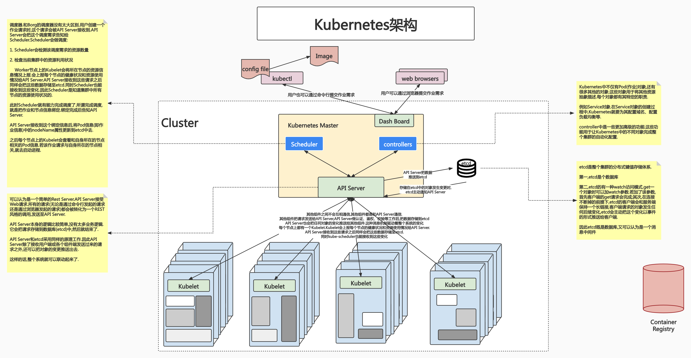
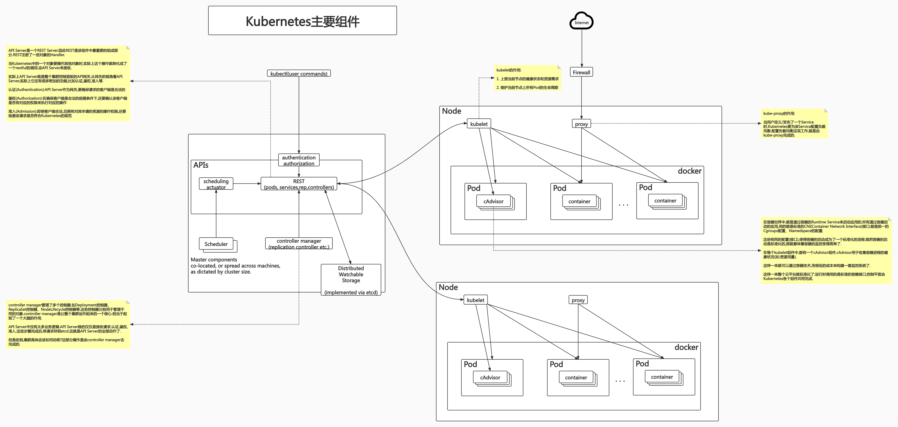
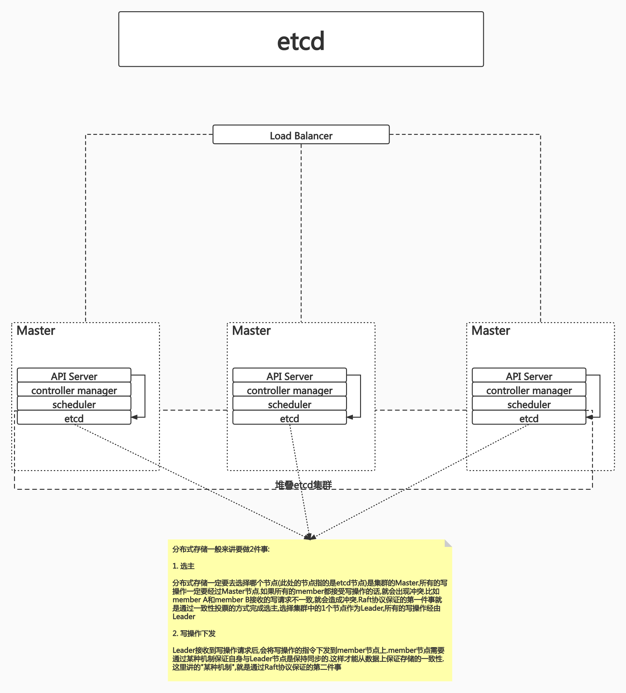
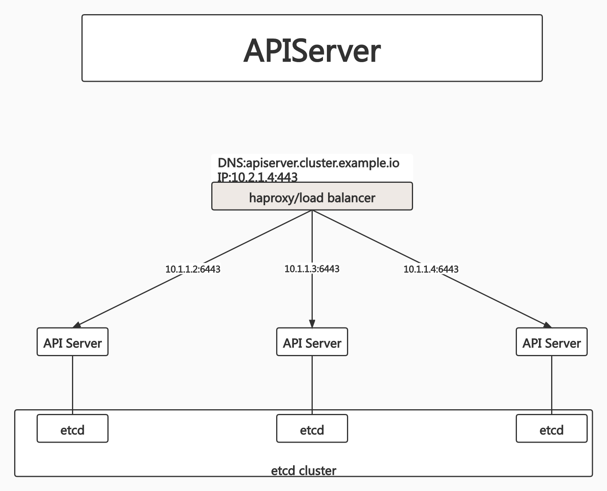
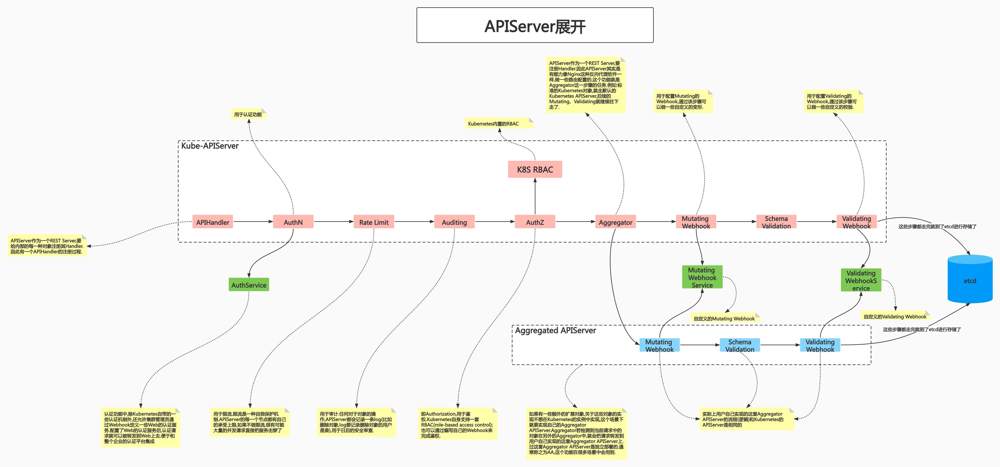
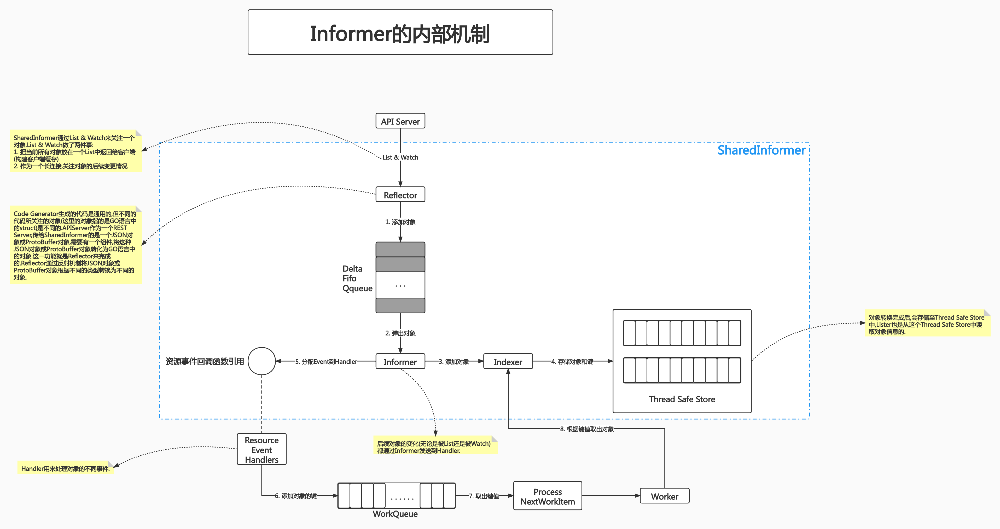
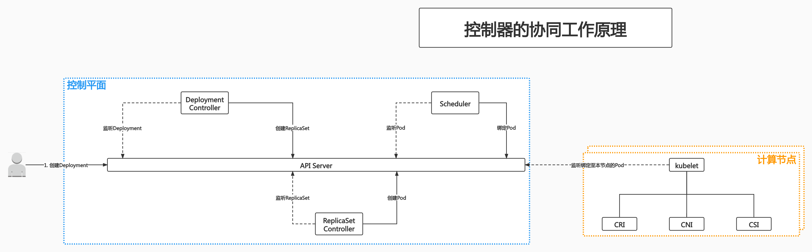
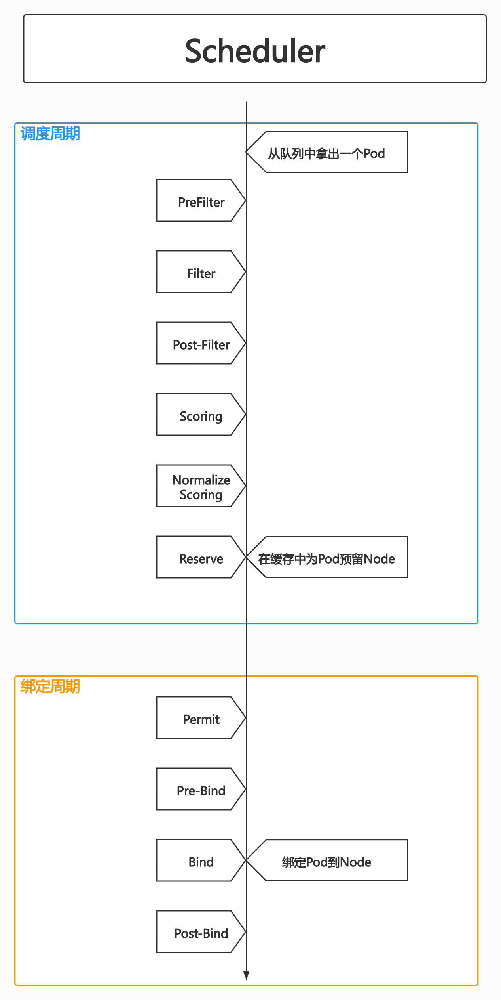
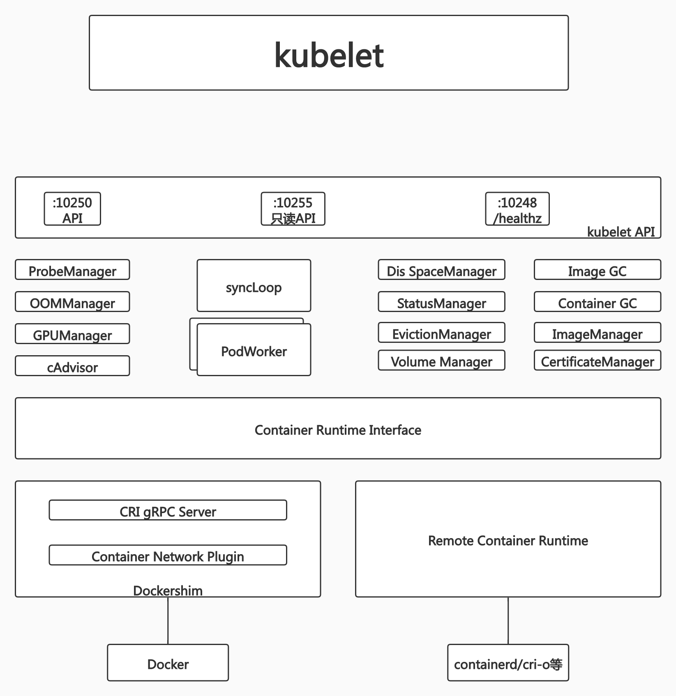
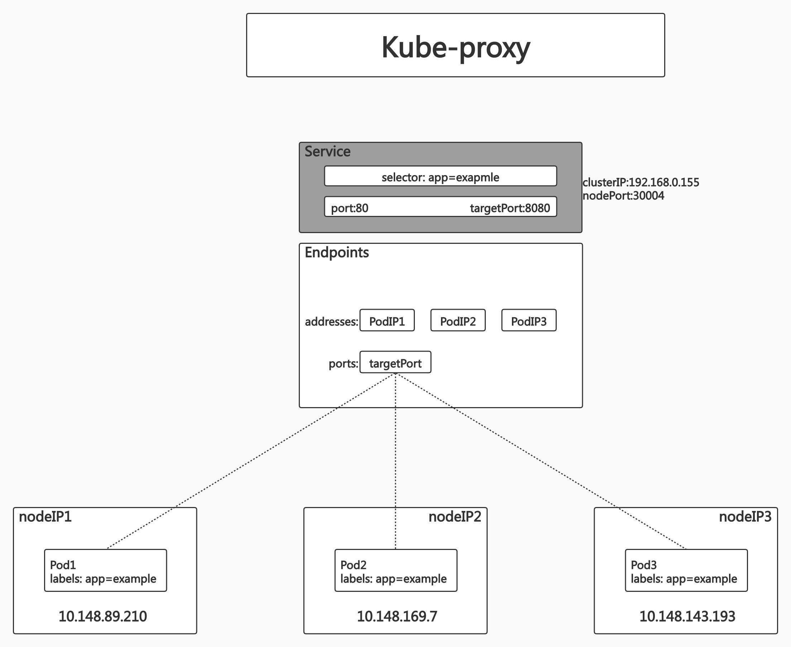

# class2:Kubernetes架构基础(二)

## PART1. Kubernetes概述

Kunbernetes遵循了声明式系统的原则.Kunbernetes是构建与声明式系统之上的一个云管理平台.Kunbernetes中所有代管的对象(计算节点、服务、作业等)全部抽象成了标准API.这之后,就把这些API作为统一的规范,和一些大厂联合背书,让大家都遵循同样的规则下场玩游戏.这样一来,这套API就成了事实标准.这意味着所有下场玩游戏的玩家,都只能向这套标准靠拢.把目光看向未来,标准已然存在,标准可以演进,但标准很难被取代.取代一个已存在的标准,这件事可以称之为"革命".

### 1.1 Kubernetes:声明式系统

Kunbernetes的所有管理能力构建在对象抽象的基础上,核心对象包括:

##### Node

计算节点的抽象,用来描述计算节点的资源抽象、健康状态等.

Kunbernetes在很多层面和Borg是相似的.Node就相当于是Borg中的Worker节点.Node的存在意味着Kunbernetes在集群管理这个层面和Borg是相似的

##### Namespace

资源隔离的基本单位,可以简单理解为文件系统中的目录结构

##### Pod

用来描述应用实例,包括镜像地址、资源需求等.是Kunbernetes中最核心的对象,也是打通应用和基础架构的秘密武器

Pod用来描述作业,是Kunbernetes的基本调度单元.用户可以在Pod中定义:该Pod要运行的容器镜像、该Pod需要的资源数量等.Pod的存在,清晰的描述了作业的资源需求和作业最终要运行的应用

Pod的存在意味着Kunbernetes在作业调度的层面和Borg是相似的

##### Service

服务如何将应用发布成服务,本质上是负载均衡和域名服务的声明

Kunbernetes中允许用户定义Service对象.Service对象一旦被创建成功,Kunbernetes就会完成负载均衡的配置以及域名配置.Service类似于Borg中的Naming Service

Service的存在意味着Kunbernetes在服务发现这一层面和Borg是相似的.

### 1.2 Kubernetes的架构

Kubernetes采用和Borg类似的架构.



### 1.3 Kunbernetes的主要组件



## PART2. Kunbernetes的主节点与工作节点

### 2.1 Kubernetes的主节点

和Borg一样,假设集群中有5000个节点,选2~3台节点作为管理节点即可.管理节点上运行的就是控制平面的组件.

##### API Server(API服务器)

这是Kubernetes控制面板中唯一带有用户可访问API以及用户可交互的组件.API Server会暴露一个RESTful的Kubernetes API并使用JSON格式的清单文件(manifest files)

##### Cluster Data Store(集群的数据存储)

Kubernetes使用etcd存储数据.这是一个强大的、稳定的、高可用的键值存储,被Kubernetes用于长久储存所有的API对象

##### Controller Manager(控制管理器)

被称为"kube-controller manager".它运行着所有处理集群日常任务的控制器.包括了节点控制器、副本控制器、断点(endpoint)控制器以及服务账户等

##### Scheduler(调度器)

调度器会监控新建的pods(一组或一个容器)并将其分配给节点

其实Scheduler和Controller没有本质区别,只是它专职做调度.

##### 在主节点上查看上述组件

使用kubeadm安装的集群,默认把控制平面的组件安装到了kube-system命名空间下.

```
soap@k8s-master:~$ kubectl get pod -n kube-system
NAME                                 READY   STATUS    RESTARTS       AGE
coredns-55dffbd598-8rcfq             1/1     Running   1 (3d8h ago)   6d7h
coredns-55dffbd598-w4c4z             1/1     Running   1 (3d8h ago)   6d7h
etcd-k8s-master                      1/1     Running   1 (3d8h ago)   6d7h
kube-apiserver-k8s-master            1/1     Running   1 (3d8h ago)   6d7h
kube-controller-manager-k8s-master   1/1     Running   1 (3d8h ago)   6d7h
kube-flannel-ds-7w96q                1/1     Running   1 (3d8h ago)   6d1h
kube-flannel-ds-dxwnk                1/1     Running   1 (3d8h ago)   6d1h
kube-flannel-ds-tx967                1/1     Running   1 (3d8h ago)   6d1h
kube-proxy-5wvtm                     1/1     Running   1 (3d8h ago)   6d1h
kube-proxy-n52bm                     1/1     Running   1 (3d8h ago)   6d1h
kube-proxy-qzxsp                     1/1     Running   1 (3d8h ago)   6d7h
kube-scheduler-k8s-master            1/1     Running   1 (3d8h ago)   6d7h
```

所谓核心控制组件,指的是如果这些组件未安装或安装后无法正常运行,则整个控制平面的API网关处于不就绪的状态.更直白一点的讲:这些组件起不来,就会导致API Server起不来.API Server起不来,用户发送的请求就没有接收者了.为了让集群的基本功能能够正常使用,至少API Server、etcd、Controller Manager和Scheduler是要正常运行的.

### 2.2 Kubernetes的工作节点

##### kubelet

负责调度到对应节点的Pod的生命周期管理,执行任务并将Pod状态报告给主节点的渠道,通过容器运行时(拉取镜像、启动和停止容器等)来运行这些容器.它还会定期执行被请求的容器的健康探测程序

##### kube-proxy

负责节点的网络,在主机上维护网络规则并执行连接转发.它还负责对正在服务的pods进行负载均衡.

## PART3. etcd

etcd是CoreOS基于Raft开发的分布式key-value存储,可用于服务发现、共享配置以及一致性保障(如数据库选主、分布式锁等)

- 基本的key-value存储
- 监听机制
- key的过期以及续约机制,用于监控和服务发现
- 原子CAS和CAD,用于分布式锁和leader选举



### 3.1 直接访问etcd的数据

安装好Kubernetes后,可以直接在Master节点上进入etcd的Pod中,查看etcd中保存的数据.

- step1. 在Master节点上指定查看命名空间kube-system下的Pod信息

```
soap@k8s-master:~$ kubectl get pods -n kube-system
NAME                                 READY   STATUS    RESTARTS        AGE
...
etcd-k8s-master                      1/1     Running   1 (3d23h ago)   6d22h
...
```

可以看到有一个名为`etcd-k8s-master`的Pod

- step2. 在Master节点上进入运行etcd的容器内部

```
soap@k8s-master:~$ kubectl -n kube-system exec -it etcd-k8s-master -- sh
sh-5.1# 
```

- step3. 查询数据

	 - step3.1 查询所有以`/`开头的key的名称

		`etcdctl`是etcd提供的命令行工具.
		
		```
		sh-5.1# etcdctl --endpoints https://localhost:2379 --cert /etc/kubernetes/pki/etcd/server.crt --key /etc/kubernetes/pki/etcd/server.key --cacert /etc/kubernetes/pki/etcd/ca.crt get --keys-only --prefix /
		/registry/apiregistration.k8s.io/apiservices/v1.
		
		/registry/apiregistration.k8s.io/apiservices/v1.admissionregistration.k8s.io
		
		/registry/apiregistration.k8s.io/apiservices/v1.apiextensions.k8s.io
		
		/registry/apiregistration.k8s.io/apiservices/v1.apps
		
		/registry/apiregistration.k8s.io/apiservices/v1.authentication.k8s.io
		
		/registry/apiregistration.k8s.io/apiservices/v1.authorization.k8s.io
		
		/registry/apiregistration.k8s.io/apiservices/v1.autoscaling
		
		/registry/apiregistration.k8s.io/apiservices/v1.batch
		
		/registry/apiregistration.k8s.io/apiservices/v1.certificates.k8s.io
		
		/registry/apiregistration.k8s.io/apiservices/v1.coordination.k8s.io
		
		/registry/apiregistration.k8s.io/apiservices/v1.discovery.k8s.io
		
		/registry/apiregistration.k8s.io/apiservices/v1.events.k8s.io
		
		/registry/apiregistration.k8s.io/apiservices/v1.networking.k8s.io
		
		/registry/apiregistration.k8s.io/apiservices/v1.node.k8s.io
		
		/registry/apiregistration.k8s.io/apiservices/v1.policy
		
		/registry/apiregistration.k8s.io/apiservices/v1.rbac.authorization.k8s.io
		
		/registry/apiregistration.k8s.io/apiservices/v1.scheduling.k8s.io
		
		/registry/apiregistration.k8s.io/apiservices/v1.storage.k8s.io
		
		/registry/apiregistration.k8s.io/apiservices/v1beta1.batch
		
		/registry/apiregistration.k8s.io/apiservices/v1beta1.discovery.k8s.io
		
		/registry/apiregistration.k8s.io/apiservices/v1beta1.events.k8s.io
		
		/registry/apiregistration.k8s.io/apiservices/v1beta1.flowcontrol.apiserver.k8s.io
		
		/registry/apiregistration.k8s.io/apiservices/v1beta1.node.k8s.io
		
		/registry/apiregistration.k8s.io/apiservices/v1beta1.policy
		
		/registry/apiregistration.k8s.io/apiservices/v1beta1.storage.k8s.io
		
		/registry/apiregistration.k8s.io/apiservices/v2beta1.autoscaling
		
		/registry/apiregistration.k8s.io/apiservices/v2beta2.autoscaling
		
		/registry/clusterrolebindings/cluster-admin
		
		/registry/clusterrolebindings/flannel
		
		/registry/clusterrolebindings/kubeadm:get-nodes
		
		/registry/clusterrolebindings/kubeadm:kubelet-bootstrap
		
		/registry/clusterrolebindings/kubeadm:node-autoapprove-bootstrap
		
		/registry/clusterrolebindings/kubeadm:node-autoapprove-certificate-rotation
		
		/registry/clusterrolebindings/kubeadm:node-proxier
		
		/registry/clusterrolebindings/system:basic-user
		
		/registry/clusterrolebindings/system:controller:attachdetach-controller
		
		/registry/clusterrolebindings/system:controller:certificate-controller
		
		/registry/clusterrolebindings/system:controller:clusterrole-aggregation-controller
		
		/registry/clusterrolebindings/system:controller:cronjob-controller
		
		/registry/clusterrolebindings/system:controller:daemon-set-controller
		
		/registry/clusterrolebindings/system:controller:deployment-controller
		
		/registry/clusterrolebindings/system:controller:disruption-controller
		
		/registry/clusterrolebindings/system:controller:endpoint-controller
		
		/registry/clusterrolebindings/system:controller:endpointslice-controller
		
		/registry/clusterrolebindings/system:controller:endpointslicemirroring-controller
		
		/registry/clusterrolebindings/system:controller:ephemeral-volume-controller
		
		/registry/clusterrolebindings/system:controller:expand-controller
		
		/registry/clusterrolebindings/system:controller:generic-garbage-collector
		
		/registry/clusterrolebindings/system:controller:horizontal-pod-autoscaler
		
		/registry/clusterrolebindings/system:controller:job-controller
		
		/registry/clusterrolebindings/system:controller:namespace-controller
		
		/registry/clusterrolebindings/system:controller:node-controller
		
		/registry/clusterrolebindings/system:controller:persistent-volume-binder
		
		/registry/clusterrolebindings/system:controller:pod-garbage-collector
		
		/registry/clusterrolebindings/system:controller:pv-protection-controller
		
		/registry/clusterrolebindings/system:controller:pvc-protection-controller
		
		/registry/clusterrolebindings/system:controller:replicaset-controller
		
		/registry/clusterrolebindings/system:controller:replication-controller
		
		/registry/clusterrolebindings/system:controller:resourcequota-controller
		
		/registry/clusterrolebindings/system:controller:root-ca-cert-publisher
		
		/registry/clusterrolebindings/system:controller:route-controller
		
		/registry/clusterrolebindings/system:controller:service-account-controller
		
		/registry/clusterrolebindings/system:controller:service-controller
		
		/registry/clusterrolebindings/system:controller:statefulset-controller
		
		/registry/clusterrolebindings/system:controller:ttl-after-finished-controller
		
		/registry/clusterrolebindings/system:controller:ttl-controller
		
		/registry/clusterrolebindings/system:coredns
		
		/registry/clusterrolebindings/system:discovery
		
		/registry/clusterrolebindings/system:kube-controller-manager
		
		/registry/clusterrolebindings/system:kube-dns
		
		/registry/clusterrolebindings/system:kube-scheduler
		
		/registry/clusterrolebindings/system:monitoring
		
		/registry/clusterrolebindings/system:node
		
		/registry/clusterrolebindings/system:node-proxier
		
		/registry/clusterrolebindings/system:public-info-viewer
		
		/registry/clusterrolebindings/system:service-account-issuer-discovery
		
		/registry/clusterrolebindings/system:volume-scheduler
		
		/registry/clusterroles/admin
		
		/registry/clusterroles/cluster-admin
		
		/registry/clusterroles/edit
		
		/registry/clusterroles/flannel
		
		/registry/clusterroles/kubeadm:get-nodes
		
		/registry/clusterroles/system:aggregate-to-admin
		
		/registry/clusterroles/system:aggregate-to-edit
		
		/registry/clusterroles/system:aggregate-to-view
		
		/registry/clusterroles/system:auth-delegator
		
		/registry/clusterroles/system:basic-user
		
		/registry/clusterroles/system:certificates.k8s.io:certificatesigningrequests:nodeclient
		
		/registry/clusterroles/system:certificates.k8s.io:certificatesigningrequests:selfnodeclient
		
		/registry/clusterroles/system:certificates.k8s.io:kube-apiserver-client-approver
		
		/registry/clusterroles/system:certificates.k8s.io:kube-apiserver-client-kubelet-approver
		
		/registry/clusterroles/system:certificates.k8s.io:kubelet-serving-approver
		
		/registry/clusterroles/system:certificates.k8s.io:legacy-unknown-approver
		
		/registry/clusterroles/system:controller:attachdetach-controller
		
		/registry/clusterroles/system:controller:certificate-controller
		
		/registry/clusterroles/system:controller:clusterrole-aggregation-controller
		
		/registry/clusterroles/system:controller:cronjob-controller
		
		/registry/clusterroles/system:controller:daemon-set-controller
		
		/registry/clusterroles/system:controller:deployment-controller
		
		/registry/clusterroles/system:controller:disruption-controller
		
		/registry/clusterroles/system:controller:endpoint-controller
		
		/registry/clusterroles/system:controller:endpointslice-controller
		
		/registry/clusterroles/system:controller:endpointslicemirroring-controller
		
		/registry/clusterroles/system:controller:ephemeral-volume-controller
		
		/registry/clusterroles/system:controller:expand-controller
		
		/registry/clusterroles/system:controller:generic-garbage-collector
		
		/registry/clusterroles/system:controller:horizontal-pod-autoscaler
		
		/registry/clusterroles/system:controller:job-controller
		
		/registry/clusterroles/system:controller:namespace-controller
		
		/registry/clusterroles/system:controller:node-controller
		
		/registry/clusterroles/system:controller:persistent-volume-binder
		
		/registry/clusterroles/system:controller:pod-garbage-collector
		
		/registry/clusterroles/system:controller:pv-protection-controller
		
		/registry/clusterroles/system:controller:pvc-protection-controller
		
		/registry/clusterroles/system:controller:replicaset-controller
		
		/registry/clusterroles/system:controller:replication-controller
		
		/registry/clusterroles/system:controller:resourcequota-controller
		
		/registry/clusterroles/system:controller:root-ca-cert-publisher
		
		/registry/clusterroles/system:controller:route-controller
		
		/registry/clusterroles/system:controller:service-account-controller
		
		/registry/clusterroles/system:controller:service-controller
		
		/registry/clusterroles/system:controller:statefulset-controller
		
		/registry/clusterroles/system:controller:ttl-after-finished-controller
		
		/registry/clusterroles/system:controller:ttl-controller
		
		/registry/clusterroles/system:coredns
		
		/registry/clusterroles/system:discovery
		
		/registry/clusterroles/system:heapster
		
		/registry/clusterroles/system:kube-aggregator
		
		/registry/clusterroles/system:kube-controller-manager
		
		/registry/clusterroles/system:kube-dns
		
		/registry/clusterroles/system:kube-scheduler
		
		/registry/clusterroles/system:kubelet-api-admin
		
		/registry/clusterroles/system:monitoring
		
		/registry/clusterroles/system:node
		
		/registry/clusterroles/system:node-bootstrapper
		
		/registry/clusterroles/system:node-problem-detector
		
		/registry/clusterroles/system:node-proxier
		
		/registry/clusterroles/system:persistent-volume-provisioner
		
		/registry/clusterroles/system:public-info-viewer
		
		/registry/clusterroles/system:service-account-issuer-discovery
		
		/registry/clusterroles/system:volume-scheduler
		
		/registry/clusterroles/view
		
		/registry/configmaps/default/kube-root-ca.crt
		
		/registry/configmaps/development/kube-root-ca.crt
		
		/registry/configmaps/kube-node-lease/kube-root-ca.crt
		
		/registry/configmaps/kube-public/cluster-info
		
		/registry/configmaps/kube-public/kube-root-ca.crt
		
		/registry/configmaps/kube-system/coredns
		
		/registry/configmaps/kube-system/extension-apiserver-authentication
		
		/registry/configmaps/kube-system/kube-flannel-cfg
		
		/registry/configmaps/kube-system/kube-proxy
		
		/registry/configmaps/kube-system/kube-root-ca.crt
		
		/registry/configmaps/kube-system/kubeadm-config
		
		/registry/configmaps/kube-system/kubelet-config-1.22
		
		/registry/controllerrevisions/kube-system/kube-flannel-ds-cd4db5bc6
		
		/registry/controllerrevisions/kube-system/kube-proxy-77dcdc8fb9
		
		/registry/csinodes/k8s-master
		
		/registry/csinodes/k8s-node1
		
		/registry/csinodes/k8s-node2
		
		/registry/daemonsets/kube-system/kube-flannel-ds
		
		/registry/daemonsets/kube-system/kube-proxy
		
		/registry/deployments/default/mysql
		
		/registry/deployments/default/myweb
		
		/registry/deployments/default/tomcat-deploy
		
		/registry/deployments/kube-system/coredns
		
		/registry/endpointslices/default/kubernetes
		
		/registry/endpointslices/default/mysql-qbj55
		
		/registry/endpointslices/default/myweb-27td7
		
		/registry/endpointslices/default/tomcat-service-multiple-ports-56vdv
		
		/registry/endpointslices/default/tomcat-service-nodeport-6fwxv
		
		/registry/endpointslices/default/tomcat-service-rpjnl
		
		/registry/endpointslices/kube-system/kube-dns-8w4xz
		
		/registry/events/development/busybox.16d2fdc8e112a2f8
		
		/registry/events/development/busybox.16d2fdccaebd2677
		
		/registry/events/development/busybox.16d2fdccb4624277
		
		/registry/events/development/busybox.16d3b1dda711edda
		
		/registry/events/development/busybox.16d3b1ddbca47bf1
		
		/registry/events/development/busybox.16d3b1ddbca49bf8
		
		/registry/events/development/busybox.16d3b1f84622d253
		
		/registry/events/development/busybox.16d4361a164bdc65
		
		/registry/events/development/busybox.16d436242ed8e5be
		
		/registry/events/development/busybox.16d4364832e84c11
		
		/registry/events/development/busybox.16d4365c5dee9fc2
		
		/registry/flowschemas/catch-all
		
		/registry/flowschemas/exempt
		
		/registry/flowschemas/global-default
		
		/registry/flowschemas/kube-controller-manager
		
		/registry/flowschemas/kube-scheduler
		
		/registry/flowschemas/kube-system-service-accounts
		
		/registry/flowschemas/probes
		
		/registry/flowschemas/service-accounts
		
		/registry/flowschemas/system-leader-election
		
		/registry/flowschemas/system-node-high
		
		/registry/flowschemas/system-nodes
		
		/registry/flowschemas/workload-leader-election
		
		/registry/leases/kube-node-lease/k8s-master
		
		/registry/leases/kube-node-lease/k8s-node1
		
		/registry/leases/kube-node-lease/k8s-node2
		
		/registry/leases/kube-system/kube-controller-manager
		
		/registry/leases/kube-system/kube-scheduler
		
		/registry/masterleases/192.168.0.154
		
		/registry/minions/k8s-master
		
		/registry/minions/k8s-node1
		
		/registry/minions/k8s-node2
		
		/registry/namespaces/default
		
		/registry/namespaces/development
		
		/registry/namespaces/kube-node-lease
		
		/registry/namespaces/kube-public
		
		/registry/namespaces/kube-system
		
		/registry/pods/default/mysql-596b96985c-7w9kv
		
		/registry/pods/default/myweb-6d5d5fccbc-674g5
		
		/registry/pods/default/myweb-6d5d5fccbc-rprxb
		
		/registry/pods/default/tomcat-deploy-7d7c57fc94-9q7bg
		
		/registry/pods/development/busybox
		
		/registry/pods/kube-system/coredns-55dffbd598-8rcfq
		
		/registry/pods/kube-system/coredns-55dffbd598-w4c4z
		
		/registry/pods/kube-system/etcd-k8s-master
		
		/registry/pods/kube-system/kube-apiserver-k8s-master
		
		/registry/pods/kube-system/kube-controller-manager-k8s-master
		
		/registry/pods/kube-system/kube-flannel-ds-7w96q
		
		/registry/pods/kube-system/kube-flannel-ds-dxwnk
		
		/registry/pods/kube-system/kube-flannel-ds-tx967
		
		/registry/pods/kube-system/kube-proxy-5wvtm
		
		/registry/pods/kube-system/kube-proxy-n52bm
		
		/registry/pods/kube-system/kube-proxy-qzxsp
		
		/registry/pods/kube-system/kube-scheduler-k8s-master
		
		/registry/podsecuritypolicy/psp.flannel.unprivileged
		
		/registry/priorityclasses/system-cluster-critical
		
		/registry/priorityclasses/system-node-critical
		
		/registry/prioritylevelconfigurations/catch-all
		
		/registry/prioritylevelconfigurations/exempt
		
		/registry/prioritylevelconfigurations/global-default
		
		/registry/prioritylevelconfigurations/leader-election
		
		/registry/prioritylevelconfigurations/node-high
		
		/registry/prioritylevelconfigurations/system
		
		/registry/prioritylevelconfigurations/workload-high
		
		/registry/prioritylevelconfigurations/workload-low
		
		/registry/ranges/serviceips
		
		/registry/ranges/servicenodeports
		
		/registry/replicasets/default/mysql-596b96985c
		
		/registry/replicasets/default/myweb-6d5d5fccbc
		
		/registry/replicasets/default/tomcat-deploy-7d7c57fc94
		
		/registry/replicasets/kube-system/coredns-55dffbd598
		
		/registry/rolebindings/kube-public/kubeadm:bootstrap-signer-clusterinfo
		
		/registry/rolebindings/kube-public/system:controller:bootstrap-signer
		
		/registry/rolebindings/kube-system/kube-proxy
		
		/registry/rolebindings/kube-system/kubeadm:kubelet-config-1.22
		
		/registry/rolebindings/kube-system/kubeadm:nodes-kubeadm-config
		
		/registry/rolebindings/kube-system/system::extension-apiserver-authentication-reader
		
		/registry/rolebindings/kube-system/system::leader-locking-kube-controller-manager
		
		/registry/rolebindings/kube-system/system::leader-locking-kube-scheduler
		
		/registry/rolebindings/kube-system/system:controller:bootstrap-signer
		
		/registry/rolebindings/kube-system/system:controller:cloud-provider
		
		/registry/rolebindings/kube-system/system:controller:token-cleaner
		
		/registry/roles/kube-public/kubeadm:bootstrap-signer-clusterinfo
		
		/registry/roles/kube-public/system:controller:bootstrap-signer
		
		/registry/roles/kube-system/extension-apiserver-authentication-reader
		
		/registry/roles/kube-system/kube-proxy
		
		/registry/roles/kube-system/kubeadm:kubelet-config-1.22
		
		/registry/roles/kube-system/kubeadm:nodes-kubeadm-config
		
		/registry/roles/kube-system/system::leader-locking-kube-controller-manager
		
		/registry/roles/kube-system/system::leader-locking-kube-scheduler
		
		/registry/roles/kube-system/system:controller:bootstrap-signer
		
		/registry/roles/kube-system/system:controller:cloud-provider
		
		/registry/roles/kube-system/system:controller:token-cleaner
		
		/registry/secrets/default/default-token-9f5dl
		
		/registry/secrets/development/default-token-gsn2f
		
		/registry/secrets/kube-node-lease/default-token-zpf9d
		
		/registry/secrets/kube-public/default-token-j8m58
		
		/registry/secrets/kube-system/attachdetach-controller-token-n9wdc
		
		/registry/secrets/kube-system/bootstrap-signer-token-6vnzr
		
		/registry/secrets/kube-system/certificate-controller-token-tspjt
		
		/registry/secrets/kube-system/clusterrole-aggregation-controller-token-m5swg
		
		/registry/secrets/kube-system/coredns-token-tx4xg
		
		/registry/secrets/kube-system/cronjob-controller-token-z5wwm
		
		/registry/secrets/kube-system/daemon-set-controller-token-c8r87
		
		/registry/secrets/kube-system/default-token-f6vnx
		
		/registry/secrets/kube-system/deployment-controller-token-lst5v
		
		/registry/secrets/kube-system/disruption-controller-token-9qhlg
		
		/registry/secrets/kube-system/endpoint-controller-token-5vfch
		
		/registry/secrets/kube-system/endpointslice-controller-token-d54vx
		
		/registry/secrets/kube-system/endpointslicemirroring-controller-token-x8k5d
		
		/registry/secrets/kube-system/ephemeral-volume-controller-token-gx2d4
		
		/registry/secrets/kube-system/expand-controller-token-2brvn
		
		/registry/secrets/kube-system/flannel-token-msw68
		
		/registry/secrets/kube-system/generic-garbage-collector-token-rz966
		
		/registry/secrets/kube-system/horizontal-pod-autoscaler-token-qgvrw
		
		/registry/secrets/kube-system/job-controller-token-9hrdg
		
		/registry/secrets/kube-system/kube-proxy-token-bzkqc
		
		/registry/secrets/kube-system/namespace-controller-token-g756k
		
		/registry/secrets/kube-system/node-controller-token-b57vj
		
		/registry/secrets/kube-system/persistent-volume-binder-token-nspp7
		
		/registry/secrets/kube-system/pod-garbage-collector-token-klmdb
		
		/registry/secrets/kube-system/pv-protection-controller-token-r4bpv
		
		/registry/secrets/kube-system/pvc-protection-controller-token-rqm9q
		
		/registry/secrets/kube-system/replicaset-controller-token-7ns9b
		
		/registry/secrets/kube-system/replication-controller-token-8wph4
		
		/registry/secrets/kube-system/resourcequota-controller-token-pj77t
		
		/registry/secrets/kube-system/root-ca-cert-publisher-token-nnfdq
		
		/registry/secrets/kube-system/service-account-controller-token-s9n5f
		
		/registry/secrets/kube-system/service-controller-token-k7qk5
		
		/registry/secrets/kube-system/statefulset-controller-token-ghcjv
		
		/registry/secrets/kube-system/token-cleaner-token-5trrn
		
		/registry/secrets/kube-system/ttl-after-finished-controller-token-lllr9
		
		/registry/secrets/kube-system/ttl-controller-token-cth54
		
		/registry/serviceaccounts/default/default
		
		/registry/serviceaccounts/development/default
		
		/registry/serviceaccounts/kube-node-lease/default
		
		/registry/serviceaccounts/kube-public/default
		
		/registry/serviceaccounts/kube-system/attachdetach-controller
		
		/registry/serviceaccounts/kube-system/bootstrap-signer
		
		/registry/serviceaccounts/kube-system/certificate-controller
		
		/registry/serviceaccounts/kube-system/clusterrole-aggregation-controller
		
		/registry/serviceaccounts/kube-system/coredns
		
		/registry/serviceaccounts/kube-system/cronjob-controller
		
		/registry/serviceaccounts/kube-system/daemon-set-controller
		
		/registry/serviceaccounts/kube-system/default
		
		/registry/serviceaccounts/kube-system/deployment-controller
		
		/registry/serviceaccounts/kube-system/disruption-controller
		
		/registry/serviceaccounts/kube-system/endpoint-controller
		
		/registry/serviceaccounts/kube-system/endpointslice-controller
		
		/registry/serviceaccounts/kube-system/endpointslicemirroring-controller
		
		/registry/serviceaccounts/kube-system/ephemeral-volume-controller
		
		/registry/serviceaccounts/kube-system/expand-controller
		
		/registry/serviceaccounts/kube-system/flannel
		
		/registry/serviceaccounts/kube-system/generic-garbage-collector
		
		/registry/serviceaccounts/kube-system/horizontal-pod-autoscaler
		
		/registry/serviceaccounts/kube-system/job-controller
		
		/registry/serviceaccounts/kube-system/kube-proxy
		
		/registry/serviceaccounts/kube-system/namespace-controller
		
		/registry/serviceaccounts/kube-system/node-controller
		
		/registry/serviceaccounts/kube-system/persistent-volume-binder
		
		/registry/serviceaccounts/kube-system/pod-garbage-collector
		
		/registry/serviceaccounts/kube-system/pv-protection-controller
		
		/registry/serviceaccounts/kube-system/pvc-protection-controller
		
		/registry/serviceaccounts/kube-system/replicaset-controller
		
		/registry/serviceaccounts/kube-system/replication-controller
		
		/registry/serviceaccounts/kube-system/resourcequota-controller
		
		/registry/serviceaccounts/kube-system/root-ca-cert-publisher
		
		/registry/serviceaccounts/kube-system/service-account-controller
		
		/registry/serviceaccounts/kube-system/service-controller
		
		/registry/serviceaccounts/kube-system/statefulset-controller
		
		/registry/serviceaccounts/kube-system/token-cleaner
		
		/registry/serviceaccounts/kube-system/ttl-after-finished-controller
		
		/registry/serviceaccounts/kube-system/ttl-controller
		
		/registry/services/endpoints/default/kubernetes
		
		/registry/services/endpoints/default/mysql
		
		/registry/services/endpoints/default/myweb
		
		/registry/services/endpoints/default/tomcat-service
		
		/registry/services/endpoints/default/tomcat-service-multiple-ports
		
		/registry/services/endpoints/default/tomcat-service-nodeport
		
		/registry/services/endpoints/kube-system/kube-dns
		
		/registry/services/specs/default/kubernetes
		
		/registry/services/specs/default/mysql
		
		/registry/services/specs/default/myweb
		
		/registry/services/specs/default/tomcat-service
		
		/registry/services/specs/default/tomcat-service-multiple-ports
		
		/registry/services/specs/default/tomcat-service-nodeport
		
		/registry/services/specs/kube-system/kube-dns
		
		sh-5.1# 
		```
		
		其中:
		
		- `--keys-only`:表示只列出key,不查看具体的键值对信息.
		
		- `--prefix /`:表示查询所有key名以`/`开头的键值对

	- step3.2 查看key为`/registry/services/specs/default/kubernetes`的value

		```
		sh-5.1# etcdctl --endpoints https://localhost:2379 --cert /etc/kubernetes/pki/etcd/server.crt --key /etc/kubernetes/pki/etcd/server.key --cacert /etc/kubernetes/pki/etcd/ca.crt get --prefix /registry/services/specs/default/kubernetes
		/registry/services/specs/default/kubernetes
		k8s
		
		v1Service?
		?
		
		kubernetesdefault"*$d825f0bf-4d0a-4541-b1ee-920477d64b152????Z
			component	apiserverZ
		provider
		kubernetesz??
		kube-apiserverUpdatev????FieldsV1:?
		?{"f:metadata":{"f:labels":{".":{},"f:component":{},"f:provider":{}}},"f:spec":{"f:clusterIP":{},"f:internalTrafficPolicy":{},"f:ipFamilyPolicy":{},"f:ports":{".":{},"k:{\"port\":443,\"protocol\":\"TCP\"}":{".":{},"f:name":{},"f:port":{},"f:protocol":{},"f:targetPort":{}}},"f:sessionAffinity":{},"f:type":{}}}Bm
		
		httpsTCP??2(	10.96.0.1"	ClusterIP:NoneBRZ`h?
		                                                    SingleStack?	10.96.0.1?IPv4?Cluster
		"
		sh-5.1# 
		```
		
		可以看到有一些乱码.这是因为这个value是GRPC协议的存储,因此该value时以Protobuf的形式存储的.因此有一些乱码.

etcd还支持监听的功能,这使得etcd有了消息机制.后续讲到etcd时演示该功能.

## PART4. APIServer



Kube-APIServer是Kubernetes最重要的核心组件之一.API Server本身是一个REST Server,因此它的扩展比较简单.

和etcd不同.etcd是一个有状态应用的集群.对于这种有状态应用,加减member或替换member还是有些复杂的.像etcd就需要花一些时间做配置.因为在有状态应用的集群中,每一个member都是有意义的.比如向集群(假设此时集群中有n个member)中添加一个member,那么所有member的协商对象就会发生改变.原来有n个memeber参与协商,添加后有n+1个member参与,所以etcd要去更改所有memeber的协商对象,修改协商对象的一些配置文件.

但对于像API Server这种无状态应用的集群,横向扩展比较简单.

Kube-APIServer是Kubernetes最重要的核心组件之一,主要提供以下功能:

##### 提供集群管理的REST API接口

包括:

- 认证(Authentication)
- 授权(Authorization)
- 准入(Admission)

	准入分为2个阶段:
	
	- Mutating

		当用户要创建一个对象时,创建请求发送到了API Server.但从集群的视角看这个对象,还需要给这个对象做一些变形(比如:增加一些属性;修改该对象的某些值等操作). 这些操作在准入的Mutating阶段完成.在API Server接收到请求之后,直到该请求存储至etcd的路径过程中,向原始的需求中添加一些其他的属性.添加这些属性是为了后续方便做一些平台层面的操作.
	
	- Validating

		Validating阶段之前是Mutating阶段.当一个请求对象经历了Mutating阶段后,发生了变形.但变形后的请求对象不一定还是一个合法对象.Validating阶段就是负责对变形后的请求做校验的.
		
		比如:集群的管理者定义对象名字的长度不能超过10.那么这个规则就会在Validating阶段被校验.
		
	准入阶段不通过,则整个请求不会被存储至etcd.

##### 提供其他模块之间的数据交互和通信的枢纽

其他模块通过APIServer查询或修改数据,只有APIServer才能操作etcd

##### 提供etcd数据缓存

提供etcd数据缓存以减少集群对etcd的访问

API Server本身还是个缓存.

API Server是唯一和etcd通信的组件.etcd是一个分布式K-V存储服务.由于是分布式存储服务,所以性能并不会特别好.如果请求是海量的,那么etcd一定是无法及时处理的.

因此API Server中维护了一份数据缓存.API Server本身就会缓冲客户端对etcd的压力.对读操作而言,API Server也有缓存.如果客户端认同缓存中的内容,则这个读请求就不会发送至etcd.

### 4.1 APIServer展开



### 4.2 Controller Manager

- Controller Manager是集群的大脑,是确保整个集群动起来的关键
- Controller Manager的作用是确保Kubernetes遵循声明式系统规范,确保系统的真实状态(Actual State)与用户定义的期望状态(Desired State)一致

	其实所有的控制器都遵循了同样的规范.先读取用户请求中的抽象对象,这个抽象对象中有用户的期望状态(Desired State).读取到Desired State后,控制器就要去做真实的配置了.控制器要确保系统的真实状态(Actual State)和用户的期望状态保持一致.

- Controller Manager是多个控制器的组合,每个Controller事实上都是一个control loop,负责侦听其管控的对象,当对象发生变更时完成配置
- Controller配置失败通常会触发自动重试,整个集群会在控制器不断重试的机制下确保最终一致性(Eventual Consisitency)

	如果配置出现了错误,控制器要自动重试,直到所有的请求都被满足,才放弃重试.这种不断重试的机制最终要达到的目的是:最终一致性(Eventual Consisitency)
	
	例:用户提交了一个创建Pod的请求.在该请求中,用户描述该Pod需要4个CPU.但当前集群中已经没有任何节点能够满足该需求了,此时该Pod处于Pending的状态.即:因为没有适合的节点,所以调度不成功.但这个调度后续还会不断重试,直到能够满足该请求的需求(可能是别的资源消失(退出),释放了足够多的资源;也可能是当前集群中有新的节点加入进来),调度器会自动调用这个处于Pending状态的Pod,最终把这个Pod启动起来.
	
	所谓Eventual Consisitency,即从用户的视角看,不需要明显的重试,只需告知平台用户的期望,其他的工作由平台来完成.
	
	但是从原有系统切到Kubernetes的情况下,往往会出现很多不适应性.例如:原有系统中,某服务要求3个实例.迁移到Kubernetes时,Kubernetes会去创建Pod(实际上是1个Pod的3个副本),但Kubernetes并不保证一定能创建出3个能够运行的(处于Running)状态的Pod.但在原有系统中,对于申请资源是有其自己的失败机制的(比如提交申请后拿不到3个实例则判定为申请失败).直白一点的说法就是:原有系统有其自己的申请失败机制,和Kubernetes为确保Eventual Consisitency的重试机制相冲突
	
	因此这种最终一致性的适应性是需要去理解的.在本例中,就可以使用超时控制的思路来解决这个问题.为该次申请设置一个超时时间(假设超时时间为T小时),若提交申请后的T小时当Kubernetes还没有为该申请成功创建出3个处于Running状态的Pod,则报错.报错后就可以使用原有系统的申请失败机制来处理了.这样就可以与原有系统适配了.

### 4.3 控制器的工作流程


#### 4.3.1 Informer的内部机制



### 4.4 控制器的协同工作原理
此处以演示说明:

- step1. 在master节点上创建文件`nginx-deploy.yaml`

	```
	soap@k8s-master:~$ vim nginx-deploy.yaml
	soap@k8s-master:~$ cat nginx-deploy.yaml
	```
	
	```yaml
	apiVersion: apps/v1
	kind: Deployment
	metadata:
	  name: nginx-deployment
	spec:
	  replicas: 1
	  selector:
	    matchLabels:
	      app: nginx
	  template:
	    metadata:
	      labels:
	        app: nginx
	    spec:
	      containers:
	        - name: nginx
	          image: nginx
	```
	
	Deployment对象用于描述一个无状态应用部署的对象.
	
	在这个yaml文件中,template部分是一个模板.用户希望在Kubernetes上部署一个应用.应用在Kubernetes集群内部,就是一个Pod.此处用户指定:

	- 在该Pod中使用nginx镜像(`spec.template.spec.containers.image`)
	- 指定该Pod的副本数为1(`spec.replicas`)

- step2. 创建Deployment对象
	
	```
	soap@k8s-master:~$ kubectl create -f nginx-deploy.yaml -v 9
	I0216 15:53:28.032360 1045972 loader.go:372] Config loaded from file:  /home/soap/.kube/config
	I0216 15:53:28.033943 1045972 round_trippers.go:466] curl -v -XGET  -H "Accept: application/com.github.proto-openapi.spec.v2@v1.0+protobuf" -H "User-Agent: kubectl/v1.23.3 (linux/amd64) kubernetes/816c97a" 'https://192.168.0.154:6443/openapi/v2?timeout=32s'
	I0216 15:53:28.047343 1045972 round_trippers.go:510] HTTP Trace: Dial to tcp:192.168.0.154:6443 succeed
	I0216 15:53:28.053219 1045972 round_trippers.go:570] HTTP Statistics: DNSLookup 0 ms Dial 0 ms TLSHandshake 4 ms ServerProcessing 0 ms Duration 19 ms
	I0216 15:53:28.053291 1045972 round_trippers.go:577] Response Headers:
	I0216 15:53:28.053388 1045972 round_trippers.go:580]     Audit-Id: b6b6e149-1dc3-448a-915a-b50e1dd86d6c
	I0216 15:53:28.053429 1045972 round_trippers.go:580]     Etag: "8E7391C3ADD95F0592798355905BFF4F6AF7ED3B1A22B97B93E1F115BDF9FE590A10F7EE1A3019995215AC0C62AD859BFB7C202F6E792A2B88F8D976973ACE6F"
	I0216 15:53:28.053526 1045972 round_trippers.go:580]     X-Varied-Accept: application/com.github.proto-openapi.spec.v2@v1.0+protobuf
	I0216 15:53:28.053628 1045972 round_trippers.go:580]     Content-Type: application/octet-stream
	I0216 15:53:28.053661 1045972 round_trippers.go:580]     Date: Wed, 16 Feb 2022 15:53:28 GMT
	I0216 15:53:28.053755 1045972 round_trippers.go:580]     X-Kubernetes-Pf-Flowschema-Uid: e0c7a762-0618-4134-81ee-16ebbabb334b
	I0216 15:53:28.053881 1045972 round_trippers.go:580]     Accept-Ranges: bytes
	I0216 15:53:28.054019 1045972 round_trippers.go:580]     Cache-Control: no-cache, private
	I0216 15:53:28.054117 1045972 round_trippers.go:580]     X-From-Cache: 1
	I0216 15:53:28.054173 1045972 round_trippers.go:580]     X-Kubernetes-Pf-Prioritylevel-Uid: f122855f-4900-4586-8ee0-5fcc584fccf4
	I0216 15:53:28.054203 1045972 round_trippers.go:580]     Last-Modified: Wed, 09 Feb 2022 10:06:46 GMT
	I0216 15:53:28.054232 1045972 round_trippers.go:580]     Vary: Accept-Encoding
	I0216 15:53:28.054261 1045972 round_trippers.go:580]     Vary: Accept
	I0216 15:53:28.168076 1045972 request.go:1179] Response Body:
	00000000  0a 03 32 2e 30 12 15 0a  0a 4b 75 62 65 72 6e 65  |..2.0....Kuberne|
	00000010  74 65 73 12 07 76 31 2e  32 32 2e 32 42 9e ec 7d  |tes..v1.22.2B..}|
	00000020  12 8c 02 0a 22 2f 2e 77  65 6c 6c 2d 6b 6e 6f 77  |...."/.well-know|
	00000030  6e 2f 6f 70 65 6e 69 64  2d 63 6f 6e 66 69 67 75  |n/openid-configu|
	00000040  72 61 74 69 6f 6e 2f 12  e5 01 12 e2 01 0a 09 57  |ration/........W|
	00000050  65 6c 6c 4b 6e 6f 77 6e  1a 57 67 65 74 20 73 65  |ellKnown.Wget se|
	00000060  72 76 69 63 65 20 61 63  63 6f 75 6e 74 20 69 73  |rvice account is|
	00000070  73 75 65 72 20 4f 70 65  6e 49 44 20 63 6f 6e 66  |suer OpenID conf|
	00000080  69 67 75 72 61 74 69 6f  6e 2c 20 61 6c 73 6f 20  |iguration, also |
	00000090  6b 6e 6f 77 6e 20 61 73  20 74 68 65 20 27 4f 49  |known as the 'OI|
	000000a0  44 43 20 64 69 73 63 6f  76 65 72 79 20 64 6f 63  |DC discovery doc|
	000000b0  27 2a 2a 67 65 74 53 65  72 76 69 63 65 41 63 63  |'**getServiceAcc|
	000000c0  6f 75 6e 74 49 73 73 75  65 72 4f 70 65 6e 49 44  |ountIssuerOpenID|
	000000d0  43 6f 6e 66 69 67 75 72  61 74 69 6f 6e 32 10 61  |Configuration2.a|
	000000e0  70 70 6c 69 63 61 74 69  6f 6e 2f 6a 73 6f 6e 4a  |pplication/jsonJ|
	000000f0  37 0a 1c 0a 03 32 30 30  12 15 0a 13 0a 02 4f 4b  |7....200......OK|
	00000100  12 0d 0a 0b b2 01 08 0a  06 73 74 72 69 6e 67 0a  |.........string.|
	00000110  17 0a 03 34 30 31 12 10  0a 0e 0a 0c 55 6e 61 75  |...401......Unau|
	00000120  74 68 6f 72 69 7a 65 64  52 05 68 74 74 70 73 12  |thorizedR.https.|
	00000130  ca 02 0a 05 2f 61 70 69  2f 12 c0 02 12 bd 02 0a  |..../api/.......|
	00000140  04 63 6f 72 65 1a 1a 67  65 74 20 61 76 61 69 6c  |.core..get avail|
	00000150  61 62 6c 65 20 41 50 49  20 76 65 72 73 69 6f 6e  |able API version|
	00000160  73 2a 12 67 65 74 43 6f  72 65 41 50 49 56 65 72  |s*.getCoreAPIVer|
	00000170  73 69 6f 6e 73 32 10 61  70 70 6c 69 63 61 74 69  |sions2.applicati|
	00000180  6f 6e 2f 6a 73 6f 6e 32  10 61 70 70 6c 69 63 61  |on/json2.applica|
	00000190  74 69 6f 6e 2f 79 61 6d  6c 32 23 61 70 70 6c 69  |tion/yaml2#appli|
	000001a0  63 61 74 69 6f 6e 2f 76  6e 64 2e 6b 75 62 65 72  |cation/vnd.kuber|
	000001b0  6e 65 74 65 73 2e 70 72  6f 74 6f 62 75 66 3a 10  |netes.protobuf:.|
	000001c0  61 70 70 6c 69 63 61 74  69 6f 6e 2f 6a 73 6f 6e  |application/json|
	000001d0  3a 10 61 70 70 6c 69 63  61 74 69 6f 6e 2f 79 61  |:.application/ya|
	000001e0  6d 6c 3a 23 61 70 70 6c  69 63 61 74 69 6f 6e 2f  |ml:#application/|
	000001f0  76 6e 64 2e 6b 75 62 65  72 6e 65 74 65 73 2e 70  |vnd.kubernetes.p|
	00000200  72 6f 74 6f 62 75 66 4a  6c 0a 51 0a 03 32 30 30  |rotobufJl.Q..200|
	00000210  12 4a 0a 48 0a 02 4f 4b  12 42 0a 40 0a 3e 23 2f  |.J.H..OK.B.@.>#/|
	00000220  64 65 66 69 6e 69 74 69  6f 6e 73 2f 69 6f 2e 6b  |definitions/io.k|
	00000230  38 73 2e 61 70 69 6d 61  63 68 69 6e 65 72 79 2e  |8s.apimachinery.|
	00000240  70 6b 67 2e 61 70 69 73  2e 6d 65 74 61 2e 76 31  |pkg.apis.meta.v1|
	00000250  2e 41 50 49 56 65 72 73  69 6f 6e 73 0a 17 0a 03  |.APIVersions....|
	00000260  34 30 31 12 10 0a 0e 0a  0c 55 6e 61 75 74 68 6f  |401......Unautho|
	00000270  72 69 7a 65 64 52 05 68  74 74 70 73 12 d4 02 0a  |rizedR.https....|
	00000280  08 2f 61 70 69 2f 76 31  2f 12 c7 02 12 c4 02 0a  |./api/v1/.......|
	00000290  07 63 6f 72 65 5f 76 31  1a 17 67 65 74 20 61 76  |.core_v1..get av|
	000002a0  61 69 6c 61 62 6c 65 20  72 65 73 6f 75 72 63 65  |ailable resource|
	000002b0  73 2a 15 67 65 74 43 6f  72 65 56 31 41 50 49 52  |s*.getCoreV1APIR|
	000002c0  65 73 6f 75 72 63 65 73  32 10 61 70 70 6c 69 63  |esources2.applic|
	000002d0  61 74 69 6f 6e 2f 6a 73  6f 6e 32 10 61 70 70 6c  |ation/json2.appl|
	000002e0  69 63 61 74 69 6f 6e 2f  79 61 6d 6c 32 23 61 70  |ication/yaml2#ap|
	000002f0  70 6c 69 63 61 74 69 6f  6e 2f 76 6e 64 2e 6b 75  |plication/vnd.ku|
	00000300  62 65 72 6e 65 74 65 73  2e 70 72 6f 74 6f 62 75  |bernetes.protobu|
	00000310  66 3a 10 61 70 70 6c 69  63 61 74 69 6f 6e 2f 6a  |f:.application/j|
	00000320  73 6f 6e 3a 10 61 70 70  6c 69 63 61 74 69 6f 6e  |son:.application|
	00000330  2f 79 61 6d 6c 3a 23 61  70 70 6c 69 63 61 74 69  |/yaml:#applicati|
	00000340  6f 6e 2f 76 6e 64 2e 6b  75 62 65 72 6e 65 74 65  |on/vnd.kubernete|
	00000350  73 2e 70 72 6f 74 6f 62  75 66 4a 70 0a 55 0a 03  |s.protobufJp.U..|
	00000360  32 30 30 12 4e 0a 4c 0a  02 4f 4b 12 46 0a 44 0a  |200.N.L..OK.F.D.|
	00000370  42 23 2f 64 65 66 69 6e  69 74 69 6f 6e 73 2f 69  |B#/definitions/i|
	00000380  6f 2e 6b 38 73 2e 61 70  69 6d 61 63 68 69 6e 65  |o.k8s.apimachine|
	00000390  72 79 2e 70 6b 67 2e 61  70 69 73 2e 6d 65 74 61  |ry.pkg.apis.meta|
	000003a0  2e 76 31 2e 41 50 49 52  65 73 6f 75 72 63 65 4c  |.v1.APIResourceL|
	000003b0  69 73 74 0a 17 0a 03 34  30 31 12 10 0a 0e 0a 0c  |ist....401......|
	000003c0  55 6e 61 75 74 68 6f 72  69 7a 65 64 52 05 68 74  |UnauthorizedR.ht|
	000003d0  74 70 73 12 9a 26 0a 19  2f 61 70 69 2f 76 31 2f  |tps..&../api/v1/|
	000003e0  63 6f 6d 70 6f 6e 65 6e  74 73 74 61 74 75 73 65  |componentstatuse|
	000003f0  73 12 fc 25 12 c7 03 0a  07 63 6f 72 65 5f 76 31  |s..%.....core_v1|
	00000400  1a 24 6c 69 73 74 20 6f  62 6a 65 63 74 73 20 6f  |.$list objects o|
	00000410  66 20 6b 69 6e 64 20 43  6f 6d 70 6f 6e 65 6e 74  |f kind Component|
	00000420  53 74 61 74 75 73 2a 19  6c 69 73 74 43 6f 72 65  |Status*.listCore|
	00000430  56 31 43 6f 6d 70 6f 6e  65 6e 74 53 74 61 74 75  |V1ComponentStatu|
	00000440  73 32 10 61 70 70 6c 69  63 61 74 69 6f 6e 2f 6a  |s2.application/j|
	00000450  73 6f 6e 32 10 61 70 70  6c 69 63 61 74 69 6f 6e  |son2.application|
	00000460  2f 79 61 6d 6c 32 23 61  70 70 6c 69 63 61 74 69  |/yaml2#applicati|
	00000470  6f 6e 2f 76 6e 64 2e 6b  75 62 65 72 6e 65 74 65  |on/vnd.kubernete|
	00000480  73 2e 70 72 6f 74 6f 62  75 66 32 1d 61 70 70 6c  |s.protobuf2.appl|
	00000490  69 63 61 74 69 6f 6e 2f  6a 73 6f 6e 3b 73 74 72  |ication/json;str|
	000004a0  65 61 6d 3d 77 61 74 63  68 32 30 61 70 70 6c 69  |eam=watch20appli|
	000004b0  63 61 74 69 6f 6e 2f 76  6e 64 2e 6b 75 62 65 72  |cation/vnd.kuber|
	000004c0  6e 65 74 65 73 2e 70 72  6f 74 6f 62 75 66 3b 73  |netes.protobuf;s|
	000004d0  74 72 65 61 6d 3d 77 61  74 63 68 3a 03 2a 2f 2a  |tream=watch:.*/*|
	000004e0  4a 62 0a 47 0a 03 32 30  30 12 40 0a 3e 0a 02 4f  |Jb.G..200.@.>..O|
	000004f0  4b 12 38 0a 36 0a 34 23  2f 64 65 66 69 6e 69 74  |K.8.6.4#/definit|
	00000500  69 6f 6e 73 2f 69 6f 2e  6b 38 73 2e 61 70 69 2e  |ions/io.k8s.api.|
	00000510  63 6f 72 65 2e 76 31 2e  43 6f 6d 70 6f 6e 65 6e  |core.v1.Componen|
	00000520  74 53 74 61 74 75 73 4c  69 73 74 0a 17 0a 03 34  |tStatusList....4|
	00000530  30 31 12 10 0a 0e 0a 0c  55 6e 61 75 74 68 6f 72  |01......Unauthor|
	00000540  69 7a 65 64 52 05 68 74  74 70 73 6a 1e 0a 13 78  |izedR.httpsj...x|
	00000550  2d 6b 75 62 65 72 6e 65  74 65 73 2d 61 63 74 69  |-kubernetes-acti|
	00000560  6f 6e 12 07 12 05 6c 69  73 74 0a 6a 51 0a 1f 78  |on....list.jQ..x|
	00000570  2d 6b 75 62 65 72 6e 65  74 65 73 2d 67 72 6f 75  |-kubernetes-grou|
	00000580  70 2d 76 65 72 73 69 6f  6e 2d 6b 69 6e 64 12 2e  |p-version-kind..|
	00000590  12 2c 67 72 6f 75 70 3a  20 22 22 0a 6b 69 6e 64  |.,group: "".kind|
	000005a0  3a 20 43 6f 6d 70 6f 6e  65 6e 74 53 74 61 74 75  |: ComponentStatu|
	000005b0  73 0a 76 65 72 73 69 6f  6e 3a 20 76 31 0a 4a ab  |s.version: v1.J.|
	000005c0  03 0a a8 03 12 a5 03 1a  a2 03 12 05 71 75 65 72  |............quer|
	000005d0  79 1a f7 02 61 6c 6c 6f  77 57 61 74 63 68 42 6f  |y...allowWatchBo|
	000005e0  6f 6b 6d 61 72 6b 73 20  72 65 71 75 65 73 74 73  |okmarks requests|
	000005f0  20 77 61 74 63 68 20 65  76 65 6e 74 73 20 77 69  | watch events wi|
	00000600  74 68 20 74 79 70 65 20  22 42 4f 4f 4b 4d 41 52  |th type "BOOKMAR|
	00000610  4b 22 2e 20 53 65 72 76  65 72 73 20 74 68 61 74  |K". Servers that|
	00000620  20 64 6f 20 6e 6f 74 20  69 6d 70 6c 65 6d 65 6e  | do not implemen|
	00000630  74 20 62 6f 6f 6b 6d 61  72 6b 73 20 6d 61 79 20  |t bookmarks may |
	00000640  69 67 6e 6f 72 65 20 74  68 69 73 20 66 6c 61 67  |ignore this flag|
	00000650  20 61 6e 64 20 62 6f 6f  6b 6d 61 72 6b 73 20 61  | and bookmarks a|
	00000660  72 65 20 73 65 6e 74 20  61 74 20 74 68 65 20 73  |re sent at the s|
	00000670  65 72 76 65 72 27 73 20  64 69 73 63 72 65 74 69  |erver's discreti|
	00000680  6f 6e 2e 20 43 6c 69 65  6e 74 73 20 73 68 6f 75  |on. Clients shou|
	00000690  6c 64 20 6e 6f 74 20 61  73 73 75 6d 65 20 62 6f  |ld not assume bo|
	000006a0  6f 6b 6d 61 72 6b 73 20  61 72 65 20 72 65 74 75  |okmarks are retu|
	000006b0  72 6e 65 64 20 61 74 20  61 6e 79 20 73 70 65 63  |rned at any spec|
	000006c0  69 66 69 63 20 69 6e 74  65 72 76 61 6c 2c 20 6e  |ific interval, n|
	000006d0  6f 72 20 6d 61 79 20 74  68 65 79 20 61 73 73 75  |or may they assu|
	000006e0  6d 65 20 74 68 65 20 73  65 72 76 65 72 20 77 69  |me the server wi|
	000006f0  6c 6c 20 73 65 6e 64 20  61 6e 79 20 42 4f 4f 4b  |ll send any BOOK|
	00000700  4d 41 52 4b 20 65 76 65  6e 74 20 64 75 72 69 6e  |MARK event durin|
	00000710  67 20 61 20 73 65 73 73  69 6f 6e 2e 20 49 66 20  |g a session. If |
	00000720  74 68 69 73 20 69 73 20  6e 6f 74 20 61 20 77 61  |this is not a wa|
	00000730  74 63 68 2c 20 74 68 69  73 20 66 69 65 6c 64 20  |tch, this field |
	00000740  69 73 20 69 67 6e 6f 72  65 64 2e 22 13 61 6c 6c  |is ignored.".all|
	00000750  6f 77 57 61 74 63 68 42  6f 6f 6b 6d 61 72 6b 73  |owWatchBookmarks|
	00000760  32 07 62 6f 6f 6c 65 61  6e a0 01 01 4a ef 09 0a  |2.boolean...J...|
	00000770  ec 09 12 e9 09 1a e6 09  12 05 71 75 65 72 79 1a  |..........query.|
	00000780  c7 09 54 68 65 20 63 6f  6e 74 69 6e 75 65 20 6f  |..The continue o|
	00000790  70 74 69 6f 6e 20 73 68  6f 75 6c 64 20 62 65 20  |ption should be |
	000007a0  73 65 74 20 77 68 65 6e  20 72 65 74 72 69 65 76  |set when retriev|
	000007b0  69 6e 67 20 6d 6f 72 65  20 72 65 73 75 6c 74 73  |ing more results|
	000007c0  20 66 72 6f 6d 20 74 68  65 20 73 65 72 76 65 72  | from the server|
	000007d0  2e 20 53 69 6e 63 65 20  74 68 69 73 20 76 61 6c  |. Since this val|
	000007e0  75 65 20 69 73 20 73 65  72 76 65 72 20 64 65 66  |ue is server def|
	000007f0  69 6e 65 64 2c 20 63 6c  69 65 6e 74 73 20 6d 61  |ined, clients ma|
	00000800  79 20 6f 6e 6c 79 20 75  73 65 20 74 68 65 20 63  |y only use the c|
	00000810  6f 6e 74 69 6e 75 65 20  76 61 6c 75 65 [truncated 13407905 chars]
	I0216 15:53:28.218511 1045972 request.go:1181] Request Body: {"apiVersion":"apps/v1","kind":"Deployment","metadata":{"name":"nginx-deployment","namespace":"default"},"spec":{"replicas":1,"selector":{"matchLabels":{"app":"nginx"}},"template":{"metadata":{"labels":{"app":"nginx"}},"spec":{"containers":[{"image":"nginx","name":"nginx"}]}}}}
	I0216 15:53:28.218562 1045972 round_trippers.go:466] curl -v -XPOST  -H "Content-Type: application/json" -H "Accept: application/json" -H "User-Agent: kubectl/v1.23.3 (linux/amd64) kubernetes/816c97a" 'https://192.168.0.154:6443/apis/apps/v1/namespaces/default/deployments?fieldManager=kubectl-create'
	I0216 15:53:28.228466 1045972 round_trippers.go:570] HTTP Statistics: GetConnection 0 ms ServerProcessing 9 ms Duration 9 ms
	I0216 15:53:28.228513 1045972 round_trippers.go:577] Response Headers:
	I0216 15:53:28.228520 1045972 round_trippers.go:580]     X-Kubernetes-Pf-Prioritylevel-Uid: f122855f-4900-4586-8ee0-5fcc584fccf4
	I0216 15:53:28.228634 1045972 round_trippers.go:580]     Content-Length: 1585
	I0216 15:53:28.228745 1045972 round_trippers.go:580]     Date: Wed, 16 Feb 2022 15:53:28 GMT
	I0216 15:53:28.228758 1045972 round_trippers.go:580]     Audit-Id: 14a47af5-8497-47f8-87c1-331e00d90640
	I0216 15:53:28.228763 1045972 round_trippers.go:580]     Cache-Control: no-cache, private
	I0216 15:53:28.228768 1045972 round_trippers.go:580]     Content-Type: application/json
	I0216 15:53:28.228772 1045972 round_trippers.go:580]     X-Kubernetes-Pf-Flowschema-Uid: e0c7a762-0618-4134-81ee-16ebbabb334b
	I0216 15:53:28.228933 1045972 request.go:1181] Response Body: {"kind":"Deployment","apiVersion":"apps/v1","metadata":{"name":"nginx-deployment","namespace":"default","uid":"275c4b2a-85de-41cc-93df-b7f512f0bc9c","resourceVersion":"438272","generation":1,"creationTimestamp":"2022-02-16T15:53:28Z","managedFields":[{"manager":"kubectl-create","operation":"Update","apiVersion":"apps/v1","time":"2022-02-16T15:53:28Z","fieldsType":"FieldsV1","fieldsV1":{"f:spec":{"f:progressDeadlineSeconds":{},"f:replicas":{},"f:revisionHistoryLimit":{},"f:selector":{},"f:strategy":{"f:rollingUpdate":{".":{},"f:maxSurge":{},"f:maxUnavailable":{}},"f:type":{}},"f:template":{"f:metadata":{"f:labels":{".":{},"f:app":{}}},"f:spec":{"f:containers":{"k:{\"name\":\"nginx\"}":{".":{},"f:image":{},"f:imagePullPolicy":{},"f:name":{},"f:resources":{},"f:terminationMessagePath":{},"f:terminationMessagePolicy":{}}},"f:dnsPolicy":{},"f:restartPolicy":{},"f:schedulerName":{},"f:securityContext":{},"f:terminationGracePeriodSeconds":{}}}}}}]},"spec":{"replicas":1,"selector":{"matchLabels":{"app":"nginx"}},"template":{"metadata":{"creationTimestamp":null,"labels":{"app":"nginx"}},"spec":{"containers":[{"name":"nginx","image":"nginx","resources":{},"terminationMessagePath":"/dev/termination-log","terminationMessagePolicy":"File","imagePullPolicy":"Always"}],"restartPolicy":"Always","terminationGracePeriodSeconds":30,"dnsPolicy":"ClusterFirst","securityContext":{},"schedulerName":"default-scheduler"}},"strategy":{"type":"RollingUpdate","rollingUpdate":{"maxUnavailable":"25%","maxSurge":"25%"}},"revisionHistoryLimit":10,"progressDeadlineSeconds":600},"status":{}}
	deployment.apps/nginx-deployment created
	```
	
	注:此处选项`-v 9`表示查看创建时的日志信息.
	
	当这条命令被执行时,Kubernetes具体的操作如下:

	1. 读取配置文件

		```
		I0216 15:53:28.032360 1045972 loader.go:372] Config loaded from file:  /home/soap/.kube/config
		```
		
		`/home/soap/.kube/config`即kubectl默认读取的配置文件.
		
		配置文件的内容如下:
		
		```
		soap@k8s-master:~$ cat /home/soap/.kube/config
		apiVersion: v1
		clusters:
		- cluster:
		    certificate-authority-data: LS0tLS1CRUdJTiBDRVJUSUZJQ0FURS0tLS0tCk1JSUMvakNDQWVhZ0F3SUJBZ0lCQURBTkJna3Foa2lHOXcwQkFRc0ZBREFWTVJNd0VRWURWUVFERXdwcmRXSmwKY201bGRHVnpNQjRYRFRJeU1ESXdPVEE0TXpBek5Wb1hEVE15TURJd056QTRNekF6TlZvd0ZURVRNQkVHQTFVRQpBeE1LYTNWaVpYSnVaWFJsY3pDQ0FTSXdEUVlKS29aSWh2Y05BUUVCQlFBRGdnRVBBRENDQVFvQ2dnRUJBTndnCmd3S1owUTlCcFBZTXJtSXYwK21yaEZuUWg1WDJhencyV1kxbUcxWnBNM3hLVXpsYnd1eGJZTkd5MWRWMXVOVDYKZTBMdFZqckNOZHBRWGhqYUI3UHJqbDRSR1RoT1FjQkFKMTNWclMva0hFVTFpWkdiOFhsdUJsa1JFRW1ZcEttdAo0R3dLbUJNdERYcENQdXdLVW5Ya05OamV4QlByWWF1bEcya0crL1oza2dGZnhIR2JBQjNjb25TamgxZTVlSzl5CkVUZXR2REE1cVBUS0hYRWlSdy91Uy9zdkQyWXBxVGpDOHRCeENNeGhGeXh2eXpIVVdQYlFjdTg0TG9pY0d0L2UKVUFDT1N3VUpiMTlndGlWSzlVWlZnb2V1bFZaS0Y2UHh2ZzkvRHhqc01ZQ1hZTXJCWXY3bUVIRU1DbVRBMWsvMApLY2FaOEo1dmVZWWlDVXUxM3FVQ0F3RUFBYU5aTUZjd0RnWURWUjBQQVFIL0JBUURBZ0trTUE4R0ExVWRFd0VCCi93UUZNQU1CQWY4d0hRWURWUjBPQkJZRUZNR0IrQUw4UGFZbVIwM1ZDNEJZUmsyNG5zT3hNQlVHQTFVZEVRUU8KTUF5Q0NtdDFZbVZ5Ym1WMFpYTXdEUVlKS29aSWh2Y05BUUVMQlFBRGdnRUJBR1dGd3YyT0EzV3lxemlRQXRPUQpKeEY2emFGL2pTQnJoSGc3WGV0NjdhcEZuRkFDaDZFbklTam9xd3ZEQ2MyQ0U1aHBtblNiT0luNUpxaThpeE5QCitKSGYxeXFmaHVrSWc0RjVUL0VjWnJGQXBPYWNHcVhlbTMzbWlLc0k1ZU5CUUY1WXFSeHVFai82bWt4WXlSUEcKMGNhd3VWeUlRMm01VTZPa3RnUW5neUtrS3BrQk5BcWcranJRTi9CdVoxTGRZcElvVXVpMVZxbHJhSmRTbG00RQplOWk3ekhIM3VOajdEdTJTdERreXdkOWF2VGMzRjBTRXI2TXd5cTZrdVgraFB3a2ZZeHNzNTlDc1E1alp3cGFhCkp0Skw2Ni9xaDFieTREbjNZOE5UaDlNZnRlMWRoc1pXaGVkYmZta3ErWVY2TlowTWJlRC9ZZ2lmNFJKM1U5V3cKNnVFPQotLS0tLUVORCBDRVJUSUZJQ0FURS0tLS0tCg==
		    server: https://192.168.0.154:6443
		  name: kubernetes
		contexts:
		- context:
		    cluster: kubernetes
		    user: kubernetes-admin
		  name: kubernetes-admin@kubernetes
		current-context: kubernetes-admin@kubernetes
		kind: Config
		preferences: {}
		users:
		- name: kubernetes-admin
		  user:
		    client-certificate-data: LS0tLS1CRUdJTiBDRVJUSUZJQ0FURS0tLS0tCk1JSURJVENDQWdtZ0F3SUJBZ0lJR3dSdXh4ZFFjbzR3RFFZSktvWklodmNOQVFFTEJRQXdGVEVUTUJFR0ExVUUKQXhNS2EzVmlaWEp1WlhSbGN6QWVGdzB5TWpBeU1Ea3dPRE13TXpWYUZ3MHlNekF5TURrd09ETXdNemRhTURReApGekFWQmdOVkJBb1REbk41YzNSbGJUcHRZWE4wWlhKek1Sa3dGd1lEVlFRREV4QnJkV0psY201bGRHVnpMV0ZrCmJXbHVNSUlCSWpBTkJna3Foa2lHOXcwQkFRRUZBQU9DQVE4QU1JSUJDZ0tDQVFFQTZVenhRY1BBNUowcFJTc3UKcklOMkZKNFMwZUpwOFZkRmRidXM4Q0syQzk3Snl0eG9WRXJ2c0g1U1BUWU1kdWJRdFFkRkl2UzZYTHVnNmYzZQpaa0NVNmd5bit2bEIyNDRKQU15RFlPOG1GbU5RM3dKQUhRYXhsUTBITTdkUFhBZDJqOFVoZzZNRlRheGgxMmtNCjV4OXNJdndRM0c3LzFOZ240MnhoeWpZZDhlaGNkMFduNTJkY3VhNXcwU1FPN09mY0FkMU02TkU4dG1qMHZRejQKYU10MDFteXU5R0VKQU5nRFAxZXZZeTVLYTFDd0lGbEM0UVVVRXBSc3hud3EybW04amdEN3p1RXV1TDE2eEJocgphc1ZHWXhjcEMxQUxUNjFhbGU1TURBblc3RFZXL1R4cEgxZ3ROOENhOTVONTNITVAvc0NpMGh2bjlDM1FOaXc1CkQzc2ZMd0lEQVFBQm8xWXdWREFPQmdOVkhROEJBZjhFQkFNQ0JhQXdFd1lEVlIwbEJBd3dDZ1lJS3dZQkJRVUgKQXdJd0RBWURWUjBUQVFIL0JBSXdBREFmQmdOVkhTTUVHREFXZ0JUQmdmZ0MvRDJtSmtkTjFRdUFXRVpOdUo3RApzVEFOQmdrcWhraUc5dzBCQVFzRkFBT0NBUUVBeUhwaWdjdFpOVzd5ZStIc3Z2OWF1b0JQU05DdEJKZU8wbGtPClM3YmNwcTRSaFRQdVo0VzhtK3BzNGF5QndaQUtOTDQ5MXdYbVZqWE5ETG1IQ0FXb3dObldyVGNrZHR4UGtXeTUKNmFpSHdYaVUxK2dPRFlFQzdDTGlKR3RIRHZ4dkRvM2xRb2FBZEVpNnF5TVUvUmJIajRPTmduQ1VYSHNpMFB1WQppSHNZQWUxT2VTVmlKeVhBK1RjZ3RZZlc1N0xubnJ0WThsaWJYNzZHU1RaVHBlUUtiOUcyU3ZESitkQVpWYVhPCkUrZE1rays1Q0V4d1BTZEVDNnVEcjlkMVliSGNabEE2VlRpRnYrakpHWDdYZEd2ODI1bWhmUmRKc21LVGpmTjcKSHZiVEI4SFhyNkJIQ1d3emZmOXA0OXNnWUNVRHpLRmcwaWhmdStNQVZjeGtUMHlLRVE9PQotLS0tLUVORCBDRVJUSUZJQ0FURS0tLS0tCg==
		    client-key-data: LS0tLS1CRUdJTiBSU0EgUFJJVkFURSBLRVktLS0tLQpNSUlFb3dJQkFBS0NBUUVBNlV6eFFjUEE1SjBwUlNzdXJJTjJGSjRTMGVKcDhWZEZkYnVzOENLMkM5N0p5dHhvClZFcnZzSDVTUFRZTWR1YlF0UWRGSXZTNlhMdWc2ZjNlWmtDVTZneW4rdmxCMjQ0SkFNeURZTzhtRm1OUTN3SkEKSFFheGxRMEhNN2RQWEFkMmo4VWhnNk1GVGF4aDEya001eDlzSXZ3UTNHNy8xTmduNDJ4aHlqWWQ4ZWhjZDBXbgo1MmRjdWE1dzBTUU83T2ZjQWQxTTZORTh0bWowdlF6NGFNdDAxbXl1OUdFSkFOZ0RQMWV2WXk1S2ExQ3dJRmxDCjRRVVVFcFJzeG53cTJtbThqZ0Q3enVFdXVMMTZ4QmhyYXNWR1l4Y3BDMUFMVDYxYWxlNU1EQW5XN0RWVy9UeHAKSDFndE44Q2E5NU41M0hNUC9zQ2kwaHZuOUMzUU5pdzVEM3NmTHdJREFRQUJBb0lCQURwamFWWCtPZjU5WHVEUwp4K0doSFNKWDFYbjE0bkhtVjVuNW1IU1pHMXFwTFhPNTZkcCt6cklyUzBYS2l5QU84RmorTXMxbTFtVnpCL2pICjhxdEFxb1JSR3BGelpJb2dhQnh0RXN4bHpmQjRkcnI1Z3paQWdKMC9IM2hQL21xWDY1SmIwZUZ5SVZlcE51dUUKZlJnekF3dFdicG5jcGVhTkdwNk9kNEwyUEZSWVNxaXZIZWQrYTFmT3hOeVNOUkQ0TkVXMzB1M2Q4OGk4c1pSUApsRlFuWTRlVytqaUc2Vmx1RzduUHNobDdGdzdIM09IOUZJMjFCbURMbmt6alI5SExNZTJhYllnSS96RWFtOGJXCkZObjFSVnpIVXNHYnRYZmpMTy8zT2lmVTY4MUdHZ1FSbU5GZ09NK1NrTjh4VEs4Rzd4QjBMdExVQ2RMVDVuTW0KZndtQ3VRRUNnWUVBNmF6MHQ2UEdOR0JEUXJoNHdWNGNZNlNuOTMzWDc3bEdEcmVhWWNDOVBnRHBJUGxkSUVJQwp1UThTaHNTOFRUSWsya05MK1FyWlorZUNRVmE5MEFXbHY4S0NiRXg3NzFkcS9BUDM4YkVsOXZ5eS9sZktXQjNlCng4OVFVNjlQUWdialJXaGF5VTJTS0ZtRzVlRE9iaVcxMEt5SWNmSXNCZ0hpUzJSR1hsdlpKY0VDZ1lFQS81YlEKVWhXc3lic2ZRTVlPUXkwQjVCYzRvZWF5K2ltc2RoRHF1azhZWFQ3TDZtTUNJYjF2MmhnZVErb1A5cU9LUEtpOApKbnoyY3N2czhZWUJ4UXFZeWc2U1JXMWhDNmQza00xRldKckhmdERiZXdFMS9VNlQ1L29XMWVJd3ZTRTVtMDEzClFqQTNURUwzM2RSSEQ2UlQ5Skd4V2JCcHpReTFNZno5OHl5NDRPOENnWUE3RjRiSERiNW9ybE0wQXl4ZVVldEIKODNpYWFKTjd4dEdGbFQ2UUs4cHZiSkdIeWllWHFibkFqS1ExdW5pWDJPOWkxcFBXeGJ5V3Z2KzhnQy85OC8rbgpUNHZsMFMyaUord2hFT3ZaamQrNDVzeG83MUIzR2c2bFhyTEVodGUzTGNDNVk1dFp2cWtRVlJ0ODlHMmZneC9JClJtazJ6M1A4ak90cC8xQ2dPZi9ld1FLQmdRRGxoYVM4SWhUUjhBVm40TFFNSlUzT2JBQUNmQzc3c2hMYXorUksKdlI3UEZjWi9UTHdzV25jb3JvSDNVU2xXdnBRMFZ2N252VTUvMXB1SVpXUVBjNjJ6dmhRaTNzL0liSEpXQ2RDZAplaGx1eTlaZGhyL2FJd2QxeWNOWi9VN3hlUFhIZm5CN2N0c2wwL25OTG9WR0NiY1BLUXJQMVRtZDF5eWNvR25aClI2OGE1d0tCZ0dmUmdqSEUzTWdKZkIrL09BR1lNYlhSMzZuQmYvVWozNktTZ1JYK2ZQRnRpWndDNXpIZ1FydHYKejI4N0lEWERIWlVxeEhrZkVJN1k2eld4aHpLVStwdnFpOFB5NzhRb3FmbkprdDBpVDM2bFRic0dUZHJvZW56Kwp2VEhYUjJEbk9yUDRjNHZYVEFGRzNiUUNsS0w1SUxaMHI1YjlmZGozRGJDRlJzNktBU1JJCi0tLS0tRU5EIFJTQSBQUklWQVRFIEtFWS0tLS0tCg==		
		```

		可以看到配置文件中有APIServer的地址和用于用户认证的身份信息
		
		有了这些信息之后,kubectl就把请求发送到了APIServer的地址
		
		```
		I0216 15:53:28.033943 1045972 round_trippers.go:466] curl -v -XGET  -H "Accept: application/com.github.proto-openapi.spec.v2@v1.0+protobuf" -H "User-Agent: kubectl/v1.23.3 (linux/amd64) kubernetes/816c97a" 'https://192.168.0.154:6443/openapi/v2?timeout=32s'
		```
		
		```
		soap@k8s-master:~$ kubectl get rs
		NAME                          DESIRED   CURRENT   READY   AGE
		...
		nginx-deployment-6799fc88d8   1         1         1       20m
		...
		```
	
	2. 控制器开始工作

		APIServer在完成认证、鉴权、准入的步骤后,将请求存储至etcd.存储完毕后控制器开始工作.
		
		本例中我们创建的是一个Deployment对象,因此是由Deployment Controller来完成这项工作. Deployment对象有其语义, Deployment对象表示用户希望创建一个Pod(本例中创建的是只有1个副本的Pod).
		
		Deployment Controller会去解析Deployment对象,并创建ReplicaSet对象(副本集对象).相当于Deployment Controller告知APIServer:Deployment Controller要创建一个ReplicaSet对象,并将模板(yaml文件中的template部分)发送给APIServer.
		
		ReplicaSet对象同样经过认证、鉴权、准入的步骤后,被存储至了etcd.之后ReplicaSet Controller会Watch APIServer,监听ReplicaSet对象.当ReplicaSet Controller监听到ReplicaSet对象被创建后,同样会去解析该ReplicaSet对象.通过解析得知副本数量、Pod模板等信息后,ReplicaSet Controller就可以完成Pod的创建了.
		
		创建Pod这一操作同样也作为一个请求被发送到了APIServer.该Pod在创建时没有经过调度,
		
	
		```
		soap@k8s-master:~$ kubectl get deployment nginx-deployment 
		NAME               READY   UP-TO-DATE   AVAILABLE   AGE
		nginx-deployment   1/1     1            1           19m
		```
	
		```
		soap@k8s-master:~$ kubectl get rs nginx-deployment-6799fc88d8 -o yaml
		apiVersion: apps/v1
		kind: ReplicaSet
		metadata:
		  annotations:
		    deployment.kubernetes.io/desired-replicas: "1"
		    deployment.kubernetes.io/max-replicas: "2"
		    deployment.kubernetes.io/revision: "1"
		  creationTimestamp: "2022-02-16T15:53:28Z"
		  generation: 1
		  labels:
		    app: nginx
		    pod-template-hash: 6799fc88d8
		  name: nginx-deployment-6799fc88d8
		  namespace: default
		  ownerReferences:
		  - apiVersion: apps/v1
		    blockOwnerDeletion: true
		    controller: true
		    kind: Deployment
		    name: nginx-deployment
		    uid: 275c4b2a-85de-41cc-93df-b7f512f0bc9c
		  resourceVersion: "438315"
		  uid: f90c23e4-4a97-4f29-89d2-813b3ecfb7c0
		spec:
		  replicas: 1
		  selector:
		    matchLabels:
		      app: nginx
		      pod-template-hash: 6799fc88d8
		  template:
		    metadata:
		      creationTimestamp: null
		      labels:
		        app: nginx
		        pod-template-hash: 6799fc88d8
		    spec:
		      containers:
		      - image: nginx
		        imagePullPolicy: Always
		        name: nginx
		        resources: {}
		        terminationMessagePath: /dev/termination-log
		        terminationMessagePolicy: File
		      dnsPolicy: ClusterFirst
		      restartPolicy: Always
		      schedulerName: default-scheduler
		      securityContext: {}
		      terminationGracePeriodSeconds: 30
		status:
		  availableReplicas: 1
		  fullyLabeledReplicas: 1
		  observedGeneration: 1
		  readyReplicas: 1
		  replicas: 1
		```
		
		之后就会去创建Pod对象
	
		```
		soap@k8s-master:~$ kubectl get pod nginx-deployment-6799fc88d8-bkswk -o yaml
		apiVersion: v1
		kind: Pod
		metadata:
		  creationTimestamp: "2022-02-16T15:53:28Z"
		  generateName: nginx-deployment-6799fc88d8-
		  labels:
		    app: nginx
		    pod-template-hash: 6799fc88d8
		  name: nginx-deployment-6799fc88d8-bkswk
		  namespace: default
		  ownerReferences:
		  - apiVersion: apps/v1
		    blockOwnerDeletion: true
		    controller: true
		    kind: ReplicaSet
		    name: nginx-deployment-6799fc88d8
		    uid: f90c23e4-4a97-4f29-89d2-813b3ecfb7c0
		  resourceVersion: "438314"
		  uid: 0d88d9ad-5658-4076-b977-454bb93eb645
		spec:
		  containers:
		  - image: nginx
		    imagePullPolicy: Always
		    name: nginx
		    resources: {}
		    terminationMessagePath: /dev/termination-log
		    terminationMessagePolicy: File
		    volumeMounts:
		    - mountPath: /var/run/secrets/kubernetes.io/serviceaccount
		      name: kube-api-access-pr6hz
		      readOnly: true
		  dnsPolicy: ClusterFirst
		  enableServiceLinks: true
		  nodeName: k8s-node2
		  preemptionPolicy: PreemptLowerPriority
		  priority: 0
		  restartPolicy: Always
		  schedulerName: default-scheduler
		  securityContext: {}
		  serviceAccount: default
		  serviceAccountName: default
		  terminationGracePeriodSeconds: 30
		  tolerations:
		  - effect: NoExecute
		    key: node.kubernetes.io/not-ready
		    operator: Exists
		    tolerationSeconds: 300
		  - effect: NoExecute
		    key: node.kubernetes.io/unreachable
		    operator: Exists
		    tolerationSeconds: 300
		  volumes:
		  - name: kube-api-access-pr6hz
		    projected:
		      defaultMode: 420
		      sources:
		      - serviceAccountToken:
		          expirationSeconds: 3607
		          path: token
		      - configMap:
		          items:
		          - key: ca.crt
		            path: ca.crt
		          name: kube-root-ca.crt
		      - downwardAPI:
		          items:
		          - fieldRef:
		              apiVersion: v1
		              fieldPath: metadata.namespace
		            path: namespace
		status:
		  conditions:
		  - lastProbeTime: null
		    lastTransitionTime: "2022-02-16T15:53:28Z"
		    status: "True"
		    type: Initialized
		  - lastProbeTime: null
		    lastTransitionTime: "2022-02-16T15:53:46Z"
		    status: "True"
		    type: Ready
		  - lastProbeTime: null
		    lastTransitionTime: "2022-02-16T15:53:46Z"
		    status: "True"
		    type: ContainersReady
		  - lastProbeTime: null
		    lastTransitionTime: "2022-02-16T15:53:28Z"
		    status: "True"
		    type: PodScheduled
		  containerStatuses:
		  - containerID: docker://69f699c1292c3dad9c5bea6136472d96135d44b375018892b0910dfb2ff1d839
		    image: nginx:latest
		    imageID: docker-pullable://nginx@sha256:0d17b565c37bcbd895e9d92315a05c1c3c9a29f762b011a10c54a66cd53c9b31
		    lastState: {}
		    name: nginx
		    ready: true
		    restartCount: 0
		    started: true
		    state:
		      running:
		        startedAt: "2022-02-16T15:53:44Z"
		  hostIP: 192.168.0.156
		  phase: Running
		  podIP: 10.244.2.10
		  podIPs:
		  - ip: 10.244.2.10
		  qosClass: BestEffort
		  startTime: "2022-02-16T15:53:28Z"
		```
		
		Pod对象中有一个名为nodeName的属性(本例中即为`nodeName: k8s-node2`),用于描述该Pod运行在哪个节点上.在该Pod刚被创建出来时,该属性值是空的.因为还没有经过调度.

	3. 调度器工作

		调度器去监听该Pod,发现该Pod没有和集群中的任何一个节点产生绑定关系.调度器会在集群中的所有可用节点中找一个适合该Pod的节点,并绑定Pod至该节点.也就是说Pod的nodeName属性是由调度器填写上去的.
		
		```
		soap@k8s-master:~$ kubectl describe pod nginx-deployment-6799fc88d8-bkswk
		Name:         nginx-deployment-6799fc88d8-bkswk
		Namespace:    default
		Priority:     0
		Node:         k8s-node2/192.168.0.156
		Start Time:   Wed, 16 Feb 2022 15:53:28 +0000
		Labels:       app=nginx
		              pod-template-hash=6799fc88d8
		Annotations:  <none>
		Status:       Running
		IP:           10.244.2.10
		IPs:
		  IP:           10.244.2.10
		Controlled By:  ReplicaSet/nginx-deployment-6799fc88d8
		Containers:
		  nginx:
		    Container ID:   docker://69f699c1292c3dad9c5bea6136472d96135d44b375018892b0910dfb2ff1d839
		    Image:          nginx
		    Image ID:       docker-pullable://nginx@sha256:0d17b565c37bcbd895e9d92315a05c1c3c9a29f762b011a10c54a66cd53c9b31
		    Port:           <none>
		    Host Port:      <none>
		    State:          Running
		      Started:      Wed, 16 Feb 2022 15:53:44 +0000
		    Ready:          True
		    Restart Count:  0
		    Environment:    <none>
		    Mounts:
		      /var/run/secrets/kubernetes.io/serviceaccount from kube-api-access-pr6hz (ro)
		Conditions:
		  Type              Status
		  Initialized       True 
		  Ready             True 
		  ContainersReady   True 
		  PodScheduled      True 
		Volumes:
		  kube-api-access-pr6hz:
		    Type:                    Projected (a volume that contains injected data from multiple sources)
		    TokenExpirationSeconds:  3607
		    ConfigMapName:           kube-root-ca.crt
		    ConfigMapOptional:       <nil>
		    DownwardAPI:             true
		QoS Class:                   BestEffort
		Node-Selectors:              <none>
		Tolerations:                 node.kubernetes.io/not-ready:NoExecute op=Exists for 300s
		                             node.kubernetes.io/unreachable:NoExecute op=Exists for 300s
		Events:
		  Type    Reason     Age   From               Message
		  ----    ------     ----  ----               -------
		  Normal  Scheduled  31m   default-scheduler  Successfully assigned default/nginx-deployment-6799fc88d8-bkswk to k8s-node2
		  Normal  Pulling    31m   kubelet            Pulling image "nginx"
		  Normal  Pulled     31m   kubelet            Successfully pulled image "nginx" in 15.547577499s
		  Normal  Created    31m   kubelet            Created container nginx
		  Normal  Started    31m   kubelet            Started container nginx
		```

		可以看到有如下事件:
		
		`Normal  Scheduled  31m   default-scheduler  Successfully assigned default/nginx-deployment-6799fc88d8-bkswk to k8s-node2`.
		
		到此为止,对于该Pod的调度工作就完成了.
		
	4. Pod与节点产生绑定关系

		k8s-node2上的kubelet会去加载该Pod.
		
		通过Container Runtime Interface,将容器进程启动起来
		
		通过Container Network Interface,配置该容器的网络
		
		通过Container Storage Interface,将存储挂载到容器上
		
	到此为止,完成了整个Pod应用的加载

		

## PART5. Scheduler

特殊的Controller,工作原理与其他控制器并无差别.

Scheduler的特殊职责:监控当前集群中所有未调度的Pod,并且获取当前集群所有节点的健康状况和资源使用情况,为待调度的Pod选择最佳计算节点,完成调度.

##### 调度阶段

- Predict

	过滤不能满足业务需求的节点,如资源不足、端口冲突等.

- Priority

	按既定要素将满足调度需求的节点评分,选择最佳节点.

- Bind

	将计算节点与Pod绑定,完成调度.



## PART6. Kubelet

Kubernetes的初始化系统(init system)

- 从不同源获取Pod清单,并按需求启停Pod核心组件

	- Pod清单可以从本地文件目录、给定的HTTPServer、Kuber-APIServer等源头获取
	- Kubelet将运行时,网络和存储抽象成了CRI、CNI和CSI

- 负责汇报当前节点的资源信息和健康状态
- 负责Pod的健康检查和状态汇报

继续讲4.4小节的案例.调度阶段完成后,目标节点上的kubelet会发现该Pod和当前节点存在绑定关系,kubelet会调用CRI、CNI和CSI来启动这个容器.



## PART7. Kube-proxy

- 监控集群中用户发布的服务,并完成负载均衡的配置
- 每个节点的Kube-proxy都会配置相同的负载均衡策略,使得整个集群的服务发现建立在分布式负载均衡器之上,服务调用无需经过额外的网络跳转(Network Hop)
- 负载均衡配置基于不同的插件实现

	- userspace
	- OS网络协议栈不同的Hooks点和插件:
		- iptabes
		- ipvs



## PART8. Add-ons

以上都是Kubernetes的核心组件.Kubernetes还有一些Add-on.

以下服务之所以以Add-on的形式提供应用,是因为没有以上所讲的核心组件,整个集群是跑不起来的.但集群能够跑起来了(换言之核心组件都有了),剩下的应用就可以以附件的形式(或者说以普通用户的形式),创建一个Pod来搭载应用.

##### kube-dns

负责为整个集群提供DNS服务.Kubernetes最核心、最重要的一个Add-on就是kube-dns.kube-dns是整个集群的域名服务.

##### Ingress Controller

为Service提供外网入口.为入口流量提供服务.

##### MetricsServer

提供资源监控

##### Dashboard

提供GUI

##### Fluentd-Elasticsearch

提供集群日志采集、存储与查询功能